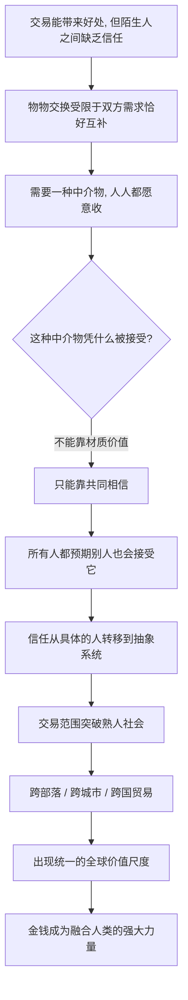

# 11｜为什么互不相识的人，会相信同一种钱？

> 为什么一张本身几乎没用的纸，或一串数字，能让全世界的陌生人愿意交换真东西？

---

## 一、先说结论

赫拉利的答案很清楚：钱是人类创造过的最成功、最普遍的信任系统。

它之所以有价值，不是因为它印得好、金属含量高，而是因为**所有人都相信别人也会接受它**。一个农民愿意用粮食换一张纸，不是因为他需要那张纸，而是因为他确信，明天拿着这张纸，别人也愿意把东西换给他。

在赫拉利看来，金钱完成了一件几乎不可能的事：把陌生人之间无从建立的人际信任，替换成一种**可以交易的共同信念**。他也因此判断，金钱是推动人类走向统一的最强大力量之一。

---

## 二、我们先理解一个问题

假设你手里有一张百元钞票。它的物理性质很普通：约一克纸，几毫米厚，印刷成本几毛钱。它不能吃、不能穿、不能烧来取暖，论材料价值几乎为零。

可你愿意用一整天的劳动去换它，愿意用它换一顿饭、一张车票、一个月房租。而卖你东西的摊主，几天前你可能根本不认识，你们语言不同、信仰不同、甚至彼此的国家正在交恶——但他会收下它。

一个人类学家如果第一次看到这一幕，大概会觉得荒谬：一群人集体同意，某种几乎没有内在价值的东西，可以换取真实的粮食、劳动和土地。

于是问题来了：**这种信任是怎么来的？** 不是血缘，不是友情，不是共同的宗教或法律，甚至连共同的语言都不需要。是什么让人与人之间最脆弱的东西——信任——变成了一种可以像商品一样转手的物品？

---

## 三、作者到底提出了什么观点？

赫拉利的判断是：**金钱是一种“想象的秩序”，而且是其中最成功的一种。**

它的价值不来自物理材质，而来自主体间的共同相信。贝壳、铜钱、银币、纸钞、账户里的数字，材质和形态天差地别，却都能互相兑换、都能买到大米。这说明它们的价值来源不在自己身上，而在**所有人都接受它**这件事上。

赫拉利举过一个有力的历史例子：古代货币并不统一，有大麦、贝壳、银锭、铜钱，可它们能跨越不同的王国、语言和神祇彼此换算。因为不管在哪里，人们都相信“这东西，别人也会收”。

他还指出，货币之所以特别，是因为它不承诺感情，也不要求信仰。它不问你是谁、从哪里来、信什么神。**只要你愿意把它当成价值，它就为你服务。** 金钱能成为全球通用的语言，恰恰因为它**什么都不说，只谈价值**。正是这种冷漠，让它能被所有人接受。

---

## 四、把这个观点翻译成人话

想象一个没有共同语言的国际集市。一个只讲中文的商人和一个只讲阿拉伯语的商人，彼此听不懂一个字，宗教不同，国籍不同，甚至对世界的看法完全相反。他们能做成一笔生意吗？

答案是可以，只要他们认同一件事：**这个单位是多少钱。**

钱不需要翻译，它像一种全世界都能读懂的“通用手势”。你不必解释自己的信仰、道德和政治立场，只要拿出货币，交易就能开始。**这是人类历史上少有的、真正跨文化的共同语言。**

再换个角度。人际信任是怎么建立的？靠长期相处、共同经历、互相试探，速度慢、成本高、范围小。你不可能信任一个从未见过、以后也不会再见的陌生人。

金钱绕开了这个过程。它不要求我信任“你”这个人，只要求我相信“别人会接受这个钱”。于是信任的对象从**具体的人**，转移到**一套抽象的系统**上。这是关键的一跃——**信任不再需要认识对方，只需要共享同一个信念。**

---

## 五、为什么会这样？

把赫拉利的推理拆成链条：

最关键的跳跃是 **D → E → F**。

金钱不能靠“它本身有用”来成立，因为大多数货币的材质价值都极低。它只能靠信念。而这个信念有一个特别的结构：**它是对别人的信念的信念。** 我相信这张纸有价值，是建立在我相信“你也相信它有价值”之上；而你的相信，又建立在你相信别人也相信之上。

这是一个可以无限套娃的循环。赫拉利把它叫作“主体间的现实”——它不存在于任何一个人的头脑里，而存在于**许多人的共同相信**之间。也正因为它不依赖具体的某个人、某个政权或某种宗教，它才能跨越如此多的边界，一路扩展成全球体系。

---

## 六、举一个现实生活中的例子

**先看人民币。**

人民币在国内能用，几乎不需要解释：买菜、坐地铁、发工资，所有人都接受。它也能跨境：一个人拿着人民币去境外，可能既不懂当地语言，也不了解当地法律，但只要对方接受，交易就能达成。对方接受的不是这张纸的材质，而是“它能换到东西”这个共识。

货币的价值并非永恒不变。历史记录显示，曾有不少政权滥发纸币，导致货币急剧贬值，信任一夜瓦解，市场退回物物交换或使用外币。这正说明**货币是纯粹靠信任运转的系统——信任在，它就有力；信任崩，它就只是一堆废纸。**

**再看比特币。**

2009 年出现的比特币没有中央银行、政府背书或贵金属储备，甚至摸不到，只是一串由密码学保证、被分布式网络维护的记录。按传统金融的眼光它几乎什么都不是，可它能换到真实的东西，也能被全球的陌生人接受——因为足够多的人相信别人也会接受它。这正是“对别人的信念的信念”的现代翻版。

它同时暴露了这套机制的脆弱：价格波动极大，几乎没有内在锚点，情绪能把它推得很高，也能让它快速回落。**支持者与怀疑者的分歧不在技术，而在“这种共同相信能维持多久”。**

对比两者很有意思：人民币靠国家信用、被制度性接受；比特币靠网络共识、波动剧烈。材质与可信来源完全不同，但赫拉利会说它们是**同一种东西**——都靠“大家相信别人也会接受”获得价值。

---

## 七、回到书中重新理解

回头看赫拉利的原始论述，钱在他整本书里扮演着一个特殊角色：**它是“想象的秩序”最干净、最没有争议的样板。**

国家和宗教都会引来立场之争，金钱没有这个问题：没人会问“美元是不是真的”，大家只问“汇率是多少”。它把“共同想象如何运作”剥离了价值包袱，赤裸裸地展示出来。

赫拉利特别强调金钱的统一力量。宗教会冲突，帝国有战争，语言有隔阂，但金钱几乎能在所有这些边界上通行。他写下那个著名的判断：**人们可以因为宗教、种族、语言而彼此对立，却很少会拒绝收钱。** 在这一点上，金钱比任何宗教或帝国都更普遍。

他也指出金钱的另一面：它把所有价值都换算成同一种尺度。当万物都可以标价，忠诚、荣誉、感情、信仰也可能被拉进市场。金钱在连接陌生人的同时，也在冲刷一些无法用价格衡量的东西。

这也是为什么，谈人类走向统一必须先谈钱：**它给出了一个全球通用的价值尺度。** 有了它，帝国与宗教才能在同一条轨道上继续推进融合。

---

## 八、这个观点背后还有什么？

**第一，信任可以“抽象化”和“外包”。** 人类不必再靠长期相处判断对方是否可信，而是把信任寄托在一套系统上。这条路往前延伸，就是法律、合同、信用评级、平台评分。

**第二，金钱是最“冷漠”的共同体。** 它不问身份、信仰、国籍，因此最容易跨越边界。冷漠在这里不是缺点，正是它能被普遍接受的前提。

**第三，主体间现实的典型结构。** 钱的价值不存在于任何一张纸币里，也不存在于任何一个人的脑子里，只在人们彼此的预期之间。这个结构和国家、法律、公司完全一致。

**第四，它为“统一”埋下伏笔。** 一个被全世界接受的价值尺度，会持续把分散的小共同体拉进同一个交易网络。金钱给出尺度，帝国给出框架，宗教给出意义。

---

## 九、这个观点有问题吗？

有，但争议的形态和种族、性别那篇不同——关于“钱靠信任运转”，学界与实务界的共识其实相当高；有疑问的是赫拉利由此推出的几个引申判断。

**第一，“金钱是最终的统一力量”可能被高估。** 货币确实能跨境流通，但世界从没有出现过真正统一的货币。汇率、外汇管制、货币集团（如欧元区）恰恰说明货币体系是**分裂而非统一**的。赫拉利讲的是大趋势，读成“金钱正在让世界变成一家”就过头了。

**第二，“对别人信念的信念”这个解释，容易被读成循环论证。** 如果钱的信任就是对别人信念的信任，那么最初那份信念从哪里来？赫拉利对这个“第一推力”讲得比较轻。事实上，国家与法律强制（法定货币地位、税收必须以本币缴纳）在货币形成中起了很大作用。经济史学者普遍认为，货币并非总是自发共识的产物，权力与制度常是其背后的推手；一些经济学家更强调“国家信用”，而非“大众共同想象”。

**第三，关于比特币的解读，学界与市场都没有定论。** 它究竟是一种新的货币、一种资产、还是一种投机品，目前仍在争论。把它归入“金钱作为共同想象”的例子，是赫拉利框架的合理应用，但这属于推论，而不是他书中的原话。

**第四，“金钱冲刷价值”的判断有很强的价值立场。** 赫拉利暗示金钱会侵蚀无法定价的东西，这符合他的一贯怀疑；但也有观点认为，货币经济曾让更多人摆脱依附、获得选择权——历史上农奴和佃农一度因此有了离开土地的可能。关于这一问题，讨论中存在不同解释，不宜一面倒。

**第五，把货币说成“人类最普遍的信任系统”，可能低估了其他系统的普遍性。** 数字身份、护照、平台账号、信用记录，今天同样在跨文化地组织陌生人合作。金钱也许是最早、最成功的那个，但未必是唯一。

**所以更准确的说法是**：赫拉利抓住了货币最本质的一面——它靠共同相信运转；但货币从来不只是“信任”，它同时是权力、制度和政治的工具。

---

## 十、今天再看这个观点

以下是基于赫拉利思想的现代延伸，不是作者原话。

如果说赫拉利讲的还是现金、硬币和银行账户，那么今天最值得注意的变化是：**钱的信任正在被重新分配。**

移动支付让交易几乎不再需要物理形态；数字货币试点、跨境支付网络、加密资产，让“谁有权发行、谁记录、谁冻结”成了新战场。货币不再只是价值尺度，它越来越像基础设施——谁掌握它，谁就掌握了让陌生人合作的能力。

更值得警惕的是“信任的自动化”。过去货币的信任靠共同预期、国家强制力和使用习惯；今天，信用评分、消费记录、平台账户把人的经济身份变成可被算法实时评估的对象。钱在连接陌生人的同时，也把每个人变成可被定价的数据点。

这就带来一个新问题：**当货币系统越来越依赖技术基础设施，而基础设施越来越集中在少数机构手中，“谁都愿意收”的中立性还能维持多久？** 赫拉利没有回答，但他的框架提示我们：货币的力量来自共识，而共识需要被维护，也可能被操纵。

---

## 十一、这一篇真正应该记住什么？

1. **钱是人类最成功的信任系统。** 它的价值不来自材质，而来自所有人都相信别人也会接受它。

2. **信任的对象被抽象化。** 人不必信任具体的陌生人，只需相信“别人会接受这个钱”，合作就能突破熟人社会的边界。

3. **货币是共同想象最干净的样板。** 它的价值存在于人们彼此的预期之间，不依赖任何单个人的头脑或物理实在。

4. **冷漠是它普遍的条件与代价。** 钱不问身份、信仰和国籍，能跨越一切边界，也会把无法定价的东西拉进市场。

5. **它不是全部真相。** 货币同时依赖国家信用、法律与权力，“靠信任运转”是它的本质一面，不是它的全部。

---

## 十二、留一个问题

> 如果金钱的力量来自“大家都相信别人也会接受”，
> 那么当越来越多交易由平台和算法记账，
> 我们信任的究竟是货币，还是那个掌握记录权的机构？

---

**下一篇**：金钱用一套尺度，把互不相识的人拉进了同一个交易网络。可它只能谈价值，无法回答你是谁、该忠于谁、这一生为了什么。历史上还有另一股力量，它靠武力建立，却常常创造出延续千年的混合文化。

下一篇我们就来拆开它——**帝国为什么是“文化大熔炉”，而不只是压迫者？**
