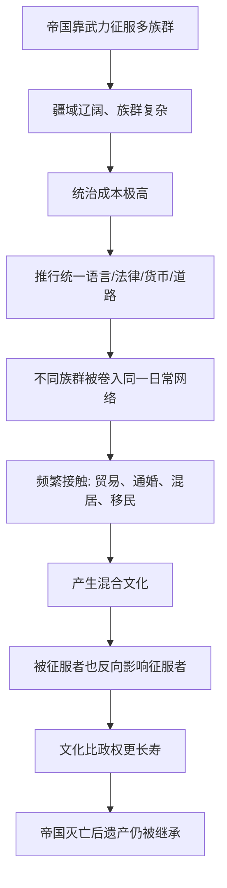

# 12｜帝国为什么是“文化大熔炉”，而不只是压迫者？

> 帝国几乎都靠武力和征服建立，为什么赫拉利却说它同时是文化融合的引擎？

---

## 一、先说结论

赫拉利的判断是：帝国首先是"想象的秩序"的一次大规模扩张。它用军队和税收建立统治，充满掠夺、压迫与屠杀；但为了降低统治成本，它又不得不在辽阔疆域内推行统一的语言、法律、货币和道路，把原本互不相干的族群硬拽进同一个网络。于是不同文化被迫频繁接触、通婚、交易、混居，孕育出新的混合文化。更关键的是，文化往往比政权活得久——帝国灭亡之后，它的语言、法律、宗教和城市常常继续留存，被后世当成"本来就有"的东西继承下来。赫拉利由此提出一个让人不太舒服的说法：今天很大一部分"全球文化"，其实是帝国扩张的遗产。

---

## 二、我们先理解一个问题

"帝国"这个词，在我们脑子里几乎自带贬义：侵略、殖民、掠夺、压迫。这当然没错，历史记录显示，几乎没有哪个帝国是干干净净建立的——罗马靠军团，蒙古靠骑兵，西班牙靠火枪和病菌。

可赫拉利偏要给帝国一个"奇怪"的位置：他把它和金钱、宗教并列，作为推动人类走向统一的三大力量之一。他甚至说，很多人今天痛恨"文化同质化"，却忘了自己说的语言、用的法律、过的节日，可能正是某个帝国的遗留。

这就留下一个真问题：**如果帝国只是压迫机器，它凭什么还能当"文化融合的引擎"？承认它带来了融合，是不是就等于替侵略辩护？**

要回答它，得先把"帝国做了什么"和"帝国好不好"这两件事分开看。

---

## 三、作者到底提出了什么观点？

赫拉利给"帝国"的定义，和日常用法不完全一样。在他看来，帝国通常有两个特征：

- **统治着大量彼此不同的族群**，而统治者并不真的打算把所有人变成一个同质民族；
- **边界是可以不断扩张的**，它没有"天然疆界"，野心就是一直往外推。

在这个意义上，帝国不等于"民族国家"。民族国家强调"一个民族、一块土地、一种文化"；帝国相反，它把许多不同的人装进同一个政治容器。

赫拉利认为，帝国之所以同时是压迫者和融合者，是因为它有双重动力。

**第一重是武力。** 帝国靠征服建立，被征服者可能被屠杀、驱逐、奴役、征税。这一点不能淡化。

**第二重是治理的算术。** 疆域一大，族群一多，如果每个地方都按自己的语言、法律、货币来，统治成本会高到无法承受。于是帝国倾向于推行统一的标准：一种官方语言、一套法律、一种货币、一张道路网。这套标准本是为了方便统治，却在客观上把不同族群卷进了同一个日常生活网络。

**第三重，也是最容易被忽略的一重：融合是双向的。** 被征服者会学征服者的语言和习惯，但征服者也会被征服者的文化改造——饮食、服饰、宗教、词汇、技术、审美，都可能反向渗入。赫拉利强调，文化融合很少是纯净的"谁吃掉谁"，更多是你中有我。

最后他抛出一个贯穿全书的判断：**文化的生命力往往比政权更长。** 一个帝国可能几十年、几百年就崩塌，但它留下的语言、法律、宗教、城市格局，可能存活上千年。

---

## 四、把这个观点翻译成人话

把帝国想成一家吞并了几十家小公司的跨国集团。

集团总部为了管理方便，要求所有子公司：改说总部语言、用同一套财务制度、走同一套审批流程、用同一种结算货币、接入同一条内部网络。对原来的小公司来说，这是强制的、粗暴的，很多本地习惯被直接废掉。

但过了一段时间，会发生几件总部没想到的事：总部食堂出现子公司的菜，产品线吸收了子公司原来的工艺，有些子公司的人甚至爬到高位，反过来改变集团的方向。

再往后，集团可能因为债务、内乱、外部竞争而倒闭。可那些被它强推出来的制度——统一的语言、财会规则、供应链网络——不会随集团一起消失。后来者接管地盘时，往往直接沿用它，因为它"已经在那儿了，很方便"。

帝国和文化的关系就是这样。**它用暴力建立秩序，用统一降低统治成本，却在无意中当了一次文化的搅拌机。**

---

## 五、为什么会这样？

把赫拉利的推理拆成一条链，大致是这样：

这条链里最容易被误读的一步，是 **C → D**。

很多人以为帝国推行统一，是为了"传播文明"或"教化野蛮人"。赫拉利的意思更冷静：**统一首先是统治的技术需要。** 国家越大，越需要可通约的度量衡、可执行的税法、可通信的语言。至于它顺带带来了文化融合，更像是一个副产品。

也正因为它主要是"统治需要"，融合往往是不对称的：征服者的语言进入官方、教育和商业，被征服者的语言退到家庭和乡村。所以"融合"这个词听起来温和，背后其实是权力在决定谁的文化更值钱。

---

## 六、举一个现实生活中的例子

看全球连锁餐饮的本地化。

麦当劳在很多国家卖的并不是同一份菜单。在印度，因为大量人口不吃牛肉，它的招牌变成了用土豆和豌豆做的素食汉堡；在中国，它卖粥、油条、米饭类产品；在中东，它有符合当地宗教饮食规范的菜单。星巴克也一样：在中国卖月饼、粽子，在日本做抹茶口味，在各地调整甜度和配方，门店的空间设计也被改造成适合当地人久坐或快取的样子。

这件事有意思的地方在于"双向"。

一方面，这些全球品牌进入本地时，确实带了强烈的外部标准：统一的标识、统一的服务流程、统一的供应链。这很像帝国推行统一制度。

另一方面，它们要活下来，就必须被本地改造。本地的食材商、本地的口味、本地的消费习惯，反过来重塑了这些品牌。更微妙的是，这些"本地化产品"有时还会回流，变成品牌在全球的卖点——某个地区发明的口味，后来卖到了别的国家。

结果既不是纯粹的"文化入侵"，也不是纯粹的"传统守护"，而是一种新的混合产物。

需要说明：这只是理解机制的现代类比。赫拉利讲的是历史上的帝国，不是快餐连锁；他用帝国说明"统一制度如何带来文化混合"，而非说商业品牌等于帝国。

---

## 七、回到书中重新理解

在书里，赫拉利谈帝国时，重心并不在"帝国该不该被谴责"——他并不回避帝国的暴力，甚至明确写出征服过程中的屠杀、奴役和掠夺。他真正想追问的是一个历史机制问题：

**为什么许多看起来天经地义的东西，其实是帝国的产物？**

他举的例子跨度很大：从苏美尔、亚述，到波斯、罗马、阿拉伯、蒙古、奥斯曼、西班牙、大英帝国。这些帝国时间、地域、宗教都不同，却有一个共同模式——它们都创造了跨越族群的共同语言、法律、货币、道路和市场，而这些不会因为帝国垮台就自动作废。

他还提出一个更大胆的设想：人类可能正在走向某种"全球帝国"——不是被某一个国家武力统一，而是全世界逐渐共享同一套规则、市场、秩序和价值话语。当然，他也清楚这不是道德上的好消息。

所以，理解赫拉利的关键是：他把帝国当成一种**历史机制**来分析，而不是当成一个**道德对象**来审判。

---

## 八、这个观点背后还有什么？

几个隐含前提值得挑明。

**第一，文化融合从来不是平等的握手。** 哪种语言成为官方语言、哪种法律成为通用规则，取决于谁掌握权力。赫拉利的"融合"叙述如果不配上"权力不对称"这一条，就容易被读成"大家自然混在一起"。实际上更常见的是：强者的文化扩散，弱者的文化退场。

**第二，帝国制造的"多样性"，是一种重组后的多样性。** 帝国确实常常消灭地方文化，但同时造出新的混合文化。它不是把世界抹平，而是把许多地方拼成新的图案。所以"帝国消灭多样性"和"帝国创造多样性"可以同时成立。

**第三，这套逻辑和"想象的秩序"一脉相承。** 帝国就是把"我们"这个想象的边界，从部落、城邦，扩大到一个横跨大陆的共同体。它用的工具——法律、货币、语言——正是共同想象的载体。

**第四，它给后文铺了路。** 帝国要维持统治，往往离不开两样东西：钱和神。收税要用统一的货币，合法化要用统一的信仰。所以帝国的故事，紧接着就会和金钱、宗教交织在一起。

---

## 九、这个观点有问题吗？

有，而且这一篇的争议，比前面几篇更敏感。

**有说服力的部分：** 历史记录显示，拉丁语、阿拉伯语、英语的传播，确实和罗马、阿拉伯、大英帝国的扩张高度相关；罗马法系至今影响欧洲多国法律；帝国修建的道路、运河、城市网络，常在后世继续被使用。说"文化常常比政权活得久"，有大量实例支撑。

**争议一：把"融合"和"压迫"并列，容易被读成替殖民主义洗白。** 一些历史学家，尤其是后殖民研究传统，强调帝国带来的不只是"混合"，还有种族等级、文化灭绝、强制同化和长期的经济剥削。他们担心，一旦把帝国主要描述成"文化搅拌机"，暴力的分量就被稀释了。赫拉利本人承认暴力，但他叙事上的重心偏向"遗产"，这是一个可以被批评的选择。关于帝国究竟是"现代化推动者"还是"掠夺者"，学界存在不同解释。

**争议二："双向融合"可能被高估。** 现实中，被征服者对征服者文化的影响通常慢、浅，多局限于饮食、服饰、词汇，而反向影响则快、深、触及制度核心。把这种关系说成"互相影响"，有把不对等说成对等的风险。

**争议三："今天的全球文化是帝国遗产"这一判断，可能低估了非帝国渠道。** 贸易、移民、传教、技术扩散、人口迁徙，都能在没有帝国的情况下传播文化。把所有融合都归功于帝国，可能有选择性地放大了一类原因。

**争议四：可能落入"幸存者偏差"。** 我们记得的往往是留下遗产的帝国，那些兴起又消失、几乎没留下什么的大帝国则被忽略。用留下来的结果反推"帝国必然带来融合"，逻辑上要小心。

**所以更准确的说法是**：赫拉利提供的是一套理解帝国历史功能的框架——它有力、清楚、善于打破"帝国只是坏人"的直觉；但它不是对帝国的道德裁决，也不能替代对具体帝国、具体时期、具体暴力的具体分析。

---

## 十、今天再看这个观点

先说清楚：赫拉利书里讲的是历史上的政治帝国。以下部分是基于他思想的现代延伸，不是他的原话。

今天，靠武力征服的帝国已很少见，但"统一标准、混合文化"的机制仍在运转，只是换了主角：跨国公司的供应链、英语、技术标准、平台生态、国际组织。它们和帝国一样，把一套外部规则推到不同地方，也在落地时被本地改造。

与此同时，反弹也出现了。人们开始追问"本土文化还剩多少""我们的语言会不会消失""为什么规则总是由别人定"。这种焦虑，本质上是帝国时代的老问题在今天重演：当融合不对称时，被融合的一方会感到损失。

这里有一个值得警惕的区分：**承认帝国留下了遗产，不等于为帝国的暴力辩护。** 这两件事可以同时为真——一座殖民时期修建的铁路，既方便了今天的通勤，也曾经用来运送掠夺的物资。赫拉利想让我们看到这种复杂性，而不是替任何一方盖章。

---

## 十一、这一篇真正应该记住什么？

1. **帝国是"想象的秩序"的大规模扩张。** 它统治许多不同族群，边界不断外扩，把"我们"的边界撑到远超部落和城邦。

2. **统一首先是统治的成本计算。** 帝国推行统一语言、法律、货币和道路，不是因为高尚，而是因为管理辽阔疆域需要可通约的标准。

3. **融合是双向但不平等的。** 被征服者学征服者更多、更深；征服者也被反噬，但影响通常较浅、较慢。别把不对等说成对等。

4. **文化往往比政权长寿。** 帝国垮台后，它的语言、法律、宗教、城市常常被后世继承，甚至被当成"自古如此"。

5. **承认遗产不等于辩护暴力。** 分析帝国作为历史机制，和对帝国作道德评价，是两件不同的事，不能混为一谈。

---

## 十二、留一个问题

> 如果今天的全球文化里，确实混着许多帝国的遗产，
> 那么当我们说要"守护本土文化"时，
> 守护的到底是多久以前、由谁的版本？

---

帝国用刀剑和制度把人绑在同一个网络里。但还有一种力量，它不需要军队、不需要收税，就能让上亿素不相识的人自愿属于同一个共同体。它凭什么做到？下一篇我们就来看——**宗教为什么能组织起上亿人。**
