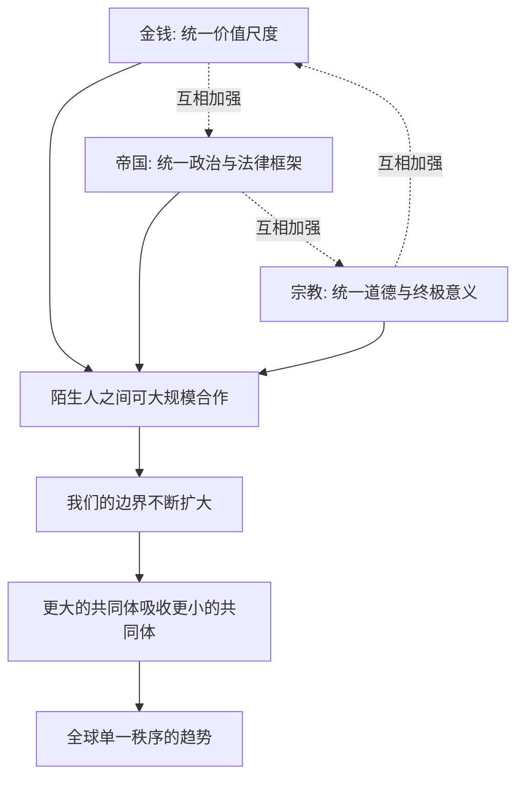

# 14｜金钱、帝国、宗教，有什么共同的秘密？

> 金钱谈利益，帝国谈权力，宗教谈信仰，它们为什么会把人类推向同一个方向？

---

## 一、先说结论

赫拉利的回答是：金钱、帝国、宗教虽然性质完全不同，甚至常常互相冲突，但它们做的其实是同一件事——构建"我们"，让越来越多的陌生人认同同一个秩序。金钱提供统一的价值尺度，帝国提供统一的政治和法律框架，宗教提供统一的终极意义。三股力量叠加，把人类从无数彼此隔绝的小世界，推向一个全球性的秩序。赫拉利由此提出一个颇有争议的判断：历史不是随机漂流的，它有一个方向——更大的共同体不断吸收和吞并更小的共同体。不过他也强调，这是一种趋势描述，不是道德进步；统一不等于更好。

---

## 二、我们先理解一个问题

前面分别看了三样东西。

金钱：它把陌生人之间的信任，变成可交换的信念。帝国：它用武力建立统治，又用统一的法律和道路把不同族群绑在一起。宗教：它把共同相信的秩序抬升为不可质疑的绝对法则，给所有人统一的道德和身份。

现在把它们摆在一起，问题就来了。这三样东西看起来根本不像一路人：金钱讲究利益，宗教劝人别贪；帝国靠暴力，宗教常常反对暴力；宗教要求你只信一个神，金钱却对信仰完全无所谓，谁的钱它都认。

既然它们如此不同，甚至彼此对立，凭什么说它们都朝同一个方向走？如果这真是一条统一的路，它的终点是什么？

---

## 三、作者到底提出了什么观点？

赫拉利在"走向统一"这一部分的核心判断是：金钱、帝国、宗教都是"想象的秩序"的扩张版本，它们的共同产物是**更大的合作单位**。

拆开看，三者的分工相当清楚：

| 力量 | 它统一了什么 | 你需要在多大程度上认同它 |
|---|---|---|
| 金钱 | 价值尺度 | 只要用，不必信 |
| 帝国 | 政治与法律框架 | 只要活在它的疆域里 |
| 宗教 | 终极意义与道德身份 | 必须信，且往往必须忠诚 |

- **金钱解决"怎么换"。** 它给所有东西一个可以换算的价格，让完全不同的社会能坐在同一张桌子上交易。它不要求你改变信仰，甚至不要求你喜欢对方。
- **帝国解决"听谁的"。** 它给辽阔疆域一套共同的法律、货币、道路和行政语言，让不同族群在同一套规则下生活。
- **宗教解决"为什么我们是一伙的"。** 它给跨地域的人群一套共同的道德、身份和意义，让陌生人之间产生超越利益的认同。

赫拉利的观点是：这三者互相加强，缺一不可。帝国要收税，需要金钱；帝国要合法，常常借助宗教；宗教要传播，需要帝国的道路、和平与供养；宗教要落地，也离不开金钱的支持。金钱则在帝国的法律和宗教的信任背书下，才敢跨地域流通。

三股力量合流，人类第一次有了"整个世界其实可以是一个秩序"的想象。

接下来是赫拉利更大胆的一步：**他认为历史有一个方向。** 从部落到城邦，从城邦到帝国，从帝国到民族国家，再到今天的全球市场和国际组织，合作的单位总体上在变大，共同体在吞并共同体。他并不认为这是道德上的进步——统一的过程往往伴随屠杀、奴役和文化灭绝——他只是说，**从长时段看，趋势是统一。**

---

## 四、把这个观点翻译成人话

假设世界上的人被切成无数个小圈子。每个圈子有自己的钱、自己的规矩、自己的神，圈子之间互不信任。

现在要让两个圈子合并，需要什么？

你需要三样东西：

1. **一把共同的尺子**——不然东西没法比价，谁欠谁的说不清。这是金钱。
2. **一套共同的规则和一个仲裁者**——不然起了冲突没人管，谁也不服谁。这是帝国和法律。
3. **一种共同的归属感**——不然只是生意关系，随时可以翻脸。这是宗教和身份认同。

这三样凑齐，两个圈子就真的能合并成一个。合并之后的圈子更大，能做的事更多，于是它又更容易吞掉或吸引旁边更小的圈子。

一句话：**金钱管"怎么换"，帝国管"听谁的"，宗教管"为什么我们是一伙的"。** 这三样一到位，陌生人就能合作；合作规模一大，人类的力量就上一个台阶。

---

## 五、为什么会这样？

赫拉利的逻辑可以画成三股力量汇入同一条河：

这里最容易被忽略的是三条虚线——**三者不是各干各的，而是互相喂养。**

帝国铸币、修路、定税法，让金钱能流通；金钱的税收和贸易又养活了帝国。帝国需要一个超越族群的理由来统治，宗教提供了"天命""神的意旨"；宗教借助帝国的刀剑和疆域，传播到了更远的地方。宗教需要供养和场所，金钱提供了资源；金钱需要信任和道德基础，宗教的"诚实""守信"观念又替它做了担保。

正是这个互相加强的循环，让"统一"不再是偶然事件，而变成了持续的推力。

---

## 六、举一个现实生活中的例子

看世界贸易组织和互联网协议。

**世界贸易组织（WTO）** 这一套机制做的事情，和帝国很像，但它没有皇帝。不同国家的关税、标准、法律各不相同，没有共同规则，做生意就要一家一家谈，成本高到不可行。WTO 提供共同贸易规则和争端解决机制：谁违规，按大家认可的规则裁决，而不是直接开打。这既是"统一规则"（帝国的功能），也是"统一尺度"（金钱的功能），只不过它是各国自愿加入的秩序，不靠武力强推。

**互联网协议（IP）** 则是更纯粹的"想象的秩序"。全世界几十亿台设备，属于不同国家、不同公司、不同个人，彼此从不认识，却能把数据准确送到对方那里。原因只有一个：大家都遵守同一套协议。IP 地址像统一的"身份与门牌系统"，域名系统像一本共同的"名录"，协议本身没有任何强制力，但全世界的设备都按它来做。

这两者合起来说明一件事：**让陌生人协调行动，靠的不是共同的血缘、共同的领袖，甚至不是共同的信仰，而是一套大家都接受、并愿意持续遵守的共同秩序。**

需要说明：赫拉利书中讨论的是历史上的统一力量（货币、帝国、宗教），并没有专门论述 WTO 或互联网协议。用它们来理解"统一机制"属于基于其思想的现代延伸。

---

## 七、回到书中重新理解

赫拉利把金钱、帝国、宗教放进同一部分，不是为了讲三段互不相关的历史，而是为了让读者看见一条主线：**人类从"许多小世界"走向"一个世界"。**

在这条主线里，每个力量扮演不同角色：

- 金钱是**最普遍**的统一者——它跨越宗教、语言、国界，因为它不要求你信任何东西。
- 帝国是**最强硬**的统一者——它用政治和军事把不同族群装进同一个容器。
- 宗教是**最深刻**的统一者——它打动的是"我为什么属于这里"，而不是"我能得到什么"。

赫拉利也讨论了"全球帝国"的可能性。他说的不是一个国家征服全世界，而是全世界逐渐共享同一套秩序——市场规则、人权话语、国际机构、对"进步"的想象。这种统一没有皇帝，却比任何历史帝国都更广泛。

但他同时警告：**统一不一定是好事。** 它可能意味着文化多样性丧失、系统脆弱性上升，以及越来越难提出"另一种可能"。

---

## 八、这个观点背后还有什么？

**第一，统一是趋势描述，不是价值判断。** 这是最容易读错的一点。赫拉利说历史朝向统一，不等于说统一是好的、正义的、值得欢迎的。征服、屠杀、同化、文化灭绝，都是统一过程的一部分。把它读成"统一就是进步"，是对赫拉利的误解。

**第二，三者的共同底层是"想象的秩序"。** 金钱、帝国、宗教之所以能统一陌生人，是因为它们都不是物理事实，而是共同相信的秩序。这正好接上了全书最早的命题：智人的秘密在于共同想象。

**第三，统一与脆弱是一体的。** 系统越大、越统一，效率越高，但单点故障的后果也越严重，退路也越少。全世界都用同一套金融规则、同一条供应链、同一套网络协议，意味着一个地方的故障可以迅速传遍全球。

**第四，它为下一部分埋了伏笔。** 当人类被金钱、帝国、宗教组织成前所未有的统一体之后，一件新事情发生了：人们开始公开承认"我们其实什么都不知道"。这个转折，正是下一部分的主角。

---

## 九、这个观点有问题吗？

有，而且这一篇的争议，主要不在具体史实，而在"历史有没有方向"这个判断本身。

**有说服力的部分：** 从长时段看，人类确实在向更大的政治、经济、文化单位整合——从部落到城邦到帝国到民族国家，再到国际组织和全球市场；通用语言、普世人权话语、全球供应链，都在扩大"我们"的范围。这不是臆想。

**争议一："历史有方向"本身是哲学判断，不是历史事实。** 一些历史学家认为，从长时段看，统一与分裂交替出现，把它描述成"趋势"再描述成"方向"，很容易滑向目的论——仿佛是历史注定要走向统一。这可能是事后筛选证据的结果：我们记住了统一的成功案例，忽略了长期的分裂与碎片化。

**争议二：把三者归为"同一类力量"，可能抹平了它们的根本差异。** 金钱你可以不用，宗教要求你忠诚，帝国的暴力则往往不可选择。一个人可以放弃某种货币，却很难放弃国籍和信仰。把它们都称为"统一的力量"，是以相同点覆盖了差异。

**争议三："世界正在走向统一"这个判断，和近年的现实并不完全吻合。** 逆全球化、贸易摩擦、民族主义回潮、技术脱钩、信息茧房，都在同时发生。关于全球化究竟是在前进、停滞还是退潮，学界存在不同解释。

**争议四：政治上的风险。** 把"统一"描述为历史方向，容易被误读成对单一秩序、单一价值的辩护，从而掩盖权力不对等——谁的规则成为世界规则，往往取决于谁更强，而不是谁更对。

**所以更准确的说法是**：赫拉利给出的是一套理解历史走向的宏大框架。它非常清晰、非常有解释力，但宏大叙事天然要牺牲细节；把它当成铁律，或当成价值主张，都有风险。更稳妥的态度是：承认统一是长期趋势之一，同时不把它当成历史的终点或道德的胜利。

---

## 十、今天再看这个观点

赫拉利书中的观点是：金钱、帝国、宗教是推动人类走向统一的三股力量，历史有趋向统一的走向，但这不等于道德进步。

以下部分是基于其思想的现代延伸，不是他的原话。

今天推动"统一"的力量，形态已经变了。全球供应链、跨境支付、国际法与普世人权话语、英语、跨国公司的技术标准——它们大多不需要帝国式的武力，却能产生类似效果：让陌生人按同一套规则行动。

与此同时，反向力量也在变强。本土主义、贸易保护、语言与文化复兴、平台割裂、信息茧房，都在把人群重新切开。于是当代的真实图景更像是"统一与分裂同时加速"：在规则和交易层面越来越统一，在身份和认同层面越来越分裂。

这里有一个值得带回全书主线的追问：如果"扩大我们"一直依赖所有人相信同一套不可质疑的东西，那么在一个信息可被无限细分、每个人都能拥有自己"真相"的时代，制造两个互相不认账的"我们"，是不是也变得更容易？

要提醒的是：赫拉利写作时所面对的主要是全球化高歌猛进的年代，今天这些变化并不在他的论述范围内，以上分析属于现代延伸。

---

## 十一、这一篇真正应该记住什么？

1. **三者的共同点是扩大"我们"。** 金钱、帝国、宗教性质不同，却都在把合作的边界从熟人推向陌生人。

2. **三者分工互补。** 金钱统一价值尺度，帝国统一政治与法律，宗教统一道德与终极意义，缺一样，大规模统一都不完整。

3. **它们互相加强。** 帝国靠金钱和宗教维持，宗教靠帝国和金钱传播，金钱靠帝国法律和宗教信任流通。

4. **赫拉利认为历史有方向。** 他判断人类总体上朝更大的共同体走，但明确表示这是趋势描述，不是道德进步。

5. **统一提升效率，也带来脆弱。** 越统一的系统越强大，也越依赖少数规则、越缺少替代方案、越难退出。

---

## 十二、留一个问题

> 如果更大的共同体确实让人类合作得更强，
> 那么当世界真的只剩一种秩序时，
> 我们得到的是持久的和平，还是失去了所有备选的方案？

---

金钱、帝国、宗教把人类整合成了前所未有的统一体。接下来，一件更反常的事发生了：人类不再宣称自己什么都知道，反而开始公开承认"我们不知道"——正是这个转折，带来了近五百年最惊人的变化。下一篇我们就从这里开始——**科学革命真正"革命"在哪里。**
