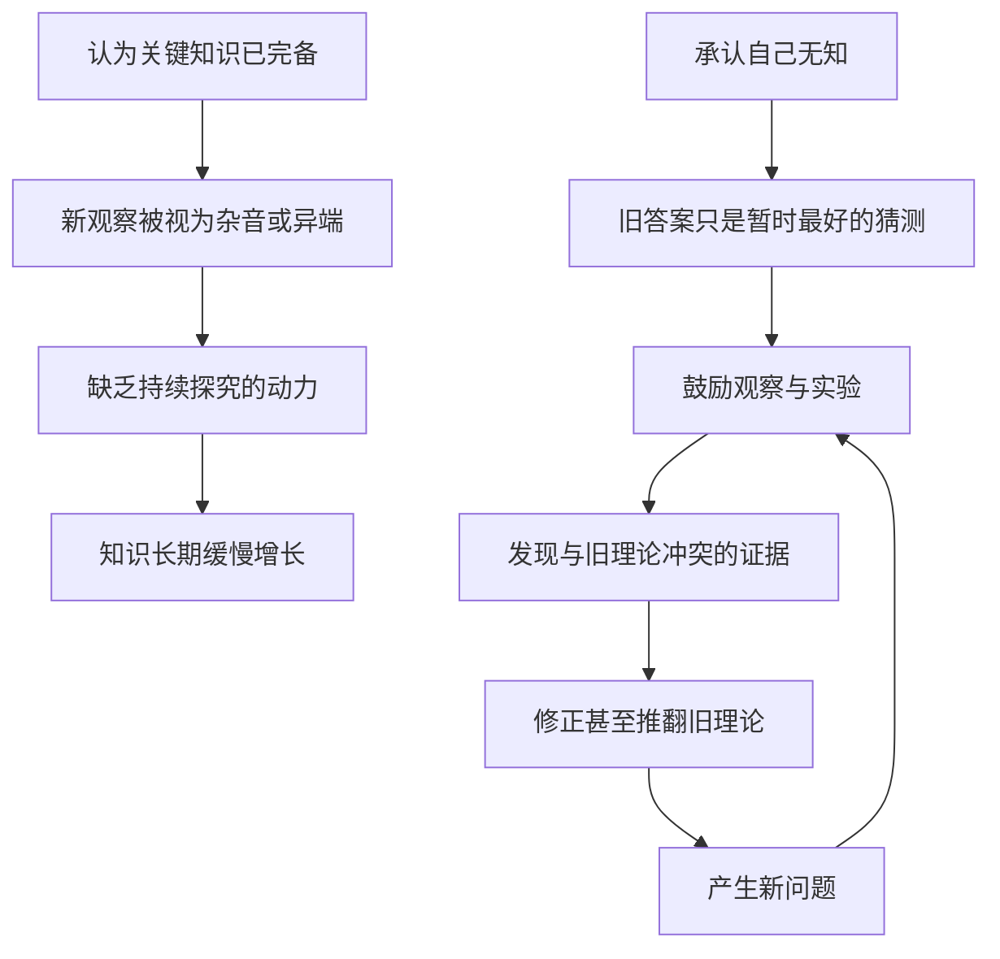

# 15｜科学革命真正“革命”在哪里？

> 科学革命和以往的知识传统相比，最根本的不同是什么？

---

## 一、先说结论

赫拉利的答案不在某项发明，而在一种态度：**承认自己无知**。

在近代科学之前，大多数文明相信最重要的知识早已被掌握——真理写在经典、神谕或圣书里，后人只需解释和应用。近代科学反过来，把"我们不知道"当成起点：用观察、实验和数学去试探，再让证据不断推翻和修正自己。

于是"无知"从一种耻辱，变成了持续进步的动力。赫拉利认为，正是这种愿意承认无知的姿态，让人类第一次获得了可以不断扩张的知识。

---

## 二、我们先理解一个问题

前一篇讲的是人类如何走向统一：金钱、帝国、宗教把越来越多的陌生人塞进同一个秩序里。可统一之后呢？真正让世界在近几百年发生剧变的，是知识开始呈爆炸式增长。

这里有个容易被忽略的现象。人类拥有系统知识已经几千年了：古埃及会测量土地，中国会冶铁造纸，阿拉伯世界保存并推进了数学与天文。但知识的大规模、持续性、自我加速的增长，却集中在近代欧洲出现。

我们通常把功劳归给天才。可天才每个时代都有。差别似乎不在人有多聪明，而在**人们对待"不知道"的态度**。这，就是本篇要解决的问题。

---

## 三、作者到底提出了什么观点？

赫拉利认为，科学革命不是一次知识的积累，而是一次"对无知的发现"。他把它看成人类思想史上的一次根本转向。

在科学革命之前，主流的知识体系对"不知道"的容忍度很低。基督教神学、伊斯兰经学、儒家经典，虽然内容不同，但有一个相似倾向：**关键真理已经给出，剩下的是解释和应用。** 世界的基本答案被认为已经写好了。

近代科学则宣布了一件听起来很扫兴的事：我们其实什么都不知道，现有的答案只是"目前最好的猜测"。赫拉利认为，正是这句听起来像认输的话，启动了持续的知识扩张——因为一旦承认无知，就有理由继续观察、继续实验、继续寻找新答案。

---

## 四、把这个观点翻译成人话

想象两种学生。

学生甲相信：教材里已经包含全部正确答案，考试就是把答案从教材里找出来、背下来。他不会去想教材以外还有什么，因为"该知道的都在书里了"。

学生乙相信：教材只是目前最好的猜想，随时可能被新证据推翻，学习就是不断去探索教材之外的未知。他会主动做实验、找反例、提新问题。

科学共同体就是学生乙。近代科学的"革命性"不在它比前人更聪明，而在它给自己定了一条规矩：**没有任何答案可以宣布为终审，只要证据出现，就得改。**

承认无知并不等于认输。它更像是把"我们不知道"四个字，从一句让人难堪的话，改写成一张可以逐项攻克的问题清单。

---

## 五、为什么会这样？

把赫拉利的推理拆成对比链条，会更清楚：

左边这条链是"答案已完备"的体系，右边这条是近代科学。两条链条的差别，不在于谁更努力，而在于**右边内置了一个自我修正的循环**：发现冲突、修正理论、再产生新问题，然后继续。

赫拉利强调的，正是这个循环被制度化之后带来的加速度。单靠某个人的好奇心，知识不会持续增长；只有当"质疑—验证—修正"成为一套被社会承认的做法，知识才会像滚雪球一样扩大。

---

## 六、举一个现实生活中的例子

看现代医学里一篇研究论文是怎么诞生的，就很直观。

一位研究者提出某种药物可能有效的假设，设计对照试验，收集数据，写出论文。论文不会因为作者是权威就直接成立，而要经过**同行评审**：其他专家会追问——样本量够不够大？对照组设置合理吗？统计方法对不对？有没有利益冲突？结论是否被数据支持？

即使在知名期刊发表，这篇论文依然不是"终审判决"。后续研究可能发现它的效果被高估，或只对特定人群有效，甚至完全推翻它。教科书每隔几年就要改版，上一代"医学常识"被淘汰是家常便饭。

这正是"承认无知"被制度化的样子：没有任何权威能宣布"到此为止，这就是最终真理"。医学能持续进步，恰恰因为它始终允许自己被证伪、被修正。反过来，一种不允许修正的知识体系，无论一开始多正确，都会随环境变化而僵化。

---

## 七、回到书中重新理解

现在再读赫拉利关于科学革命的论述，就顺了。

他并不是说近代突然冒出了一批更聪明的头脑，而是说人类的态度发生了转变：从"我们差不多都知道了"，变成"我们几乎一无所知"。他把这一转变放在科学革命的核心位置，认为它带来的不只是新发现，而是三样能力——愿意观察、愿意做实验、愿意用数学描述世界。

更关键的是第四样：**愿意让证据推翻自己。** 他反复强调，科学的独特之处不在它永不犯错，而在于它把犯错和纠错变成了日常流程。理解这一点，也就理解了为什么近代科学能越滚越快，而此前的知识体系大多停在某个高度上。

---

## 八、这个观点背后还有什么？

这里有几点赫拉利没有完全展开、但很关键的前提。

**第一，知识增长需要社会允许质疑权威。** 承认无知不只是个人心态，它要有一套容忍异议、保护探究的制度环境，否则"我不知道"会被当成冒犯。

**第二，科学本身也是一种"共同相信的秩序"。** 它和国家、货币一样，靠一群人的共同承认才运转。但它比别的秩序多了一条特别的规则：主动欢迎反例。这是它和教条最大的区别。

**第三，赫拉利采用的是偏认识论的解释。** 他把科学革命的根，放在人们如何看待"知识"这件事上，而不是单纯放在技术或经济上。这个选择后面会和帝国、资本的故事接上——因为承认无知，才会想去探索未知的世界。

---

## 九、这个观点有问题吗？

有说服力的一面很明显：它抓住了科学区别于教条的关键——可被检验、可被修正。但这套解释也有争议。

**关于"承认无知"是否是唯一根本，学界存在不同解释。** 一些科学史家和经济学家认为，科学革命还得益于很具体的制度和条件：大学、学会、出版、专利、望远镜与显微镜这类新工具，以及航海、军事、贸易带来的现实需求。印刷术让知识能快速传播和批评，它的作用可能被低估了。把一切归结为一种态度，风险是忽略了物质与制度基础。

**"此前文明都认为知识已完备"这个概括也略显笼统。** 中世纪的经院哲学其实也有活跃的辩论和对自然的观察；阿拉伯世界的数学、天文、医学长期领先；中国的技术成就同样可观。把它们统统塞进"答案已完备"的框子里，是一种简化。

**科学与宗教也不像流行印象那样完全对立。** 历史记录显示，早期许多科学家本身是虔诚信徒，认为研究自然是理解神的造物。一些历史学家认为，某些宗教传统对"自然有规律可循"的信念，反而为科学提供了土壤。

**所以更准确的说法是**：赫拉利提供了一条很有力的认识论解释，但科学的兴起更可能是态度、制度、工具、经济需求与宗教文化多因素叠加的结果，而非单一原因所能概括。

---

## 十、今天再看这个观点

以下部分是基于赫拉利思想的现代延伸，不是作者原话。

今天，科学的自我修正机制面对着一些新挑战。论文数量爆炸式增长，同行评审的负荷越来越重，部分领域出现"可重复性危机"——一些已发表的结果，别人重复不出来。媒体又习惯把初步研究包装成耸动标题，让公众误以为科学总是给出确定性答案。

与此同时，在公共讨论中，"承认无知"仍然稀缺。人们更容易接受斩钉截铁的断言，而不是"目前证据显示……但还需要更多研究"。更微妙的是，科学有时被当成另一种"答案已完备"的权威：只要贴上"科学研究表明"的标签，质疑就变得不受欢迎。

可科学的独特价值恰恰相反——它永远准备被修正。学会说"我们还不确定"，不是软弱，而是科学最硬的那块骨头。

---

## 十一、这一篇真正应该记住什么？

1. **科学革命的根不在某项发明，而在"承认无知"。** 从认为真理已完备，转向认为现有答案只是暂定，是根本的区别。

2. **无知从耻辱变成了动力。** 一旦承认"我们不知道"，继续观察和实验就有了正当理由，知识才有可能持续扩张。

3. **自我修正机制是科学的引擎。** 科学不因永不犯错而强大，而因它把发现错误、推翻旧论变成了日常流程。

4. **科学也是一种"共同相信的秩序"。** 但它内置了欢迎反例的规则，这使它区别于其他靠共同信念维持的体系。

5. **单一解释有简化风险。** 科学革命的成因更可能是制度、工具、经济需求与文化多因素叠加，不宜只看态度。

---

## 十二、留一个问题

> 如果科学的本质是"承认自己不知道"，
> 那么当一个社会越来越依赖科学给出确定结论时，
> 我们是在尊重科学，还是在不自觉地把科学变成新的教条？

---

**下一篇**：光有承认无知的态度还不够。要探索，就得有船、有设备、有人肯出钱，还得有能去的地方。近代科学为什么偏偏和帝国扩张、海外贸易纠缠在一起，甚至结成了长期的同盟？

下一篇我们就来拆开这个问题——**科学为什么和帝国、资本结成了同盟？**
