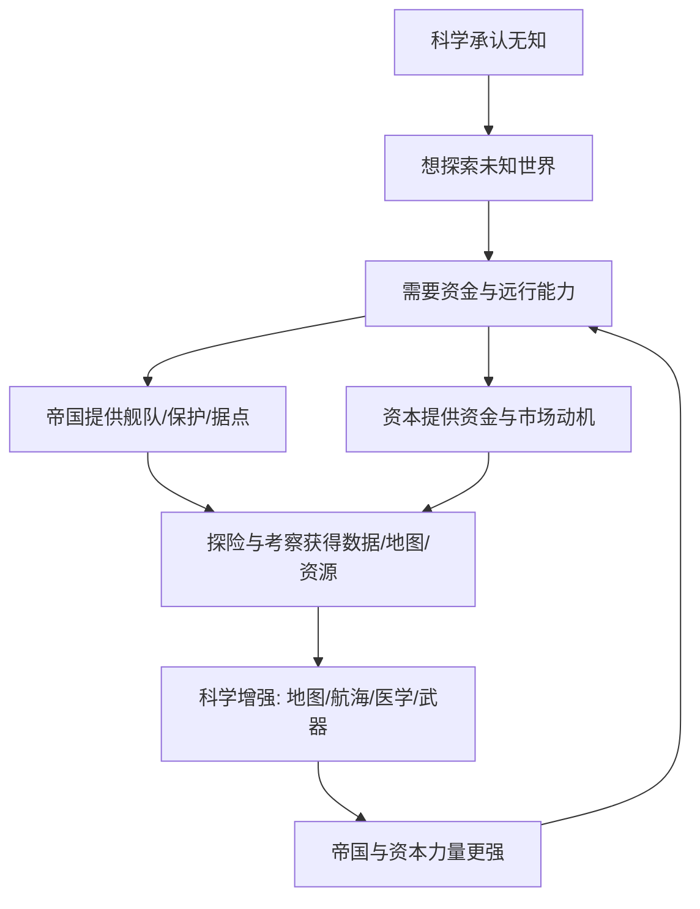

# 16｜科学为什么和帝国、资本结成了同盟？

> 科学、帝国扩张和资本主义，为什么会在近代紧密咬合在一起？

---

## 一、先说结论

赫拉利认为，近代的科学、帝国与资本主义不是三件互不相干的事，而是一个**正反馈的三角**。

科学需要资金，也需要能去"收集数据"的机会；帝国需要地图、航海技术和武器来扩张；资本主义需要新市场和新资源。于是帝国和资本出钱出船资助科学，科学又把更强的技术和信息还给帝国与资本，让它们更有力量，再资助更多科学。

这套循环有个冷酷的推论：**看似纯粹的知识，背后往往嵌着利益结构。**

---

## 二、我们先理解一个问题

上一篇讲到，科学革命的关键是"承认自己无知"。可光有态度，科学跑不起来。探索是要花钱的：造船、雇人、买仪器、远航，样样要资源。一个只在书斋里怀疑世界的学者，很难把知识推到新高度。

问题就出在这里。近代最活跃的科学活动，常常不在安静的学院，而在船队、据点、植物园和贸易站里；出钱的往往不是纯粹出于好奇心的人，而是政府和商业公司。

于是我们必须追问一个不太舒服的问题：**近代知识的大爆发，真的只是一群求知者纯粹追求真理的结果吗？还是它从一开始就长在权力和利益的土壤上？**

---

## 三、作者到底提出了什么观点？

赫拉利指出，近代科学、帝国和资本主义之间形成了一个"三角同盟"，他称之为知识、帝国与资本主义的联盟。

三方的需求刚好互补：

- **科学**想要数据、标本、观测，需要有人付钱、有船可坐、有地方可去。
- **帝国**想要精确的地图、可靠的航海、更先进的武器、对陌生地域的了解。
- **资本**想要新市场、新原料、新贸易路线，需要地理和商业情报。

在赫拉利看来，这三者互相喂养，越转越快。他特别提到一个象征性的细节：欧洲人开始在新地图上画出大片空白，并标注"此处未知"。承认无知，成了去填补空白的理由；而填补空白的过程，同时服务了科学、帝国和资本。

---

## 四、把这个观点翻译成人话

想象一艘远洋探险船。

船上有三类人：水手负责航行，士兵负责武力，还有一位博物学家负责采集标本、记录气候和地形。海军要的是海图和据点，商人要的是香料和市场，科学家想要的是数据和物种。一趟航行，同时满足三方。

谁付钱？往往是政府和商业公司一起。科学家得到新数据，帝国得到新地图，资本得到新航线。三方都觉得自己赚了。

这不是一场精心策划的阴谋，而是各方利益自然咬合的结果。去同一个地方、做同一件事，能同时满足三种需求——这种结构一旦形成，就会不断自我加强。赫拉利想说的正是：**近代科学的许多突破，和殖民扩张、海外贸易是同一场航行里的不同收获。**

---

## 五、为什么会这样？

把这条循环画出来，逻辑就很清楚：

关键在最后一步 **H → C**：帝国和资本变强后，有能力资助更多探索，于是循环继续。这就是"正反馈"——不是一次性的交换，而是越滚越大的相互强化。

它也解释了一个现象：近代科学中心为什么出现在欧洲，而不是当时同样有知识传统的其他地区。赫拉利的暗示是，谁能把"求知"和"扩张、赚钱"更紧密地绑在一起，谁就更容易让知识加速累积。

---

## 六、举一个现实生活中的例子

历史记录显示，英国东印度公司是一家私人股份公司，却被授予了贸易垄断权，甚至拥有军队、缔约和管辖据点的准主权权力。它派船队远航、建立据点、绘制海图，也雇人收集植物、地理和当地社会的情报。

这些情报很难被干净地分成"商业信息"和"科学数据"：季风规律既是航海的科学问题，也是决定何时开船的生意问题；一张精确的海图既是地理学成果，也是军事和贸易资产。公司的扩张离不开对这些知识的掌握，而它对知识的需求又反过来资助了更多的考察与测绘。科学、商业和权力在这里缠成一股绳。

作为现代对照，可以看今天的华为。这家公司长期把很大比例的收入投入研发，而研发能力又成了它在全球市场上的核心竞争力。必须说明：华为与东印度公司分属完全不同的时代、制度和行业，动机与手段也不可类比。这里只是想指出一个相似的结构——**资本投入知识，知识又反过来增强资本。**

---

## 七、回到书中重新理解

再回看赫拉利的论述，就明白他为什么要花那么多笔墨写探险、地图、植物园和殖民地。

他并不是想说"科学只是权力的工具"，那是把话说死了。他真正想指出的是：科学在近代并非漂浮在利益之上的纯粹活动，而是**嵌在帝国和资本的结构中运转**。他反复用地图上的空白作比喻，正是一箭双雕——那空白既代表承认无知，也代表等待被占领、被开发、被记录的空间。

理解了这一点，后面的故事才接得上：近代经济增长和政治扩张之所以能持续，很大程度上靠的就是这条"知识—权力—资本"的循环在不停转动。

---

## 八、这个观点背后还有什么？

有几个赫拉利点到但没有完全展开的前提。

**第一，知识生产需要资源和机会。** 单靠好奇心，撑不起大规模的远洋考察和大批学者。谁掌握资源，谁就在很大程度上决定了科学往哪个方向走。

**第二，帝国本身也是一种"想象的秩序"。** 它靠共同相信的叙事维持，而科学往往为它提供了"进步""文明""使命"这类说法。科学不仅给帝国工具，也给帝国理由。

**第三，它为后文埋了线。** 资本为什么要不断出钱支持扩张？因为它相信投入会有回报——这就通向了对"未来"的信任，也就是下一篇要讲的资本主义信条。

---

## 九、这个观点有问题吗？

有说服力的一面是，它揭示了科学的社会嵌入性：知识从来不是在一个真空里生长出来的，资金、权力和需求都会塑造它。这一点越来越被科学史和科学社会学的研究支持。

但争议也很实在。

**把科学和帝国、资本绑得过紧，可能低估了其他动机。** 关于这一问题，学界存在不同解释。一些科学史家强调，纯粹的好奇、宗教信仰、个人志趣同样是强大的驱动力——很多研究者并非在为帝国或公司打工。二者关系或许比"同盟"这个词描述的更复杂、也更矛盾。

**"正反馈"并非处处成立。** 有些重要科学进展与帝国扩张无关；也有些帝国对科学并不友好，甚至打压异见。历史上并不存在一条自动运行的规律。

**还有选择性的问题。** 其他文明也有国家资助科学和技术的例子，阿拉伯世界、中国都曾长期领先。为什么它们没有形成同样持续的循环？答案可能牵涉产权制度、市场竞争结构、政治分权等赫拉利并未充分展开的因素。只说"结成了同盟"，解释力就到这一步为止。

**此外，赫拉利的叙述带有较强的伦理色彩。** 把殖民掠夺与科学成就并置，容易让人从解释滑向道德评判。指出知识与权力的联系是重要的，但若把科学简化为权力的附庸，同样是一种过度简化。

**所以更准确的说法是**：科学、帝国与资本的互惠结构是近代的一大特征，但它既不是唯一原因，也不是每个案例都成立的通则。

---

## 十、今天再看这个观点

以下是基于赫拉利思想的现代延伸，不是作者原话。

今天，科学与资金、权力的纠缠比近代更细密。制药、军工、芯片、人工智能，无不是巨额资本和国家战略的交汇点。谁出钱、谁定方向、谁获得收益，直接影响哪些问题被研究、哪些被忽略。

企业资助的研究可能偏向能变现的方向；公共资金则更可能关注暂时看不出用途的基础科学。开放科学的精神与商业专利之间，始终存在张力。而芯片、算力、数据的地缘政治竞争则表明，"知识—权力"的结合仍在延续，只是换了形式。

值得警惕的不是"科学有钱"这件事本身——没有钱科学跑不动——而是一旦资金来源过于单一，研究方向会不会被悄悄收窄？保持渠道的多元和研究的开放，或许是让求知的动力不被单一利益绑架的一种办法。

---

## 十一、这一篇真正应该记住什么？

1. **科学不是孤立的，它需要资金和收集数据的机会。** 光有怀疑世界的态度，撑不起大规模的探索。

2. **科学、帝国、资本形成正反馈。** 帝国和资本资助科学，科学又增强帝国与资本，循环越来越大。

3. **探险船、地图、植物园是三方需求的交汇点。** 同一趟航行，同时产出数据、地图和市场。

4. **知识生产嵌在权力与利益结构中。** 看似纯粹的知识，背后往往有出钱的人和想要的东西。

5. **"同盟"解释有力，但可能过紧。** 好奇、信仰、制度差异等因素同样重要，不宜把科学简化为权力附庸。

---

## 十二、留一个问题

> 如果一个社会只愿意奖励能立刻变现的知识，
> 那些暂时看不出用途、却可能改变一切的基础研究，
> 还有没有生存的空间？

---

**下一篇**：在这套三角同盟里，资本那一角最让人费解。钱是有限的，未来却还没发生，它凭什么愿意把钱投进一件还没影的事里？这背后其实是一种关于"未来"的信念。

下一篇我们就来拆开这个问题——**资本主义为什么会相信"未来一定更好"？**
