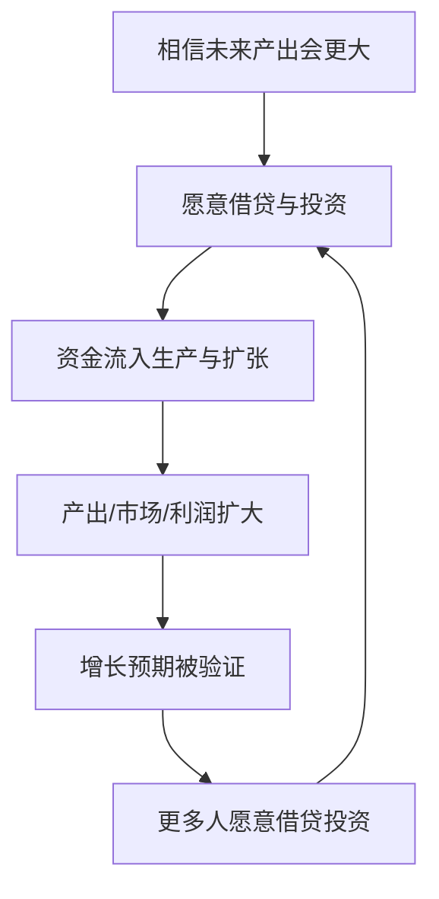
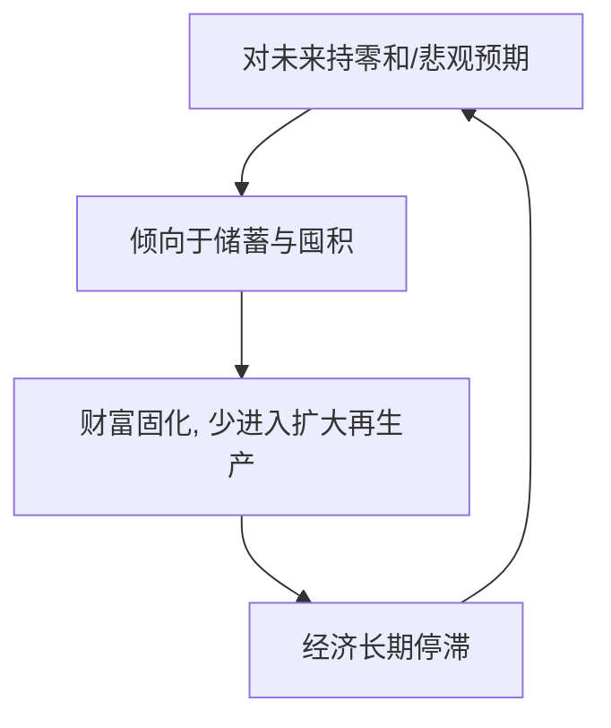

# 17｜资本主义为什么会相信“未来一定更好”？

> 资本主义为什么愿意把资源不断投入到"还没发生的未来"？

---

## 一、先说结论

赫拉利认为，资本主义的核心信条是**增长**——相信未来的总产出会大于今天。正因为相信未来更富裕，借贷和投资才显得合理：今天借出的钱，将来能连本带利地收回。

在他看来，这种对未来的信任，是近代经济区别于古代经济的根本。古代经济大体在"好年景与坏年景互相抵消"的循环里打转，而近代经济相信饼会越做越大，于是资源被不断投向未来。

这个信念既是增长的引擎，也孕育了泡沫与危机。

---

## 二、我们先理解一个问题

上一篇讲到，帝国、资本与科学结成了同盟，而资本是其中出钱的那一角。于是问题就来了：钱是有限的，未来却还没发生。一个头脑清醒的人，为什么要拿今天确定的东西，去赌一个还没影的明天？这不像是谨慎，倒像是冒险。

更奇怪的是，古代也有商人放贷、也有远距离贸易，为什么它们没能带来持续的经济增长？为什么人类在几千年里生活水平大体原地踏步，直到近代才突然加速？

这说明关键可能不在"会不会做生意"，而在一个更基础的东西——**人们如何想象未来**。

---

## 三、作者到底提出了什么观点？

赫拉利把资本主义描述成一种关于增长的信仰体系。

在他看来，资本主义不只是私有制加市场的组合，而是一套特定的逻辑：**把赚到的利润重新投入生产，以获取更大的利润。** 这套逻辑要求不断把资源投向未来，而它成立的前提，是人们相信未来的产出会超过今天。

他把信贷看成这种信念最直接的体现。把钱借给别人，本质上是把"未来的产出"提前折算到今天来用。如果相信未来更大，借贷和投资就合情合理；如果相信未来只会重复今天甚至更差，那么借钱消费就是危险的。赫拉利认为，正是这套"对未来抱有信心"的心态，让近代经济获得了前所未有的扩张冲动。

---

## 四、把这个观点翻译成人话

想象两个人面对同一笔钱。

**古代农夫**的世界观是循环的：丰年之后必有荒年，好日子和坏日子会互相抵消，长期看总量大致不变。在这种世界观里，借钱去扩大生产是有风险的，因为明年的收成未必比今年多，稳妥的做法是把粮食囤起来、把财富固化下来。

**近代企业家**的世界观是增长的：明年会比今年产出更多，市场会更大。在这样的预期下，借钱扩张不是败家，而是理性的投资，因为借来的钱能生出更多的钱。

同一笔借贷，在不同的"未来观"下，一个是赌博，一个是生意。资本主义的本质，就是让"未来会更好"从少数人的乐观，变成整个社会默认的日常信念。

---

## 五、为什么会这样？

把这条逻辑拆成链条就很清楚：

对照一下古代经济：

两条循环的差别，就在最开头那句对未来的判断上。赫拉利强调的关键机制是**贴现**：信贷把未来的收益拉到现在，让今天的生产提前获得资源。这也解释了一个看似矛盾的现实——一个社会越多人相信未来会更好，它就越容易真的变得更好，因为信心会让资源流动起来。

---

## 六、举一个现实生活中的例子

看创业融资就非常直观。

一位创业者手里有个想法，却没有钱把产品做出来。他去找投资人，投资人给一笔钱，换取公司的一部分股份。投资人赌的是什么？不是这家公司当下值多少，而是**它未来能赚多少钱**。这笔钱来自对未来的预期，而不是当下的收入。假如所有投资人都认定未来不会更好，这种融资模式会立刻消失。

房贷也是同一个逻辑。一个人买房，银行借给他一大笔钱，银行看的是他未来的收入能不能还上。买房的人则把未来几十年的收入，提前变成了今天的一套房子。

这两个例子都指向同一件事：**现代经济的大量活动，是拿未来做抵押。** 我们不是等到钱攒够了才去做事，而是先相信未来的自己会有能力，再借钱把事做起来。整个体系能运转，靠的就是这种对未来的集体信任。

---

## 七、回到书中重新理解

现在再读赫拉利的论述，就明白他为什么把"增长"提到那么高的位置。

他认为，前现代经济之所以增长缓慢，不只是技术落后，也因为在观念上缺乏"未来会更好"的普遍信念。大多数产出被当期消耗掉了，剩余有限；而人们又倾向把财富固化成粮食、土地、庙宇这类看得见的东西，而不是投进扩大再生产。

近代之后，一旦"未来更大"成为社会共识，利润就会被持续投入再生产，形成自我强化的增长。赫拉利还把它和科学革命的心态连起来：既然知识可以被不断扩张，产出为什么不能？承认无知带来了进步信念，而进步信念又支撑了经济增长——两件事在同一种乐观里汇合。

需要说明的是，赫拉利在书中是从文明史的角度概述这一转变的，他关心的是"信念"这一层，而不是银行具体如何操作。钱究竟是怎么被创造出来的，属于下一篇的话题。

---

## 八、这个观点背后还有什么？

有几个隐含前提值得点出。

**第一，增长的信念必须被制度支撑。** 光有乐观不解决问题，还得有保护产权、执行合同、稳定货币、可靠会计的制度，人们才敢把钱投出去。信念和制度是一体两面。

**第二，对未来的信任本身就是一种"共同相信的秩序"。** 它和货币、国家一样，存在于许多人的共同预期里。大家相信增长，增长才更可能发生；这是一种自我实现的集体信念。

**第三，它承接前文、也埋下后续。** 承认无知（科学）带来进步信念，科学与帝国资本结盟带来扩张动力，而对未来的信任则是资本那一角的心态。至于信用具体如何被创造、银行扮演什么角色，下一篇专门处理。

---

## 九、这个观点有问题吗？

有说服力的一面是，它承认了预期和信心在经济中的核心作用，这与后来经济学对预期、动物精神的重视方向一致。把"未来观"当作古今经济的分水岭，也确实点出了某种真实差异。

但争议不少。

**关于资本主义的定义，学界存在分歧。** 一些经济学家认为，资本主义更应被定义为一套制度组合——私有产权、市场竞争、雇佣劳动、法治和金融体系——而不是一种"信仰"。把它的核心归结为心理信念，可能把制度因素放轻了。

**增长的原因也不止一个。** 一些历史学家和经济学家认为，18、19世纪的增长加速，很大程度上是能源与工业技术革命（煤炭、蒸汽机、机械化）的结果，不单是心态转变。先有了机器和燃料，增长的信念才有物质基础。反过来也可能成立：是技术带来了增长，才让人们相信未来会更好。

**前现代经济也并非完全没有未来观念。** 远距离贸易、长期借贷在古代并不罕见，只是规模、制度和持续性不同。把古人统统说成"零和悲观"，是一种方便的对照，未必准确。

**还有一个循环论证的风险。** "因为相信增长所以增长，因为增长了所以更相信增长"，这个说法虽然抓住了自我强化的现象，却容易被用来解释一切，反而失去了分辨力。

**所以更准确的说法是**：对未来的信任确实是近代经济扩张的重要心理与制度条件，但它更像是技术与制度变革的伙伴，而不是唯一的发动机。至于乐观预期催生泡沫、泡沫破灭时同一机制反向放大恐慌，赫拉利书中提到但未展开，正好可由经济学的相关研究补充。

---

## 十、今天再看这个观点

以下是基于赫拉利思想的现代延伸，不是作者原话。

今天，"未来一定更好"的信念正在一些地方受到考验。经济增速放缓、人口老龄化、债务高企、气候变化的成本，都让"下一代一定比这一代更富"这个默认假设变得不那么理所当然。当一个社会里的多数人不再相信未来更好，会发生什么？一些观察者担心，人们会转向储蓄、保守，政治上则更容易接受短期的、防御性的选择。

与此同时，资本市场对遥远未来的预期却越来越激进。许多公司的估值高度依赖"若干年后会爆发"的叙事，于是泡沫和回调都更频繁。这说明同一个"相信未来"的机制，既可以驱动创新，也可以放大狂热。

还值得提醒的是，如果经济增长最终受资源与生态的约束，那么建立在"未来一定更好"之上的信用体系，就需要重新定义自己——否则它只是在把问题推给未来。

---

## 十一、这一篇真正应该记住什么？

1. **资本主义的核心信条是"增长"。** 它相信未来的总产出会大于今天，因此才敢把资源投向未来。

2. **对未来的信任让借贷和投资变得合理。** 信贷把未来的收益提前拿到今天使用，这是近代经济的特有姿态。

3. **前现代经济难以持续增长，部分因为缺乏这种信念与制度。** 产出大多被当期消耗，财富也倾向固化。

4. **增长信念带来繁荣，也带来泡沫。** 乐观情绪既能驱动扩张，也能在逆转时放大恐慌。

5. **单一心理解释有局限。** 技术、能源与制度的变革同样是增长的关键，不宜只归因于心态。

---

## 十二、留一个问题

> 如果经济增长最终要撞上资源与生态的边界，
> 那么这套建立在"未来一定更好"之上的信用体系，
> 该怎么重新定义自己，才不至于把代价一直推给下一代？

---

**下一篇**：说完了"相信未来"，还有一个更让人费解的细节：银行账面上的钱，好像能比实际存进去的多。你的存款，到底是真的存在那里，还是只是一串被大家共同相信的数字？

下一篇我们就来拆开这个问题——**银行凭什么把明天的钱借给今天？**
