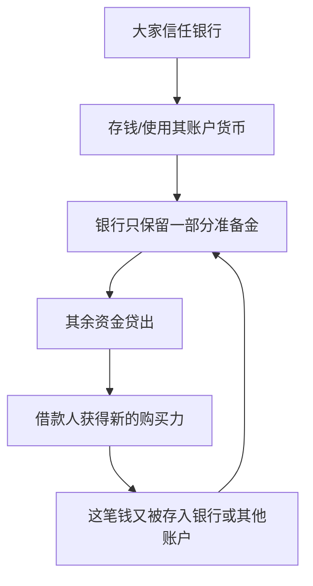
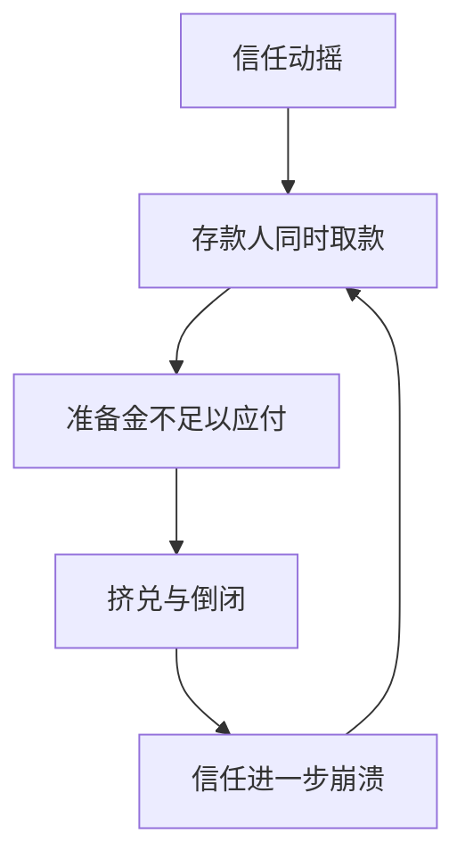

# 18｜银行凭什么把明天的钱借给今天？

> 银行账户里的钱，真的存在吗？为什么银行能把"不存在的钱"借出去？

---

## 一、先说结论

赫拉利把货币和信贷都归入**共同想象的秩序**。在他看来，信贷在很大程度上是一种"共同想象的信用"：银行不必持有全部存款作为现金，只保留一部分准备金，其余可以贷出，于是信贷能创造出新的购买力。

钱之所以看上去"凭空出现"，是因为信用本身就是一种被广泛相信的秩序——大家相信别人也会接受它、相信银行能偿付。

一旦这种信任崩溃，就会出现挤兑；想象出来的钱，也可能真的消失。

---

## 二、我们先理解一个问题

上一篇讲到，资本主义愿意把资源投向未来，而信贷是把未来拉到现在的手段。可这里有个更让人不解的细节：投出去的这些钱，究竟从哪来？

我们通常以为银行是个"保管钱的地方"：你存进去 100 元，银行把其中一部分借出去，自己留一部分备用。这个印象不算错，但漏掉了最关键的一环——**在现实中，贷款往往发生在存款之前。** 银行决定放贷时，它并没有先去数一遍金库，而是在账面上记下两笔：你多了一笔存款，同时欠银行一笔债。这时，一笔新的购买力出现了。

于是就有了那个让人心里发虚的问题：银行账户里的钱，真的存在吗？如果大家都去取，取得出来吗？

---

## 三、作者到底提出了什么观点？

赫拉利认为，钱的本质不是金属或纸，而是"所有人都相信别人也会接受它"的集体信念。货币是全人类最成功的一套共同想象。

银行体系把这种信念放大了一档。银行不需要为每一笔存款都留着等额的现金，只保留一部分准备金，其余部分可以贷出去收利息。这意味着，同一批资金在某种意义上可以支撑比它本身更多的购买力。赫拉利把这视为"想象的秩序"发挥现实力量最典型的领域之一。

在他看来，这不是诈骗，而是一套被法律、会计和信任共同支撑的制度。它的稳定，靠的不是金库有多满，而是大家相信银行还得上、也相信别人不会同时来取。信贷能凭空"创造"购买力，但那是真实的购买力和真实的负债——只是它的根基，是一种共同相信。

需要说明：赫拉利在书里是从文明史角度概述这一点的，并没有逐条讲解准备金制度的技术细节。下面的机制展开，是结合现代金融常识的说明。

---

## 四、把这个观点翻译成人话

想象一个村子，最早大家用金币交易。

后来有了钱庄：你把金币存进去，拿到一张票据，票据可以当钱花。渐渐地，大家发现票据流转得很顺，金币很少被真正取回。钱庄于是明白：不必为每张票据都存着金币，可以拿一部分贷出去收利息，只要留够日常兑付的量就行。

于是，同一批金币，撑起了比它多得多的票据。只要没有大批人同时来兑换，这个体系就稳稳运转；而它一旦稳，大家就更放心，愿意只拿票据、不碰金币——信心自己把自己托住了。

现代银行是这套逻辑的升级版。钱变多了，但对应的实物并没有同步变多。这不是魔法，而是"信用"这两个字在起作用：它让未来还没有产生的价值，今天就能被使用。

---

## 五、为什么会这样？

把这条循环画出来：

这条链的关键在 **F → C**：贷出去的购买力，往往又回到银行体系里，被再次保留一部分、再次贷出。经过多轮，整个社会账面上的货币总量，会被放大到远超最初那批"真金白银"的水平。这个过程就是通常所说的信用创造。

反过来的链条同样成立：

同样一套机制，信心充足时创造繁荣，信心逆转时加速崩溃。这就是为什么金融体系对"信心"这个词如此敏感。

关于准备金的比例，必须谨慎：不同国家、不同时期、不同类型的机构，规定差异很大，有的宽松、有的严格，不能用某个固定数字来概括。真正稳定的规律只有一条——**银行留存的现金，通常远少于它账面上的存款总额。**

---

## 六、举一个现实生活中的例子

先看信用卡，它最能体现"信贷创造购买力"。

你刷卡消费时，并没有先往卡里存钱。银行先替你把钱付给商家，你由此欠银行一笔债务，以后再还。也就是说，这笔购买力在你还款之前就已经出现了，它是银行基于对你未来还款能力的信任"创造"出来的。你花的不是自己的存款，而是银行对你未来的信任。这也解释了信用卡逾期为何后果严重：那是一笔真实存在的、有强制偿还义务的负债。

余额宝则能说明"同一笔钱被不同用途反复使用"的直觉。你把钱转入余额宝，本质上是交给货币基金去投资短期资产；你以为那笔钱还在、随时可取，同时它又被投了出去，购物时还能顺手用它付款。这套安排的稳定，完全建立在"多数人不会同时全部取出"的预期上。

这里要特别提示：余额宝背后的机制与银行存款并不完全相同，前者受货币基金和支付机构的相关规则约束，后者受存款保险、准备金等制度约束。两者不可简单等同，这里只是借它说明"钱在不同用途之间被反复使用"这件事。

---

## 七、回到书中重新理解

再回看赫拉利的论述，就能理解他为什么把货币和信贷当成"共同想象"的核心案例。

他的核心论点是：信用是一种共同想象，而银行是这个想象最强大的放大器。货币、公司、国家、人权，全都靠大家的共同相信才存在；在这些想象出来的秩序里，钱大概是覆盖面最广、渗透最深的一种——几乎每个人都相信它、使用它、为它工作。

他还强调，这套体系之所以能创造繁荣，是因为它把未来的产出提前变现，让今天就能动用明天的资源。但它也因此格外依赖信任的稳定：信任是它唯一的底气。金融体系于是成了"想象"发挥现实力量最戏剧化的舞台——平时它稳得像物理定律，恐慌时又能在一夜之间蒸发。

---

## 八、这个观点背后还有什么？

有几个隐含前提值得点出。

**第一，它承接了"钱是想象的秩序"这一判断。** 既然钱的价值来自共同相信，那么银行的做法就不神秘了：它只是把这套信念放大，让同一批信任支撑起更多的交易。

**第二，信任必须被制度化。** 光靠人心不够，还要有合同、抵押、破产法、监管和最后贷款人。没有这些，信用创造很快就会变成骗局。

**第三，它把三篇串成一条线。** 科学承认无知带来进步信念，对未来的信任支撑资本主义，而信用创造则让"未来的钱"真正流通起来。同一个"想象"的机制，在知识、增长和货币三个领域同时运转。

**第四，它也解释了金融危机的破坏力。** 既然账面上的钱建立在共同相信之上，那么当共同相信崩塌，想象出来的那部分钱就真的消失了——不是被谁偷走，而是大家一起不再相信了。

---

## 九、这个观点有问题吗？

有说服力的一面是，它把金融现象放回"社会信任"这个框架里，直观且抓住了要害。而且，现代经济学对"银行能创造货币"这一点其实已有相当共识，相关研究并不新鲜；赫拉利的贡献主要在于把它讲得通俗，而非提出新理论。

但有几处需要谨慎。

**一个措辞上的风险**：说银行"把不存在的钱借出去"，容易让人误解成那是幻觉。更准确的说法是——那笔钱在法律和会计上是真实的购买力、真实的负债，有强制偿还义务。所谓"凭空出现"，是一种便于理解的说明性说法，不是指它不存在。

**"只保留少量准备金"也不能一概而论。** 关于这一问题，各国和各个时期的制度差异很大：有的时期准备金要求可以很高，存款保险、央行最后贷款人、影子银行、货币基金等安排也各不相同。用一句话概括所有银行体系，可能会误导。

**赫拉利对金融的叙述偏重隐喻。** 他更关心"信任"这层含义，对央行如何主动调控货币、监管如何约束风险等，着墨不多。这些机制同样是理解现代金融不可缺的部分。

**所以更准确的说法是**：赫拉利提供的是一个关于信任与想象的、很有启发的视角；而金融体系的具体运作，需要结合货币银行学的细节来看，不能只靠一个比喻就下结论。

---

## 十、今天再看这个观点

以下是基于赫拉利思想的现代延伸，不是作者原话。

今天的货币形态仍在快速演化：移动支付、央行数字货币、稳定币、平台里的各种"余额"。你账户里的"钱"，越来越多只是数据库里的一个数字。这套体系对信任的依赖不但没有减少，反而更纯粹了。

过去几年，不少国家经历了大规模的货币宽松，随后又面对通胀压力，这说明货币创造与信任之间的关系依然是宏观经济的核心。信心充足时，信贷能支持创新和增长；信任受损时（银行危机、货币危机），同一机制会逆向狂奔，速度往往比建立时更快。

理解这一点，至少能帮我们看懂新闻里的几个高频词——"流动性""挤兑""央行出手"。它们背后是同一件事：一笔被大家共同相信的信用，能不能继续被相信下去。

---

## 十一、这一篇真正应该记住什么？

1. **钱是共同想象的秩序，银行是它的放大器。** 货币的价值来自集体相信，银行把这套相信放大成信用创造。

2. **银行不必持有全部存款，只留一部分准备金即可放贷。** 因此信贷能创造新的购买力，让账面上的货币多于最初的现金。

3. **这套机制靠信任稳定，也因信任崩塌而挤兑。** 信心充足时创造繁荣，信心逆转时加速崩溃。

4. **那笔钱是真实的负债与购买力，不是幻觉。** "凭空出现"只是说明性说法，它有法律上的强制偿还义务。

5. **各国制度差异很大，不能用固定数字概括。** 准备金要求、存款保险、监管安排各不相同，需结合具体制度理解。

---

## 十二、留一个问题

> 如果现代货币的大部分，只是被大家共同相信的一串数字，
> 那么当这种信任开始向一个不属于任何国家的数字货币转移时，
> 国家还能剩下多少调控经济的能力？

---

**下一篇**：信用与增长的故事讲到这里，还有一个力量一直没有正面出场。当人类学会把能源变成动力，用机器替代人力，这套"信贷—生产—消费"的循环才真正开始指数级地奔跑，连家庭、城市和时间观念都被重新塑造。

下一篇我们就来拆开这个问题——**工业革命到底改变了什么？**
