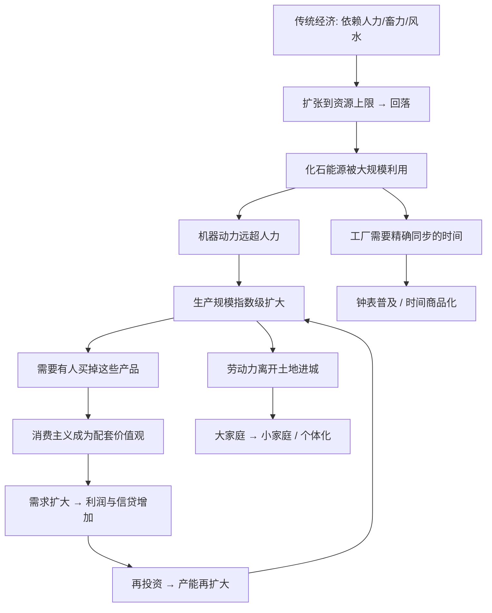

# 19｜工业革命到底改变了什么？

> 工业革命真正改变的是技术，还是人类与能源、时间的关系？

---

## 一、先说结论

赫拉利认为，工业革命表面上是机器取代了手工，本质上却是一次"关系重组"：人类第一次学会把大规模能源转成生产，再把生产转成消费，用"信贷—生产—消费"的循环，把增长变成一种停不下来的常态。

更关键的是，这场革命不只换了工具，还换掉了人和时间、人和家庭、人和欲望的关系。钟表把时间切成可以出售的单位，城市化打散了大家族，而消费主义被专门发明出来，去承接那些源源不断生产出来的东西。

换句话说，工业革命真正的产物不是蒸汽机，而是一种"必须永远增长"的活法。

---

## 二、我们先理解一个问题

人类历史上从来不缺技术改良。两千年前就有水车、风车、齿轮、火药，中世纪也有各种精巧的机械。可为什么只有十八、十九世纪这一次，增长会突然起飞，而且一飞就是两百年没有停？

如果技术就是答案，那问题反而更奇怪了：为什么同样的技术，出现在不同的社会里，结果差别那么大？

所以真正要问的是：工业革命到底在"人和世界的关系"里动了哪一根筋？它改变了什么，才让"一年比一年更多"这件事，从偶然变成了默认？

理解了这一点，才能理解我们今天的很多处境——为什么工作要打卡、为什么假期要旅游消费、为什么"增长"几乎成了所有国家的默认目标。这些都不是自然现象，它们有一个共同的源头。

---

## 三、作者到底提出了什么观点？

赫拉利把工业革命的要害，归结为**能源**。

在此之前，人类能用的动力基本来自两处：人和动物的肌肉，以及风、水这类自然力。这两处都有一个硬上限——一块土地能养的人、能养的牲畜是有限的，能利用的风水也受地理限制。所以传统经济总是在"扩张到极限，然后回落"之间循环。

工业革命做的事，是找到了一个几乎不受这个上限约束的新来源：**化石能源**。煤、石油、天然气，本质上是把几亿年积累的太阳能压缩在地下。人类一旦学会高效地烧它、用它驱动机器，就等于给自己接上了一个巨大的能量插座。

赫拉利强调的不只是"能量变大"，而是这个变化引发了自我强化的循环：

- 有了更多能源，就能生产更多商品；
- 生产更多商品，就需要更多买家和资金；
- 更多的消费和利润，又反过来支持更多的信贷、投资和产能扩张。

于是形成"**信贷—生产—消费—再投资**"的正反馈。这正好和第 17、18 篇讲的资本主义连在一起：资本主义相信未来会更好，于是敢借钱；工业革命则真的把这份"未来"造了出来。银行把明天的钱借给今天，工厂则把今天的投入变成明天更多的产出——两者是一套机器的两面。

赫拉利的另一个重点，是配套的**价值观**。生产出来的东西必须有人买，否则循环就断了。所以他特别指出，现代经济需要一种全新的伦理：**消费主义**。过去很多文化把节俭、克制、少欲当成美德；而现代经济需要人们把"买更多、更新、更好"当成责任甚至快乐。

最后是**时间与家庭**。工业要求精确、同步、可协调：机器不能等农夫看天吃饭，工厂要所有人同一个点到同一个地方做同一件事。于是钟表从奢侈品变成必需品，时间从"日出而作"变成可计量、可出售的商品。同时，工厂需要流动的劳动力，人们离开土地进城，多代同堂的大家庭被拆成小家庭，个体第一次成为"可雇佣、可搬迁"的单位。

---

## 四、把这个观点翻译成人话

先换个角度看能源。

古代的富裕，本质上是"能调动多少人力"。皇帝修宫殿，靠的是征发几十万民夫；地主收租，靠的是佃农的汗水。人本身就是能源，所以"多子多福"不仅是观念，更是经济理性——多一个儿子就多一份劳力。

工业革命把这个逻辑换掉了。一台蒸汽机干的活，可能相当于几百个人。于是**能源第一次可以和人脱钩**：你不再需要靠生更多的人来获得更多动力。这就是为什么工业社会里，"人口多"从资产逐渐变成了压力。

再看增长循环，可以打个比方。一家小吃店每天只做固定几十碗，卖完收摊，这就是传统经济——稳定，但封顶。要突破就得：先借钱租更大的店面（信贷），雇更多人做更多碗（生产），再想办法让更多人来吃（消费），赚到的钱投进去开分店（再投资）。循环一旦转起来，会越转越快。

但它有个致命前提：**必须有人一直买**。所以现代社会必须不断制造新需求。于是"消费"从一种行为变成一套系统：广告、分期、潮流、节日促销，都在为这个循环服务。

时间也是同理。钟表普及后，"一个小时"变成了可以买卖的东西——你上班卖的不是体力，而是被计量过的生命时段。打卡机、工时、KPI，都是这套时间秩序的产物。

---

## 五、为什么会这样？

把赫拉利的推理拉成链条，大致是这样：

这条图里最关键的是 **E → F → G → H → I** 这个闭环。它是一个正反馈：每一圈都让下一圈更大。这解释了为什么工业革命之后的经济不再是"涨—落—涨"的循环，而变成了一条持续向上的曲线。

而这个闭环还有一个隐含要求：**增长必须是常态**。一旦停止增长，信贷还不上、就业没着落、社会预期崩掉。所以现代经济像一辆没有空挡的车——可以减速，但很难停下。这正是赫拉利想让人警惕的地方。

另外两个箭头（C → J → K 和 E → L → M）说明，工业革命从来不只是"工厂里的事"。它同时重写了时间秩序和家庭结构。这是它和以往任何技术革新的根本不同：它改变的是整个社会组织方式。

---

## 六、举一个现实生活中的例子

先看**福特流水线**。

在流水线出现之前，造一辆车要靠一群技术工人围着一辆车各自装配，慢、贵、依赖老师傅。福特把工序拆成极细的步骤，让每个工人固定站在一个位置，重复一个动作，传送带把车送到他面前。

结果不只是"快了"。它带来三个连锁反应：产量暴涨、单价大幅下降、于是普通人第一次买得起汽车。但与此同时，工人也变成了流水线上的一个零件——动作被标准化，节奏被传送带控制，时间不再属于自己。

这正是赫拉利说的那套逻辑的缩影：能源和分工把产能推上去，产能又必须被消费消化，而消费的前提是价格足够低、供给足够多。流水线是"生产端"的极限压缩。

再看**双十一购物节**。

它几乎是"消费主义"的教科书级案例：把分散的日常购买压缩到一天，用倒计时、优惠、预售、直播，人为制造"必须买点什么"的紧迫感。很多人买的并不是缺的东西，而是因为"便宜""别人都在买""不买就亏了"。

从赫拉利的视角看，这不是简单的促销，而是增长循环在当代的一次集体排练：产能需要被消化，于是必须持续生产新的欲望。区别只在于，福特靠降低价格让人买得起，今天靠制造氛围让人想买。

两个例子合起来，正好覆盖循环的两端——一端是"怎么造出来"，一端是"怎么卖出去"。

---

## 七、回到书中重新理解

现在再回头看赫拉利关于工业革命的章节，就清楚他在做什么了。

他没有把重点放在"发明了哪些机器"上，而是反复追问：这些机器把人和世界的关系改成了什么样。在他看来，工业革命最深的革命性，是**把"增长"从例外变成了默认**。以前的经济可以在一个水平上稳定几百年，工业革命之后，"不增长"反而成了危机。

他也特意把这一章和前面讲资本主义、后面讲幸福连起来。资本主义提供了对未来的信任，工业革命提供了兑现未来的能力，而这两者都需要一个东西兜底——**永远有人买**。所以他才花篇幅讲消费主义，因为它是这套系统能转下去的社会心理基础。

---

## 八、这个观点背后还有什么？

有几个隐含前提值得点出来。

**第一，能源视角隐含一种唯物论。** 赫拉利倾向于把历史变化的底层动力放在物质条件上：能量、资源、技术。这很解释力，但也意味着他相对弱化了思想、制度、偶然事件的作用。

**第二，它纵向勾连了资本主义。** 信贷—生产—消费的循环，实际是第 17、18 篇思想的具体落地。资本提供资金和信念，工业提供产能，消费提供一个"社会心理接口"。

**第三，它埋下了"评价问题"的伏笔。** 增长让物质变多，但如果人的满足感不随之上升，那增长的意义就要被重新追问。这正是下一篇要处理的问题。

---

## 九、这个观点有问题吗？

有。赫拉利给了一条很有力的解释路径，但它并不是没有争议的定论。

第一，**"工业革命"这个分期本身就有争议。** 关于这一问题，学界存在不同解释。一些经济史学者认为，真正的转折是渐进的、区域性的，把某一年当作"革命"的起点可能过于整齐。也有人强调，制度、产权、法律、贸易网络的作用，未必比能源小。

第二，**能源决定论可能过度简化。** 把工业革命主要归因于化石能源，等于把复杂的制度、文化、资本积累压缩成一个变量。反例是：有些地区同样能获得煤，却没有自发进入工业化。这说明能源是必要条件之一，但未必是充分条件。

第三，**"消费者被塑造"这个说法容易被推得太远。** 广告和营销确实在制造需求，但如果因此就断定消费者完全没有自主选择，就把人当成了纯被动的木偶。更稳妥的表述是：需求有一部分是自然的，有一部分是被商业放大的。

第四，**增长的代价在赫拉利的叙述里相对靠后。** 生态破坏、资源耗竭、气候问题，这些后果在他写书时已经出现，但相较于他对"增长逻辑"的分析，分量仍偏轻。后来的研究普遍认为，这套循环对地球系统的压力，可能比书中呈现的更紧迫。

因此更准确的说法是：赫拉利准确地抓住了工业革命的"结构性"特征——它重组了能源、生产和欲望的关系；但把它讲成一场主要以能源为因的革命，是一种有侧重、也有取舍的叙述。

---

## 十、今天再看这个观点

以下部分是基于赫拉利思想的现代延伸，不是他在书里的原话。

赫拉利写的是蒸汽和煤的时代，但增长循环今天不但没停，反而被技术加密了。

平台经济、算法推荐、移动支付，把"生产—消费"的循环压缩到更短的周期。过去一次购物要出门、挑选、付款；今天几秒钟就能完成，推荐系统还会根据你的行为预测并引导下一次购买。赫拉利讲的"消费主义作为配套价值观"，今天已经升级为"个性化的欲望生产系统"。

时间这条也值得延伸。工业时代把人按小时组织，今天更细：外卖的配送时间、短视频的停留时长、任务的响应速度。时间被切得更碎，也被更精细地定价。

还有一层更根本的问题：工业革命的增长依赖能源，而今天的主流讨论已经开始追问增长的边界——环境压力、资源约束，以及"增长是否真的能带来满足"。这一问题，正是下一篇要正面处理的。

---

## 十一、这一篇真正应该记住什么？

1. **工业革命的本质是能源跃迁。** 人类从人力和畜力，转向煤、石油这类化石能源，第一次让动力摆脱了对人口和土地的依赖。

2. **它建立了一个自我强化的增长循环。** 信贷—生产—消费—再投资，这个正反馈让经济从"涨落后回落"变成持续向上的曲线。

3. **消费主义是这套循环的配套价值观。** 产品必须被消化，所以现代社会需要不断制造新的欲望，节俭从美德变成"不合时宜"。

4. **被改变的还有时间和家庭。** 钟表让时间可计量、可出售；城市化把多代同堂的大家庭拆成流动的小家庭。

5. **增长成了默认，而默认未必是自然。** 现代经济几乎无法停下增长，这既是动力，也是一种结构性的压力。

---

## 十二、留一个问题

> 如果这套增长循环的前提是"永远有人买"，
> 而人的满足感又不会随着买得更多而同步上升，
> 那么增长到底是在满足需求，还是在生产需求？

---

**下一篇**：工业革命带来了前所未有的财富、寿命和便利。按常理，人应该越来越幸福才对。可为什么很多研究显示，物质条件大幅改善，主观幸福感却没有同步起飞？

下一篇我们就来拆开这个问题——**人类越来越富，为什么不一定越来越幸福？**
