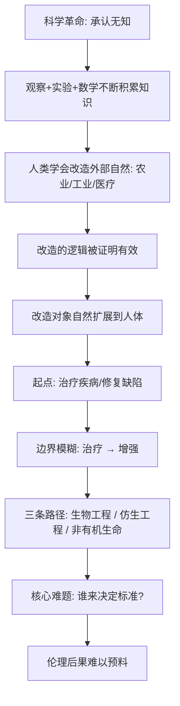

# 21｜人类为什么开始试图改造自己？

> 人类为什么不再满足于适应环境，而要改造自身？

---

## 一、先说结论

赫拉利的判断是：科学革命让人类完成了一次根本转弯——从"顺应自然"转向"改造自然"。而这个逻辑一旦启动，就很难停在外部的山川河流上，它最终会落到人类自己身上。

在他看来，人类正在把同样的工具对准自身：改写基因、替换器官、把机械和神经系统接起来。这条路的第一步往往是治疗，但治疗和增强之间并没有一条清晰的界线——治着治着，就变成了"想更强"。

赫拉利真正担心的不是某项技术本身，而是**没有人能说清停下来在哪里，以及由谁来决定那条线。**

---

## 二、我们先理解一个问题

先看一个简单的对比。

几万年来，人类适应环境的方式，主要是改变自己去配合世界：冷了就穿兽皮、热了就找阴凉、缺食物就迁徙。农业和工业让人类开始改造外部环境——修水坝、铺铁路、建城市。这些都是对"身外之物"的改造。

但从二十世纪后期开始，出现了一个新的方向：**改造的对象变成了人本身。** 疫苗、抗生素、器官移植、人工关节、试管婴儿，人类的肉体和生命过程，第一次成为可以被干预的工程对象。

问题就来了：我们凭什么、又为什么会把改造的尺度从"环境"推进到"自己"？如果连"人是什么"都可以被重写，那么这跟过去所有革命相比，究竟新在哪里？

这不只是科技新闻里的问题，它牵涉到每个人都关心的：什么算治疗，什么算变强？谁有资格决定我的孩子长什么样？

---

## 三、作者到底提出了什么观点？

赫拉利在书里区分了三条改造自身的路径，这个三分法常被引用。

**第一条是生物工程。** 指在基因和生物层面主动修改生命体。它的起点常是治病：修复导致遗传病的基因，用药物和生物技术干预身体的运作。从治疗出发，它可以延伸到"增强"——比如提高记忆力、改变外貌、延长寿命，甚至选择后代的某些特征。

**第二条是仿生工程。** 指把机械、电子装置与人体结合。人工耳蜗、心脏起搏器、智能假肢、视网膜植入，都属于这一类。当这些装置不仅能"补上缺失"，还能"超出常人"时，界限就开始模糊：一条能感知红外线的假肢，还是单纯的"治疗"吗？

**第三条是非有机生命，也就是人机结合和人工智能方向。** 这条最激进：先让机器能理解人的意识，再让人的意识与机器系统相连，甚至设想把心智上传到非生物的载体上。这条路径在赫拉利写作时还相当遥远，但它代表了一种逻辑延伸——如果生命可以被设计，那"有机"这个前提本身也可以被放弃。

赫拉利强调的共同点是：**这三条路的第一步都披着"治疗"的外衣，但它们的终点都通向"改造"。** 而一旦进入"改造"，我们就不再只是自然的产物，而成了自己设计的对象。

他还提出一个更尖锐的判断：这一转向的伦理后果，比以往任何一次革命都更难预料。因为过去改造的是外部世界，我们可以用"好不好用"来判断；而改造自身，涉及的是"什么才算人""谁有权定义人"，这些没有现成的标准答案。

---

## 四、把这个观点翻译成人话

关键在于分辨两个词：**治疗**和**增强**。

治疗是"把人恢复到正常水平"：近视可以戴眼镜，缺牙可以种牙，生病可以吃药。这几乎没有争议，因为大家默认"正常"是一个值得恢复的状态。

增强是"把人提升到超过正常水平"：健康的人想变得更聪明、更专注、更耐老、更高。这时候问题就来了——"正常"到底是谁定的？如果所有人都能买到"超常"，那"正常"会不会变成一种新的落后？

一个很好的类比是眼镜。眼镜毫无疑问是治疗，没人觉得戴眼镜不道德。但如果有一天出现一种手术，能让健康人获得超出常人的夜视能力，而且只有买得起的人才做，那么它还是"治疗"吗？它会如何改变竞争、公平和"人"的含义？

赫拉利想说的是：**技术问题往往可解，难的是价值问题。** "能不能做"由科学回答，"该不该做""谁来做""做到哪一步"没有科学家能替你回答。这需要社会、法律、伦理共同承担，而这恰恰是最没有共识的部分。

---

## 五、为什么会这样？

把"从顺应自然到改造自身"的转向画成链条：

关键在 **F → G** 这一步。它解释了为什么这条线特别难守：治疗和增强在技术操作上常常是同一套手段，差别只在目标和"正常"的定义。你很难用一个纯技术的标准去划线。

而 **H → I** 又说明，这不是某一种技术的孤立问题。三条路径同时推进，彼此还在加速：基因技术借鉴生物学的进展，仿生工程借鉴材料学和电子学，人工智能又整体提升三者的效率。它们互相加强，导致伦理讨论永远慢一步。

最终落到 **I → J**：因为缺乏公认的标准和权威，改造自身这件事，很可能不是被"决定"的，而是被市场和技术一步一步推着发生的。

---

## 六、举一个现实生活中的例子

先看**疫苗**。它几乎是最典型的"治疗"案例：通过免疫系统训练，让人免于致命的传染病。它拯救了无数生命，也被公认为公共卫生史上的重大成就。

但即便这样清晰的"治疗"，也伴随过长期的争议——关于风险、关于个人选择与公共利益的边界、关于强制与自由。这个例子说明：**连最接近纯治疗的技术，都难以完全摆脱伦理张力和群体博弈。** 那么，当技术从"防病"迈向"增强"时，争议只会更大。

再看**曾引发广泛争议的基因编辑婴儿事件**。

这一事件的核心争议，不在于"基因技术有没有用"，而在于：对尚未出生的、无法表达意愿的个体，人类是否有权在其生殖细胞上做不可逆的修改？即便修改的初衷是"预防疾病"，它也已经越过了传统治疗的边界——因为它改动的不是某一个病人的身体，而是会传给后代的遗传信息。

这个事件之所以成为标志性案例，正因为它集中体现了赫拉利提出的所有难题：治疗与增强的界线在哪里？谁来审批？谁来承担后果？如果这些修改成为"可购买的服务"，社会会不会出现新的、被写进基因的分层？

需要强调：本文不针对任何个人做价值评判，这个事件的意义在于它把问题摆到了台面上。

---

## 七、回到书中重新理解

现在再读赫拉利的这一部分，会发现他的位置非常清楚：他不是在预测某项技术何时成熟，而是在指出一个**逻辑转折点**。

前面讲科学革命时，他强调"承认无知"是科学的力量来源。到了改造自身这一章，他要问的是：当这种力量的对象变成了人，会发生什么？在他看来，科学让我们能改造自然，而同样的逻辑迟早会导向"改造人"。这不是阴谋，而是一种顺理成章。

他也刻意把这一章放在幸福问题之后。理由很直接：如果人并不因更多物质而更幸福，那"想变得更强、更聪明、更长寿"的冲动，到底是为了幸福，还是为了别的什么？这层追问，让他对"改造自身"保持一种既开放又警惕的态度——它可能是人类的新阶段，也可能是人类把自己的方向盘交了出去。

理解这一点，才能读懂他最后一篇的担忧：不是"技术会不会来"，而是"我们有没有准备好"。

---

## 八、这个观点背后还有什么？

有几个前提值得点出。

**第一，"治疗"与"增强"的二分本身在哲学上并不稳固。** 因为"正常"很难有客观标准，它随时代、文化、技术而变。今天被认为是"增强"的眼科手术，明天可能被当成"治疗"。

**第二，改造自身和"想象的秩序"是连着的。** "正常的人""健康的人""合格的人"这些标准，并不是生物学的天然给定，而是社会共同相信的界定。一旦标准可以被技术改变，这套共同想象也会被迫重写——这直接指向下一篇。

**第三，平等问题被再一次放大。** 如果增强是市场化的，最先受益的是买得起的人。这会否让"生而平等"这个近代的共同想象，在经济分层之外，再叠上一重"生物分层"？

**第四，它隐含一种技术自主性。** 赫拉利的叙述里有一种倾向：技术一旦可行，就会自行推进。这让"由谁来决定"这个问题显得更加紧迫，也更难回答。

---

## 九、这个观点有问题吗？

有，需要分清楚哪些是扎实的、哪些是推测性的。

第一，**"从治疗自然滑向增强"可能有宿命论色彩。** 现实中并非所有可行技术都会不受约束地推行。历史上，各国通过监管、伦理审查、国际共识，确实对某些技术设过限制（例如对人的生殖系基因编辑，很多国家有法律禁止）。赫拉利的技术自主性倾向，可能低估了制度约束的力量。

第二，**"三条路径"的划分很清晰，但现实中彼此交织。** 生物工程、仿生工程、非有机生命三者常常互相支撑，把复杂趋势切成三条线，有助于理解，也可能掩盖它们之间的联动。

第三，**时间尺度被讲得偏快。** 赫拉利描述的"改造自身"，很多在写作时仍属前沿设想。过度强调紧迫性，容易让人忽略技术落地中的漫长、反复和失败。

第四，**"谁来决定"的答案其实并不必然悲观。** 医疗伦理、知情同意、临床试验规范、基因编辑治理框架，都是人类已经在尝试作答的机制。它们不完美，但并非完全缺位。

第五，**"改造自身"是否等于"人将不再是人"，这是一个价值判断而非科学结论。** 有人把它看成对"人类尊严"的威胁，也有人看成人类能力的自然延伸。关于这一问题，学界和公众存在不同解释，不宜把其中一种当作唯一答案。

因此更准确的说法是：赫拉利敏锐地指出了"改造对象从自然转向人"这一结构变化，并提出了"谁来决定"的核心问题；但他在技术推进会否势不可挡、伦理约束有没有效力上，比现实要更倾向于悲观。

---

## 十、今天再看这个观点

以下部分是基于赫拉利思想的现代延伸，不是他在书里的原话。

赫拉利写作时，改造自身的讨论还主要集中在基因和义体。而在今天，第三条路径——人工智能——已经以一种他当年只能设想的方式进入了日常。

一个显眼的例子是脑机接口。一些研究团队在做"让瘫痪者用意念控制机械臂或打字"的项目，这在性质上非常接近"治疗"。但同样的技术，理论上也可以用于让健康人更快地获取信息、直接与设备交互。治疗与增强的界线，又一次出现在同一个装置上。

另一个方向是人工智能与人体的结合：可穿戴设备持续监测心率、睡眠、血糖，算法据此给出建议甚至直接调节。这已经是"人机结合"的一种温和形态，只是尚未深入到神经层面。赫拉利所描述的"边界模糊"，在这里有了更贴近生活的呈现。

需要再次强调：这些是技术趋势的延伸，不是赫拉利在书中的原文。他的贡献不在预言了哪一项技术，而在于提前把一个无法回避的问题摆到了我们面前——**当"人"可以被设计，我们凭什么决定设计成什么样？**

---

## 十一、这一篇真正应该记住什么？

1. **科学革命让改造对象从自然转向人。** 人类先是适应环境，再是改造环境，最后开始把工程思维用于自己的身体和心智。

2. **治疗与增强之间没有清晰的界线。** 很多技术最初用于治病，但同样的手段很容易滑向"变得更强的需求"，而"正常"本身没有客观标准。

3. **改造自身有三条路径。** 生物工程改写基因，仿生工程把机械接入人体，非有机生命设想让人机与人工智能结合。

4. **真正的难点是价值问题，不是技术问题。** 能不能做由科学回答，该不该做、由谁决定、做到哪里，需要社会共同作答，而共识恰恰最难建立。

5. **这一转向指向一个更根本的问题。** 一旦"人"的定义可以被重写，建立在"人"之上的共同想象——平等、权利、尊严——都要面对重新界定的挑战。

---

## 十二、留一个问题

> 如果治疗和增强用的是同一套技术，只是目标不同，
> 那么当这项技术只能先服务买得起的人时，
> "生而平等"这句话，还能不能站得住？

---

**下一篇**：如果人类真的能设计自己的基因、意识和智能，那"智人"这个物种本身，还会稳定存在吗？我们会不会迎来一个连名字都不再叫"人"的下一阶段？

下一篇我们就来拆开这个问题——**智人会不会终结？人类的下一阶段是什么？**
