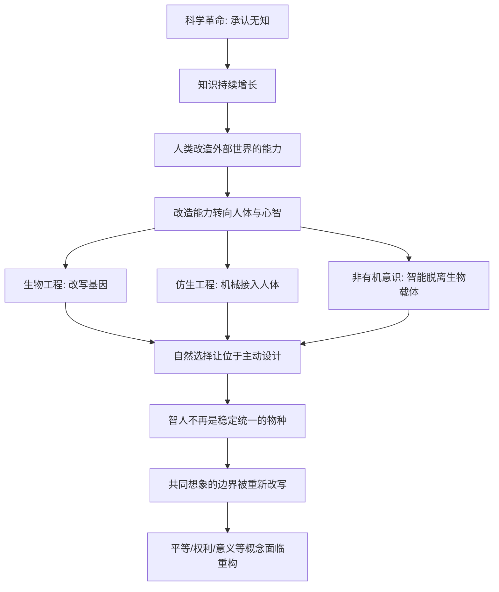

# 22｜智人会不会终结？人类的下一阶段是什么？

> 如果人类能设计自己的基因、意识和智能，那么"智人"还是不是一个稳定的物种？

---

## 一、先说结论

赫拉利的答案是：智人未必会"灭亡"，但很可能不再"稳定"。

他预见的不是一场灾难片式的终结，而是一种更安静、更难察觉的变化：当人类能用生物工程改写基因、用仿生工程替换身体、用人工智能延伸甚至取代心智时，"人"这个类别就不再有一个统一、固定的边界。到那时，地球上可能出现的是几种智能形式共存——有的仍是有机生命，有的是半机械人，有的完全不属于生物。

他把这种可能性称为"神人"或后人类。这既是可能性，也是一个警告：**人类创造出来的力量，有可能最终超出人类自己的控制。**

---

## 二、我们先理解一个问题

先把"物种"这个词想清楚。

在生物学上，一个物种通常指可以互相交配并产生可育后代的群体。智人之所以是智人，是因为我们共享同一套基因，处在同一条演化的河流里。

可如果有一天：一部分人的基因被大规模改写，一部分人的大脑与机器直接相连，还有一部分"智能"根本不再依托生物体，那么"智人"还是同一个物种吗？这些人之间还能互相理解、甚至互相交配吗？

更麻烦的是哲学问题：什么才算"人"？是由基因定义，由意识定义，由社会承认定义，还是由"共同相信"定义？——注意，最后这个答案，正好回到了这本书一开始讲的东西。

所以这一篇真正要问的是：**当"人"可以被重新设计，那支撑整个人类秩序的"人"这个概念，会不会被拆开？**

---

## 三、作者到底提出了什么观点？

赫拉利在书的最后一章里，谈的是"智人的终结"。这里要澄清一点：他说的"终结"，不等于灭绝。

他说的是一种**物种层面的松动**。人类历史上第一次，演化可能不再主要靠自然选择，而是靠设计。自然选择是盲目的、缓慢的、被动的；而设计是有目标的、快速的、主动的。一旦人类能设计自己，智人就从一个"自然物种"，变成了一个"可以改参数的产品"。

他提出的可能路径，和前一篇讲的三条呼应：

**第一，生物工程。** 直接在基因和生理层面改造人，让后代拥有某些被选择的特征。如果这条路走下去，人类可能不会分裂成新的物种，但个体之间的差异会被空前拉大。

**第二，半机械人（仿生工程）。** 把非生物的部件与人体、甚至与大脑结合，让人获得原本不具备的能力。当机械部分承担了越来越多的认知和感知功能，"人"和"机器"的边界就开始融化。

**第三，非有机意识。** 最激进的一条：意识可能不再需要生物载体，智能可以完全运行在非有机的系统上。这条路径直接挑战了"生命"和"人"的定义。

赫拉利的判断是：这三种可能不是遥不可及的科幻，而是前面科学革命逻辑的自然延长。既然是自然延长，那就意味着——**没有人真正按下了启动键，它就已经在走了。**

他还给出一个关键的警告：这一过程最危险的地方，不是技术失败，而是"失控"。人类发明了能改变气候、毁灭城市、改写生命的力量，但这些力量是否会被明智地使用，赫拉利没有把握。

---

## 四、把这个观点翻译成人话

可以这样理解他的担忧。

人类过去的力量，大多作用在"外部"：火、农业、机器、市场。这些都还在人可理解、可管理的范围内。而改造自身、创造新智能，把力量对准了"内部"——我们的身体、我们的大脑、我们定义自己的方式。

这就像一个原本只会修房子的人，突然开始改自己的大脑。工具没变，对象变了，风险等级完全不一样。

一个更贴近的类比是"尺度问题"。人类几千年来的秩序，建立在一个共同信念上：**人是有限的、会死的、有共同生理基础的。** 法律、伦理、宗教、经济，都围绕这个前提设计。

如果这个前提被推翻——如果有些人可以活几百年，可以随时接入超强智能，可以备份记忆——那么建立在"人人都会死"之上的税收、继承、保险会怎样？建立在"人人有共同脆弱性"之上的同情与道德会怎样？

赫拉利想说的正是：**当"人"的定义可以被重新编写时，受影响的不是某一项技术，而是整座文明的坐标。**

---

## 五、为什么会这样？

把"智人之后"的逻辑画成链条：

这条链条最关键的是 **F → G → H**。

技术上的分歧只是手段不同，它们汇到同一个点上：**演化的方向盘从自然手里，转到了人类手里。** 这一步一旦发生，"智人"就不再是一个由生物学给定的统一类别，而变成一个可被分化、可被定制的集合。

接着 **G → H** 才是赫拉利真正想说的：问题不只是"人变成什么样"，而是"人这个概念还成不成立"。而"人"是一整套共同想象的承重墙——它撑着平等、人权、尊严、责任。承重墙一动，上面的建筑都要重新评估。

---

## 六、举一个现实生活中的例子

先看 **ChatGPT** 这一类人工智能。

它的出现本身就是一次提示：智能不一定需要生物载体。一个非人类的系统可以写文章、做翻译、进行对话。它还没有意识，也不具备赫拉利所说"非有机意识"的全部含义，但它已经动摇了我们一个默认假设——**智能必然等于人。**

更值得注意的是它和"共同想象"的关系。赫拉利在第一篇里说过，智人的超能力是让成千上万人相信同一个故事。而今天，讲故事这件事正在部分地被机器接管：算法能生成叙事、生成图像、生成可信的语气。如果共同想象的生产权被重新分配，人类的组织方式就可能跟着变。

再看**科幻作品**。

科幻的价值不在于预言得准，而在于它把可能性提前摆到台面上。关于"人机融合是否还叫人""意识能否被上传""后人类会不会统治人类"，科幻早已反复推演。赫拉利的论述，某种程度就是把这类想象从故事里拉出来，当成需要现在就认真讨论的问题。

两类例子合起来说明：智人的下一阶段可能不是突然到来的，而是一连串看似合理的技术进步——更好的义肢、更聪明的助手、更有效的基因治疗——叠加起来，慢慢把"人"推到一个新位置。

---

## 七、回到书中重新理解

现在把这一篇放回整本书，它的功能就清楚了：它是收尾，也是回环。

赫拉利从"智人只是普通动物"讲起，一路讲到认知革命、农业、金钱、帝国、宗教、科学、资本、工业、幸福、改造自身，最后停在"智人的终结"。这个结构不是随意的：**他其实是在讲同一个主题的不断放大——共同想象如何建立、扩张，最后可能被彻底改写。**

第一篇给出的地基是：智人的力量来自能让陌生人相信同一个故事。而最后一篇提出的问题是：如果连"人"这个最基础的共同想象都可以被重新编写，那么我们赖以组织世界的所有故事——权利、国家、货币、道德——会不会一起被改写？

所以他谈"神人"，核心不是预言一种新物种，而是提出一个警告：**人类创造了可以重新定义自己的力量，却没有同步创造能约束这股力量的东西。** 这是全书反复出现的那个结构性张力，在最前沿的场景里重新出现。

这也解释了书名的含义——从一种普通动物，走到有能力像"神"一样设计生命的地位，中间那条路，正是我们一路追下来的那条线。

---

## 八、这个观点背后还有什么？

有几个隐含前提值得点出。

**第一，"共同想象"是全书的最大伏笔。** 第一篇种下，最后一篇回收。国家、货币、人权、乃至"人类"，本质都是被共同相信的秩序；一旦能被设计，它们的稳定性就要重新检验。

**第二，它把平等问题推到极限。** 如果能力可以被购买和遗传，那么"生而平等"这个近代最重要的共同想象，可能面临自诞生以来最严峻的挑战。

**第三，它留下一个关于"意义"的问题。** 如果人被设计出来，那"我想成为什么样的人"还是不是自己的选择？这正是第二十篇幸福问题的终点——当感受都可以被制造，意义还剩多少是内生的？

---

## 九、这个观点有问题吗？

有。这一篇是全系列推测性最强、争议也最大的部分。

第一，**"智人终结"这个说法容易被误读。** 赫拉利讲的是物种边界松动，不是人类灭绝。把它等同于"人类要完蛋"，是对他论述的过度引申。关于这一问题，学界也存在连续演化与真正断裂的不同解释。

第二，**时间尺度和技术可行性存在很大不确定性。** 非有机意识、意识上传、大规模基因改造，很多仍属高度推测。把它们和已经落地的技术（如辅助医疗）并列讨论，可能模糊了"已经发生"和"只是设想"的区别。

第三，**"技术自主推进"的倾向可能被高估。** 现实中，监管、伦理、公众态度、经济成本都会拖慢甚至阻断某些方向。把技术写成一旦可行就必然发生，会削弱人的选择空间，也忽略了历史上多次"刹车"的案例。

第四，**"后人类"的哲学讨论尚无共识。** 什么算人、意识能否脱离身体、尊严是否要求生物的脆弱性——这些问题没有定论，不宜以赫拉利的一种立场代替全部讨论。

第五，**叙述的悲观色彩值得注意。** 赫拉利更强调失控和风险，但技术也可能带来新的福祉：治愈疾病、减少痛苦、拓展认知。如果只讲警钟，容易忽略另一面。

因此更准确的说法是：赫拉利提出了一套极具启发性的框架——把"智人的未来"和"共同想象的边界"连在一起；但它是一个开放的思想实验，而不是一个可以验证的预言。这一篇的价值，在于它迫使我们在技术真的到来之前，先想清楚我们想成为什么。

---

## 十、今天再看这个观点

以下部分是基于赫拉利思想的现代延伸，不是他在书里的原话。

赫拉利写作时，讨论还集中在基因和义体上；而今天最活跃的变量，是人工智能。它让"非有机智能"这条路径，从设想变成了正在发生的现实。

一个当下就能感受到的变化是：越来越多的人开始像信任一个机构一样，去信任一个 AI 给出的答案。这在结构上和本书开篇讲的"共同想象"是同一回事——人们愿意接受一套并非自己亲身验证的秩序。区别只在于，过去这套秩序的制造者是人，现在越来越多是系统。

由此产生的追问比赫拉利当年更直接：如果算法参与到"什么是对的""什么是正常的""什么是值得追求的"这些判断里，那么"人"这个概念，会不会不是被基因改写，而是被"我们相信什么"悄悄改写？

需要再次强调：这些是基于赫拉利思想的延伸，不是他的原话。他没有给出答案，他给的是一连串必须由我们自己回答的问题。
---

## 十一、这一篇真正应该记住什么？

1. **"智人终结"不等于人类灭绝。** 赫拉利说的是物种边界松动：人可能被分化、被设计，不再是一个稳定统一的类别。

2. **下一阶段有三条路径。** 生物工程改写基因，仿生工程让人机结合，非有机意识让智能脱离生物载体。

3. **真正的变化是演化主导权的转移。** 从盲目缓慢的自然选择，转向有目标、可加速的主动设计。

4. **问题最终回到"共同想象"。** 如果"人"这个最基础的共同想象可以被重写，那么平等、权利、尊严、意义都要重新界定。

5. **这是警告，而非预言。** 赫拉利担心的不是技术失败，而是人类创造了巨大的力量，却没有同等的智慧去约束它。

---

## 十二、留一个问题

> 如果"人"从来都是一个被共同相信的概念，
> 而不是一个固定不变的生物事实，
> 那么当我们有能力重新编写它时，谁有资格拿起这支笔？

---

二十二篇走下来，我们完成了一次很长的旅程：从十万年前非洲草原上一种不起眼的动物，讲到能让成千上万人相信同一套秩序，再到学会用金钱、帝国、宗教、科学和资本把世界重塑，最后停在"我们可能改造自己、甚至重新定义人"的门槛前。

赫拉利给的不是答案，而是一副看世界的新眼镜：文明的地基不是自然事实，而是共同相信。国家会变，货币会变，连"人"的含义也可能变——唯一不变的，是人类一直在用故事组织自己。

那么，这套解读到此结束了，理解才刚刚开始。你未必同意赫拉利的每一个判断，甚至应该怀疑其中一些。真正重要的，是带着这些追问继续读下去、想下去，然后形成你自己的那一套解释——毕竟，"我们相信什么"这件事，从来都是每个人自己的选择。
