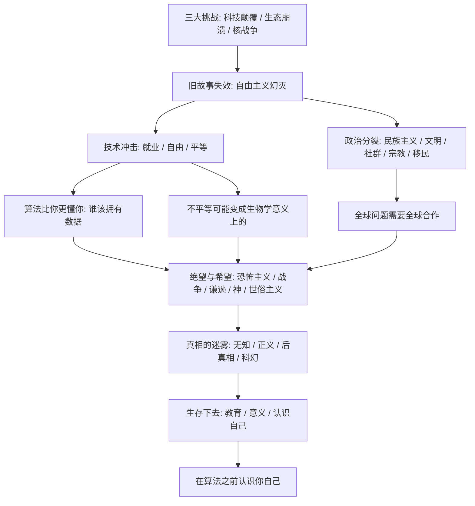

# 《今日简史：人类命运大议题》深度解读系列

## 系列简介

《今日简史》是尤瓦尔·赫拉利「简史三部曲」的收官之作（中信出版集团，2018 年，林俊宏译；原作名 21 Lessons for the 21st Century）。《人类简史》回望过去，《未来简史》眺望未来，而这一本把目光收回当下，追问一个最紧迫的问题：**现在到底发生了什么？我们该关注什么？**

赫拉利的判断是：人类正同时面对三大挑战——科技颠覆、生态崩溃和核战争。它们本质上都是全球性问题，但世界却在往相反的方向走：民族主义回潮、身份对立加剧、真相越来越难以辨认。更根本的是，我们赖以理解世界的旧故事已经失效，而新的故事还没有到来。

这本书不像前两本那样提供宏大预言，它更像一份「当下的清单」：从 AI 与就业、自由与数据、文明与民族主义，到恐怖主义、无知、正义、后真相，最后落在教育与意义。赫拉利很少给出标准答案，他做的是逼读者自己思考。

本系列把全书重新组织成 5 个部分、21 篇解读，每篇只回答一个核心问题，帮你从「知道赫拉利说了什么」，走到「能够自己判断他说得对不对」。

---

## 全书核心问题

| 层次 | 核心问题 | 本书的回答方向 |
|---|---|---|
| 时代问题 | 旧的故事为什么失效了？技术颠覆会把人类带向哪里？ | 自由主义的故事在 2008 年后逐渐幻灭，新故事尚未成形；就业、自由、平等都在被重写 |
| 政治问题 | 全球性问题为什么无法用民族主义的方式解决？人类还能共同生活吗？ | 三大挑战需要全球合作，而民族主义、文明叙事、宗教和移民争议都在把人类拉向分裂 |
| 恐惧问题 | 恐怖主义、战争与历史叙事，如何扭曲我们对世界的判断？ | 恐惧被放大、战争不再划算、每个文明都自居中心；谦逊与世俗价值是解药 |
| 真相问题 | 我们为什么无知？正义为什么难？真相为什么敌不过故事？ | 知识分工让个人越来越无知，结构性偏见让正义难寻，虚构故事天生比事实更有吸引力 |
| 生存问题 | 教育、意义与自我认识——个人还能做什么？ | 教通用的能力而非具体技能，在故事之外寻找意义，用观察心智的方式认识自己 |

---

## 全书知识地图

---

## 全系列目录

### 第一部分：旧故事的失灵

#### 01｜自由主义的故事为什么讲不下去了？

核心问题：曾经战胜法西斯主义和共产主义的自由主义，为什么在 21 世纪失去了说服力？

核心观点：赫拉利认为，20 世纪有三大故事在竞争：法西斯主义、共产主义和自由主义。自由主义最终胜出，靠的是「把饼不断做大」——用经济增长让各方都满意。但这个前提正在失效：增长解决不了生态崩溃，也解决不了科技颠覆。2008 年金融危机之后，人们对自由主义的故事越来越幻灭，而新的故事还远未达成共识。

理解难度：★★★☆☆

关键词：三大故事、自由主义、幻灭、经济增长、新叙事

---

#### 02｜当机器抢走工作，人的价值从哪里来？

核心问题：如果 AI 和机器人接管了大部分工作，人类失去的仅仅是收入吗？

核心观点：赫拉利认为，自动化真正冲击的不只是饭碗，而是意义——工作是现代人身份、自尊和社会地位的来源。他预计「无用阶层」可能日益庞大：不是失业，而是在经济与军事体系里都不再被需要。全民基本收入（UBI）能解决钱的问题，但解决不了「我为什么活着」的问题；对意义和社群的追求，会变得比对工作的追求更重要。

理解难度：★★★☆☆

关键词：就业、无用阶层、全民基本收入、意义、连接性

---

#### 03｜当感受可以被操纵，自由还剩下什么？

核心问题：自由主义把「听从自己的感受」当作最高准则，可如果感受可以被测量和操纵呢？

核心观点：赫拉利指出，感受不过是生化算法的输出，用来快速计算生存和繁殖的概率。一旦技术能攻入并操纵人心，「听从内心」就变成了「听从被设计好的内心」，民主政治可能变成一场「情感充沛的木偶戏」。这不是遥远的科幻：搜索排名已经在定义「真相」，情绪已经在被测量和引导。

理解难度：★★★★☆

关键词：自由、感受、生化算法、数据霸权、操纵

---

#### 04｜未来的不平等，为什么可能是「生物学」的？

核心问题：人类历史上的不平等可以被废除，为什么未来的不平等可能不行？

核心观点：赫拉利认为，过去的不平等（阶级、种族、性别）是法律和文化层面的，可以被废除；但生物技术与信息技术的结合，可能让不平等「下沉」到生物学层面：少数人买得起延长生命、升级认知的疗法，人类可能分化成不同的「生物种姓」，甚至「种化」为不同的物种。他还提出 21 世纪最重要的政治问题：数据该归谁所有？因为数据巨头真正收集的不是注意力，而是权力。

理解难度：★★★★☆

关键词：平等、种化、生物种姓、数据所有权、注意力商人

---

### 第二部分：分裂的世界

#### 05｜民族主义能解决全球性问题吗？

核心问题：面对核战争、生态崩溃和科技颠覆，为什么「各管各的」行不通？

核心观点：赫拉利认为，人类现在至少有三个共同敌人：核战争、生态崩溃和科技颠覆，它们本质上都是全球性问题。民族主义擅长处理国内事务，甚至是民主运转的前提，但无法解决这些问题；真正的危险不是爱国，而是良性爱国主义滑向「我的国家至高无上」的极端民族主义。他主张人类需要一种全球性的认同和忠诚，并警告：如果坚持「本国优先」到底，结局可能比 1914 年和 1939 年更惨烈。

理解难度：★★★☆☆

关键词：民族主义、爱国主义、全球问题、共同敌人、全球认同

---

#### 06｜「文明冲突」为什么解释不了世界？

核心问题：把世界分成「西方文明」「伊斯兰文明」来解释冲突，错在哪里？

核心观点：赫拉利指出，所谓「文明」并不是边界清晰的实体，而是不断变化、互相学习的产物：人类群体与其说靠延续性定义，不如说靠「发生了什么改变」来定义；那些自称古老的传统，大多是后人讲出来的故事。他认为，只要谈的是实际议题——如何建立国家、打造经济、兴建医院、制造炸弹——几乎所有人都属于同一个文明。文明冲突论把复杂的现实简化成几块对撞的板块，既不符合历史，又容易被用来为冲突辩护。

理解难度：★★★☆☆

关键词：文明、文明冲突、故事、共同文明、身份

---

#### 07｜为什么我们越「连接」越孤独？

核心问题：社交媒体让人与人的「连接」空前方便，为什么社群反而在瓦解？

核心观点：赫拉利从扎克伯格「用科技重建全球社群」的宣言谈起：社群瓦解是真的——各类社群的成员规模在几十年间大幅萎缩；但线上「连接」替代不了真实社群。人类是身体性的社会动物，社群需要面对面相处、共同经历和相互责任，而网络互动更容易让人从别人的眼光里理解自己，感受越来越依赖点赞。当真实社群退场、虚拟连接又填不满空缺，孤独就会转向极端的身份认同。

理解难度：★★☆☆☆

关键词：社群、孤独、社交媒体、身体、身份认同

---

#### 08｜宗教还能回答现代世界的问题吗？

核心问题：在技术时代，宗教到底是答案、问题，还是别的东西？

核心观点：赫拉利把宗教放在三类问题面前检验：技术问题（如何种地、治病）、政策问题（如何管理经济）和身份认同问题（谁是我们、谁是他们）。他的判断是：宗教在技术和政策问题上派不上什么用场——祭司的真正专长从来不是降雨治病，而是「诠释」，即在事情失败时找到说得过去的理由；但在身份认同问题上，宗教影响巨大，而且多半是制造问题，而不是解决问题：现代宗教常常像「婢女」一样侍奉民族主义，用来划出「我们」与「他们」的界线。

理解难度：★★★★☆

关键词：宗教、诠释、身份认同、民族主义、技术问题

---

#### 09｜移民争论的真正焦点是什么？

核心问题：移民问题为什么这么难谈？双方到底在争什么？

核心观点：赫拉利把移民问题拆成一份「协议」的几项条款：东道国是否允许进入（这是责任还是施舍）、移民是否必须接受东道国文化（接受多少）、同化到什么程度才算「我们」。他发现争论的真正焦点藏在更深处：现代人嘴上反对种族主义，心里却成了「文化主义者」——把文化当成不可比较、不可改变的实体。他的建议是：别把它当成善与恶的对决，这是两种合理的政治立场之争，应该摆到桌面上，用民主程序来解决；只有包容是不够的，还需要经验和智慧。

理解难度：★★★★☆

关键词：移民、文化认同、文化主义、宽容、民主程序

---

### 第三部分：绝望与希望

#### 10｜恐怖主义为什么靠「恐惧」作战？

核心问题：恐怖分子杀死的人远少于车祸，为什么却能撼动整个国家？

核心观点：赫拉利指出，恐怖主义本质上是一场「戏」：它的目的不是造成实质伤害，而是传播恐惧、激怒对手，让对手「过度反应」。恐怖分子就像一只想摧毁瓷器店的苍蝇：它自己什么也动不了，于是钻进公牛的耳朵，让公牛发狂，把整个店撞烂——「9·11」之后的美国就是那头公牛。他提醒：恐怖分子不可能打败我们，唯一能打败我们的是我们自己的过度反应；而一个国家的政治暴力越少，恐怖袭击带来的冲击反而越大。

理解难度：★★★☆☆

关键词：恐怖主义、恐惧、过度反应、戏剧、回音板

---

#### 11｜战争为什么变得「不划算」了？

核心问题：历史上战争是发财的手段，为什么今天的大国战争变得不划算了？

核心观点：赫拉利给出三个理由：财富的主要形式已经从土地变成知识，而知识无法被掠夺；核武器让大国之间的全面战争变成集体自杀；全球贸易让和平比战争更有利可图——「21 世纪最成功的策略是作壁上观」。他用日本做例子：二战前的日本精英认定不侵略就会经济停滞，结果日本真正的经济奇迹，恰恰发生在输掉所有侵略战争之后。但他警告：这不是物理定律，而是脆弱的政治成就，永远不要低估人类的愚蠢。

理解难度：★★★☆☆

关键词：战争、知识经济、核威慑、贸易、和平的脆弱

---

#### 12｜为什么每个文明都觉得自己是世界的中心？

核心问题：为什么几乎每个民族、每种宗教，都认为自己是历史的主角？

核心观点：赫拉利从自己的犹太教育讲起：他从小被教导犹太史是世界的中心，后来才发现每个文明都这样教育孩子——中国是「中央王国」，西方是文明灯塔，每个宗教都把自己想象成全宇宙最重要的。这种自我中心不是某个民族的毛病，而是人类的通病：它让历史叙事变得好懂，也让人看不见别人的贡献。他认为，认真思考「谦逊」不是自我贬低，而是看清世界、向他人学习的前提。

理解难度：★★★☆☆

关键词：谦逊、历史叙事、自我中心、文明、学习

---

#### 13｜如果没有神，道德还成立吗？

核心问题：「上帝存在吗」的争论背后，真正值得问的问题是什么？

核心观点：赫拉利区分了两种「神」：作为宇宙奥秘的神，和作为秩序制定者、道德权威的神。他认为，神圣经典其实是富有想象力的祖先写下的故事，目的是让社会规范和政治结构显得天经地义。对他来说，真正的问题不是宇宙怎么来的，而是「有没有高于人类的道德权威」；他的回答是：道德的重点不是遵守神圣的诫命，而是减少痛苦——想做一个有道德的人，不需要相信任何神话，只要真正理解「痛苦」的含义。

理解难度：★★★★☆

关键词：神、神圣经典、道德权威、痛苦、诫命

---

#### 14｜世俗主义到底相信什么？

核心问题：世俗主义常被说成「什么都不信」，它自己有一套价值观吗？

核心观点：赫拉利指出，世俗主义不是空箱子，而是一套正面的价值体系：真相、同情、平等、自由、勇气和责任。它最重视真相——基于观察和证据，而不是信仰；它也最强调「承认自己的不完美」：如果你相信某个力量揭示了绝对真理，就无法承认任何错误；而如果你相信一切只是有缺陷的人类在追寻真相，就能坦然认错。他还留下一个尖锐的问题：你的宗教或意识形态，过去犯过的最大错误是什么？如果答不上来，就不该把世界交给它。

理解难度：★★★☆☆

关键词：世俗主义、真相、同情、责任、不完美

---

### 第四部分：真相的迷雾

#### 15｜你知道的为什么比你以为的少？

核心问题：现代人受教育程度空前，为什么对世界的理解反而越来越少？

核心观点：赫拉利引用「知识的错觉」研究：大多数人自信地以为自己懂拉链，却说不清拉链的原理——我们把别人大脑里的知识当成了自己的。现代社会靠知识分工运转，这本身高效；问题在于人类很少能认清自己的无知，观点多半来自群体思维和群体忠诚，而不是个人理性。更麻烦的是权力：权力像黑洞一样扭曲它周围的空间，革命性的真相很难抵达权力中心，所以「承认自己的无知」反而成了最可靠的态度。

理解难度：★★★★☆

关键词：无知、知识的错觉、群体思维、权力黑洞、承认无知

---

#### 16｜正义为什么如此难以实现？

核心问题：世界上那么多不公，为什么纠正它如此困难？

核心观点：赫拉利认为，当代世界大多数的不公正，并不来自个人的偏见，而是来自大规模的结构性偏见——但人类的大脑还是狩猎采集者的大脑，尚未进化出察觉结构性偏见的能力。现代经济的因果链太长：你穿的衣服、用的手机背后可能牵连着剥削和污染，却没有一个环节能让你清晰地「负责」。当真相难辨、责任难归，人们就会躲进宗教和意识形态提供的避风港，用简单的故事代替复杂的思考。

理解难度：★★★★☆

关键词：正义、结构性偏见、复杂性、道德困境、避风港

---

#### 17｜「后真相」时代，真相还重要吗？

核心问题：假新闻为什么比真相传播得更快？真相会输吗？

核心观点：赫拉利提醒我们：人类从来都是「故事动物」，虚构的故事天生就比事实更能团结人心——一千个人相信一个月的是假新闻，十亿人相信一千年就成了宗教。真正的新问题是技术让操纵故事变得空前便宜：算法可以批量制造和精准投送谎言，戈培尔式的「谎言重复一千遍」如今可以工业化生产。最危险的不是假新闻本身，而是「真相已经不重要」的观念——当人们更想控制世界而不是理解世界，真相就成了第一个牺牲品。

理解难度：★★★★☆

关键词：后真相、假新闻、故事、宣传、真相的代价

---

#### 18｜科幻小说为什么能塑造未来？

核心问题：为什么说科幻小说是 21 世纪最重要的文学形式？

核心观点：赫拉利认为，真正塑造人们对科技之想象的，不是科学论文，而是《黑客帝国》《她》《黑镜》这类科幻作品：科技公司照着科幻的剧本做产品，公众照着科幻的图景理解 AI。但科幻也常常误导——它总担心机器人造反，而真正该担心的是少数超人类精英与大多数无力者之间的裂痕；它还回避了最可怕的问题：如果「真实的自我」本身也是被构建的，你逃出一个小母体，只会进入一个更大的母体。相比之下，《美丽新世界》比《1984》更贴近我们的未来：用爱与快乐控制人，比用恐惧和暴力更可靠。

理解难度：★★★★☆

关键词：科幻小说、母体、智能与意识、美丽新世界、故事

---

### 第五部分：生存下去

#### 19｜未来的教育应该教什么？

核心问题：如果没人知道 2050 年的世界需要什么技能，今天该教孩子什么？

核心观点：赫拉利认为，信息不再是稀缺品——学生手里已经有太多信息，稀缺的是理解信息、判断轻重、形成世界观的能力。他赞同教育专家的「4C」主张：批判性思考、沟通、合作与创意；比起具体的工作技能，更重要的是通用的生活技能：随机应变、学习新事物、在不熟悉的环境里保持心智平衡。想跟上 2050 年的世界，人类需要一次又一次地重塑自己；而如果你想保住对自己人生的控制权，就得跑得比算法更快，在它们之前认识你自己。

理解难度：★★★☆☆

关键词：教育、4C、心智平衡、重塑自己、认识自己

---

#### 20｜人生的意义为什么不能是一个故事？

核心问题：我们习惯用故事回答「人生有什么意义」，可故事可靠吗？

核心观点：赫拉利说，人想要的意义答案十有八九是一个故事：民族史诗、宗教轮回、真爱童话。故事不需要真实，只要能给你一个角色和身份认同，就能让人觉得人生有了意义——民族主义用英勇的故事让你着迷，用灾难的故事让你流泪，最后你的一切判断都围绕「这对我们的国家有什么影响」。但故事有代价：你投入得越多，越难分辨虚构与现实。他指出，世界上最真实的东西是痛苦；如果真想知道人生的意义，最好的出发点不是换一个更好的故事，而是开始观察痛苦、探索痛苦的本质——「你并不是一个故事」。

理解难度：★★★★☆

关键词：意义、故事、身份认同、仪式、痛苦

---

#### 21｜为什么「认识自己」变得如此重要？

核心问题：在信息洪流和被操纵的故事之间，个人还能靠什么站稳？

核心观点：赫拉利给出的个人答案是观察自己的心智。他区分大脑（神经元组成的实体网络）与心智（痛苦、愉快、爱和愤怒等主观体验的流动），并分享了自己的内观冥想实践：每天两小时，不为放松，而是为了看清念头、情绪和欲望如何升起、如何消散——就像风吹过头发，你既不是风，也不必等同于那些被事后整理过的故事。他坦承这是个人经验而非科学处方，但他坚持：当外部世界越来越复杂、故事越来越逼真时，看清自己的能力，可能是个人最后也最重要的防线。

理解难度：★★★☆☆

关键词：冥想、内观、心智、认识自己、观察

---

## 推荐阅读顺序

主线就是 `01 → 21`，按认知难度和逻辑依赖分五段推进：

1. **旧故事的失灵（01 → 04）**：三大挑战登场，自由主义的故事失效；技术接着冲击就业、自由与平等。这一段是全书的问题设定，不需要任何技术背景。
2. **分裂的世界（05 → 09）**：既然问题是全球性的，为什么人类反而退回民族主义？再依次拆解文明叙事、社群瓦解、宗教角色与移民争议。
3. **绝望与希望（10 → 14）**：恐惧从哪里来（恐怖主义、战争），自省从哪里来（谦逊），希望从哪里来（神与世俗主义）。
4. **真相的迷雾（15 → 18）**：我们为什么无知、正义为什么难、真相为什么敌不过故事，以及科幻如何塑造我们对未来的想象。
5. **生存下去（19 → 21）**：回到个人——教育该教什么、意义从哪里来、如何认识自己。

给不同需求读者的入口：

- **想先抓全书骨架**：读 `01 → 02 → 03 → 05 → 17 → 19`，六篇读完能拿到全书的主要论证链条。
- **对 AI、数据与算法议题感兴趣**：直接从 `02 → 03 → 04 → 17 → 19` 切入。
- **对政治与身份议题感兴趣**：重点读 `05 → 06 → 08 → 09 → 14`。
- **想练习批判性阅读**：`06`、`10`、`11`、`13`、`17` 五篇里赫拉利的判断最需要被质疑，适合边读边反驳。

---

## 例子与素材分配表（写正文前必读）

每篇的专属案例，**禁止跨篇重复使用**：

| 篇 | 专属案例（主） | 备用/对照 |
|---|---|---|
| 01 | 一家靠「明年会更好」维持士气的公司：增长一停，故事就崩 | 2008 年金融危机与「历史终结」的乐观 |
| 02 | 把「我是做什么的」当成身份的人，在失业之后 | 全民基本收入的实验（芬兰、肯尼亚） |
| 03 | 短视频推荐算法：你以为的「我想要」，其实是它塑造的 | 广告从「说服」到「预判」的演变 |
| 04 | 天价「升级疗法」下的两种人生：生物种姓的雏形 | 免费 App 的生意：「我们不是用户，而是商品」 |
| 05 | 气候变化与跨国污染：不认国界的问题，认国界的答案 | 荷兰在二战中的双重标准（对纳粹 4 天投降，却为殖民地打 4 年） |
| 06 | 你今天穿的牛仔裤、喝的咖啡、用的阿拉伯数字，全是「文明杂交」的产物 | 「伊斯兰国」自称回归纯正传统 |
| 07 | 微信好友几千人，深夜却找不到一个能打电话的人 | 扎克伯格的「全球社群」宣言 |
| 08 | 同一本《圣经》，读出相反的环保立场：福音派与天主教徒之争 | 日本的「现代化工具 + 传统认同」模式 |
| 09 | 一个欧洲小镇的难民安置争议：本地人的焦虑与移民的处境 | 欧盟的多元文化实验与危机 |
| 10 | 「9·11」之后美国在中东的「瓷器店横冲直撞」 | 一次袭击之后，整个城市安检升级的日常代价 |
| 11 | 日本战前的「不侵略就停滞」误判，与战后的经济奇迹 | 硅谷的收购与竞争：知识买得到，抢不到 |
| 12 | 三本历史教科书：中国孩子学「中央王国」，犹太孩子学「选民」，西方孩子学「文明灯塔」 | 赫拉利的犹太教育自述 |
| 13 | 地震救援队里，没有人问彼此的信仰 | 以神之名的暴力：为「神的愤怒」找借口 |
| 14 | 会认错的制度：飞机失事调查不找替罪羊，而是改系统 | 赫拉利的那个提问：「你犯过的最大错误是什么？」 |
| 15 | 拉链实验：人人自信满满，却说不清拉链的原理 | 权力黑洞：总统为什么听不到真话 |
| 16 | 一件 T 恤的全球供应链：谁该为其中的剥削负责？ | 看不见的结构性偏见：算法与信贷歧视 |
| 17 | 家族群里的养生谣言：为什么辟谣总跑不过谣言 | 戈培尔的「谎言重复一千遍」 |
| 18 | 《黑客帝国》与《楚门的世界》：逃出母体，进入更大的母体 | 《美丽新世界》vs《1984》：用快乐控制比用恐惧更有效 |
| 19 | 今天入学的孩子，2050 年才四十岁：该教他什么？ | 流水线式的学校：铃声、教室、30 个同龄人 |
| 20 | 「等我买房/结婚就幸福了」：故事给你角色，也困住你 | 民族史诗与真爱童话 |
| 21 | 赫拉利每天两小时的内观：看着念头来了又走 | 一次 10 分钟观察呼吸的练习 |

---

## 全系列状态

- 共 **21 篇**，分 **5 个部分**，正文已全部完成（连同本拆解目录，共 22 个 Markdown 文件）。
- 每篇独立成文，统一结构：先说结论 → 提出问题 → 作者观点 → 翻译成人话 → 推理链（含 Mermaid 图）→ 现实例子 → 回到书中 → 深层逻辑 → 争议 → 现代延伸 → 核心结论 → 留一个问题。
- 每篇都严格区分「赫拉利的书中观点」「历史与科学事实」「学界争议」「现代延伸」，并在争议处保持开放；例子按全局分配表各篇专用，无跨篇重复。
- 建议阅读顺序：从 **01｜自由主义的故事为什么讲不下去了？** 开始，依次读到 **21｜为什么「认识自己」变得如此重要？**；也可参考上文「推荐阅读顺序」中的不同入口。
- 网页版已生成：同目录下的 `index.html`（卡片式目录页）与各篇同名 `.html`，可直接在浏览器中打开。
