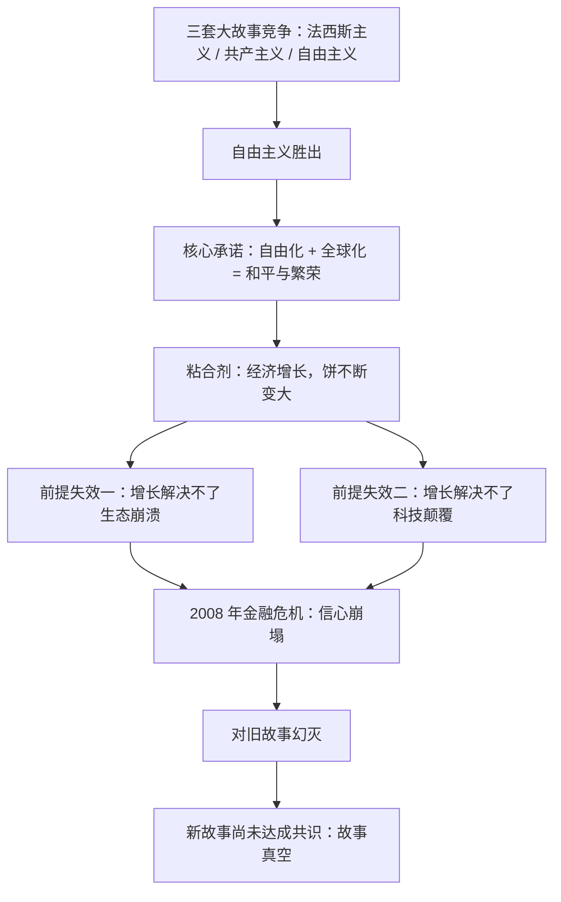

# 01｜自由主义的故事为什么讲不下去了？

> 一个曾经让几十亿人相信的故事，为什么会突然失效？

---

## 一、先说结论

赫拉利认为，20 世纪有三套大故事在争夺人类的未来：法西斯主义、共产主义和自由主义。冷战结束时，自由主义胜出，它靠的是一句简单而有力的承诺：只要让政治和经济继续自由化、全球化，就能为所有人带来和平与繁荣。

这套承诺的粘合剂是经济增长——只要饼不断变大，每个人都能分到更大的一块。但赫拉利指出，这个机制正在失灵：增长解决不了生态崩溃，也解决不了科技颠覆。2008 年金融危机之后，越来越多的人觉得这套故事是精英的骗局，而新的故事还没有到来。

我们正处在一个「故事真空」的时代。这是理解这本书所有议题的起点。

---

## 二、我们先理解一个问题

先问一个问题：为什么一个故事会「讲不下去」？

我们通常以为，一个信念之所以崩塌，是因为有人拿事实反驳了它。但现实里，人们放弃一个故事，往往不是因为它是假的，而是因为它不再管用了。

故事像一份长期合同：它向人们承诺某些东西，人们按它的规则生活，它则用现实来兑现承诺。合同能维持多久，取决于承诺兑现得好不好。一旦连续违约，再动听的故事也会失去信用。

那么，自由主义这份合同向人们承诺了什么？它最近为什么开始违约？这就是本文要回答的问题。

---

## 三、作者到底提出了什么观点？

赫拉利在《今日简史》第一章「理想的幻灭」里，给出了他的核心判断：人类思考用的是故事，而不是事实、数据或方程式。

他说，20 世纪，来自纽约、伦敦、柏林和莫斯科的全球精英讲述了三套大故事：

- 法西斯主义的故事把历史解释为不同国家之间的斗争，构想的是一个群体暴力镇压其他所有群体；
- 共产主义的故事把历史解释为不同阶级之间的斗争，构想的是通过集中制赢得公平；
- 自由主义的故事把历史解释为自由与专制之间的斗争，构想的是依靠最少的控制，实现所有人的自由与和平交往。

冷战结束后，自由主义似乎赢了。赫拉利并不否认它曾经的成功——他甚至说自由主义相当有韧性，它学习了对手的许多优点，比如从共产主义那里学会了重视平等。它真正的胜利机制，是「把饼做大」：用持续的经济增长，让无产阶级与资产阶级、信徒与无神论者、原住民与移民都能各分一块。

问题在于，赫拉利说，这个机制有两个前提，如今都在失效。

第一，经济增长无法拯救生态系统——恰恰相反，增长本身就是生态危机的成因。

第二，经济增长也无法自动解决科技颠覆带来的问题，因为增长正是以越来越多的破坏性创新为基础的。

再加上 2008 年全球金融危机，人们开始觉得自由化和全球化是一场骗局：以牺牲普通人为代价，让一小群精英获利。于是，对自由主义故事的信心急剧下降，而新的故事还没有取得共识。

---

## 四、把这个观点翻译成人话

可以把「故事」理解成一家公司的愿景。

有一家创业公司，前五年每年涨薪，人人都相信「我们正在改变世界」。这句愿景之所以有人信，不是因为它是真理，而是因为每年加薪的现实在替它背书。

第六年，增长停了，公司开始裁员。你会发现，昨天还是「我们是一家人」，今天就成了「公司只是雇佣关系」。愿景没有变，是现实不再替它背书了。

赫拉利说的「自由主义讲不下去了」，就是这个意思：不是有人用新证据驳倒了它，而是它承诺的那台「增长机器」，转不动了。

---

## 五、为什么会这样？

把赫拉利的推理拆开，是一条清晰的链条：

关键在于 D 到 G 这一段。

自由主义的故事不是靠「正确」运转的，而是靠「每个人都能分到更多」运转的。它把不同阶层、不同信仰、不同族群的人都拉进同一张桌子，靠的正是「饼会变大」这个预期。预期一旦落空，桌子就变成了擂台——近十年来的政治撕裂、身份对立、强人政治，赫拉利认为，都可以放在这条链上理解。

而更麻烦的是链条的末端：旧故事失效之后，并没有一个新的、能解释 AI 与生物技术时代的故事来接替它。赫拉利警告说，如果自由主义或者什么新信仰想塑造 2050 年的世界，就必须先了解人工智能、大数据算法和生物工程，再把这套现实融入一个全新的叙事。

---

## 六、举一个现实生活中的例子

看一家真实的「增长公司」。

有一家做了二十年的制造企业，老板每年年会都说同一句话：「明年会更好。」前十五年，这句话是真的：订单在涨，工资在涨，食堂在翻新，工人们的子女还能进厂。

后来行业饱和，订单不再增长。老板还是说「明年会更好」，但所有人都知道这句话失效了。于是车间里开始流传各种版本的故事：有人说老板在转移资产，有人说订单被销售部门吃了回扣，有人开始怀念「以前的老板」。

同样的厂房、同样的机器、同样的老板，只是饼不再变大了，人心就散了。

赫拉利对自由主义社会的观察与此同构：当增长这台机器停摆，人们不会说「故事错了」，而是会开始寻找替罪羊、退回更小的身份共同体——这正是全书后面要讨论的民族主义回潮、身份对立与「后真相」的心理土壤。

---

## 七、回到书中重新理解

现在回头看赫拉利在第一章里的具体论述，会更容易理解他的分寸感。

他并没有宣布「自由主义已死」。相反，他承认自由主义证明了自己比其他任何对手都更柔韧、更灵活。他真正想说的是：自由主义擅长回答「如何把饼做大」，却不擅长回答「饼做不大时怎么办」，更没准备好回答「当技术开始重写人本身，自由意味着什么」。

他也提醒，替代方案不会自动是更好的故事。历史已经演示过：当旧故事失去信用，先填补空白的，往往是最简单、最情绪化的故事，而不是最理性的那个。

第一章里，他把这个时代的底牌摊在了桌上：人类正同时面对核战争、生态崩溃和科技颠覆三大挑战，而它们全是全球性问题——偏偏在这个节骨眼上，人们退回了各自的小故事。这个矛盾，是全书所有议题的总背景。

---

## 八、这个观点背后还有什么？

第一，它有一个底层前提：大规模人类合作依赖「共同相信的虚构故事」——国家、货币、公司、人权，莫不如此。这是赫拉利从《人类简史》贯穿至今的核心命题。故事不是装饰，而是基础设施。

第二，它给出了一种判断故事的方法：别看一个故事说了什么，看它靠什么续命。自由主义靠经济增长续命；那么新故事要靠什么续命？这个问题会在后面的篇章里反复回响。

第三，它解释了为什么「讲道理」常常无效。如果人们信的是故事而不是事实，那么摆事实、讲数据就动摇不了立场——这一点在后真相那一篇里会展开。

第四，它为整个系列定了调：技术冲击之所以可怕，不只因为它本身，而因为它同时拆掉了旧故事的几根支柱。

---

## 九、这个观点有问题吗？

赫拉利的判断很有冲击力，但至少有几处值得追问。

第一，他可能过早宣判了自由主义的「幻灭」。自由主义在历史上多次被宣告死亡：1930 年代大萧条、1970 年代滞胀，每次都有人预言它终结，它却以改良的方式活了下来。一些政治学者认为，民主制度的自我修正能力被赫拉利低估了。

第二，把法西斯主义、共产主义、自由主义并列为「三套大故事」，是一种高度简化的处理。三者并不是同一层级的竞争叙事，各地的历史经验也千差万别。用「故事竞争」的框架统摄 20 世纪，叙事上很流畅，但会抹掉大量细节。

第三，「经济增长解决不了生态崩溃」这个论断本身存在争议。绿色增长的支持者认为，脱碳与增长可以并行；而赫拉利的立场更接近「增长的逻辑与生态的逻辑根本冲突」。关于这一问题，学界存在不同解释，尚无定论。

第四，有批评者指出，赫拉利的「故事论」很难被证伪：任何信念都可以被解释成故事，任何失败都可以被解释成故事失效。解释力强，但边界模糊。

---

## 十、今天再看这个观点

以下是基于赫拉利思想的现代延伸，不是作者原话。

赫拉利写这本书是 2018 年，那时还没有 ChatGPT。今天再看，他说的「科技颠覆」已经多了一个新角色：AI 不只是颠覆就业和权力的技术，它开始直接生产故事本身——生成式模型可以批量制造叙事、伪造图像与声音，让「共同相信的东西」变得更容易被定制，也更难被共享。

这既验证了他的担心，也加重了他的担心：如果每个群体都生活在算法为自己定制的故事里，「新故事达成共识」只会更难。

另一面也值得记录：一些新的叙事雏形正在出现，比如「人类共同面对气候风险」，以及围绕 AI 治理的全球对话。它们还很脆弱，但至少说明——故事真空未必注定被最坏的故事填满。

---

## 十一、这一篇真正应该记住什么？

1. 人类靠共同相信的故事组织大规模合作；故事不是装饰，而是社会的基础设施。
2. 故事靠兑现承诺来维持信用，自由主义的故事靠的是「经济增长」这台机器。
3. 增长解决不了生态崩溃和科技颠覆，于是旧故事违约，幻灭发生。
4. 旧故事失效不等于新故事到来——「故事真空」才是这个时代真正的处境。
5. 故事不是被事实驳倒的，是被现实违约的：这解释了为什么摆数据常常说服不了人。

---

## 十二、留一个问题

如果旧故事已经失效，而更简单、更情绪化的故事正在填补空白，那么一个更好的新故事应该长什么样？它至少需要回答哪些旧故事回答不了的问题？

而在旧故事承诺过的所有东西里，最实在的一条是：只要努力，就有一份工作。工作带来收入，也带来身份和尊严。当机器开始抢走工作，这条承诺会变成什么？
