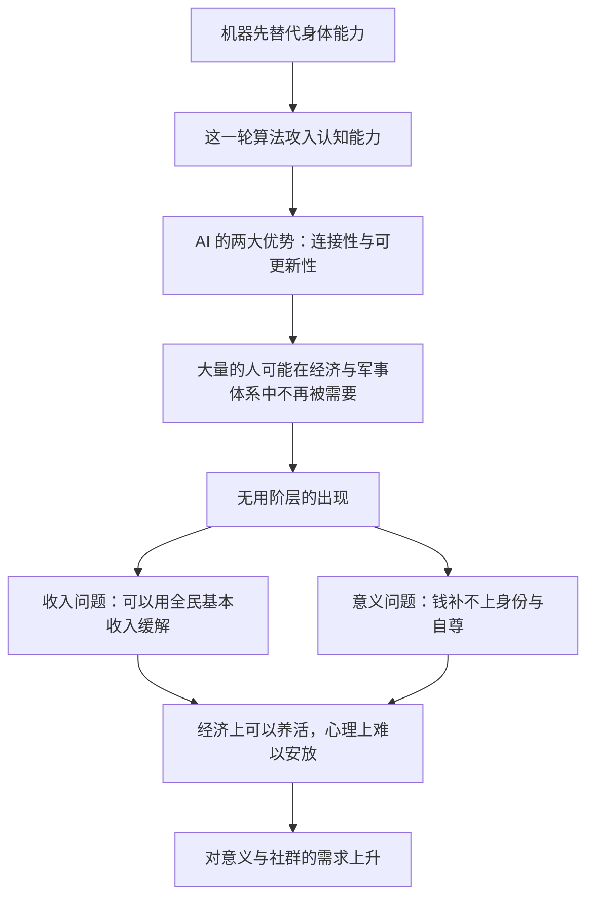

# 02｜当机器抢走工作，人的价值从哪里来？

> 如果 AI 和机器人接管了大部分工作，人类失去的仅仅是收入吗？

---

## 一、先说结论

赫拉利认为，自动化真正冲击的不只是饭碗，而是意义。

工作在现代社会里从来不只是挣钱的手段。它是我们回答「我是谁」最常用的方式，也是自尊和社会地位的来源。当一份工作消失，消失的往往不只是工资单，而是这个人对自己整个人的判断。

他预计「无用阶层」可能日益庞大：不是失业，而是在经济体系与军事体系里都不再被需要。全民基本收入（UBI）能解决钱的问题，却解决不了「我为什么活着」的问题。因此在赫拉利看来，对意义和社群的追求，会变得比对工作的追求更重要。

这一篇要处理的，就是这条从「饭碗」通往「意义」的连锁反应。

---

## 二、我们先理解一个问题

先问一个问题：为什么丢工作这件事，会让人觉得比丢钱更痛？

设想两种处境。第一种，你每个月都有一笔稳定收入自动到账，但你没有任何事可做，也没有人需要你做什么。第二种，你收入不高，每天很累，但同事依赖你，客户等你。

大多数人会说，第一种更让人难受。原因在于，现代人是在「职业」里完成自我定义的：第一次见一个人，我们往往先问「你是做什么的」，通过职业判断对方的社会位置，也确认自己的位置。

所以当工作消失，被抽走的不只是一项收入来源，还有一整套关于「我是谁、我有什么用」的答案。这就是本文要回答的问题。

---

## 三、作者到底提出了什么观点？

赫拉利在《今日简史》第二章「就业」里，把人类的能力分成两种：身体能力和认知能力。

过去的机器主要替代身体能力——蒸汽机、流水线、起重机取代的是肌肉。而这一轮技术不一样：它正在攻入认知领域。当算法能读片、能写文案、能翻译、能写代码，人类过去最自豪的那部分能力，也第一次站到了被替代的位置上。

赫拉利还指出，AI 有两个非人类的优势。

第一是「连接性」：人类个体之间无法直接共享记忆和经验，而一辆自动驾驶汽车学会的东西，可以瞬间复制给所有同款汽车。第二是「可更新性」：人类需要漫长的教育周期才能升级技能，算法却可以整体更新。

关于未来就业市场，赫拉利并不认为一定是「机器全面取代人」。另一种可能是：2050 年的就业市场会是人机合作，而不是人机竞争。但无论哪一种，他都认为会出现一个前所未有的问题——大量的人在经济上可能不再被需要。

他用的词是「无用阶层」。这个词很刺耳：它指的不是人没有价值，而是说在一个只按经济产出和军事能力衡量人的体系里，这批人不再被这个体系需要。

紧接着是政策层面的讨论：全民基本收入（UBI），也就是无条件给每个人发一笔钱，保障基本生活。赫拉利认为，这在技术上可以讨论，在经济上也可以争论，但它有一个绕不过去的边界——钱可以发，意义发不出来。

他还提醒一句：智人本来就不是一种会满足于现状的动物。给一笔钱让人闲着，并不会自动带来幸福，反而可能带来更深的空虚和愤怒。

---

## 四、把这个观点翻译成人话

可以把「工作」理解成一张三合一的卡。

第一张是饭卡：它给你收入，让你能生活。第二张是身份证：它告诉别人你是谁，也告诉你自己是谁。第三张是社交卡：它给你一个每天见面、有共同任务的人群。

我们平时以为工作主要是第一张卡。但当失业真的发生时，最难受的往往是第二张和第三张卡被注销了。

赫拉利想说的就是：UBI 能补发第一张卡，但补不了第二张和第三张。你可以给一个人钱，却没法直接给他一个「你很重要」的位置，也没法直接给他一群需要他的人。

这也是为什么他的结论听起来不像经济政策，更像一句人生建议：当工作不再是意义的来源，人类得去找别的来源。

---

## 五、为什么会这样？

把赫拉利的推理拆开，是一条清晰的链条：

关键在于 D 到 H 这一段。

赫拉利的判断有一个隐藏前提：现代社会的「价值」几乎全部被折算成经济价值。你能挣钱、能纳税、能消费，就被算作「有用」。所以当一个人不再进入这个折算体系，他不只是穷，而是从「被需要」变成了「被忽略」。

这里要注意，链条中 F 与 G 是两条平行的分支，而不是先后关系。政策通常只处理 F：发钱、培训、再就业。但赫拉利认为 G 才是更难的那一半——一个人可以衣食无忧，同时觉得自己是多余的。这种痛苦不会因为账户里有钱而消失。

---

## 六、举一个现实生活中的例子

看一位四十多岁的资深工程师。

他在一家制造企业做了十八年，从助理工程师做到技术负责人。公司遇到棘手的故障，车间主任第一个想到的就是他。他自己也习惯这样介绍自己：「我是搞设备的。」

后来公司上了新的自动化产线，又引入算法做故障预测。系统能提前知道哪台机器要出问题，维修流程被拆成标准步骤，交给更年轻、成本更低的团队执行。他被列进了优化名单。

第一个月他还挺轻松。第三个月，他发现真正难熬的不是钱，而是几件事同时消失了：早上没有必须去的地方；旧同事的电话越来越少，因为工作群里已经没有他了；亲戚聚会时有人问「现在在忙什么」，他答不上来。

最刺痛他的一句话，是妻子在安慰他时说的：「你别多想，我们家又不缺你这点钱。」这句话本来是善意，却恰好命中了他最怕的那件事——他不再被需要了。

后来他去社区做志愿维修，帮老人修电器，一小时挣不到以前一天的零头，但他说那段时间「人回来了」。这个细节很能说明赫拉利的观点：他缺的从来不只是收入，而是一个能回答「我是谁」的位置。

---

## 七、回到书中重新理解

现在回头看赫拉利在第二章里的具体论述，会更容易理解他的分寸感。

他并没有宣称「工作会消失」。他讨论的是可能性，并且给出了两种前景：一种是大量人失去经济价值，另一种是人机合作形成新的分工。他甚至提到，历史上每一次技术革命都曾引发类似的恐慌，而人类最终都找到了新的工作。

但他认为这一次有两点不同：第一是速度，过去的转型给了几代人时间去适应，而这一轮的冲击可能压缩在一两代人之内；第二是深度，以前被替代的是技能，这一次被触及的是人类最引以为傲的认知能力，也就是「人之为人的优越感」本身。

他也强调，问题不是「人能不能活下去」，而是「人靠什么觉得自己活着有意义」。所以他谈 UBI 时，重点不在钱够不够，而在钱之外还缺什么；他谈社群时，也不是怀旧，而是在说：如果工作不再提供归属，人类需要另找一种能提供归属的结构。

---

## 八、这个观点背后还有什么？

第一，它建立在一个更深的前提上：人的价值感来自「被需要」，而不是来自「被供养」。这是赫拉利从《人类简史》延续下来的判断——智人是靠合作生存的动物，合作需要位置。

第二，它把「经济问题」重新定义为「政治问题」。如果大量人不再被市场需要，那么「谁来决定谁有用」就不再是市场的事，而是政治的事。这是 UBI 讨论真正的难点。

第三，它预告了后续两条线：一条是关于自由——当算法比你自己更了解你，连「我想做什么工作」都可能被塑造；另一条是关于平等——如果价值由数据和技术决定，被排除在外的人会越来越多。

---

## 九、这个观点有问题吗？

先说他最有说服力的地方。

赫拉利对「工作不只是收入」的观察，几乎每个人都能在自己的生活里验证。失业带来的羞耻、回避、身份崩塌，是社会学和心理学里被反复记录的现象。他把 UBI 的讨论从「发多少钱」推进到「发了钱之后呢」，这个推进是有价值的。

但至少有几处值得追问。

第一，「无用阶层」这个判断可能过早。一些经济学家认为，技术替代与岗位创造是同时发生的，历史上从未出现过技术导致长期大规模失业的情形。关于自动化对就业的净影响，学界存在不同解释。

第二，赫拉利把「工作与身份」的关系讲得过于统一。在不少文化里，人的身份更多来自家庭、宗教或社群，而不是职业。对这些人来说，失业的痛苦未必等于存在危机。

第三，UBI 的批评者会说，他其实低估了钱的作用。如果基本收入加上医疗、教育、住房的保障足够扎实，很多人完全可以靠兴趣、创作、照护家人来重建意义——意义不必由市场提供。

第四，也是最尖锐的一点：赫拉利把「意义危机」当作技术带来的新问题，但也可以反过来看——也许问题不是人失去了意义，而是社会一直用工作来掩盖意义问题，技术只是把这层遮盖揭开了。两种解释都能自圆其说，谁也还没有定论。

---

## 十、今天再看这个观点

以下是基于赫拉利思想的现代延伸，不是作者原话。

赫拉利写这本书是 2018 年，那时生成式 AI 还没有进入大众视野。今天再看，他说的「攻入认知领域」已经不只是预测：写文案、画图、写代码、做客服、做初级分析，这些原本被认为需要「人的判断」的工作，正在被重新定价。

同时，他说的「连接性」也变得更具体了：模型的更新不再需要几代人的教育周期，而是以周为单位。对个人来说，这意味着过去「学一门手艺吃一辈子」的路径越来越难维持。

另一面也值得记录。一些新的组织形态正在出现：开源社区、协作平台、平台化的小型服务、以兴趣为中心的社群。它们还没有形成稳定的收入模式，但至少说明——当旧的位置消失，人未必只能等待被安排，也可能自己造位置。

---

## 十一、这一篇真正应该记住什么？

1. 这一轮机器替代的不只是体力，还包括认知能力，人类最自豪的那部分优势第一次被正面挑战，这是与以往任何一次变革都不同的地方。
2. AI 有两个非人类的优势：连接性让它把学会的东西瞬间复制给所有同类设备，可更新性则让它不必再等待人类那样漫长的教育周期。
3. 「无用阶层」指的不是人没有价值，而是在一个只按经济产出和军事能力衡量人的体系里，这批人不再被这个体系需要，这正是这个词刺耳的地方。
4. 全民基本收入能解决钱的问题，但解决不了身份、自尊和被需要的感觉：钱可以发，意义发不出来，这是它最难补上的一环。
5. 当工作不再是意义的主要来源，对意义和社群的追求会变得比找一份工作更重要，这才是真正的转向，也是每个人都要面对的问题。

---

## 十二、留一个问题

> 如果有一天你的收入完全不需要来自工作，你早上醒来的第一个念头会是什么？你能立刻说出三件「没有人付钱也值得做」的事吗？

能回答出来的人，也许已经找到了工作之外的意义来源。但还有一个更难的问题等在后面：就算你找到了自己想做的事，那份「想要」本身，真的是你自己产生的吗？还是有人在你不知道的地方，一点一点把它塑造了出来？
