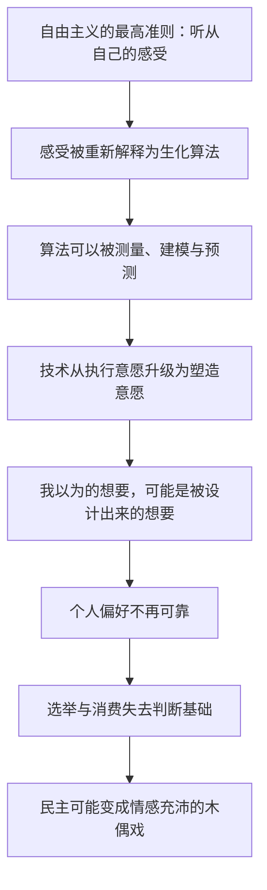

# 03｜当感受可以被操纵，自由还剩下什么？

> 自由主义把「听从自己的感受」当作最高准则，可如果感受可以被测量和操纵呢？

---

## 一、先说结论

赫拉利指出，自由主义有一个隐藏的致命弱点：它把「心」当作最高的权威。

「跟着你的心走」「听从你内心的声音」「你有权决定自己的身体和人生」——这些说法都建立在一个假设上：我的感受是我自己的，它真实、可靠、不可外包。可赫拉利说，感受不过是一套生化算法的输出。

感受是什么？它是一套快速计算生存和繁殖概率的机制。恐惧让你躲开危险，饥饿让你寻找食物，爱让你靠近能一起养育后代的人。它不神秘，它是进化留下的快捷方式。

问题就出在这里：如果感受可以被测量、被预测、被操纵，那么「听从内心」就变成了「听从被设计好的内心」。民主政治可能变成一场「情感充沛的木偶戏」——每个人都很投入、很激动、很真诚，但剧本不在自己手里。

---

## 二、我们先理解一个问题

先问一个问题：为什么「听从内心」这个建议，在过去几千年里一直很安全？

因为在过去，没有人有办法从外部读到你的内心。

你的喜好、你的恐惧、你的犹豫，都藏在你脑子里，外人最多靠猜：别人可以强迫你的身体，却很难强迫你喜欢什么。正因如此，「内心」成了谁也进不去的最后堡垒，自由主义把最高权威放在这里是有道理的。

但现在，这个堡垒的门被打开了。

你的每一次点击、每一次停留、每一次心跳加速，都可以被记录。记录之后可以建模，建模之后可以预测，预测之后就可以引导。当有人比你更早地知道你下一秒会想要什么，你还能说那是「你自己的想要」吗？

这就是本文要回答的问题。

---

## 三、作者到底提出了什么观点？

赫拉利在《今日简史》第三章「自由」里，做了一件很颠覆的事：他把自由主义最珍视的东西——个人感受——拆成了生物学。

他说，感受并不是什么神秘的东西，它是生化机制的产物。你之所以爱一个人、恨一件事、害怕一种处境，是因为大脑里的化学反应在替你算概率。感受是一套算法，只是运行在碳基硬件上。

沿着这个思路，他给出一个尖锐的判断：对「心」的依赖，是自由民主的致命弱点。

自由民主的整套逻辑都建立在「选民知道自己要什么」之上。投票、消费、言论，都是个人偏好的表达。但如果偏好可以被制造，这套逻辑的地基就松了。

赫拉利举了一个当时看起来还很小、现在看已经很大的例子：搜索排名。他说，当我们说「去谷歌一下」时，其实是在把「什么是真的」交给一套排名算法。算法决定你先看到什么、信什么，而多数人不会翻到第十页。

他还有一句很值得琢磨的话，大意是：在关键时刻，情绪常常战胜哲学理论。当一个人被恐惧或愤怒抓住，他读过的所有道理都会暂时失效——而这正是操纵技术最擅长利用的入口。

---

## 四、把这个观点翻译成人话

可以把「听从内心」理解成「跟着导航走」。

导航之所以可信，是因为它读的是你的目的地，用的是公共的地图数据。你决定去哪，它只负责怎么走。

现在换一种情形：这个导航不仅知道你要去哪，还悄悄改了你的目的地。它发现走某条路线更容易让你中途进店消费，于是每次都在你犹豫的瞬间，把那条路线标成「最快」。三个月后，你以为自己一直想去的就是那家店。

导航没有骗你，它只是在你做决定之前，先帮你把决定做好了。

赫拉利说的就是这个：当技术从「执行你的意愿」升级到「塑造你的意愿」，自由就从一个哲学问题，变成了一个技术问题。

---

## 五、为什么会这样？

把赫拉利的推理拆开，是一条清晰的链条：

关键在于 C 到 E 这一段。

赫拉利的论证不是「有人要害你」，而是「系统会自然朝这个方向走」。因为能预测你的偏好，就能更精准地卖给你东西、更有效地争取你的选票、更牢地留住你的注意力。这些收益是巨大的，所以没有哪家公司会主动停下。

更麻烦的是，这个过程不需要任何人说谎。算法只是不断给出「更符合你口味」的结果，久而久之，你的口味被这些结果重新塑造。到那一步，「我想要什么」这个问题，已经没有干净的答案了。

---

## 六、举一个现实生活中的例子

看短视频推荐算法。

一位用户最初只是想学做菜。他刷到一条家常菜视频，看完，又看了两条。第二天，首页里出现了更多做菜内容。他很满意：「这算法挺懂我。」

某个晚上，他刷到一条情绪激烈的吵架视频，停了三秒。系统记下了这三秒。接下来的几天，这类内容越来越多——冲突、反转、夸张的标题。他一边说「这些没营养」，一边一条接一条地看完，四十分钟过去了。

半年后，他的首页已经几乎没有做菜视频了。他自己也说不上来是什么时候开始变成这样的。他原本的爱好还在，只是很久没被推送过。

这个例子里最值得注意的一点是：他从来没有明确说过「我想看吵架」。他只是停留了三秒。系统用这三秒推断了他的偏好，然后用接下来几百条内容，把这个推断变成了事实。

赫拉利说的「听从内心」的困境，在这里变得非常具体：他每次打开手机时，都觉得自己在做选择；但这个「选择」的菜单，早就被上一次的停留决定了。他越是按算法希望的方式点击，算法就越是确信它懂他——**欲望本身被重新雕刻了，而雕刻的过程他全程参与，却毫无察觉。**

---

## 七、回到书中重新理解

现在回头看赫拉利在第三章里的具体论述，会更容易理解他的分寸感。

他并没有说「自由是假的」。他承认自由主义的成就是真实的：它让几十亿人摆脱了任意权力的支配，让个人第一次成为政治的中心。他质疑的是它的地基——「个人感受不可侵犯」这个假设，在技术上已经站不住了。

他也把这个问题放在更大的框架里：不是某个坏人要操纵你，而是数据、算法和生物技术三者结合之后，人类第一次有了从外部修改内心体验的能力。这是历史上从未出现过的局面。

他还提醒，危险往往不是以压迫的形式出现的。压迫会让你知道自己在被压迫，你会反抗；而更有效的方式是让你觉得一切都很顺。这种操纵最不容易被察觉，因为它伪装成了「被理解」。

最后，他没有给出乐观的解法，只留下一个方向：如果你想保住对自己人生的控制权，就得比算法更早地认识你自己。

---

## 八、这个观点背后还有什么？

第一，它把「自由」从一个道德概念变成了一个技术概念。过去自由的对立面是暴政，现在自由的对立面可能是「被优化的舒适」。

第二，它指向一个更尖锐的问题：谁掌握数据，谁就掌握塑造人的能力。如果只有少数公司和国家能读到几十亿人的内心，那么「自由」就不再是每个人平等拥有的东西，而是一种被分配的资源。

第三，它给「知道真相」增加了一个新难点。当每个人看到的现实都不同，「真相」就不再是找到它的问题，而是「我们还能不能拥有同一个它」的问题。

---

## 九、这个观点有问题吗？

先说他最有说服力的地方。

赫拉利把「感受是算法」这个生物学常识，接到了政治哲学最核心的假设上，这个接口接得非常准。他举的搜索排名、情绪压过理性，今天几乎每个人都体验过。他最有价值的一点，是把「操纵」从阴谋论变成了系统论——不需要坏人，系统自己会走过去。

但至少有几处值得追问。

第一，「感受只是生化算法」这句话本身有争议。一些哲学家和认知科学家认为，把主观体验完全还原为可计算的机制，跳过了一个关键问题：为什么会有「体验」这回事。关于意识的本质，学界存在不同解释，尚无定论。

第二，赫拉利可能高估了操纵的有效性。人的偏好并不是随便就能被改写的，社会关系、价值信念和长期习惯都有很强的稳定性。广告业投入巨大，但多数广告的效果其实很有限。

第三，他讲「民主变成木偶戏」时，把选民描述得过于被动。民主制度里有对抗操纵的机制：独立媒体、司法审查、公共辩论、选举更替。这些机制可能变弱，但不会自动消失。

第四，也是最值得警惕的一点：这个观点可能被用来否定个人判断的合法性。如果所有人的感受都可能是被塑造的，那还有谁能说「我认为这样不对」？这个推论显然过头了。**被影响不等于被决定，这是赫拉利的论证里最容易被推得太远的一步。**

---

## 十、今天再看这个观点

以下是基于赫拉利思想的现代延伸，不是作者原话。

赫拉利写这本书时，推荐算法主要还是按行为数据工作。今天再看，情况已经往前走了两步。

第一步，模型不再只是匹配内容，它开始直接生成内容。过去是「从一百条里挑你最可能点的那条」，现在是「为你造一条」。第二步，交互形态从文字和短视频，扩展到语音、虚拟形象和实时对话。当一个人每天和算法对话几小时，被塑造的不只是兴趣，还有说话方式、情绪节奏和看待关系的习惯。

这既验证了他的担心，也加重了他的担心：过去要操纵一个人，需要一群人长期投入；现在成本正在快速下降。

另一面也值得记录。同一批技术也在给个人提供自查工具：你可以查看使用时长、内容分布，甚至主动清理推荐画像；关于算法透明与可解释性的讨论也在推进。它们还很粗糙，但至少说明——「被塑造」未必只能一路到底。

---

## 十一、这一篇真正应该记住什么？

1. 自由主义把最高权威放在「个人的心」上，这个假设是它最坚实的地方，也是它在技术时代最脆弱的地方，两者其实是同一件事。
2. 赫拉利把感受解释为生化算法，用来快速计算生存和繁殖的概率，而不是一种神秘的内在声音，这是理解整章论证的起点。
3. 当技术从执行意愿升级为塑造意愿，「听从内心」就可能变成「听从被设计好的内心」，自由从一个哲学问题变成了技术问题。
4. 操纵最有效的形式不是压迫，而是让你觉得一切都很顺、都被理解，这种操纵最不容易被察觉，也最难反抗，因为反抗的理由都被拿走了。
5. 感受不是命令而是信息：能观察它、怀疑它、等待它过去，而不是立刻服从它，才谈得上真正的自由，这也是赫拉利最后给个人的建议。

---

## 十二、留一个问题

> 如果「我想要什么」这件事已经不能完全信任，那么一个人还能靠什么来判断自己真正要的是什么？

这个问题没有轻松的答案，但有一个方向可以试：把自己当作一个可以被观察的对象，而不是必须服从的对象。只是，在学会观察自己之前，还有一件事需要先看清——塑造你的那只手，究竟握在谁手里？它凭什么能握得这么牢？
