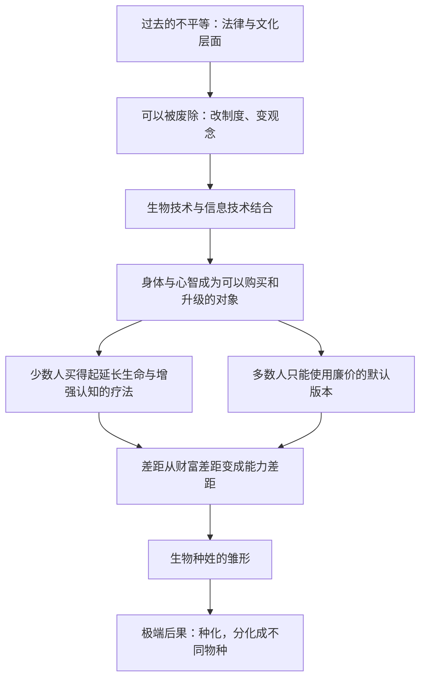

# 04｜未来的不平等，为什么可能是「生物学」的？

> 人类历史上的不平等可以被废除，为什么未来的不平等可能不行？

---

## 一、先说结论

赫拉利认为，过去的不平等（阶级、种族、性别）都建立在法律和文化之上，因此可以被废除：改法律、变观念、搞平权，几代人的努力就能把它削平。

但生物技术与信息技术一旦结合，不平等可能「下沉」到生物学层面。

这句话的意思是：不平等不再只是「你有钱、我没钱」，而是「你的身体和大脑被改造过，我没有」。少数人买得起延长生命、增强认知的疗法，多数人只能使用廉价的默认版本。久而久之，人类可能分化成不同的「生物种姓」，甚至像物种一样分道扬镳——赫拉利用的词是「种化」。

他还提出一个他认为属于 21 世纪最重要的政治问题：数据该归谁所有？因为数据巨头真正收集的不是注意力，而是权力。

---

## 二、我们先理解一个问题

先问一个问题：为什么历史上的不平等可以被废除，而技术造成的不平等可能不行？

关键区别在于「载体」。

法律和观念上的不平等，写在制度和头脑里。制度可以改，头脑可以教育。种族隔离被废除了，女性获得了投票权，种姓制度在法律上被取消了——这些历史都证明了一件事：只要不平等是人写下来的，人就能把它划掉。

但如果不平等写进了身体呢？你没法通过一部法律，让一个接受了认知增强的孩子，和一个没接受的孩子站在同一条起跑线上。你可以给他发补助、给他好学校，但两边的硬件已经不同了。

这就是本文要回答的问题：不平等如果从「规则」搬到了「肉体」，还能不能像以前那样被纠正？

---

## 三、作者到底提出了什么观点？

赫拉利在《今日简史》第四章「平等」里，把问题分成了两步。

第一步是回顾。历史上人类为平等奋斗了很久：废除奴隶制、争取普选、反对种族歧视、推动性别平等。这些斗争之所以可能成功，是因为不平等的根源是人为的——法律规定的、文化默认的，而人为的东西人就能改变。

第二步是提问：如果下一轮不平等不再是人写的呢？

他给出的机制是：生物技术让人可以改造身体和心智，信息技术让这些改造可以被精准定价、被个性化推荐。两者结合就会形成一条新的分层线——不是「谁有更多钱」，而是「谁的身体更好、活得更久、想得更快」。

他用「种化」描述极端后果：如果不同群体被改造得差异越来越大，以至于无法通婚、无法互相理解，那就不再是同一物种内部的阶层差异，而是物种分化。他用「生物种姓」形容这种分层结构。

关于数据，赫拉利的判断同样直接。他指出，那些提供免费服务的科技公司，商业模式是用服务换数据。他引用了那句被反复提起的比喻：在这些平台上，我们不是他们的用户，而是商品。他把这类公司称为「注意力商人」，他们卖的不是产品，而是能预测注意力的模型。

但他认为这还不够准确。他真正想说的是：**数据带来的不只是钱，而是权力。** 能预测一个人的选择，就能影响他的选择；能影响足够多人的选择，就能左右一个国家的走向。所以他提出：如何规范数据的所有权，这可能是这个时代最重要的政治问题。

---

## 四、把这个观点翻译成人话

可以把社会想象成一栋楼。

过去的不平等，是楼层的高低。有人住顶层，有人住地下室，很不公平，但楼是同一栋，楼梯是通的，政策要做的只是修电梯、开通道。

赫拉利担心的新不平等，是这栋楼被换成了两栋楼。一栋装了恒温系统、私人医生和认知增强；另一栋只有基本的水电。更麻烦的是，两栋楼之间没有电梯——不是不给修，而是两边的结构已经不一样了，通道在物理上不存在。

到那时，「努力就能往上走」这句话会变得很残酷：它是对的，但你走的那条楼梯，通向的不是上面那栋楼。

---

## 五、为什么会这样？

把赫拉利的推理拆开，是一条清晰的链条：

关键在于 C 到 G 这一段。

赫拉利的推理有一个很朴素的起点：市场会为稀缺的东西定价，而健康、寿命和智力是最稀缺的东西。只要技术允许，它们就会被商品化，而商品化的东西总是先到付得起钱的人手里。

接下来是自我强化：有钱的人用钱换能力，能力换更多的钱，再用更多的钱换更强的能力。这个循环在财富领域早就存在，但财富可以靠税收和再分配来调节；如果循环发生在身体里，税收就无能为力了——你没法把一个人的记忆和认知能力抽出来重新分配。

链条末端是 I，也就是赫拉利最激进的一步：如果分化足够深，人类这个物种本身会裂开。他承认这是可能性而非预言，但认为它有讨论的必要。

---

## 六、举一个现实生活中的例子

看同一座城市里的两个孩子。

一个住在城市西边的高层住宅区，父母都是高收入专业人士。孩子出生时做了全套基因筛查，查出几种代谢风险，从此有了定制饮食和定期随访。小学时他注意力不集中，家里请了评估师做认知训练。到高中，他参加一对一的科研项目，简历上已有实验室经历。

另一个孩子住在城市东边的老城区，父母做零工，收入不稳。他的健康信息主要来自学校体检，有一次近视被漏掉了整整一年。他放学后大部分时间花在手机上，因为那是家里唯一不需要额外花钱的娱乐。屏幕给他即时的快乐，也悄悄拿走了他练习专注的机会。没有人恶意害他，只是免费的东西自有它的代价。

两个孩子相隔不过十几公里，坐地铁半小时。但到十八岁时，他们之间的差距已经不只是成绩单上的分数，而是身体的健康记录、大脑的注意力结构，以及「我能做什么」的想象空间。

如果这个差距再叠加一层「可购买的身体升级」，那么十年后的分岔就不再是社会阶层问题，而是生物差异问题——这正是赫拉利说的「生物种姓的雏形」。

---

## 七、回到书中重新理解

现在回头看赫拉利在第四章里的具体论述，会更容易理解他的分寸感。

他并没有说「人类正在变成两个物种」。他用的是条件句：如果生物技术发展到那个程度，如果不加干预，那么可能出现种化。这是对未来风险的描述，不是对现状的判决。

他也没有把责任全部推给科技公司。他指出，免费服务换数据这套模式，用户自己是知情、自愿的——我们点过同意，也确实得到了便利。问题在于，没有人能预料这些数据的长期用途，也没有人真的读过那些条款。所以真正的问题不是「他们骗了我们」，而是我们从来就没有一套规则来界定数据该属于谁。

关于数据所有权，赫拉利提出的是一个政治问题，而不是技术问题。他把它和历史上的土地所有权相提并论：过去几百年，人类花了很大力气才建立起关于土地、资本和劳动的所有权规则；现在数据成了新的关键资源，规则却还几乎是空白。

---

## 八、这个观点背后还有什么？

第一，它把「平等」这个概念本身升级了。过去的平等是「机会平等」或「结果平等」，赫拉利指出还有第三种：**能力平等**。当能力可以被购买，前两种平等都不足以维持社会的基本共识。

第二，它解释了为什么「再分配」这套老工具可能不够用。税收能转移财富，但不能转移已经被写进身体的优势。

第三，它把数据问题、自由问题和权力问题连成了一片：数据所有权既决定谁能受益，也决定谁能塑造你。

---

## 九、这个观点有问题吗？

先说他最有说服力的地方。

赫拉利的框架抓住了技术不平等的一个真实特点：它可以叠加和累积。财富差距会被消费掉一部分，能力差距却会一代一代传下去，甚至可以被写进生殖细胞。他还把「数据所有权」这个抽象议题，变成了每个人都能理解的权力问题。

但至少有几处值得追问。

第一，「种化」在生物学上几乎不成立。物种分化需要长期的生殖隔离和巨大的选择压力，人类社会恰恰相反：人群之间的流动和通婚一直在增加。一些生物学家认为，这个推论是把社会分层借用了生物学的语言，听起来震撼，却缺乏机制支撑。

第二，赫拉利可能低估了技术的下沉速度。历史上许多只有富人能用的技术——手机、疫苗、汽车、空调——最终都变得廉价而普及。如果认知增强也走这条路，「生物种姓」就不会长期存在。

第三，数据所有权听起来是个好口号，但操作起来极难。数据是复制的、可组合的、跨境的，把它当作私有财产来分配，可能反而会强化少数巨头的垄断地位。批评者指出，赫拉利指出了问题，却几乎没有给出可执行的路径。

---

## 十、今天再看这个观点

以下是基于赫拉利思想的现代延伸，不是作者原话。

赫拉利写这本书是 2018 年，今天再看，两条线都往前推进了。在生物技术这一侧，基因编辑、细胞治疗、脑机接口的进展，让「可购买的身体升级」不再是纯科幻；同时，这些技术目前的成本仍然极高，主要服务于少数患者和研究者——这恰好符合他的担心：先到的人先受益。

在数据这一侧，变化更快。生成式 AI 让数据的价值被重新定价：过去你贡献的是点击，现在你贡献的可能是判断力、写作方式和专业知识。围绕数据使用的监管讨论正在多个地区推进，但规则之间差异很大，跨境流动几乎无法约束。

另一面也值得记录。开放数据、公共算力、开源模型这些方向，正在形成一种「数据公共品」的思路。它们还很初步，但至少提出了一种可能——数据不一定要被私人占有。

---

## 十一、这一篇真正应该记住什么？

1. 过去的不平等写在法律和文化里，因此可以被废除；而写进身体里的不平等，很难再用同一套制度工具去纠正，这是两者最根本的区别。
2. 生物技术与信息技术一旦结合，差距就可能从财富层面下沉到能力层面，再分配这套老工具会越来越不够用，这是最需要警惕的变化。
3. 「种化」是赫拉利提出的极端后果设想，属于警告而不是预言，在生物学上争议很大，不宜当作定论，它更像一个用来思考的边界。
4. 数据巨头收集的不只是注意力，而是预测和影响人的权力，这才是数据问题真正困难的地方，也是它值得被当作政治议题的原因。
5. 如何规范数据的所有权，是赫拉利认为这个时代最重要的政治问题之一，而答案至今还没有成形，也是我们这一代人要面对的任务。

---

## 十二、留一个问题

> 如果一个人身体里的优势可以被购买、被继承、被写进下一代，那么「人生而平等」这句话还剩下多少可操作的内容？

这已经不只是分配问题，而是一个关于「人是什么」的问题。而当少数国家或公司握住了塑造人的能力，另一件更难的事就浮了出来：这些问题没有一个是任何国家能单独解决的，可人类偏偏正在退回各自的国境线内。
