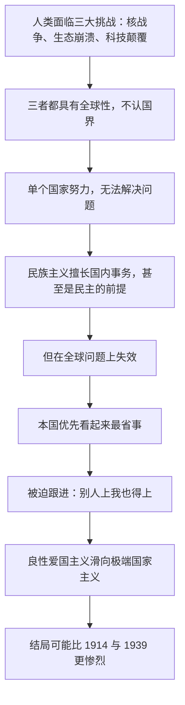

# 05｜民族主义能解决全球性问题吗？

> 面对核战争、生态崩溃和科技颠覆，为什么「各管各的」行不通？

---

## 一、先说结论

赫拉利认为，人类现在至少有三个共同敌人：核战争、生态崩溃和科技颠覆。这三个问题有一个共同特点——它们在本质上都是全球性的，不认国界。

民族主义擅长处理国内事务。它甚至是民主运转的前提：没有对共同体的认同，人们不会愿意为陌生人纳税、服兵役、遵守同一套规则。赫拉利在这一点上并不反对它，但他的判断是：面对这三大挑战，民族主义不够用。

他真正警惕的不是爱国，而是良性爱国主义滑向「我的国家至高无上」的极端民族主义。他主张人类需要一种全球性的认同和忠诚，并警告：如果坚持「本国优先」到底，结局可能比 1914 年和 1939 年更惨烈。

---

## 二、我们先理解一个问题

先问一个问题：为什么有些问题，一个国家再强也解决不了？

判断一个问题是不是「全球性」的，有一个简单的标准：如果只靠最好的那一个国家努力，问题会不会自己解决？

一个国家关起门来搞减排，而邻国继续排放，气候不会变好；一个国家禁止了某种危险技术，而别国继续研发，技术照样扩散；一个国家单方面裁减核武器，而对手不裁，它只是把自己变弱了。

这三个问题都符合这个标准：**参与者的收益，取决于别人的行为。** 这类问题在逻辑上就不属于「各管各的」范畴。

这就是本文要回答的问题。

---

## 三、作者到底提出了什么观点？

赫拉利在《今日简史》第七章「民族主义」里，先做了一件不太常见的事：他为民族主义说了句公道话。

他指出，如果没有民族主义，世界不会变得更好，而更可能陷入部落割据、一片混乱。民族国家是让几亿陌生人愿意彼此合作、彼此负责的容器。他举欧洲国家做对比：瑞典、德国、瑞士之所以能有稳定的民主和慷慨的福利，靠的正是国民之间强烈的共同体认同。

所以在赫拉利看来，问题不是「民族主义好不好」，而是「它在哪个层次上管用」：在国内事务上管用，在全球性问题上不管用。

他把当前的处境概括为三个共同敌人。

第一，核战争。核武器一旦使用，后果不受国界限制，它带来的是「集体自杀」式的风险。

第二，生态崩溃。气候、海洋、大气、物种，这些系统没有国籍，受害者往往不是排放最多的人。

第三，科技颠覆。人工智能、生物工程、网络攻击天然具有跨越国界的性质，单个国家无法独立监管，也无法独立获得安全。

他接着指出危险的具体形态：不是爱国，而是爱国的极端化。他用一句话点出这个滑坡——**良性的爱国主义会摇身一变，成为盲目的极端国家主义。** 前者是「我爱我的国家，希望它好」；后者是「我的国家至高无上，为此什么都可以做」。

他还提醒，科技领域有一种「被迫跟进」的机制：只要有一个国家走上高风险、高回报的科技之路，其他国家就会被迫跟进，单边的自我约束很难维持。

最后是他的主张：人类需要一种全球性的认同和忠诚。他并不认为这会取代民族认同，而是需要一种「多层次的忠诚」——一个人可以同时爱自己的城市、自己的国家和全人类。

---

## 四、把这个观点翻译成人话

可以把世界想象成一栋合租的公寓。

每个房间有自己的租客、自己的规矩、自己的门锁，这很正常，也很必要。

但公寓有几样东西是共用的：地基、水管、电闸、消防通道。如果某一户为了自己方便，把下水道改道、把电闸的保险丝换成铜丝、把消防通道堆满杂物，那么受害的不是他一个人——整栋楼都会塌。这时候，其他住户再「各管各的」，就是在陪着他一起承担后果。

赫拉利说的就是这件事：国家主权像你的房间，是合理的；核武器、气候和技术风险像地基和电闸，是共用的。你可以在房间里坚持自己的规矩，但不能假装楼下没有别人。

---

## 五、为什么会这样？

把赫拉利的推理拆开，是一条清晰的链条：

关键在于 C 到 G 这一段。

赫拉利的论证里有一个不太直观的点：**「本国优先」之所以看起来可行，是因为它只算了一部分账。** 它算的是「我省下了多少钱、避免了多少约束」，没算的是「别人也这么做之后，我付出的代价」。

于是形成一种类似囚徒困境的局面：每个国家都觉得自己的单边行动是理性的，所有人的理性加在一起，就是集体的灾难。科技领域的「被迫跟进」就是这种机制最清楚的体现——不是谁想冒险，而是谁都不敢不跟。

而链条末端的 I 是历史参照：1914 年的欧洲各国，没有一个国家认为自己在发动一场世界大战，每个国家都只是在保卫自己的利益；1939 年同样如此。赫拉利的意思是，如果今天重演同样的逻辑，后果会比那时严重得多，因为武器和技术的破坏力已经不在同一个量级。

---

## 六、举一个现实生活中的例子

看气候变化与跨国污染。

假设有一条河，从上游国家流向下游国家。上游国家要发展工业，废水排进河里——对它来说这是成本最低的方案。下游国家的渔民发现鱼越来越少，水质越来越差。他们抗议，但上游国家会说：这是我们境内的河，怎么用是我们的主权。

空气污染更明显。一个国家的电厂和工厂排放的污染物，会随着大气环流飘到邻国。这意味着一个国家即使把自己的排放压得很低，居民仍然可能呼吸到别人排放的污染。

碳排放更是如此：温室气体一旦进入大气层就完全混合，全人类共享同一个后果。一个国家减排，收益被所有国家分享；一个国家不减排，代价被所有国家分担。这在经济学上被称为「搭便车」问题。

这个例子最有力地说明了赫拉利的判断：在物理层面，「各管各的」根本不成立。你的排放不会因为国界而停下，你的受害者也不会因为国界而改变。

---

## 七、回到书中重新理解

现在回头看赫拉利在第七章里的具体论述，会更容易理解他的分寸感。

他并不是要取消国家。他反复强调，民族国家仍然是目前最有效的人类组织形式，也是民主得以运行的基础。他反对的是把民族主义当作处理一切问题的万能工具。

他也不认为全球认同会自然而然地出现。他承认这是极难的目标：人类的部落本能是几万年演化出来的，而全球认同只有很短的尝试历史。

他还特意区分了两种「爱国」。良性爱国主义是愿意为国家付出、为国家骄傲，同时承认别的国家也有同样的权利；极端国家主义是把国家放在一切价值之上，包括真相、道义和后代。他担心的滑坡就发生在两者之间——而滑坡通常不是从恶念开始的，是从「我们只是先照顾自己」开始的。

---

## 八、这个观点背后还有什么？

第一，它把「爱国主义」和「极端民族主义」做了切割。这个区分很重要：现实中任何对民族主义的批评，都很容易被听成「不爱国」，导致讨论无法进行。

第二，它提出了一个组织原则：**忠诚是可以分层的。** 你可以同时是家人、市民、国民和人类的一员，这些身份并不必然冲突；真正冲突的是「只有一层」的那种忠诚。

---

## 九、这个观点有问题吗？

先说他最有说服力的地方。

赫拉利对三大挑战的定性是站得住的：它们确实都不认国界，单边努力确实无法解决。他对民族主义的处理也很克制——先肯定它的功能，再指出它的边界，这让批评更有分量。而「被迫跟进」这个机制，在核扩散、军备竞赛、技术监管上都能找到大量例证。

但至少有几处值得追问。

第一，「需要全球认同」这个结论缺少可操作的路径。批评者认为，现成的国际工具都在，问题从来不是「缺一个全球政府」，而是「大国不愿意被约束」。把问题归到认同上，可能反而绕开了权力这个真问题。

第二，他对民族主义的批评可能低估了它的正面作用。一些历史学者认为，现代福利国家、劳工权利和公共服务，恰恰是靠民族共同体认同才建立起来的；弱化国家认同，可能先削弱的正是再分配的政治基础。

第三，把生态崩溃完全描述为「全球问题」，忽略了责任分布的不均：排放最多、受益最多的国家，与承受最大气候风险的国家并不是同一批，解决方案不能只是「大家一起减」。

第四，他关于「比 1914 和 1939 更惨烈」的警告很有力量，但也很笼统：那时的惨烈来自工业化的总体战，而今天的战争形态、经济结构和相互依赖程度都已经不同。关于这一类比是否成立，学界存在不同解释。

---

## 十、今天再看这个观点

以下是基于赫拉利思想的现代延伸，不是作者原话。

赫拉利写这本书是 2018 年。今天再看，他列的三大挑战一个都没有变轻。

在生态方面，极端天气的频率和强度在上升，各国在减排责任上的分歧依然存在，但可再生能源的成本下降得比预期快，这给合作提供了新的经济基础——减排不再只是「牺牲」，也可能是产业机会。

在科技方面，AI 治理成了新的全球议题。各国都在讨论规则，但规则差异本身就在制造竞争压力：谁监管宽松，谁可能跑得更快。这恰好印证了赫拉利说的「被迫跟进」。

在核方面，大国之间的战略竞争重新升温，军控框架面临压力。这条线最能说明他的判断：即使所有人都知道后果，结构性竞争依然会把国家推向前台。

另一面也值得记录。跨国合作并非只在倒退：公共卫生、气象监测、航空安全、部分金融规则，都已形成相当成熟的全球机制。它们的共同特点是——**问题足够具体，收益足够清晰，而且没有强烈的对抗性。** 这或许提示了一条现实路径：先从事务性合作开始，而不是先要求认同。

---

## 十一、这一篇真正应该记住什么？

1. 核战争、生态崩溃和科技颠覆是人类的三个共同敌人，它们本质上都是全球性问题，单边努力无法解决，这是全书问题设定的起点。
2. 民族主义擅长处理国内事务，甚至民主运转也要靠它，但它无法解决全球性问题，层次不同，工具也就不同，这是它的边界所在。
3. 真正危险的滑坡是：良性爱国主义变成「我的国家至高无上」的极端国家主义，而滑坡往往从「先照顾自己」开始，不是从恶念开始。
4. 「被迫跟进」让单边的自我约束很难维持，科技竞争尤其如此，这不是道德问题而是结构问题，也是全球合作最难的地方。
5. 赫拉利主张用全球认同和分层忠诚来补足民族主义，并警告「本国优先」到底的后果可能比两次世界大战更惨烈，这是他的结论。

---

## 十二、留一个问题

> 如果问题真的不认国界，而人的忠诚天然认国界，那么「全球认同」要靠什么长出来——是靠共同的敌人，还是靠共同的利益？

这个问题很难，但还有一个更难的地方藏在下面：人们之所以退回国家、民族、宗教这些叙事，是因为它们讲的故事足够清楚、足够让人有归属。可是这些故事之间，真的像我们以为的那样彼此对立吗？把它们分成几个互相碰撞的「文明」，这种分法本身，站得住脚吗？
