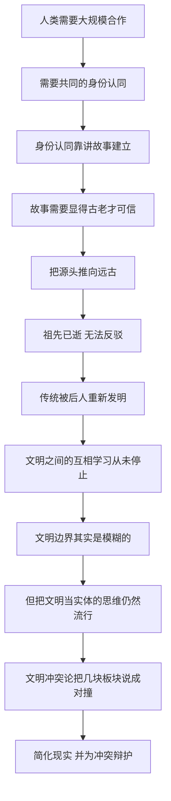

# 06｜「文明冲突」为什么解释不了世界？

> 当有人说「这是西方文明与伊斯兰文明的冲突」时，他究竟说错了什么？

---

## 一、先说结论

赫拉利认为，「文明」不是一块边界清楚的板块，而是一条一直在改道的河。它没有城墙，没有会员证，也没有统一的意志。真正塑造它的不是延续性，而是改变——人类群体与其说靠「我们一直是这样」来定义自己，不如说靠「我们经历了什么、变成了什么」来定义自己。

他还有一个更尖锐的判断：那些自称源远流长的传统，大多不是从远古一路原封不动传下来的，而是后人为了当下的需要讲出来的故事。祖先早已仙逝，无法反驳，于是任何主张都可以挂上「自古以来」的招牌。

在此基础上，赫拉利提出一个让人意外的说法：只要谈的是实际议题——如何建立国家、打造经济、兴建医院、制造炸弹——几乎所有人都属于同一个文明。人类的差异，远没有「文明冲突」这个词暗示的那么大。

而「文明冲突论」的问题正在于：它把复杂的现实压缩成几块对撞的板块，既经不起历史检验，又特别好用——因为它可以为冲突提供辩护，把利益之争说成宿命之战。

---

## 二、我们先理解一个问题

先问一个问题：当我们说「某某文明」的时候，我们指的究竟是什么？

如果文明是一群人，那么成员名单在哪里？边界画在哪里？一个人搬到另一个国家、改说另一种语言、改信另一种宗教，他属于哪个文明？

你会发现，只要追问三层，「文明」这个单位就开始模糊。它不像国家那样有法律边界，也不像公司那样有注册信息。

那么，为什么我们还这么爱用它？因为它方便。用几块大板块解释世界，比理解两百个国家、几千种利益要省力得多。本文要回答的就是：这个省力的框架，究竟在哪里失真了？

---

## 三、作者到底提出了什么观点？

赫拉利在《今日简史》第 6 章「文明」里，系统地质疑了「文明冲突」这套说法。

第一，他指出文明没有清晰的边界。我们很难讲清「西方文明」从哪里开始、到哪里结束：它包含多少种语言、多少种宗教、多少种制度？把这些统统装进一个叫「文明」的袋子里，袋子本身就是虚构物。

第二，他认为人类群体是靠「改变」而不是靠「延续」来定义自己的。一个群体最像自己的时候，往往正是它发生变化的时候：接受新的技术与制度，然后重新讲述自己是谁。

第三，许多被当作古老传统的东西，其实是后人创造出来的故事。故事需要一个源头，于是人们把源头往远古推，推到一个没人能查证的地方。用他的意思说：祖先仙逝已久，无法反驳。

第四，他举了一个极端的例子：自称要回归纯正伊斯兰教的「伊斯兰国」，并不是在复活某个原封不动的古代版本，而是在做一种全新的诠释。这不是「古老」的胜利，而是「新造」的伪装。

第五，也是最有冲击力的一点：只要讨论的是实际事务——怎么建立国家、打造经济、兴建医院、制造炸弹——几乎所有人都属于同一个文明。工程师用的都是同一套物理定律，银行家算的都是同一本账。

---

## 四、把这个观点翻译成人话

可以这样理解：文明不是墙，而是方言。

同一种语言，每个地区说起来口音不同、词汇不同，还会互相借词。你今天说的中文里，有大量从日语转译回来的词汇，也有从英语直接搬来的词。你不会因此说「我的语言被侵略了」，因为语言本来就是这样长出来的。

文明的边界也是一样：不是画出来的，是长出来的；不是固定的，是一直在变的。

而「文明冲突论」的做法，相当于把语言看成一块块固定的石头：这块是「汉语世界」，那块是「英语世界」，两者天生不同、注定对撞。它忽略了石头之间一直在互相渗透，也忽略了每块石头内部从来就不统一。

赫拉利想说的是：与其问「这是哪个文明」，不如问「这些人正在做什么事、面临什么困难」。前一个问题给你阵营，后一个问题给你现实。

---

## 五、为什么会这样？

把赫拉利的推理拆成一条链，是这样：

关键在于 D 到 G 这一段。

一个群体要让人愿意为它牺牲，光说「我们这样生活」是不够的，还得说「我们一直这样生活」。于是人们不断往过去追溯，把当下的选择包装成古老的传承。因为祖先不会出来抗议，这套包装几乎没有成本。

而 H 到 I 是另一半真相：文明之间从来在互相学习。宗教、技术、制度、食物、词汇都在跨境流动，你把一个文明当成封闭系统，历史立刻会给你一堆反例。

矛盾就在这里：现实中的文明是开放的、杂交的、变动的；政治语言里的文明是封闭的、纯粹的、恒定的。当人们相信世界由几块恒定板块构成，冲突就从「利益之争」变成了「宿命之战」，而宿命之战是不需要谈判的。

---

## 六、举一个现实生活中的例子

看看你今天的日常。

早上你穿牛仔裤。丹宁布这种织法最早出现在法国南部，「牛仔裤」这个名字又和意大利的热那亚有关；真正把它变成全球服装的，是美国的淘金者和后来的工厂；而你现在这条裤子，很可能是在孟加拉、越南或中国的车间里缝出来的。

上午你喝一杯咖啡。咖啡树原产在埃塞俄比亚，后来在阿拉伯半岛被大规模种植和饮用，再经欧洲的贸易网络扩散到美洲和亚洲。今天巴西和越南是主要产地，意大利人做出了浓缩咖啡。

下午你写下一串「阿拉伯数字」——1、2、3、4。这套数字其实起源于印度，经阿拉伯世界传入欧洲，所以欧洲人叫它「阿拉伯数字」，而阿拉伯人自己叫它「印度数字」。连名字都是一次误认。

牛仔裤、咖啡、阿拉伯数字，没有一样属于「纯粹」的某一种文明。它们都是杂交的产物。赫拉利要说的正是这一点：你越是认真看自己的日常生活，越找不到「纯粹」。文明的常态不是隔离，而是交换。

---

## 七、回到书中重新理解

回到第 6 章，赫拉利的分寸值得注意。

他并没有说「文明不存在」。他说的是：文明作为「我们是谁」的自我叙事存在，作为一种边界清楚的政治实体则不存在。这两件事经常被混为一谈。

他也并没有说世界上没有冲突。他要说的是：把冲突命名为「文明之间的冲突」，会遮蔽真正的分歧。真正的分歧往往在同一块「文明」内部——同一种宗教里的不同派别，同一个国家里的不同阶层。把内部矛盾改写成外部对撞，是政治中最常见的操作。

他还提醒：关于「我们」和「他们」的界线，从来不是自然给定的，而是被人画出来的。画线的人有自己的目的，而线一旦画成，就会看起来像天然存在的地形。

---

## 八、这个观点背后还有什么？

第一，这是一种反本质主义的思路。「文明」被当成一个有意志、有性格的整体。赫拉利认为，这是把群体的属性人格化，而真正做决定的，永远是具体的人、具体的机构、具体的利益。

第二，它和前面对「故事」的讨论是同一件事。文明是故事，民族是故事，宗教也是故事。它们不是假的，而是被建构的——被建构的东西同样能决定生死，只是它不能被当成自然法则来使用。

第三，它给后面几个议题埋了伏笔。宗教为什么退守到身份领域？移民争论为什么吵不出结果？这些问题的底层，都是同一件事：人们把文化当成了实体。

---

## 九、这个观点有问题吗？

先说赫拉利最有说服力的地方。他关于「文明边界模糊」的观察有大量历史证据支撑：技术、宗教、制度、语言一直在跨境流动，任何一个自称纯正的文明，都能被拆出外来成分。他对「传统被发明」的批评，也有相当多的历史研究支持。而「文明冲突」这套话语确实容易被用来为冲突辩护——先定义敌人，再合理化对抗。

但至少有几处值得追问。

第一，这个论断有可能被推到过度。一些学者认为，虽然文明的边界是模糊的、可渗透的，但在家庭结构、信任模式、对权威的态度、宗教在公共生活中的位置这些具体维度上，不同社会之间的差异是可测量、可重复的，而且确实会影响制度运转。边界模糊不等于没有差别。

第二，赫拉利可能低估了宗教与文化在现实冲突中的实际作用。许多冲突的参与者，自己就是用宗教或文明的语言来动员和理解的。说这是「被利用的话语」，未必能解释为什么这套话语如此有效。

第三，这个说法偏乐观。它强调的是共同的技术与制度语言，却可能掩盖了权力上的不平等：谁在定义什么是「现代」、什么是「落后」，本身就是一件有政治含义的事。

第四，「文明」是个很难证伪的概念。关于这一问题，学界存在不同解释，赫拉利的立场是其中有力的一种，但不是唯一的。

---

## 十、今天再看这个观点

以下是基于赫拉利思想的现代延伸，不是作者原话。

赫拉利写这一章时，主要针对的是把世界切成「西方」与「伊斯兰」的流行框架。今天，这条线的形状变了，但画线的手没变。

一个变化是，全球性的问题越来越不认文明。气候危机、传染病、人工智能的规则、数据的跨境流动，这些问题面前，任何一个国家或任何一种「文明」都无法单独应对。这恰恰印证了赫拉利的判断：在真正要紧的事务上，人类只有一个文明。

另一个变化是，画线的工具变了。过去靠讲历史故事，现在还可以靠算法：推荐系统决定你看到谁、把谁当成「他们」。当每个人手机里的世界都不一样，界线就更容易被制造。

---

## 十一、这一篇真正应该记住什么？

1. 文明不是边界清晰的实体，而是一直在变化、一直在互相学习的产物。它的常态是杂交，不是纯粹，任何自称纯正的文明都能被拆出外来成分。
2. 一个群体靠「发生了什么改变」来定义自己，而不是靠延续；所谓古老传统，大多是后人为当下需要讲出的故事，祖先早已无法反驳。
3. 只要谈的是建立国家、发展经济、兴建医院、制造炸弹这类实际议题，几乎所有人都属于同一个文明，差异远小于冲突论暗示的规模。
4. 文明冲突论把现实压缩成几块对撞的板块，既不符合历史，又容易被用来把利益之争说成宿命之战，从而关掉谈判的空间。
5. 追问「他属于哪个文明」只会得到阵营；追问「他正在解决什么问题、面临什么困难」，才能看到现实，也才能找到彼此对话的起点。

---

## 十二、留一个问题

> 如果「文明」的边界本来就是人画出来的，那么在今天，人们为什么如此渴望一块更大的身份？

当国家、民族、文明这些大词都显得太远，而身边又没有几个能随时说话的人时，人会往哪里去找归属？这份渴望常常并不指向宏大的板块，而指向一件更小、更贴身的事——身边究竟有没有人。
