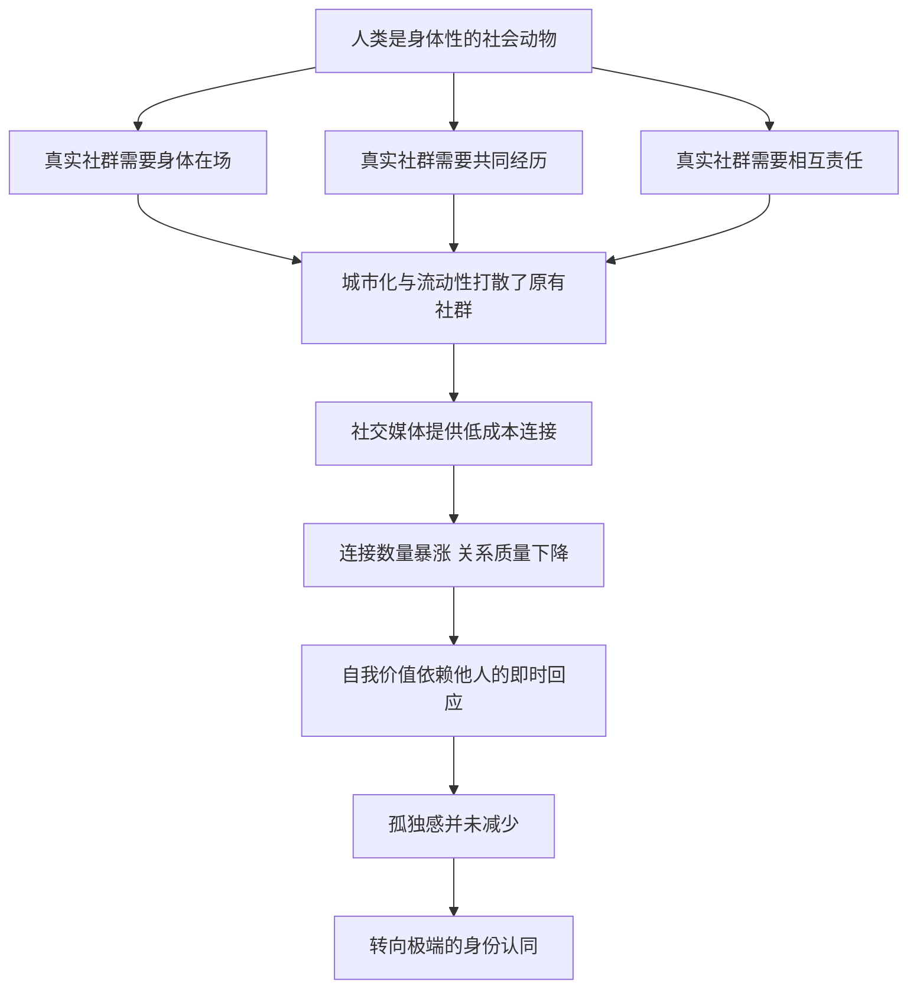

# 07｜为什么我们越「连接」越孤独？

> 联系人的数量创下历史新高，为什么真正能说上话的人反而越来越少？

---

## 一、先说结论

赫拉利认为，社群瓦解是真的，而且是可以测量的：几十年间，各类社群的成员规模大幅萎缩，人们越来越不认识自己的邻居。

但他不认为线上「连接」能填补这个空缺。人类是身体性的社会动物——身体不是可以随便替换的容器，面对面相处、共同经历、相互负责，这些才是社群真正的材料，而网络互动给不了。

更麻烦的是，网络互动会悄悄改变一个人理解自己的方式：你会越来越习惯从别人的眼光里看自己，感受越来越依赖点赞和回应。

于是出现一个奇怪的局面：真实的社群退场了，虚拟的连接又填不满空缺，孤独留在原地。而赫拉利提醒，孤独不会安静地待着，它会转向极端的身份认同——去寻找一个足够大、足够简单的「我们」。

---

## 二、我们先理解一个问题

先问一个问题：「连接」和「社群」是同一件事吗？

在通讯录里加一个人，叫连接。在凌晨三点打给他，而且知道他一定会接，叫社群。

前者是技术能力问题，后者是关系质量问题。社交平台把前者做到了极致，却没有办法把前者自动转换成后者——因为它经营的不是关系，而是信息。

那么社群到底需要什么才能成立？大致是三样：共同的身体在场、共同的经历、彼此之间的责任。这三样东西都不便宜，都需要时间，而时间恰恰是最不能被压缩的资源。

本文要回答的是：当这三样东西被技术替代了「一部分」的时候，人身上会发生什么？

---

## 三、作者到底提出了什么观点？

赫拉利在第 5 章「社群」里，从一个看起来很乐观的场景讲起：2017 年，扎克伯格发表宣言，说要利用科技重建全球社群，让世界重新连成一体。

赫拉利的回应是：这个目标值得尊重，但工具用错了。

他引述的说法是，几十年来各类社群的成员比例大幅下滑，减少的幅度大约在四分之一这个量级。人不再认识自己的邻居，不再属于教会、工会、社区组织、兴趣团体，连大家庭的日常往来都在变少。

然后他给出关键判断：线上互动无法替代真实社群。原因是人类的身体。人是演化出来的社会动物，嗅觉、触觉、表情、姿态、共处一室时的沉默，这些不是「多余的形式」，而是社会联结的原材料。赫拉利把这称为「人类身体的价值」——在线世界里身体被删掉了，而恰恰是身体承载着最难伪造的那部分信任。

第三个判断关于自我。网络互动让人越来越从别人的眼光里理解自己：一有有趣的事就拍照发帖，等回应、等点赞。感受不再是自己内心升起的，而是来自网络的回响。而点赞是最容易给、也最容易收回的东西。

第四个判断是去向。孤独不会让人安静下来，它会让人们去找一个更大的「我们」——民族、宗教、部落。当真实的社群无法提供归属，极端的身份认同就会来接手。

---

## 四、把这个观点翻译成人话

可以把社群理解成一间经常开火的厨房。

一间厨房之所以是厨房，不是因为它有灶台，而是因为有人真的在那里做饭：油烟熏黑了墙，碗碟有缺口，冰箱里有过期的酱料。它是有痕迹的、有历史的、有责任的——谁用完不洗锅，第二天会有人骂。

社交平台提供的更像一个外卖软件的界面：你能看到上千家餐厅，能随时下单，评价区里热热闹闹。它确实解决了「饿」这件事的一部分，但它不会让你拥有一间厨房。

赫拉利想说的是：社群不是「认识的人」的集合，而是「互相欠着」的网络。欠着才需要负责，负责才有归属。而点赞既不需要负责，也留不下痕迹。

---

## 五、为什么会这样？

把赫拉利的推理拆成一条链：

关键在于 E 到 G 这一段。

社群瓦解不是社交媒体的错，它是城市化和高流动性的副产品：人们为了工作不断搬家，家族的日常往来被打断，教会、工会、社区组织这些「免费的归属」一个个变薄。社交媒体出现时，空缺已经在那里了。

而 F 到 H 是替代失败的机制。平台提供的是低成本的连接：加个好友、点个赞、留个评论，几乎不需要付出。正因为成本低，它无法承载责任的重量。更微妙的是，它把「我被回应了吗」变成了一个可以实时查看的数字，于是自我价值被外包给了别人的即时反应。这不是某个人意志薄弱，而是界面设计的必然结果。

I 到 J 是赫拉利真正担心的地方：孤独不会保持沉默。它需要出口，而最简单的出口，是一个足够大、足够正义、足够清晰的「我们」。在这个「我们」里，你不需要被认识，只需要被归类。

---

## 六、举一个现实生活中的例子

看一个很常见的画面。

她的通讯录里有两千八百多个联系人，好友上限早就用完了，还加了小号。朋友圈里她永远是热闹的：旅行、加班、生日蛋糕、猫。生日那天，她收到两百多条祝福，其中三十多条是群发的。

那天晚上十一点，她刚知道自己被裁员了。她坐在客厅地板上，一个个翻通讯录，从 A 翻到 Z，翻了两遍。她想找一个能打电话的人——不是能帮她介绍工作的，只是能听她说十分钟的人。

最后她打给了三年没联系的一个大学室友。对方接起来的第一句话是：「这么晚了，出什么事了？」

这就是赫拉利说的那个悖论：联系的管道空前通畅，可求助的名单却在缩短。不是她不会社交，而是这些年在「连接」上花的所有力气，都没有变成那种凌晨三点能打出去的关系。

那一夜之后，她在朋友圈发了一条更用力的动态。第二天的点赞比往常更多。

---

## 七、回到书中重新理解

回到第 5 章，赫拉利的论述有几个容易被忽略的分寸。

第一，他没有把责任推给技术本身，也没有说「回到从前」。他承认线上工具在信息传播、组织动员、跨地域联络上有巨大价值——问题只在于，它被当成了社群的替代品，而它不是。

第二，他对身体价值的强调不是浪漫主义的怀旧，而是一个演化事实：人类的心智是在面对面互动中形成的，很多信号只有共处一室才能传递。视频会议能看到脸，但看不到一屋子人的沉默。

第三，他把社群问题和身份认同问题接在了一起。这一章不是孤立的一章，它是理解后面民族主义、宗教、移民几章的地基：所有那些关于「我们是谁」的激烈争论，背后都有一个空洞——真实的归属感正在变薄。

第四，他给出的结论不带命令：想重建社群，不能靠开发更多 App，而要靠人真的花时间去相处。这件事没有捷径。

---

## 八、这个观点背后还有什么？

第一，它揭示了「注意力」的错位。平台的商业目标不是让人有归属感，而是让人停留得更久。归属感和停留时长是两件事，有时甚至相反。

第二，它解释了为什么「点赞」让人上瘾又让人空虚。它给的是一种廉价、即时、可撤回的认可，正好落在人类最敏感的神经上：我是否被看见。

第三，它提供了一个新的视角来看极端主义。当一个人加入某个狂热群体时，他得到的往往不只是意识形态，还有兄弟、仪式、集体行动、被需要的感觉——那正是他失去的社群。

第四，它把「孤独」从一个私人情绪问题，变成了一个政治问题。

---

## 九、这个观点有问题吗？

赫拉利的判断有相当扎实的部分。面对面互动对心理健康的积极作用，有大量研究支持；社群参与度长期下降，也是被反复测量的现象；网络使用与孤独感之间的关系，也有不少研究指向负面。他指出「点赞不能替代责任」，这一点很难反驳。

但有几处需要平衡。

第一，他可能低估了线上社群的救助作用。对罕见病患者、身处偏远地区的人、性少数群体、异地分居的家庭来说，网络社群不是替代品，而是唯一的可能。一些学者认为，赫拉利把「线上」和「真实」对立得过于干净，而现实中二者常常是混合的。

第二，「从前的社群更好」这个前提本身值得怀疑。传统社群同样有代价：监视、闲话、排斥、对个人选择的压制。怀旧很容易把「认识所有人」记成温暖，却忘掉「所有人都认识你」的窒息。

第三，因果关系并不清楚。是社交媒体导致了孤独，还是孤独的人更依赖社交媒体？关于这一问题，学界存在不同解释，现有研究还不足以给出单向的结论。

第四，赫拉利提出的替代方案——多花时间面对面相处——在结构上很难落地。问题不只是个人愿不愿意，还有城市怎么规划、工作怎么安排、时间怎么被占用。把这件事说成个人选择，可能低估了它的难度。

---

## 十、今天再看这个观点

以下是基于赫拉利思想的现代延伸，不是作者原话。

赫拉利写这一章时，短视频还没有统治注意力，AI 伴侣也还没有成为一门生意。今天再看，他描述的那条链条更长了。

一个变化是，互动的对象开始不限于人。聊天机器人可以随时回应、永远耐心、从不评判，它把「被看见」这件事做成了可以订阅的服务。它确实缓解了一部分孤独，但也可能让人更少去练习那种需要耐心和退让的真实关系。

另一个变化是，孤独正在被明确定价。陪伴服务、语音直播、虚拟恋人，这些产品说明需求足够大，大到可以支撑一个市场。

还有一面值得记录：面对面的价值正在被重新发现。一些城市在修复公共空间，社区食堂、邻里互助、兴趣小组在城市里重新出现。它们还很零散，但至少说明，那个空缺已经有人开始认真对待。

---

## 十一、这一篇真正应该记住什么？

1. 社群瓦解是真实且可测量的：几十年间各类社群的成员规模大幅萎缩，人们越来越不认识身边的人，也不再属于任何固定的团体。
2. 连接不等于社群。加好友是一种技术能力，凌晨三点能打出去才是关系质量，前者可以被平台放大，后者只能靠时间慢慢积累。
3. 人类是身体性的社会动物，面对面相处、共同经历和相互责任，是线上互动无法替代的社群材料，信任就长在这些具体细节里。
4. 网络互动让人越来越从别人的眼光里理解自己，感受越来越依赖点赞，而点赞是最廉价、最即时、也最容易收回的一种认可。
5. 孤独不会安静地待着，它会转向极端的身份认同——去寻找一个足够大、足够简单的「我们」，在那里你只需要被归类，不必被认识。

---

## 十二、留一个问题

> 如果孤独会把人推向更大的「我们」，那么这个「我们」究竟在多大程度上是信仰，又在多大程度上只是一张可以抱团取暖的名单？

而当人们用宗教、传统和经典来回答「我们是谁」的时候，问题会变得更清楚，还是更难分辨？那些流传千百年的文本，在今天还能为我们解决什么？
