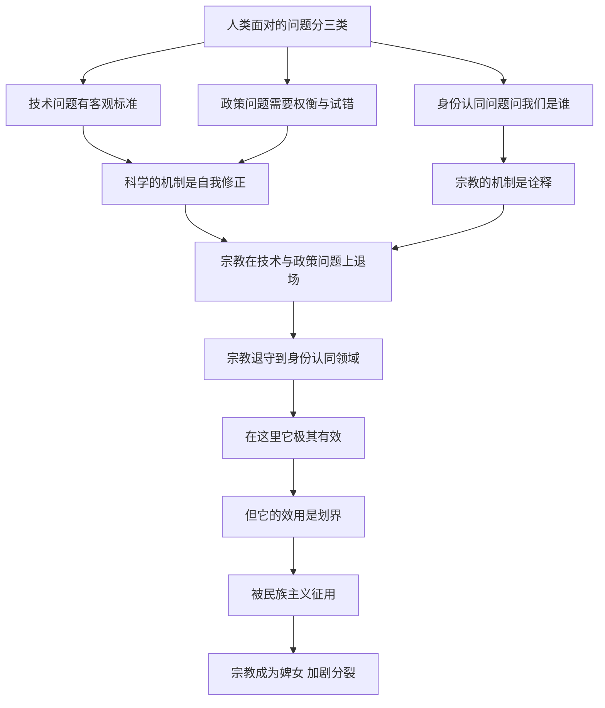

# 08｜宗教还能回答现代世界的问题吗？

> 在技术时代，宗教到底是答案、问题，还是别的东西？

---

## 一、先说结论

赫拉利认为，问「宗教还有用吗」问得不够精确。他把宗教放到三类问题面前分别检验：技术问题——怎么种地、怎么治病；政策问题——怎么管理经济、怎么分配资源；身份认同问题——谁是我们、谁是他们。

他的判断很明确：在前两类问题上，宗教派不上什么用场。祭司真正的专长从来不是降雨治病，而是「诠释」——在事情失败时，找到一个说得过去的理由。

但在第三类问题上，宗教的影响巨大，而且多半是在制造问题，而不是解决问题。现代宗教常常像「婢女」一样侍奉民族主义，被用来划出「我们」与「他们」的界线。

---

## 二、我们先理解一个问题

先问一个问题：当我们问「宗教能回答现代世界的问题吗」，我们指的是哪一类问题？

这三类问题的性质完全不同。

技术问题有客观标准：雨下没下、病好没好、桥塌没塌。答案可以被检验，错了就得改。

政策问题没有唯一答案，但有可比较的后果：失业率、通胀、寿命、犯罪率。它需要权衡，需要试错，需要承认不确定性。

身份认同问题则是另一回事：它问的不是「怎么办」，而是「我们是谁」。这个问题没有实验室，只有故事。

把三类问题混在一起谈，讨论就会失焦。赫拉利的做法，就是先把它们分开，再一一对照。

---

## 三、作者到底提出了什么观点？

赫拉利在第 8 章「宗教」里，用这个三分法来检验宗教。

在技术问题上，他举了祈雨舞的例子：跳舞的人相信这能带来雨水，可雨并没有因此落下。这时候祭司的考验才真正开始——不是考验他能不能降雨，而是考验他能不能解释为什么没下雨。这套解释的本事，才是祭司的核心技能。

这也是祭司与科学家分道扬镳的地方。科学家的工作也会失败，但科学的机制是自我修正：错了就改理论，再接受下一轮检验。祭司的机制是诠释：错了就改说法，而说法永远不会被证伪。

在政策问题上，他的判断同样直接：宗教经典无法告诉我们货币政策该怎么定、电网该怎么建、传染病该怎么防——这些问题的答案，依赖于只有现代才存在的知识。

在身份认同问题上，他的评价变了：宗教在判断「谁是我们、谁是他们」这件事上极其有效。它能带来雨水吗？不能。能医治疾病吗？不能。能制造炸弹吗？不能。但它能告诉你，谁是自己人，谁是外人。

而最尖锐的一句是：现代宗教常常像「婢女」一样侍奉民族主义，被国家征用，为边界、战争和排斥提供神圣的背书。

他还举了日本的例子：十九世纪的日本大规模引进西方的技术与制度，同时极力强调自己独特的传统认同——工具可以现代化，认同必须「自古如此」，这套组合后来被很多国家模仿。

---

## 四、把这个观点翻译成人话

可以把宗教想成一份家谱。

家谱的作用，是告诉你你是谁、你从哪里来、谁跟你是一家人。它极其重要：没有家谱，一个人在大家族里就没有位置。

但家谱不会告诉你今年该种什么庄稼、孩子发烧该吃什么药、家里的水管该怎么修。不是家谱不够权威，而是这些问题根本不在它的射程之内。

问题出在，当有人拿家谱来回答水管问题时，事情就麻烦了：他不能说「我不知道」，他必须说「祖上定下的规矩是……」。而一旦「祖上的规矩」可以用来解释一切，它就同时变成了一件万能的工具——既能解决争论，也能终结争论。

赫拉利想说的是：宗教在「我们是谁」这个问题上无可替代，在「怎么办」这个问题上却常常只是把不确定包装成确定。

---

## 五、为什么会这样？

把赫拉利的推理拆成一条链：

关键在于 E 和 F 的对比。

两类机制的差别不在谁更聪明，而在谁能被纠正。科学和现代制度允许自己被证据推翻，所以它们能积累；诠释不允许自己被推翻，所以它只能积累说法。在一个需要不断试错的世界里，前者必然胜出——这就是为什么祈雨舞最终让位给了气象学，神谕让位给了统计。

但 G 到 I 是赫拉利提醒的另一半：宗教并没有消失，它只是换了岗位。它从「解释自然」退到了「定义身份」。而身份认同有一个特点——它是零和的：你说自己是谁，同时就在说谁不是。所以宗教在退守之后，反而变得更容易被政治利用。K 到 L 就是结果：宗教提供的不是解决方案，而是边界，而边界可以被任何一方拿去用。

---

## 六、举一个现实生活中的例子

看一个让人觉得奇怪的场面：同一本《圣经》，被读出了相反的环保立场。

在美国，相当一部分福音派基督徒引用《创世记》里「治理这地」的表述，认为人类被赋予了管理甚至支配自然的权利，因此对严格的环境法规持怀疑态度，担心它妨碍经济增长和人的自由。

而天主教方面的立场几乎相反。教皇方济各在 2015 年的通谕里，把气候变化明确列为人类必须回应的道德挑战，呼吁转变生活方式、减少对自然的掠夺。天主教徒引用的是同一本《圣经》，也包括同一段关于「治理」的经文——但读出的意思是「看顾」和「守护」。

同一本书，同一段文字，两种截然相反的结论。

这说明什么？赫拉利的答案是：分歧的真正根源不在经典，而在现代政治。两群人在气候政策、政府角色上的立场本来就不同，他们只是各自回到经典里，为已经站好的位置找到一段经文。经典是万能的引用库，但选择引用哪一句的，是今天的政治。

---

## 七、回到书中重新理解

回到第 8 章，赫拉利的论述还有几层常被忽略的意思。

第一，他并不是在说宗教「假」。他说的是宗教的功能发生了变化。宗教仍然在回答很多人最在意的问题：我为什么活着、我该怎么对待别人、我死后会怎样。这些问题的答案不需要实验室，也不应该被简化成「有用」或「没用」。

第二，他对「诠释」的批评其实不只针对宗教。任何一套不容许被证伪的解释体系，都有同样的毛病：出了问题就修改说法，而不是修改主张。赫拉利把这一点点出来，是为了让我们警惕所有「永远不会错」的说法，无论它披着什么外衣。

第三，他指出了宗教与民族主义的合流，这是理解当代政治的一把钥匙。当国家需要一个超越利益的理由时，宗教能提供；当宗教需要一个执行者时，国家能提供。这种交换非常有效，代价是双方都被对方改写。

---

## 八、这个观点背后还有什么？

第一，它提供了一个判断话语的实用标准：看一套说法能不能被证伪。能认错、能修改、能接受下一轮检验的，值得信赖；只能解释、不能修正的，需要保持距离。

第二，它解释了为什么很多争论永远吵不完。如果双方用的不是同一套证据标准——一方要数据，一方要经典——那么辩论的胜负不取决于谁更有道理，而取决于谁掌握了发言的场合。

第三，它把宗教问题和身份问题连在了一起。当人们缺归属，宗教和民族主义都能提供现成的归属，而它们提供归属的方式，是把界线画得更清楚。

---

## 九、这个观点有问题吗？

赫拉利最有说服力的地方，是他把「哪类问题」这个前提摆在了最前面。很多关于宗教的争论之所以原地打转，正是因为一方在谈技术事实，另一方在谈身份归属。他对「诠释机制」的批评也很锋利：一套永远能自圆其说的解释体系，确实很难带来进步。

但至少有三处需要平衡。

第一，宗教在政策领域并非全然无用。一些学者指出，历史上的废奴运动、民权运动、扶贫与教育机构，都有宗教团体深度参与，提供了关键的道德动力和组织资源。说宗教在政策问题上「派不上用场」，可能低估了它动员社会的能力。

第二，把宗教主要描述成「诠释机器」和「身份工具」，可能遗漏了信仰者的内在体验。对很多人来说，宗教不是一套用来划界的说法，而是日常的安慰、纪律、社群与意义来源。用功能主义的视角看它，容易把活生生的信仰看成一个空壳。

第三，「宗教多半是在制造问题」这个判断偏向一边。宗教既是许多冲突的旗号，也是许多和解的资源——同一种传统里，既能找出排外的经文，也能找出包容的经文，前面那个环保的例子恰好说明了这一点。

第四，把宗教和民族主义的关系概括成「婢女侍奉主人」，可能过于单向。现实中两者互相改写：宗教被民族化，民族主义也被宗教化。关于这一问题，学界存在不同解释，具体案例的差异很大。

---

## 十、今天再看这个观点

以下是基于赫拉利思想的现代延伸，不是作者原话。

赫拉利写这一章时，最热的宗教议题是宗教与恐怖主义、宗教与民族主义。今天，议题的清单上多了几项。

一是新技术带来的道德问题。基因编辑、人工智能的决策权、人的数据能不能被买卖，这些问题既需要技术判断，也需要价值判断，而现有的宗教传统和世俗伦理都还没有给出被广泛接受的答案。

二是宗教与网络民族主义的合流。宗教的动员能力和社交媒体的传播能力结合起来，界线的画法变得更碎、更快、更情绪化。同一种宗教内部的派别对立，有时比宗教之间的对立更激烈。

三是一个有趣的对称：在技术和政策领域，新的「祭司」出现了——算法在告诉我们该看什么、该信什么，而且和古代的祭司一样，很少解释自己为什么这么判断，也很少承认错误。

---

## 十一、这一篇真正应该记住什么？

1. 问「宗教还有用吗」不够精确。要分开看：技术问题、政策问题、身份认同问题，三者的评判标准完全不同，混在一起谈就必然失焦。
2. 在技术问题上，科学靠自我修正胜出；祭司的核心技能从来不是降雨治病，而是在事情失败之后，找到一个说得过去的理由。
3. 宗教无法带来雨水、无法医治疾病、无法制造炸弹，却能极其有效地判断谁是「我们」、谁是「他们」，而且这种划界是零和的，天然制造对立。
4. 现代宗教常常像婢女一样侍奉民族主义，被用来为边界、战争和排斥提供神圣背书，而代价是宗教与国家互相改写，各自失去一部分自己。
5. 同一本经典可以读出相反的立场，说明分歧的根源往往不在经典，而在今天的政治——经典是引用库，选择引用哪一句的是政治。

---

## 十二、留一个问题

> 如果经典只是引用库，真正做选择的是今天的政治，那么当人们为一个国家的「文化边界」争论不休时，他们真正害怕的到底是什么？

是文化的消失，还是自己熟悉的生活正在改变？而当这种焦虑被摆到台面上，一个社会能不能既守住自己的边界，又不把新来的人当成敌人？
