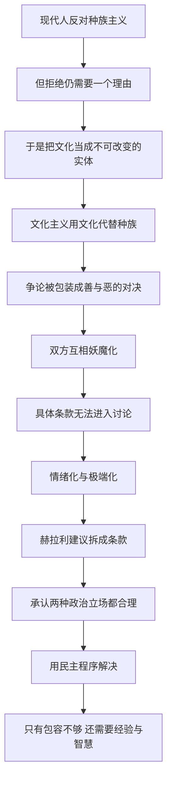

# 09｜移民争论的真正焦点是什么？

> 关于移民，双方吵得最凶的往往不是真正的分歧，那真正的分歧在哪里？

---

## 一、先说结论

赫拉利认为，移民争论之所以难谈，是因为它被包装成了一场善与恶的对决，而它其实不是。

他建议把移民问题拆成一份「协议」的几项条款：东道国是否允许移民进入——这是责任还是施舍；移民是否必须接受东道国的文化——接受多少；同化到什么程度才算「我们」。

拆开之后，真正藏在水面下的东西才会浮出来：现代人嘴上反对种族主义，心里却常常变成了「文化主义者」——把文化当成不可比较、不可改变的实体，用「文化不同」代替了从前那句「种族不同」。

他的建议是：别把它当成善与恶的对决。这是两种合理的政治立场之争，应该摆到桌面上，用民主程序来解决。同时他提醒：只有包容是不够的，还需要经验和智慧。

---

## 二、我们先理解一个问题

先问一个问题：为什么移民问题这么难谈？

一个原因是它同时牵动了两套语言。一套是利益的语言：工作机会、福利负担、治安、人口结构、国家主权。另一套是道德的语言：人道、同情、庇护的责任、人类的平等。

两套语言都成立，但它们不在同一个层面上。用利益反驳道德，像是用算账回答「应不应该」；用道德反驳利益，像是用理想回答「可不可能」。于是双方都觉得自己被误解了。

另一个原因是，这个问题牵扯到每个人最贴身的东西：我熟悉的生活会不会消失？我的孩子会在什么样的环境里长大？

本文要回答的就是：在这些情绪和口号之下，双方真正在争的是什么？

---

## 三、作者到底提出了什么观点？

赫拉利在第 9 章「文化认同」里，用一种很像律师的方式处理这个议题：先把一份「移民协议」拆成条款。

第一条，东道国是否允许移民进入。分歧在于性质：允许进入是一种责任，还是一种施舍？如果是一种责任，拒绝就是失职；如果是一种施舍，接受的人就该感恩。

第二条，移民是否必须接受东道国的文化，接受多少。是完全保留自己的习惯，还是要接受当地的语言、法律和核心价值？

第三条，同化到什么程度才算「我们」。住满多少年、说得多流利、孩子在哪里上学，才能算自己人？这一条没有客观标准，只有感觉。

第四条，这些条款由谁决定、怎么履行、如何监督？

拆完条款之后，赫拉利指出更深的一层：今天的很多人嘴上反对种族主义，实际上已经变成了「文化主义者」。种族主义说「这个种族天生不如那个种族」；文化主义说「这种文化无法与那种文化融合」。前者已经声名狼藉，后者听起来却很有道理——但结构是一样的：把一群人当成一个不可改变的整体。

他给出的态度是：这不是善与恶的对决，而是两种合理政治立场之间的争论——一种更看重同质性和连续性，一种更看重开放和流动。既然都合理，就不该靠道德帽子压服对方，而应该摆到台面上，用民主程序来解决。

最后一句提醒也很重要：只有包容是不够的，还需要经验和智慧。宽容不是一句口号，而是一门需要长期学习的手艺。

---

## 四、把这个观点翻译成人话

可以把移民问题想成一群人合租一套房子。

老住户有权决定：要不要再招一个室友，新室友要不要遵守家里的规矩，住多久才算「自己人」而不是「那个新来的」。

你会发现，这些问题全都可以讨论，而且答案不止一个。真正让争吵失控的，不是这些条款，而是双方对彼此的想象：老住户怀疑新室友根本不打算融入，新室友觉得老住户从第一天起就想赶他走。

赫拉利想说的是：移民争论的焦点，往往不在条款本身，而在「你到底是什么人」这个判断上。一旦这个判断成立，条款就没人再看了。

---

## 五、为什么会这样？

把赫拉利的推理拆成一条链：

关键在于 A 到 D 这一段。

种族主义在道义上已经破产，但它背后的那种需求——需要一个「为什么他们不能进来」的理由——并没有消失。文化主义正好补上了这个位置：它不说谁优谁劣，只说「文化不同，难以融合」。这句话听起来中立，实际上完成了同样的工作：把一群人整体化、固定化。

E 到 G 是后果。当一方认为对方是种族主义者，另一方认为对方是叛国者，中间那几条真正需要谈判的条款就没有人讨论了。争论变成了身份表态：你站哪边，比你说什么更重要。

I 到 L 是赫拉利的出路。他的办法很朴素：把问题拆小，让它变得可谈判，并承认两种立场都有正当理由——想守住自己的生活方式，和想给逃难的人一个机会。

---

## 六、举一个现实生活中的例子

看一个欧洲小镇。

镇上有八千多人，一条主街，一所中学。2015 年之后，镇上的旧体育馆被改成了临时安置点，陆续住进了三百多名难民，主要是来自叙利亚和阿富汗的家庭。

本地人的焦虑很具体：中学的班级人数从二十二人涨到了三十一人，老师却没有增加；超市里多了戴头巾的女性，有人觉得「街上不像以前了」。镇上的老面包店老板说了一句话：「我不讨厌他们，我只是觉得自己家突然变成了别人的家。」

移民的处境同样具体：很多人有工作许可的问题，等了两年也没批下来；孩子在学校跟不上，回家没人能辅导；他们最怕的不是被讨厌，而是不知道明天还能不能留下。

镇议会的听证会开到深夜。一个本地妇女说：「我们需要有人告诉我们，到什么程度才算够了。」一个已经拿到身份的叙利亚男人站起来说：「我不是来取代你们的，我只是想有个地方重新开始。」

两边都不是恶人。一边在守自己熟悉的生活，一边在求一个活下去的机会。真正没人回答的，是那个具体问题：到什么程度，才算够了？

---

## 七、回到书中重新理解

回到第 9 章，赫拉利的论述有几个值得注意的分寸。

第一，他并不认为东道国的担心都是偏见。他承认，一个社会有权讨论自己的文化边界——这是民主决策的一部分，不是道德污点。把任何对移民的疑虑都贴上「排外」的标签，只会让讨论关门。

第二，他也不认为移民应该被要求全盘放弃自己的文化。他强调文化本身是流动的、可混合的，不是一整套必须整批更换的软件。所谓「文化冲突」，很多其实可以被时间和接触磨平。

第三，他把「文化主义」的问题指向了双方。文化主义者不只在反对移民的一边，也在一些移民群体内部：把「我们的文化」和「他们的文化」都当成铁板一块的人，用的是同一套思维。

第四，他给出的关键词是「宽容」，而且他把宽容定义成一件困难的事，而不是一种善良的态度：宽容意味着你要忍受一些你不喜欢的东西，而且不打算立刻消灭它。

---

## 八、这个观点背后还有什么？

第一，它揭示了现代道德语言的一个盲区。种族主义被赶出了正当话语，但它背后的心理需求换了件衣服继续存在。识别这种「换装」，比宣布某种主义已经死亡重要得多。

第二，它把移民问题放回了民主理论的框架里。一个社会该不该接受移民、接受多少、要求什么，最终要由这个社会的成员来回答。这个答案不可能让所有人满意，但它必须被公开讨论，而不是由道德口号代答。

第三，它和前面几章共享同一种诊断：把文化当成实体，是很多政治争论的共同病灶。文明冲突论如此，宗教身份论如此，移民争论也如此。看到这一点，才能从「谁对谁错」退回到「我们到底在谈什么」。

---

## 九、这个观点有问题吗？

赫拉利最有说服力的地方，是他把一团情绪化的争论拆成了可以逐条讨论的问题。拆开之后，人们至少知道自己在争哪一条。「文化主义」这个诊断也很敏锐：它指出了当代排外话语的形式变化——从「种族」换成了「文化」，结构却没有变。

但至少有几处需要平衡。

第一，「把问题交给民主程序」这个建议可能过于乐观。民主程序本身也可能产生排外的结果，多数人的投票未必保护少数人的权利。一些学者认为，赫拉利把民主程序当成中立的裁决机制，忽略了它也会被情绪和动员左右。

第二，把移民争论描述成「两种合理政治立场之争」，可能低估了其中真实存在的偏见和歧视。现实中，对移民的敌意并不总是出于对文化连续性的合理关切，有时就是赤裸裸的排斥。把两者都称为「合理」，可能让后者获得了不该有的体面。

第三，「文化是可混合的」这个判断虽然大体成立，但也有代价被忽略。融合的过程常常不是双向的和平交换，而是弱势一方单向地放弃。谁的文化被要求改变更多，本身就是一个权力问题。关于这一问题，学界存在不同解释。

---

## 十、今天再看这个观点

以下是基于赫拉利思想的现代延伸，不是作者原话。

赫拉利写这一章时，欧洲正处在难民危机的高峰之后，争论的焦点是「接收多少」。今天，这个议题的形状变了不少。

一个变化是，气候问题正在制造新的迁移压力。当一片土地不再能养活它上面的人时，「要不要接收」就不再是偶发事件，而会变成常态。

另一个变化是，技术正在降低一部分摩擦。实时翻译、远程工作让「语言不通」这个门槛变低了一些。但它降低的是交流成本，不是身份焦虑——后者才是争论的真正燃料。

---

## 十一、这一篇真正应该记住什么？

1. 移民问题应该被拆成具体条款：是否允许进入、接受多少文化、同化到什么程度、如何履行，而不是笼统地争论「要不要移民」这一件事。
2. 现代人嘴上反对种族主义，心里却常常变成「文化主义者」，把文化当成不可比较、不可改变的实体，用文化代替了从前的种族。
3. 把移民争论包装成善与恶的对决，会让真正需要谈判的条款失去讨论空间，双方互相妖魔化，争论最后变成一场身份表态。
4. 这是两种合理政治立场之争——看重同质性与连续性，和看重开放与流动——应该摆到台面上用民主程序解决，而不是靠道德帽子压服对方。
5. 只有包容是不够的，还需要经验和智慧。宽容不是善良的态度，而是一门需要长期练习的手艺，意味着忍受你不喜欢的东西。

---

## 十二、留一个问题

> 如果一个社会既想守住自己熟悉的生活，又不想把逃难的人当成敌人，那么它需要回答的到底是哪一条边界——法律上的、文化上的，还是心理上的？

而当人们在争论「他们会不会伤害我们」时，往往忽略了另一种恐惧的规模要大得多：它不是来自远方的少数人，而是被放大到整个社会的那种不安。恐惧本身，有时候比威胁更有效。
