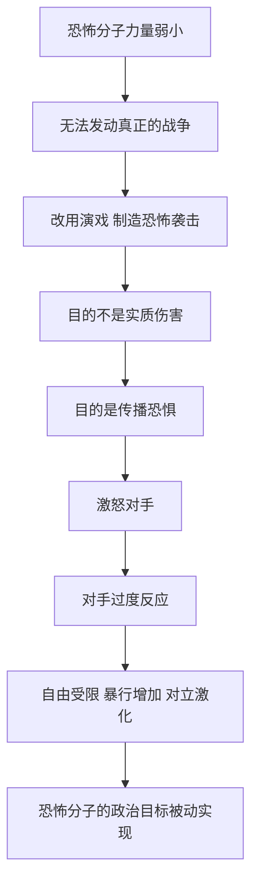

# 10｜恐怖主义为什么靠「恐惧」作战？

> 恐怖分子杀死的人远少于车祸，为什么却能撼动整个国家？

---

## 一、先说结论

赫拉利认为，恐怖主义本质上是一场「戏」。它追求的不是实质伤害，而是恐惧；它真正的目标也不只是被袭击的对象，而是这个对象的反应。

恐怖分子很清楚：以他们的力量，打不赢任何一场真正的战争。所以他们换了一种打法——不去摧毁对手的军队，而是去摧毁对手的安全感，然后等着对手自己犯下大错。

赫拉利的判断因此非常尖锐：**恐怖分子不可能打败我们，唯一能打败我们的是我们自己的过度反应。** 他还指出一个反直觉的规律：一个社会的政治暴力越少、生活越安宁，一次恐怖袭击带来的冲击反而越大——就像越安静的房间里，一根针落地越像炸雷。

---

## 二、我们先理解一个问题

要理解这个观点，先要理解一件反常的事：恐惧的大小，和伤害的大小并不成比例。

车祸每年夺走的生命远远多于恐怖袭击，却没有哪个国家因为车祸而改变战略、发动战争、把整个社会变成安检通道。同样是人死亡，为什么一种被当成事故，另一种被当成宣战？

因为恐惧不是按死亡人数计算的，而是按「意义」计算的。车祸是可预期的、分散的、没有敌人的；恐怖袭击是集中的、有意图的、带着敌意的。人类的心智对后者极其敏感——在漫长的进化史里，真正致命的从来不是统计数字，而是同类的恶意。

恐怖分子利用的正是这个心理漏洞：他们制造不了多少伤害，却能制造出远远超过伤害本身的恐惧。

---

## 三、作者到底提出了什么观点？

赫拉利在《今日简史》第十章「恐怖主义」里提出了一个反直觉的判断：恐怖主义是一种「演戏」的策略。

他分析说，恐怖分子通常力量弱小，无法发动真正的战争，也没有能力占领土地、击溃军队。那么他们为什么还要发动袭击？因为袭击的目的不是军事胜利，而是政治效果：**传播恐惧、激怒对手，让对手做出失控的反应。**

一旦被激怒，国家就可能犯下一连串错误：过度报复、限制自由、实施暴行、激化族群对立。这些反应会动摇舆论、偏移权力平衡，甚至把更多人推向极端。也就是说，恐怖分子自己什么都做不了，却能让对手替他们完成破坏。

赫拉利还特别指出：真正有效的手段其实是情报、渗透与隐秘行动——精准、低调、不制造戏剧性。但它有个致命缺点：在电视上不够精彩，所以在政治上往往输给看得见的强硬。

---

## 四、把这个观点翻译成人话

赫拉利用了一个非常形象的比喻：**恐怖分子就像一只想摧毁瓷器店的苍蝇。**

苍蝇自己撞不动任何一件瓷器，也推不倒货架。但它可以钻进公牛的耳朵里嗡嗡作响，把公牛惹疯；公牛在店里横冲直撞，最后把整间店撞成碎片。事后人们看到的是满地瓷片，而那只苍蝇早就飞走了。

这个比喻的要点在于：砸碎瓷器店的从来不是苍蝇，而是公牛——而公牛是自愿发狂的。

翻译成人话就是：恐怖主义是一种「借力」的战术。它借的不是武器，而是对手的愤怒、恐惧和自尊。它赌的不是自己能赢，而是对手会失控。所以应对恐怖主义最关键的能力，不是更强的报复心，而是一只更稳的手。

---

## 五、为什么会这样？

把赫拉利的推理链拆开，大致是这样：

这条链上最关键的一环，是从「激怒对手」到「对手过度反应」。

如果没有这一环，一次恐怖袭击就只是一桩惨案：会被哀悼、被调查、被追责，但不会改变一个国家的战略方向。是过度反应，把一次袭击放大成了历史事件。

赫拉利还在这条链上加了一个放大器：一个社会的政治暴力越少，一次袭击就越显得天崩地裂。他称之为「回音板」效应——在暴力常态化的地方，一次爆炸只是新闻；在长期和平的地方，一次爆炸足以成为集体创伤。恐怖分子真正想要的，就是那块安静的回音板。

---

## 六、举一个现实生活中的例子

「9·11」事件之后的美国，就是一头冲进瓷器店的公牛。

袭击者要的从来不只是那几栋楼的倒塌，而是美国的反应：他们赌美国会发怒、会出兵、会把自己的力量投进一个陌生的地区。这个赌注押中了。

接下来的十几年里，美国发动了阿富汗战争和伊拉克战争，投入了巨额军费，付出了大量士兵伤亡，而整个中东陷入长期的动荡与权力真空；与此同时，美国国内大幅扩张了监控与搜查的权力，机场安检从此成为一代人的日常记忆。代价并不只由袭击者承担，而是由整个地区、整个社会共同承担。

这正是那只苍蝇想要的结果：它自己什么也没撞碎，瓷器店却塌了。赫拉利想提醒的正是——如果那头公牛当时没有发狂，恐怖分子的收获会小得多。恐怖主义真正的破坏力，有一大半是它的对手免费赠送的。

---

## 七、回到书中重新理解

现在回头看第十章的具体论述，会更能体会赫拉利的分寸。

他并不认为恐怖主义是小事。他承认袭击是真实的罪行，受害者是真实的，恐惧也不是凭空的。他反对的是把恐怖主义当成一种「战略威胁」——仿佛它真有征服一个国家的能力。

他真正想强调的有两点。

第一，**反恐的最高境界是「没有戏可看」。** 情报、渗透、精准打击、国际合作，这些手段不产生戏剧性，因此不容易获得政治加分，但它们是真正削弱恐怖组织的方式。

第二，政府必须主动管理公众情绪。恐怖分子的胜负，很大程度上由被袭击社会的反应决定：如果社会保持冷静、照常生活、不让恐惧改写制度，袭击就失败了；如果社会用限制自由和制造仇恨来回应，袭击反而成功了。

---

## 八、这个观点背后还有什么？

第一，它揭示了「恐惧」作为一种政治资源的运作方式。恐惧不需要事实支撑，只需要一个画面。谁能制造画面，谁就能设定议程。

第二，它重新定义了「胜利」。在传统战争里，胜利意味着消灭敌人；在这种不对称冲突里，胜利意味着**不被改变**——你保住了自己的制度、自由和判断力，才算赢。

第三，它和全书反复出现的主题呼应：人类靠故事和感受行动，而不是靠数据。恐怖主义是「用最少的现实制造最多的故事」的极端案例。

第四，它提醒我们注意另一种更隐蔽的损失：恐怖分子的暴力是有限的，但国家为应对它而建立起来的监控、审查和紧急权力，可能长期留在社会里。真正的代价，往往在袭击结束很久之后才慢慢显现。

---

## 九、这个观点有问题吗？

赫拉利这一章的洞察力，首先来自一个很难反驳的事实对比：恐怖主义造成的死亡人数，确实远远低于车祸、疾病或普通犯罪。把「恐惧的规模」和「伤害的规模」分开来看，是理解现代安全政治的一把好钥匙。

但至少有几处值得追问。

第一，**「过度反应」由谁来定义？** 事后看，某些军事行动确实得不偿失；但事前，决策者面对的是不完整的信息和真实存在的下一次袭击威胁。一些安全研究者认为，赫拉利低估了恐怖组织获取更危险手段的可能性，也低估了「什么都不做」的政治与道德代价。

第二，恐怖主义真的没有达到政治目的吗？历史上，一些暴力组织确实通过持续袭击迫使对手让步、撤军或改变政策。如果完全否认这一点，就把恐怖分子写得比实际更无能了。

第三，「回音板效应」有循环论证的风险：社会反应强烈，被解释为因为社会和平；社会反应平静，又被解释为因为社会已经习惯。这样的解释很难被证伪。

第四，一些学者指出，赫拉利的分析偏重「国家应当克制」，却较少讨论恐怖主义背后的政治土壤——占领、压迫与身份绝望。只谈反应、不谈成因，结论容易滑向「只要冷静就没事了」。

---

## 十、今天再看这个观点

以下是基于赫拉利思想的现代延伸，不是作者原话。

赫拉利写这一章时，社交媒体还只是传播渠道之一。今天，「演戏」的门槛被进一步拉低了：一次袭击可以被现场直播，一段视频可以在几小时内被算法推送给全球用户，恐惧的传播几乎不再需要传统媒体的中转。

这意味着两件事。一方面，恐怖分子能以更小的成本制造更大的心理冲击，那块「回音板」变得更大、更灵敏。另一方面，恐惧的来源也早已不限于恐怖主义：公共卫生事件、经济震荡、族群冲突，都能被同一套机制放大。

于是赫拉利的提醒在今天更值得重读：真正需要防守的，往往不是某个具体的敌人，而是我们自己的反应模式。一个社会能否分辨「真实威胁」和「被放大的威胁」，正在成为它最重要的能力之一。

---

## 十一、这一篇真正应该记住什么？

1. 恐怖主义本质上是一场戏：它不追求实质伤害，只追求恐惧与愤怒，目的是激怒对手，让对手自己动手破坏自己的秩序、自由与安全。
2. 恐怖分子像钻进公牛耳朵里的苍蝇：它撞不动任何瓷器，真正砸碎整间店的是那头被惹疯的公牛，也就是对手的过度反应，而不是苍蝇的力量。
3. 反恐真正有效的办法是情报、渗透与隐秘行动：它们安静、不精彩、不出镜，因此在电视政治里常常输给看得见的强硬，而强硬往往代价更高。
4. 一个社会越和平，一次袭击带来的冲击反而越大。恐怖分子真正需要的不是更大的破坏力，而是一块足够安静、足够敏感的回音板，以及一个愿意为恐惧改变自己的对手。
5. 恐怖分子不可能打败我们，能打败我们的是我们自己的反应。保持冷静、照常生活、不交出自由，本身就是一种战略胜利，而不是软弱。

---

## 十二、留一个问题

> 如果恐怖分子的胜负有一半取决于我们的反应，那么一个社会该用什么标准来判断：哪些威胁值得付出改变制度的代价，哪些只是需要被冷静承受的噪音？

而恐怖主义其实只是战争的一种极端形式。过去几千年里，战争一直是掠夺财富、扩张版图最直接的手段：打赢一仗，就能拿到土地、人口和税收，这笔账算得清清楚楚。但今天，账本似乎被翻了过来——有时打赢一场大国战争，比不打还要亏。财富的形态变了，战争的收益也就跟着变了。

---
