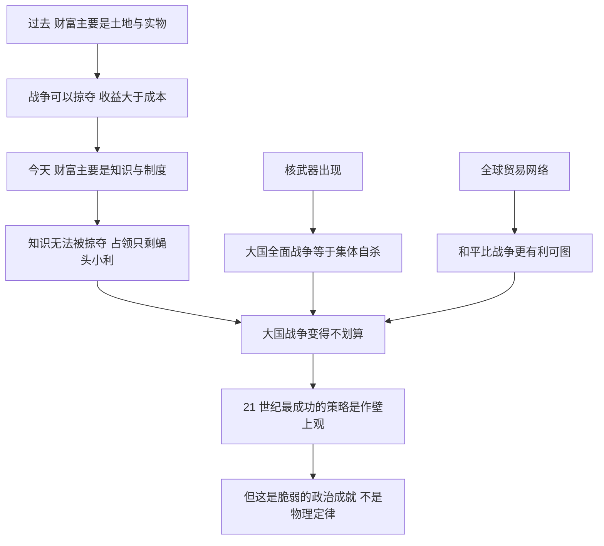

# 11｜战争为什么变得「不划算」了？

> 历史上战争是发财的手段，为什么今天的大国战争变得不划算了？

---

## 一、先说结论

赫拉利认为，战争在过去几千年里反复发生，是因为它常常真的划算：打赢一场仗，就能拿到土地、人口、税收和资源。但进入 21 世纪，这笔账被算反了——对大国而言，全面战争已经从「投资」变成了「自杀」。

他给出的三个理由分别是：财富的主要形式从土地变成了知识，而知识无法被掠夺；核武器让大国之间的全面战争等于集体毁灭；全球贸易让和平比战争更有利可图。用他的话说，**21 世纪最成功的策略是作壁上观。**

但他同时警告：这不是物理定律，而是一项脆弱的政治成就。「永远不要低估人类的愚蠢」——这是他给这一章留下的最重的一句话。

---

## 二、我们先理解一个问题

先问一个问题：战争曾经为什么会「划算」？

在农业时代，财富主要是实物：土地、粮食、牲畜、金银、人口。这些东西有一个共同点——它们能被搬走，也能被占领。占领一块土地，就等于获得它未来所有的产出；掠夺一座城市，就等于把几十年的积累一次性收入囊中。

在这样的世界里，战争是一门有回报的生意。风险当然很高，但收益也足够高，所以人类几千年里反复下注。真正的问题不是「人为什么好战」，而是「在什么条件下，战争会变成一门亏本生意」。

赫拉利的回答正是从这个角度切入的：当财富的形态变了，战争的收益结构也就变了。

---

## 三、作者到底提出了什么观点？

赫拉利在第十一章「战争」里，给出三个理由来解释为什么大国战争变得不划算。

**第一，财富的主要形式变了。** 过去最重要的资产是土地，今天最重要的资产是科技与体制的知识。而知识有一个关键特性：它无法用战争来掠夺。你可以占领一座工厂，却没法把工程师头脑里的东西搬走；你可以抢走一台机器，却抢不走让它运转的整个知识网络。

**第二，核武器改变了成本结构。** 当双方都拥有核武器，大国之间的全面战争就不再是「谁赢谁输」的问题，而是「大家一起死」的问题。战争从高风险高回报的赌局，变成了必然亏光本金的赌局。

**第三，全球贸易让和平更赚钱。** 如果繁荣来自贸易、投资与技术合作，那么打断这套网络，损失会大于所得。赫拉利由此提出那句著名的判断：21 世纪最成功的策略是作壁上观——让别人去消耗，自己专心发展。

他还举了一个国家的例子来说明这种判断可以错得多么彻底，我们会在第六节详细讲。最后他强调：这一切并不是自然规律，而是需要精心维护的政治成就。

---

## 四、把这个观点翻译成人话

可以这样想象两个家庭。

过去，邻居的财富是粮仓、牲口和土地。你把他的粮仓占了，粮食就是你的；你把他的地划过来，收成就是你的。这时候，抢劫是有「现金流」的。

今天，邻居的财富是配方、专利、人才、客户关系和制度。你冲进去占了厂房，拿到的只是一堆设备和一堆债务；配方在他工程师的脑子里，客户关系在市场的信任里，你抢不到，也搬不走。

于是「抢」这件事的价值就下降了：占领能拿到的东西越来越少，而占领的成本——军费、治理、抵抗、国际孤立——却越来越高。当收益小于成本，理性的大国就不该动手。

赫拉利说的「不划算」，就是这个意思：不是人变善良了，而是账本变了。

---

## 五、为什么会这样？

把赫拉利的推理链拆开，大致是这样：

这条链的关键，是三个理由其实指向同一件事：**战争的成本在上升，收益在下降。**

而更值得注意的是链条的最后一步。赫拉利并没有说「人类从此告别战争」——他说的是，今天的和平建立在几个脆弱的条件上：核威慑不能失灵、贸易网络不能断裂、决策者不能集体误判。任何一环松动，账本都可能被重新写一遍。

---

## 六、举一个现实生活中的例子

日本是一个让人脊背发凉的案例：同一个国家，同一批精英，在两个时代做出了两个完全相反的判断，而这两个判断都错得彻底。

二十世纪三十年代，日本的政治与军事精英形成了一个共识：国家人口在增长，资源却要靠进口，如果不向外扩张、不侵略，经济就会停滞、国家就会窒息。这个判断把日本推上了侵略战争的道路，最终的结果是国家被炸成废墟、军队被解散、殖民地全部失去。

按当年的逻辑，日本应该从此万劫不复。但事实正好相反：战后放弃军事扩张、专心发展经济与技术的日本，迎来了人类历史上最惊人的经济增长之一，成为世界主要经济体，人民的生活水平远超战前。

同一批人、同一个国家、同一套资源条件——差别只在于他们选择了抢，还是选择了做生意。赫拉利想说明的正是：战前精英所谓「不侵略就停滞」的必然性，根本不存在；它只是一个被自己的恐惧与傲慢反复确认的故事。

---

## 七、回到书中重新理解

回到第十一章的论述，会发现赫拉利的论证有几个容易被忽略的层次。

第一，他并没有说「战争已经消失」。他承认局部战争、内战、代理人冲突仍然存在——因为在不涉及核大国全面对抗的情况下，战争的账本在某些地区仍然算得过来。

第二，他特别提到中国的崛起：在很大程度上，它是依靠经济因素而非军事征服实现的。这在他的论证里是一个重要证据——在今天的财富形态下，发展经济比占领土地更有效。

第三，他提到俄罗斯与北约之间的叙事之争：双方各自讲着一套关于威胁与背叛的故事。赫拉利的态度是谨慎的，他不去判定谁对谁错，而是指出：当各方都被自己的叙事推动时，即便账本上写着「不划算」，战争仍然可能发生。

第四，他反复强调，和平是一种需要主动维护的成就，而不是历史的默认状态。

---

## 八、这个观点背后还有什么？

第一，它提供了一个判断战争风险的方法：不看谁更凶，看账本怎么算。只要「收益大于成本」的结构没有回来，大国之间全面战争的动力就有限。

第二，它解释了知识经济的政治含义：既然财富靠知识，那么真正的竞争就发生在教育、科研、制度与人才吸引上——这些领域恰恰最不能用武力解决。

第三，它让人重新理解「强大」的定义。一个国家的强大，越来越表现为它能否让别人愿意与它合作，而不是能否让别人害怕它。就像硅谷的竞争：领先者靠收购与创新取胜，靠把人才与知识吸引过来——**知识买得到、学得到，唯独抢不到。**

第四，它与全书的全球合作主题相连：贸易网络是和平的物质基础，而破坏这张网络的民族主义冲动，同时也在破坏和平本身。

---

## 九、这个观点有问题吗？

赫拉利这一章最有说服力的地方，在于它把「战争」从道德话题拉回到成本话题。他不靠「人应该善良」来劝人和平，而是指出：在新的财富结构下，侵略是亏本买卖。这个角度比道德呼吁更难反驳，也更容易被现实检验。

但至少有几处值得追问。

第一，**「不划算」不等于「不可能」。** 赫拉利自己在书中也承认，人类经常低估自己的愚蠢。事实上，在他写这本书之后，欧洲仍然爆发了大规模战争——这提醒我们，账本逻辑敌不过领导人对自己叙事的信念。

第二，知识与领土的价值对比可能被过度简化。能源、矿产、航道、战略纵深、水资源，在今天依然具有真实价值；一些学者认为，赫拉利低估了地缘与资源的持久重要性。

第三，「贸易带来和平」是一个古老的命题。在第一次世界大战之前，也有不少观察者相信，国家之间紧密的经济联系已经让战争无利可图——随后爆发的大战打碎了这种乐观。关于经济上的相互依赖究竟抑制还是加剧冲突，学界至今存在不同解释。

第四，核威慑的「稳定」在历史上并不像看起来那么稳：多次危机中，误判与意外的可能性都真实存在。把和平寄托在「没人敢按按钮」上，本身就是一种高风险的设计。

---

## 十、今天再看这个观点

以下是基于赫拉利思想的现代延伸，不是作者原话。

赫拉利写这一章是在 2018 年。此后几年里发生的几件事，让他的判断同时被验证，也被挑战。

被验证的一面：经济与技术的竞争进一步取代了领土争夺，制裁、出口管制、供应链与芯片成为新的「战场」，而这些手段的杀伤力恰恰来自它们对知识与贸易网络的依赖——这与他说的「财富的形态决定冲突的形态」一致。

被挑战的一面：欧洲重新出现了大规模战争，说明「不划算」的算计可以被信念、恐惧与国内政治压倒。同时，无人机、网络攻击与人工智能让战争的门槛和形态都在变化：一个较小的国家或组织，也可能获得过去只有大国才有的打击能力。

于是更准确的总结可能是：战争整体上变得不划算了，但没有变得不可能。赫拉利的警告——「永远不要低估人类的愚蠢」——仍然是最值得记住的那一句。

---

## 十一、这一篇真正应该记住什么？

1. 战争在过去之所以常见，是因为它常常真的划算：土地、人口、税收与资源都能被占领和掠夺，收益清晰可见，成本却可以转嫁给失败的一方。
2. 今天财富的主要形式是知识与制度，而知识无法用战争掠夺：你可以占领工厂，却搬不走工程师头脑里的东西；占领只剩蝇头小利，成本却高得惊人。
3. 核武器让大国之间的全面战争变成集体自杀，全球贸易让和平比战争更赚钱，所以 21 世纪最成功的策略是作壁上观：让别人去消耗，自己专心发展。
4. 日本战前认定「不侵略就会停滞」，战后却靠和平发展创造了经济奇迹：同一批精英、同一个国家，两个判断都错得彻底，所谓必然性往往是自我欺骗。
5. 和平不是物理定律，而是一项需要精心维护的脆弱政治成就：核威慑不能失灵、贸易网络不能断裂、决策者不能集体误判，而人类的愚蠢永远不该被低估。

---

## 十二、留一个问题

> 如果战争的账本已经算不过来，为什么仍然有那么多领导人相信自己必须一战？是账本算错了，还是他们看到的账本和我们不一样？

账本问题背后，其实还有一个更古老的动力：每个群体都相信自己是历史的中心、自己的诉求天经地义。当一个民族把自己想象成世界的主角时，战争就不再是成本计算，而是命运召唤。这种以自我为中心的历史叙事从哪里来，又该如何被看清？

---
