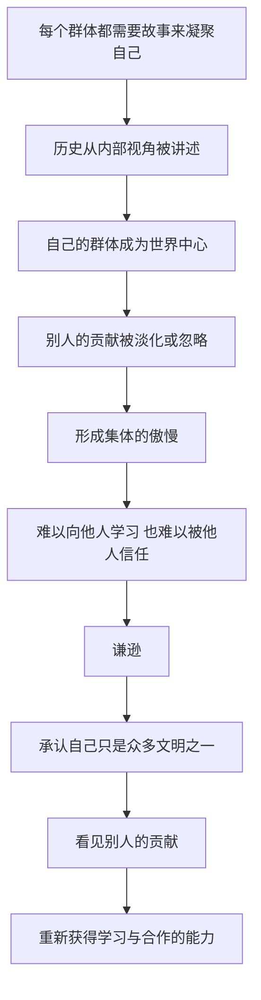

# 12｜为什么每个文明都觉得自己是世界的中心？

> 为什么几乎每个民族、每种宗教，都认为自己是历史的主角？

---

## 一、先说结论

赫拉利认为，把自己想象成世界的中心，不是某一个民族的毛病，而是几乎所有文明的通病。

他给出的观察是：中国孩子从小学到「中央王国」，犹太孩子从小学到自己是「选民」，西方孩子从小学到自己是文明的火炬手——每一本历史教科书都把自己的群体放在舞台中央，把别人写成配角。

这种自我中心让历史变得好懂，也让人看不见别人的贡献。赫拉利因此提出一个看似温和、实则艰难的主张：**认真对待「谦逊」。** 在他看来，谦逊不是自我贬低，而是看清世界、向他人学习的前提。

---

## 二、我们先理解一个问题

先问一个问题：为什么人天生会把自己的群体放在中心？

答案可能比我们想的更朴素。人的认知天然以自己为参照：我们记得住自己家的事，记不住邻居家的事；我们熟悉自己的语言，觉得别的语言奇怪。这种「自我参照」在个人层面叫自恋，在群体层面就变成了集体中心主义。

更关键的是，这种中心感并不需要事实支撑，它靠的是叙事。一个民族的历史往往被讲成一个有开头、有高潮、有使命的故事，而讲故事的视角永远是从内部看的。在故事里，自己的苦难是史诗，别人的苦难是背景；自己的成就是文明，别人的成就是模仿。

于是问题就变成了：当所有人都这样讲故事时，世界看起来会是什么样子？

---

## 三、作者到底提出了什么观点？

赫拉利在第十二章「谦逊」里，从自己的经历讲起：他从小接受犹太教育，被教导犹太历史是世界的中心、犹太人的命运是历史的主轴。后来他才意识到，这不是犹太人的特殊毛病——**每一个文明都这样教育自己的孩子。**

他举了几个例子：中国人从小知道自己是「中央王国」，位于世界的中心；西方人相信自己是文明的火炬，把现代性带给了全人类；几乎每一种宗教都把自己想象成全宇宙最重要的事情。

他由此提出一个更尖锐的观察：许多宗教一边赞颂谦逊，一边却把自己想象成全宇宙最重要的；一边要求个人谦和，一边又公然展现出集体的傲慢。

赫拉利并不认为这是恶意的谎言。他认为，这种自我中心的叙事是自然形成的，甚至是有用的：它让历史变得连贯，让群体获得凝聚力和自尊。但它的代价也很明显：**它让人看不见别人的贡献，也让人失去向他人学习的能力。**

---

## 四、把这个观点翻译成人话

可以这样理解：每个文明都像是写自传的人。

写自传的人不会故意撒谎，但有一个天然的倾向——所有事件都是围绕「我」发生的。别人帮过的忙，会被记成「在关键时刻遇到了贵人」；自己学来的东西，会被记成「我独创的方法」。读起来很连贯，也很动人，但和旁观者看到的版本不太一样。

如果我们把所有人的自传放在一起读，就会发现一个奇怪的现象：每个人都声称自己是主角，每个人都在讲同一批发明、同一段历史的「自己版本」。

赫拉利想说的谦逊，就是承认：**我的自传只是自传，不是全世界的编年史。** 我引以为傲的东西，很可能来自别人的传授；我引以为耻的时刻，别人的版本里也许写得更客观。这不是自贬，而是从「唯一的主角」变成「众多参与者之一」。

---

## 五、为什么会这样？

把赫拉利的推理链拆开，大致是这样：

链条的前半段说明：自我中心不是道德缺陷，而是叙事的自然副产品。任何一个群体，只要用故事来维持团结，就会不自觉地把自己的位置放大。

链条的后半段才是赫拉利真正关心的：如果自我中心会让人失去学习能力，那么谦逊就不只是一种美德，而是一种**认识论上的必需**——你要先承认自己不知道，才有可能真的知道。

---

## 六、举一个现实生活中的例子

想象三本同时打开的历史教科书。

第一本在中国孩子手里。目录从远古讲起，核心概念是「天下」与「中央王国」：我们是文明的发源地，周边是「四方」，历史的主线是王朝的兴衰与文明的延续。

第二本在犹太孩子手里。核心概念是「选民」与「应许之地」：我们是被拣选的民族，历史的主线是流散、苦难与回归，其他民族在这条主线里往往是背景。

第三本在西方孩子手里。核心概念是「文明的火炬」：从希腊罗马到文艺复兴、启蒙运动、工业革命，现代世界的自由、科学与民主都是我们的贡献，历史的主线是人类不断走向进步。

三本书都很连贯，都很能鼓舞人心。但把它们并排放在一起，你会发现一件有意思的事：同样一段历史，在三本书里的角色分配完全不同——同一个发明，三本书里可能各有各的起源故事；同一场战争，三本书里可能分别是胜利、灾难和插曲。

没有人在这三本书里刻意造假。问题在于，每本书都从自己的位置看世界，而位置决定了什么被放大、什么被省略。赫拉利想让我们意识到：一个孩子如果只读自己那本书，会真诚地以为自己是宇宙的中心。

---

## 七、回到书中重新理解

回到第十二章的具体论述，有几个细节值得留意。

第一，赫拉利特别提到犹太文化极为重视教育。这不是随口的夸奖，而是他论证的一部分：正是这种对教育的重视，让一套中心叙事被一代代完整地传递下去。教育越成功，叙事越牢固。

第二，他强调自己的批评是双向的。他批评犹太人的自我中心，也同样批评西方、中国以及各种宗教的自我中心——他不是站在某个更高的位置指责别人，而是承认自己也曾是其中一员。

第三，他的目标不是让任何群体否定自己。谦逊不等于自我否定：你可以为自己的传统骄傲，但不必相信这个传统是宇宙的唯一重点。

第四，他把「谦逊」和「学习」直接挂在一起。一个相信自己已经拥有一切真理的人，没有理由再学任何东西；而愿意承认别人也有东西可教，才是学习的起点。

---

## 八、这个观点背后还有什么？

第一，它揭示了历史叙事的政治功能。教科书从来不只是知识清单，它同时在做一件事：告诉孩子们「我们是谁」。所以历史教材之争，往往不是学术之争，而是身份之争。

第二，它解释了为什么「文明冲突论」那么有吸引力。如果每个文明都自认是主角，那么世界自然会被想象成几个主角之间的对抗——这正好呼应了赫拉利对文明叙事的批评。

第三，它给「学习」提供了一种新的理由。我们向别人学习，不是因为别人更高贵，而是因为没有人能垄断真理。谦逊是知识增长的前提。

第四，它把个人层面的功课也包含了进来。一个民族会讲自我中心的故事，一个人也会。看清自己故事里的省略号，是同一个功课。

---

## 九、这个观点有问题吗？

赫拉利这一章的说服力，在于它指出了一个几乎无法反驳的普遍现象：每个文明的历史教育都以自己为中心。只要你把不同国家的教科书并排来看，这个现象就一目了然。他把「谦逊」从一个道德词变成认识论工具，也是很有价值的一步。

但至少有几处值得追问。

第一，**「都自我中心」这个说法会不会抹平差异？** 自我中心的程度并不相同，有些叙事确实伴随着对外的侵略与压迫，有些则更多是防御性的自尊。把它们一律归为「通病」，可能让人忽略具体的责任。

第二，一些学者认为，赫拉利对犹太教育的描述带有选择性，而且他在批评集体傲慢的同时，也在用自己的立场——世俗的、普遍主义的立场——评判所有传统，这本身是不是另一种「我的视角才是正确的」？

第三，「文明之间互相学习」这一主张，可能低估了真实的差异与冲突。有些传统之间的分歧不只是视角问题，而是关于权利、性别、自由的根本分歧。用「互相学习」一笔带过，会显得过于温和。

第四，谦逊的建议很个人化。它呼吁个人反省，却几乎没有回答制度层面的问题：如果各国的教科书都由政治力量决定，个人的谦逊能改变什么？

---

## 十、今天再看这个观点

以下是基于赫拉利思想的现代延伸，不是作者原话。

赫拉利写这一章时，算法还没有像今天这样深入日常。今天，「每个文明都觉得自己是中心」这件事有了新的技术支持：推荐系统会持续向人们推送符合其既有认同的内容，让每个群体的中心叙事都得到不断确认。

与此同时，公共领域也出现了相反的运动：围绕历史教科书的争论越来越激烈，博物馆开始重新解释殖民时期的展品，一些流失文物被要求归还。这些争论本质上都在问同一个问题——**我们讲给自己听的那个故事，是否遗漏了别人的位置？**

赫拉利的提醒因此显得更有现实意义：谦逊不是要人放弃自己的认同，而是提醒每一个讲述者，历史不是自传，而是众多声音的合奏。

---

## 十一、这一篇真正应该记住什么？

1. 把自己想象成世界中心，不是某个民族的毛病，而是几乎所有文明的通病：每个群体都从内部视角讲述历史，都把自己的位置放在故事的正中央。
2. 中国的「中央王国」、犹太的「选民」、西方的「文明灯塔」，三种叙事的结构并不相同，但都把自己放在舞台中央，把别人写成了配角与背景。
3. 自我中心让历史变得连贯、让群体获得自尊，代价却是看不见别人的贡献，也失去向他人学习的能力——而学习能力一旦失去，衰落往往随之而来。
4. 许多宗教一边赞颂谦逊，一边把自己想象成全宇宙最重要的：个人谦和与集体傲慢可以并存于同一个体系，这种矛盾并不是例外，而是常态。
5. 谦逊不是自我贬低，而是承认自己只是众多参与者之一：先承认自己不知道，才有可能真的知道，这是看清世界、向他人学习的前提。

---

## 十二、留一个问题

> 如果每个群体都真诚地相信自己才是主角，那么彼此之间还有可能真正听懂对方吗？而在「听懂」之后，我们又该凭什么判断哪些做法是对的？

这个问题很快会指向一个更棘手的地方：人们判断对错的标准，往往来自自己的传统——来自经典、诫命和祖辈的教导。于是争论最后常常落到同一个地方：道德到底从哪里来？如果没有一个高于人类的权威为它背书，道德还站得住吗？

---
