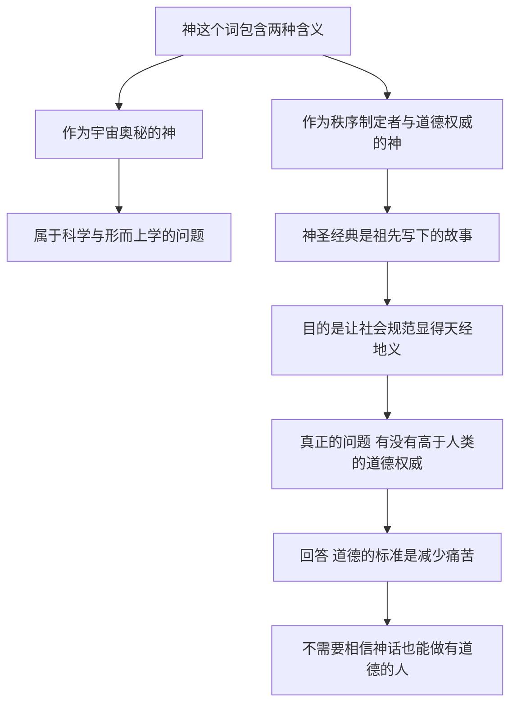

# 13｜如果没有神，道德还成立吗？

> 「上帝存在吗」的争论背后，真正值得问的问题是什么？

---

## 一、先说结论

赫拉利认为，「上帝存在吗」这个问题之所以争论不休，是因为它把两个完全不同的问题混在了一起。

第一个问题是宇宙论的问题：宇宙是怎么来的、有没有一位创造者？第二个问题是道德与秩序的问题：有没有一个高于人类的权威，为「什么是对」提供最终依据？赫拉利说，他真正关心的是第二个。

他的回答是：**道德的重点不是遵守神圣的诫命，而是减少痛苦。** 想做一个有道德的人，不需要相信任何神话；你只需要真正理解「痛苦」这两个字意味着什么。

---

## 二、我们先理解一个问题

先问一个问题：为什么「有没有神」这件事，几千年都吵不出结果？

原因之一是，它其实不是一个问题，而是至少两个问题的重叠。当有人说「我相信上帝」，他可能在说「我相信宇宙有一位创造者」，也可能在说「我相信有一套不容置疑的道德法则」，还可能只是在说「我属于某个共同体」。

这三种说法需要的证据完全不同。关于宇宙起源，可以观察、可以推理；关于道德权威，只能靠论证和直觉；关于归属，靠的是生活经验与情感。把它们混在一起讨论，就必然出现一种局面：一方在谈证据，另一方在谈意义，双方都觉得对方答非所问。

所以要理清这场争论，第一步是把「神」这个词拆开。这正是赫拉利做的事。

---

## 三、作者到底提出了什么观点？

赫拉利在第十三章「神」里做了一个关键区分：他区分了两种「神」。

一种是作为**宇宙奥秘**的神：世界的创造者、自然规律的制定者，是物理学和形而上学讨论的对象。

另一种是作为**秩序制定者与道德权威**的神：他颁布诫命、裁定善恶，为社会的法律、习俗和权力结构提供最终的背书。

赫拉利说，他真正想讨论的是第二种。而他给出的判断很直接：神圣经典其实是富有想象力的祖先写下的故事，它们的目的不是记录宇宙的真相，而是让当时的社会规范和政治结构显得天经地义——**「这是神的旨意」，是最有力的合法性来源。**

因此他认为，真正值得问的问题不是宇宙怎么来的，而是：有没有高于人类的道德权威？他的回答是，道德不需要这样的权威：判断一个行为对不对，关键看它是否制造了不必要的痛苦。

---

## 四、把这个观点翻译成人话

可以把这两种「神」想象成两种完全不同的东西：一种是物理定律，一种是宪法。

物理定律不需要人相信它，也不在乎你怎么评价它，它只是在那里运行。宪法则完全不同：它是人写出来的，靠人的承认和权威维持，它告诉你能做什么、不能做什么，并且需要一个「为什么它说了算」的理由。

赫拉利的问题是：当我们谈论「神」时，我们谈的到底是哪一种？如果谈的是宇宙的起源，那属于科学的领域，宗教经典并没有提供可检验的答案；如果谈的是社会规范，那我们其实在谈一部很古老的宪法——它由祖先写下，被神圣化，用来解释为什么某些规则不可动摇。

他接下来做的事很关键：既然规范是人写的，那么判断它的标准就不能再由它自己提供。于是他提出一个更朴素的判准——看它带来的痛苦。

---

## 五、为什么会这样？

把赫拉利的推理链拆开，大致是这样：

这条链最关键的一步，是从「神圣经典是故事」到「需要另找道德标准」。

如果诫命的权威来自神，那么质疑诫命就等于质疑神，讨论就此终止。但如果经典被理解成祖先为了维持秩序而写下的故事，那么这些规范就可以被讨论、被比较、被改进——就像我们可以修改一部过时的宪法。

赫拉利给出的新标准是痛苦：不是因为痛苦是神圣的，而是因为痛苦是**最真实、最不需要信仰就能确认**的东西。

---

## 六、举一个现实生活中的例子

想象一场地震之后的救援现场。

废墟还在余震中颤动，一支国际救援队连夜抵达。队里有来自不同国家的队员：有人每天清晨面向某个方向祈祷，有人在胸前划十字，有人什么都不信。他们在同一片瓦砾上工作，用同一台生命探测仪寻找信号，把同一个孩子从水泥板下抬出来。

在这几十个小时里，没有人问过彼此的信仰。没有人问「你向谁祈祷」，也没有人因为对方不信神而拒绝合作。他们唯一的共识非常朴素：**底下的人正在痛苦，把人救出来就是对的。**

这个场景几乎就是赫拉利那一章的活样本。它说明两件事。第一，道德实践往往不需要神学共识：不同信仰的人与无神论者可以在具体行动上完全一致，因为痛苦的判准是共通的。第二，真正让人行动的，不是「这样做符合哪条诫命」的推理，而是对另一个生命痛苦的直接感知——用赫拉利的话说，是真正理解了「痛苦」的含义。

---

## 七、回到书中重新理解

回到第十三章的论述，有几个细节容易被误读。

第一，赫拉利并不是在论证「神不存在」。他明确说，他不打算也没有能力解决宇宙论的问题；他讨论的是宗教在道德与秩序问题上的角色。把这一章读成一篇无神论宣言，是读错了重点。

第二，他的批评有具体指向：宗教经典中包含着大量与今天道德直觉相冲突的内容——关于奴隶、关于惩罚、关于性别与战争。如果道德权威真的来自文本，那么这些内容就无法被质疑；而事实上，几乎所有的宗教传统都在不断重新解释文本，这本身就说明道德的来源在别处。

第三，他给出了那句非常关键的表述：如果你真的明白某个行为会给自己或他人造成不必要的痛苦，自然就不会去做。这句话把道德从「遵守命令」变成了「看清事实」——道德不再是服从，而是理解。

第四，他提醒人们注意宗教的另一种作用：它有时会为愤怒提供借口，把人的仇恨包装成神圣的使命。这也是他坚持把道德标准放在痛苦而非诫命上的原因之一。

---

## 八、这个观点背后还有什么？

第一，它把道德的基础从权威转向了体验。不是「谁说的」，而是「发生了什么」。这让人有可能在不同信仰之间建立共同的道德语言。

第二，它呼应了全书的一个核心主题：**痛苦是最真实的东西。** 故事可以是虚构的，身份可以是建构的，但疼痛不会因为你不相信它就消失。

第三，它重新解释了宗教的社会功能。即使不承认经典是神的话语，也必须承认它提供了仪式、社群、安慰和共同记忆——这些功能是真实的需求，不能靠一句「这是迷信」就取消。

第四，它把责任交回给人类。如果道德权威不在天上，那么规则由我们自己制定，也由我们自己负责修改。这既是自由，也是压力。

---

## 九、这个观点有问题吗？

赫拉利这一章最有力的地方，是那个看似简单的重新提问：把「神存在吗」换成「有没有高于人类的道德权威」。这个问题确实更难被绕开，也更能逼出真问题。而「减少痛苦」作为道德判准，有一个明显优点：它不需要任何形而上学的预设，不同信仰的人都能用它对话。

但至少有几处值得追问。

第一，**「减少痛苦」能承担全部道德判断吗？** 痛苦是可以比较和累加的吗？如果牺牲少数人的利益能让多数人少受痛苦，这个标准会不会滑向功利主义的老问题——而功利主义正是被批评最多的一种道德理论？

第二，一些学者认为，道德不只是「减少伤害」，还包括权利、义务、公正与承诺。一个人可以既不制造痛苦，也不做任何有道德分量的事；把道德压缩成痛苦计算，可能漏掉太多内容。

第三，许多信徒会反驳：诫命在他们那里不只是外部权威，也是共同体意义与情感联结的来源。把它解释成「祖先编的故事」，从信仰内部看是一种外部化的误读，忽视了神学传统内部丰富的自我解释与自我修正。

第四，也有学者指出，赫拉利把「理解痛苦」当作道德基础，实际上依赖一种道德直觉——共情，而共情本身在心理学上是有偏私的：我们更容易对亲近的人产生共情，也更容易对远处的苦难麻木。那么它能否作为普遍标准？

---

## 十、今天再看这个观点

以下是基于赫拉利思想的现代延伸，不是作者原话。

赫拉利写这一章时，最激烈的道德争论还集中在宗教与世俗的旧战场上。今天，新的战场出现了，而且它们几乎都与技术有关。

当算法开始参与医疗诊断、司法量刑和招聘筛选，当基因编辑可以改变下一代的性状，当工厂化养殖让数以亿计的动物生活在痛苦之中，当临终病人要求决定自己如何离开——这些问题很难再靠引用经典来解决，因为经典写作时，这些技术根本不存在。

这时候，赫拉利的判准反而变得更实用：**别问这件事有没有违反哪条古老的诫命，先问它会制造多少痛苦、痛苦由谁承担、谁能从中获利。** 这个提问方式不要求任何信仰前提，因此可以在立场完全不同的人之间使用。

它也有一个隐含的要求：你必须真的愿意去看痛苦，包括那些不在你眼前、不属于你群体的痛苦。这一步比任何神学辩论都难。

---

## 十一、这一篇真正应该记住什么？

1. 「神」这个词其实包含两种含义：作为宇宙奥秘的神，和作为秩序制定者、道德权威的神。它们属于不同的问题，需要的证据也完全不同，混在一起就永远吵不清。
2. 神圣经典可以理解为富有想象力的祖先写下的故事：它的功能不是记录宇宙的真相，而是让当时的社会规范和政治结构显得天经地义。
3. 真正值得追问的不是宇宙怎么来的，而是有没有高于人类的道德权威；赫拉利的回答是：道德不必依赖这样的权威，判断对错的关键在于它是否制造痛苦。
4. 道德的重点是减少痛苦：如果你真的明白一个行为会给自己或他人带来不必要的痛苦，自然就不会去做，不需要任何神话或诫命作前提。
5. 不同信仰的人与无神论者可以在具体行动上完全一致，因为痛苦的判准是共通的：救人的手不区分祈祷的方向，道德实践不需要先达成神学共识。

---

## 十二、留一个问题

> 如果道德不需要神的授权，那么它需要什么？仅仅依靠「减少痛苦」的共识，真的足以支撑一个庞大而多元的社会吗？

赫拉利给出的替代方案是世俗主义。但「世俗」这个词常常被误解成「什么都不信」，或者「没有底线」。一套不以神为起点的价值体系，究竟相信什么、拒绝什么、又靠什么约束自己？这值得认真对待。

---
