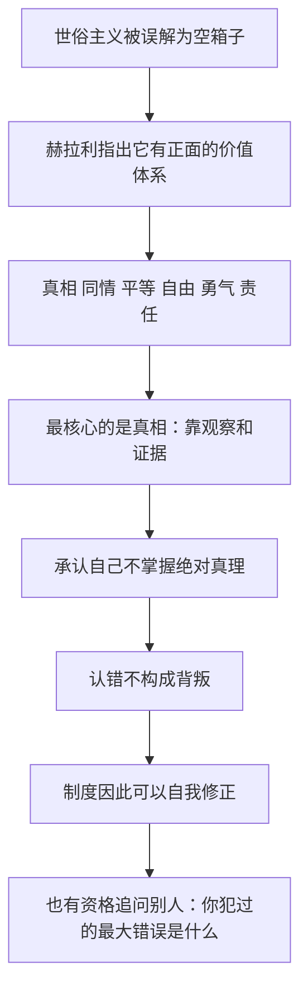

# 14｜世俗主义到底相信什么？

> 世俗主义常被说成「什么都不信」，它自己有一套价值观吗？

---

## 一、先说结论

赫拉利认为，世俗主义不是一只空箱子。它常常被宗教人士批评为「没有信仰」，也常常被世俗的人自己当成「什么都不用信」的通行证。赫拉利认为这两种理解都是误读：世俗主义有一套正面的价值体系——真相、同情、平等、自由、勇气和责任。

其中最核心的是两条。第一，它把真相放在信仰之上：判断一件事，靠的是观察和证据，而不是某本书说了什么、某个权威宣布了什么。第二，它要求人承认自己的不完美：世俗主义不认为自己掌握了绝对真理，它只认为有一群有缺陷的人，正在努力把问题看得更清楚一些。

正是这两条，让世俗主义有能力做一件宗教和意识形态常常做不到的事——公开承认「我们错了」。

---

## 二、我们先理解一个问题

先问一个问题：如果一个人不参加宗教仪式、不相信超自然力量，他是不是就「什么都不信」？

人们常常把「世俗」理解成「中立」，甚至「空洞」：好像世俗国家是一间没有装饰的房间，谁都可以进来，但房间里什么都没有。

可是，一个能运转的社会不可能什么都不信。法律要靠某种信念支撑，教育要有某种取向，公共讨论要有某种底线。

所以真正的问题不是「世俗主义信不信」，而是「它信什么、它凭什么」。赫拉利正是从这里开始谈的。

---

## 三、作者到底提出了什么观点？

赫拉利在第十四章「世俗主义」里先做了一个澄清：世俗主义不是对某一种宗教的否定，也不是「没有宗教的人凑在一起」，它是一套独立的、正面的价值体系。

他列出的六条是：真相、同情、平等、自由、勇气和责任。

- 真相：世俗主义最看重的东西。它要求用观察和证据来检验主张，而不是用信仰、经典或权威来终止讨论。
- 同情：不是只同情「自己人」，而是对所有受苦的生灵都抱有同情——不管他们属于哪个国家、哪个宗教、哪个族群。
- 平等：所有人都具有同样的价值，而这个价值不取决于出身、血统或信仰。
- 自由：人应该有权思考、怀疑、表达，并选择自己的道路。
- 勇气：知道真相之后还要敢说出来，敢于承担后果。
- 责任：自由不是为所欲为，而是你要为世界的样子、为你自己的判断负责。

赫拉利特别强调两点。第一，世俗主义最重视的是真相，而真相来自观察和证据。第二，世俗主义的核心特征，是承认自己的不完美。他说，如果你相信某个力量已经揭示了绝对真理，那么你就无法承认任何错误——因为一旦承认，整个体系就动摇了；但如果你相信一切只是有缺陷的人类在追寻真相，那么承认错误就不是背叛，而是本分。

他还留下一个尖锐的问题：请你说出，你的宗教或者意识形态，过去犯过的最大错误是什么？如果你的回答是「我们没有犯过错」，或者你根本答不上来，那么你就不该把世界交给它。他还说过，他更愿意相信那些承认自己无知的人，而不是那些声称自己全知全能的人。

---

## 四、把这个观点翻译成人话

用一句大白话概括：世俗主义不是「我不信神」，而是「我愿意被事实纠正」。可以把两种态度放在一起对比。

第一种态度是：我手里有一份完整的说明书，世界该怎么运转、人该怎么活，上面都写好了。我的任务是执行和解释。如果现实和说明书不符，那么错的是现实，或者是我理解得不够好。

第二种态度是：我没有说明书。我只能和一群跟我一样会犯错的人一起，一点一点观察、试验、修正。我现在的结论很可能是错的，但我会努力让它比昨天更接近真实。

赫拉利说的世俗主义，就是第二种态度。它看起来没有那么让人安心——没有绝对保证，也没有终极权威。但它有一个巨大的好处：它能改。一个能改的东西，才有可能越改越对。

---

## 五、为什么会这样？

把赫拉利的推理拆开，是一条很清晰的链条：

关键在于 E 到 G 这一段。

一个体系能不能认错，不取决于它的人品好坏，而取决于它的结构。如果真理已经被某个力量完整揭示，那么「认错」就等于承认那个力量出了问题——这几乎不可能。但如果真理被理解为「人类还在追寻的目标」，那么认错就只是追寻过程中的一步。

赫拉利的意思正是：世俗主义之所以值得被认真对待，不是因为它给出的答案更动听，而是因为它保留了改答案的能力。

---

## 六、举一个现实生活中的例子

看飞机失事调查。

一架客机坠毁，几百人丧生。接下来发生的事情，几乎和大多数人想象的不一样：调查人员的首要任务不是找到「谁该被骂」，而是找到「系统哪里出了问题」。

他们会去读黑匣子，还原驾驶舱里最后几分钟的对话；他们会检查同型号飞机的每一个部件；他们会去查航空公司的维修记录、飞行员的排班表、机场的跑道标识。如果调查发现是设计缺陷，就改设计；如果是流程漏洞，就改流程；如果是沟通用语容易误解，就改用语。整套航空安全体系，就是靠一次次事故之后的这种「认错」建立起来的。

想象一下，如果调查的原则是「我们的制度不可能出错」，那就只能找一个人来负责：飞行员操作失误、机务疏忽、天气意外。锅分完了，报告写完了，下一年同样的原因再来一次。

这里有一个可以记住的判断：一个制度愿意承认「我们错了」，它才有资格继续飞。个人也一样。

---

## 七、回到书中重新理解

现在回头看赫拉利在第十四章里的写法，会发现他很有分寸。

他并没有说世俗主义比宗教「更高级」。他说的是：世俗主义有自己的价值，而且这套价值经常被它的支持者自己都忘掉了。很多自称世俗的人，并没有认真对待真相、同情和责任——他们只是不参加宗教活动而已。这不是世俗主义的胜利，而是世俗主义的失败：一套价值如果只剩下「反对什么」，它就撑不起任何东西。

他还谈到世俗主义教育的取向：教孩子区分真相与信仰，教他们同情所有受苦的生灵，带他们欣赏全人类的智慧遗产，鼓励他们自由思考并且为自己的结论负责。请注意这四条的共同点——它们都不告诉孩子「你应该相信什么」，而是告诉他「你应该怎么去判断」。

这也解释了他为什么把「承认自己的不完美」看得那么重：他追问的那个问题不是在羞辱谁，而是在测试一个体系是否还有修正自己的能力。

---

## 八、这个观点背后还有什么？

第一，它接上了本书前面对「故事」的讨论。所有大规模的人类合作都依赖共同相信的故事，而故事天生倾向于自我辩护。世俗主义想做的，是给故事装一个刹车。

第二，它重新定义了「谦逊」。在前一章里，赫拉利讲过每个文明都觉得自己是世界的中心；在这里，他给出了谦逊的制度版本——不是姿态上的客气，而是结构上承认「我可能是错的」。

第三，它把道德的重心从「遵守」移到了「负责」。遵守需要权威，负责只需要判断力和勇气。这意味着世俗道德对人的要求其实更高，而不是更低。

---

## 九、这个观点有问题吗？

赫拉利这个判断最有说服力的地方，在于它抓住了一个真实的区别：能认错的体系和不认错的体系，长期表现确实不同。科学、航空安全、公共卫生这些领域的进步，很大程度上就来自这种「可以被推翻」的机制。用「你犯过的最大错误是什么」来检验一个体系，是一个很锋利的提问。

但争议同样存在。

一些学者认为，赫拉利把世俗主义描述成一套统一的价值体系，未免太过整齐。现实中的世俗主义有很多版本：有的强调科学与理性，有的强调个人权利，有的强调国家中立，彼此之间并不一致，甚至互相冲突。「真相、同情、平等、自由、勇气、责任」这六条，更像是他挑选出来的理想清单，而不是历史上世俗运动实际共享的信条。

也有学者指出，他可能低估了「承认不完美」的代价：一个总在公开承认错误的共同体，也可能因此失去行动力和凝聚力，而某些不承认错误的体系在短期内反而显得更有执行力。这个问题没有简单的答案。

另外，关于世俗价值与宗教传统的关系，学界存在不同解释。一些学者认为现代的人权与平等观念有深厚的宗教根源；另一些学者则认为它们是世俗思想独立发展的结果。

最后一点是叙事上的：把宗教和意识形态都归入「声称掌握绝对真理」的一类，是一种简化。

---

## 十、今天再看这个观点

以下是基于赫拉利思想的现代延伸，不是作者原话。

赫拉利写这一章时，还没有生成式 AI 带来的信息污染。今天再看，「承认自己的不完美」这件事变得更难，也更值钱了。

一方面，算法让人更容易只看到支持自己的证据。当一个体系被推荐系统包裹起来，它的错误会被自动过滤掉，「认错」所需要的现实反馈就越来越难抵达。另一方面，当图片、声音、视频都可以被合成，「证据」本身也变得可疑，靠观察去判断一件事的成本大幅上升。

这也让世俗主义那六条里最不起眼的一条变得关键：责任。技术不会负责，算法不会负责，只有人和制度可以。谁发布、谁审核、谁承担后果，正在变成新的公共议题。

---

## 十一、这一篇真正应该记住什么？

1. 世俗主义不是一只空箱子，而是一套正面的价值体系：真相、同情、平等、自由、勇气和责任，其中真相被放在最高的位置，判断事情靠观察与证据。
2. 它最特别的地方是承认不完美：只有承认自己会犯错，一个体系才保留了修正自己的能力，也才有资格去要求别人认错。这看起来像示弱，实际上是最难做到的一件事。
3. 赫拉利留下的那个提问值得每个人自己回答一次：你所相信的宗教或意识形态，过去犯过的最大错误是什么？答不上来，就不该把世界交给它。
4. 一个制度是否可靠，可以看它犯错之后做什么：是找一个替罪羊把责任推出去，还是承认系统有问题并把它改掉。前者重复错误，后者积累能力。
5. 承认不完美不是姿态，而是一种能力：它意味着你愿意让现实来纠正自己。在一个信息越来越容易被操纵的时代，这种能力比任何答案都更稀缺。

---

## 十二、留一个问题

> 如果「能认错」是判断一个体系是否可靠的标准，那么请你自己回答一次：你个人最坚信的那套观念，过去犯过的最大错误是什么？

有意思的是，认错的前提是它先意识到自己错了。而这件事比我们想象的难得多——大多数时候，我们并不是不愿意承认无知，而是根本不知道自己无知。这种自信从何而来，它又会在什么地方被戳破？
