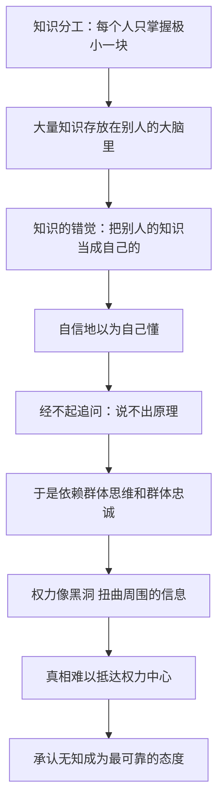

# 15｜你知道的为什么比你以为的少？

> 现代人受教育程度空前，为什么对世界的理解反而越来越少？

---

## 一、先说结论

赫拉利认为：现代人知道的确实比祖先多，但那是「集体知道得多」，不是「你知道得多」。我们每个人的知识，绝大部分都存放在别人的大脑里、机构的数据库里，我们真正掌握的本事只有一件——知道该去问谁。

他引用关于「知识的错觉」的研究：大多数人自信满满地以为自己懂拉链，可一旦被要求详细解释拉链的原理，几乎全都卡壳。问题不在于我们无知——知识分工本来就意味着无知——而在于人类很少能认清自己的无知。

再加上权力：赫拉利说，巨大的权力像黑洞，越接近它，周围的空间扭曲得越厉害，真相很难抵达权力中心。所以在这样一个世界里，「承认自己的无知」反而成了最可靠的态度。

---

## 二、我们先理解一个问题

先问一个问题：一个现代城市居民和一个狩猎采集者，谁更「有知识」？

答案有点反直觉。一个受过十六年教育的现代人，可能不会生火、不会做衣服、不会打兔子、不知道眼前这株植物能不能吃。而一个狩猎采集者，这些都会，他的知识是完整的、可以直接用的。

现代人的优势在别处：他知道怎么找到会做这些事的人，知道用什么东西去交换，知道背后有一整套系统在替他运转。

于是问题就来了：如果每个人的知识都是残缺的，我们凭什么这么自信？赫拉利要解释的正是这种自信从哪里来。

---

## 三、作者到底提出了什么观点？

赫拉利在第十五章「无知」里提出了几个判断。

第一，现代人的知识是分工的产物。狩猎采集者必须知道如何做衣服、如何生火、如何打兔子，因为没有人可以替他做。而现代人几乎一切都依赖他人的专业知识，没有一样是自己弄明白的。这不是缺陷，而是现代社会得以高效运转的条件。

第二，人类很少能认清自己的无知。赫拉利引用了关于「知识的错觉」的研究：当我们把别人大脑里的知识当成自己的知识时，我们会感觉自己懂得很多，实际上却经不起追问。他举的典型例子就是拉链——多数人自以为理解拉链的工作原理，但一旦被要求一步步描述，就会发现说不清楚。

第三，我们的观点多半来自群体思维和群体忠诚。赫拉利指出，人的政治观点、道德判断，往往不是在独立研究之后形成的，而是在所属群体里被塑造的。我们相信某个结论，常常只是因为「我们这边的人」都这么相信。

第四，权力会扭曲信息。他用了一个物理学的比喻：巨大的权力像一个黑洞，越靠近它，周围的时空扭曲得越厉害，任何东西都无法逃脱。所以真相很难抵达权力中心——身边的人有动机告诉掌权者他想听的话。他也说过，如果你没有可以浪费的时间，就永远找不到真相。

由此，他的结论是：在一个个人知识必然残缺、观点容易被群体和权力塑造的世界里，「承认自己的无知」是最可靠的态度。

---

## 四、把这个观点翻译成人话

大白话就是：你以为你懂，其实你只是认识懂的人。

可以这样理解：现代社会的知识像一套供水系统。你家水龙头一拧就出水，但你既不知道水从哪个水库来，也不知道净化流程有几步，更不知道管道埋在哪里。你只需要知道水龙头在哪、账单交给谁。

这不是坏事。问题出在两件事上。第一，你会误以为水龙头是你自己挖的：当有人问「水为什么是干净的」，你会随口答出一个听起来合理的解释，而且你真心相信它。第二，当所有人都用同一套「听起来合理的解释」，它就变成了常识；常识未必是错的，但它往往没有人检验过。

赫拉利想说的是：无知不可怕，不知道自己无知才可怕。

---

## 五、为什么会这样？

关键在于 C 到 F 这一段。

无知本身是中性的：一个人不可能什么都懂。真正产生后果的，是「无知的错觉」——因为感觉自己懂了，我们就停止了追问；因为停止了追问，判断就只能靠身边人的共识；而一旦判断靠的是共识，它就不再对现实负责，只对群体负责。

赫拉利认为，权力让这个循环更严重。越靠近权力中心，说真话的成本越高、收益越低，于是掌权者听到的世界，是一个被身边人的期待和恐惧扭曲过的世界。他那个黑洞的比喻，说的就是这种扭曲的不可逃避性。

---

## 六、举一个现实生活中的例子

看一个很多人做过的实验，主题是拉链。

研究者先请参与者给自己打分：你有多了解拉链？它是怎么工作的？为什么拉一下就能合上、再拉一下又能分开？大多数人都给出了相当高的分数——毕竟每天都要用到，怎么可能不懂。

接着，研究者请他们尽可能详细地写下拉链的工作原理：两排齿是怎么咬合的、滑块在里面做了什么、为什么反过来拉就能分开。结果几乎所有人都在这一步卡住了。有人画了图，图画错了；有人写了半天，发现自己只是在重复「它就是能合上」。

更耐人寻味的是后续：当这些人意识到自己讲不清之后，他们对自己了解拉链程度的评分并没有明显下降。也就是说，被当场戳穿之后，人依然倾向于相信自己其实是懂的。

这就是「知识的错觉」的形状：不是撒谎，而是我们的大脑分不清「我知道这个东西」和「我掌握它的原理」。而这种错觉不只出现在拉链上，它出现在经济政策、医疗方案、技术风险上，只是那些领域没有人在旁边当场请你写原理。

---

## 七、回到书中重新理解

回到第十五章，可以看到赫拉利并不是在嘲笑无知。

他强调的是狩猎采集者与现代人的对比：前者必须知道如何做衣服、生火、打兔子，因为他的生存直接依赖这些知识；后者几乎一切都依赖他人的专业知识，而这恰恰是现代经济效率的来源。分工让每个人都变得无知，同时让整体变得强大。这不是要退回自给自足，而是要认清这套系统的性质。

他还特别提醒，找真相是需要成本的。他的说法是：如果你没有可以浪费的时间，就永远找不到真相。想弄清一件事，你得花时间去读、去比、去等，去接受自己一开始的判断可能是错的。

所以他的结论并不是「多读书就好了」，而是：先承认自己不知道，才可能开始真正知道。

---

## 八、这个观点背后还有什么？

第一，它接上了前面关于「故事」和「群体」的讨论。如果人的判断主要来自群体，那么说服一个人改变立场，等于要求他离开自己的群体——这就解释了为什么摆事实常常无效。

第二，它给「专家」问题提出了新的角度。既然每个人的知识都是残缺的，社会就必须依赖专家；但专家同样受群体和利益影响，而且他们之间的分歧普通人很难判断。信任谁、信任到什么程度，成了现代人的必修课。

第三，它对权力提出了一个结构性判断：真相难以抵达权力中心，不是掌权者的人品问题，而是位置问题。这会直接影响我们如何设计决策机制和纠错机制。

第四，它为后面几章做了铺垫：如果连自己的无知都难以察觉，那么谈正义、谈真相、谈道德责任都会变得极其困难。

---

## 九、这个观点有问题吗？

最有说服力的地方，是「知识的错觉」这类研究确实有大量实验支持：人在被要求解释机制时，会明显高估自己的理解程度；而且被纠正之后，自信往往很快恢复。这一点很难反驳，也很容易被日常经验验证。

争议主要有几处。

一些学者认为，赫拉利把「个人无知」推得过于悲观。人类从来不是靠个人知识生存的，而是靠社会性的知识网络；在这个意义上，「把别人的知识当成自己的」不是错觉，而是社会合作的正常机制。真正需要的不是减少这种依赖，而是学会在什么时候去核查它。

另一些学者指出，群体思维确实存在，但把它说成人类观点的主要来源，会低估个人反思和制度设计的作用。教育、新闻专业主义、同行评议，都是专门用来对抗群体偏见的机制，成效虽有争议，但不该被一笔抹掉。

关于「权力黑洞」的比喻，学界存在不同解释。有研究确实发现，地位越高的人越容易听到被过滤后的信息；但也有研究显示，透明度和问责制度可以显著改善这种扭曲。

还有一点是逻辑上的：赫拉利本人也是一位知识生产者，他在向读者断言「你们其实不懂」。这个说法如果成立，那么读者凭什么相信他的判断呢？这是所有关于无知的论述都要面对的自我指涉难题。

---

## 十、今天再看这个观点

以下是基于赫拉利思想的现代延伸，不是作者原话。

赫拉利写这一章时，搜索引擎还是人们获取信息的主要入口。今天再看，无知的形式又变了一层。

过去我们不知道，会承认自己不知道，然后去查；现在，一个即时生成的答案会立刻递到眼前，格式工整、语气自信，让人很难分辨自己是在了解，还是在被安抚。当获取一个「听起来合理的解释」的成本降到接近零，「知识的错觉」就变得更容易发生：我们连「该去问谁」这一步都省掉了。

与此同时，验证一件事需要的时间成本反而更突出了。于是「承认自己不知道」不再只是一种美德，它更像一种需要主动维护的能力。

---

## 十一、这一篇真正应该记住什么？

1. 现代人的知识是分工的产物：整体懂得比祖先多得多，个人却几乎什么都不懂。这不是退步，而是现代社会能够高效运转的前提。
2. 「知识的错觉」让我们把别人大脑里的知识当成自己的，于是自信被放大。越是被追问就卡壳的判断，越不该被当成可靠的认识。
3. 我们的观点常常来自群体思维和群体忠诚，而不是独立的个人理性。这也是为什么摆事实往往说服不了人：改变立场等于离开群体。
4. 权力像黑洞，越靠近中心，信息扭曲得越厉害。身边的人有动机说掌权者想听的话，所以真相很难抵达权力中心，这是位置问题而非人品问题。
5. 在一个个人必然无知的世界里，承认自己不知道不是退让，而是最可靠的态度。先承认不知道，才有可能开始真正知道，这也是赫拉利反复强调的姿态。

---

## 十二、留一个问题

> 如果让你现在写下自己最常谈论的三个话题的原理，你能写到第几行才卡住？

而当我们意识到自己的知识其实如此残缺时，一个更难的问题就出现了：我们看到的世界上的那些不公，究竟有多少是真实的结构，又有多少是被自己的位置和习惯筛选过的画面？为什么明明有那么多不公，纠正它却如此困难？
