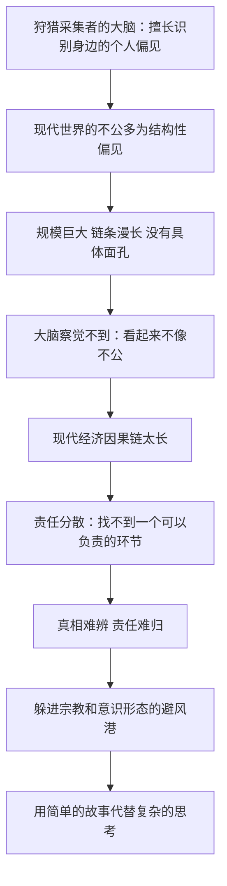

# 16｜正义为什么如此难以实现？

> 世界上那么多不公，为什么纠正它如此困难？

---

## 一、先说结论

赫拉利认为，当代世界大多数的不公正，并不是来自某个坏人的恶意，而是来自大规模的结构性偏见——由制度、市场、习惯和无数普通人的日常选择共同造成的偏见。

麻烦在于，我们的大脑还是狩猎采集者的大脑。它擅长察觉身边某个人的不公平行为，却几乎没有进化出察觉「结构性偏见」的能力：一个分散在几千公里、几百家公司、几十年时间里的不公，看起来不像不公，倒像「事情本来就是这样」。

更棘手的是现代经济的因果链太长。你穿的衣服、用的手机背后，可能牵连着剥削和污染，却没有一个环节能让你清晰地负责。当真相难辨、责任难归，人们就会躲进宗教和意识形态提供的避风港，用简单的故事代替复杂的思考。

---

## 二、我们先理解一个问题

先问一个问题：什么叫「不公」？

最常见的版本是这样的：有人故意欺负了另一个人，或者某个人贪污了本该属于大家的东西。这种不公有受害者、有加害者、有清晰的因果，我们可以指着某个人说「就是他」。

但如果一种不公根本没有加害者呢？如果它是由一整套规则、几百万个看起来都合理的选择、几十年累积下来的结果呢？

假设有一群人生活在一个区域，孩子上学要走很远的路，因为公交线路恰好绕开了这里。没有人下令绕开，是当年的规划者按「客流效率」算出来的，而客流数据又反映了历史上形成的贫困。所有人都按规则办事，结果是孩子们每天多走一小时。

这就是赫拉利要谈的那类问题：不是坏人做坏事，而是一群好人在一个坏结构里各做各的事。

---

## 三、作者到底提出了什么观点？

赫拉利在第十六章「正义」里提出了几个判断。

第一，他区分了个人偏见和结构性偏见。个人偏见是某个具体的人对某群人的成见；结构性偏见则分散在整个制度里，由无数人在不自知的情况下共同维持。

第二，他指出人类的大脑还没有进化出察觉结构性偏见的能力。我们的大脑是狩猎采集者的大脑，它进化出来是为了处理小规模社群里的关系——谁对我好、谁偷了我的东西、谁在背后说我坏话。而现代的不公往往规模巨大、链条漫长、没有具体面孔，这种形状的东西，我们的大脑不敏感。

第三，现代经济的因果链太长，导致道德责任难以归属。他提到，我们穿的衣服、用的手机背后可能牵连着剥削和污染，但链条从原料到成品跨越许多国家和环节，没有一个环节能让你清晰地说「我要为这里负责」。

第四，当真相难辨、责任难归时，人们会去寻找避风港。赫拉利认为，宗教和意识形态常常提供这样的避风港：它们给出一个简单而完整的解释，让你不必面对那些复杂的、没有答案的问题。他也提醒，不作为本身也是一种选择。

---

## 四、把这个观点翻译成人话

大白话就是：真正难对付的恶，不是坏人干的那种，而是「所有人都没做错、结果却是错的」那种。

可以这样理解。你站在一条河边，看到水里漂着垃圾。如果是一个人在上游倒垃圾，你可以去制止他、举报他。但现在的情况是：上游有几百家工厂，每家都符合排放标准；下游有几百万个家庭，每家都用了含磷的洗衣液。你站在河边，垃圾在漂，但你不知道该找谁。

这就是结构性偏见的形状。它的特征是：责任被分摊到没人能承担的程度，每一个环节都「合理」，合起来却荒谬。

赫拉利说，人类的大脑对这种情况几乎无能为力。因为它不给你一个可以恨的对象，也不给你一个可以解决的问题，它只给你一种模糊的不适感——而你很快会用别的故事把这种不适感盖住。

---

## 五、为什么会这样？

关键在于 A 到 D 这一段。

赫拉利的推理起点不是道德，而是认知。他不是说人不愿意主持正义，而是说人常常根本看不见不公——因为不公的形状变了，而感知它的器官没有跟着变。狩猎采集者需要在一分钟内判断出「这个人有没有骗我」；现代人需要在三十年、跨越五个国家的链条里判断「这个价格里有没有剥削」。

链条的后半段则是心理上的：当一个问题既看不清又解决不了时，人的自然反应是降低认知负荷。避风港的价值就在这里——它给出的解释虽然简单，但让人重新感到世界是可以理解的。

---

## 六、举一个现实生活中的例子

看一件 T 恤。

它可能由美国得州或者西非某地的棉花纺成纱，纱在印度或越南被织成布，布在中国或孟加拉被染色，染色用的化学药剂来自某个欧洲化工企业的配方，然后被裁剪、缝制、包装，最后装上一艘货轮，漂过几千公里，进入一个你熟悉的商场或者电商仓库，标价七十九元。

你想做一个「干净的消费者」。于是你去看吊牌：产地写着孟加拉。你上网查那家代工厂，再往上查到它给十几个国际品牌供货。你想问：缝这件衣服的人，每天工作多少小时、拿多少工资、车间通风怎么样、印染废水去了哪里？你会发现，你查到的每一条信息，都需要你信任另一个你从未见过的人或者机构。而吊牌不会告诉你这些，它只写着「100% 棉」。

这就是赫拉利说的那种困境：你确实想让世界变得公正，但你找不到一个可以负责的环节。你不买这一件，会有另一个人买；你换一个品牌，供应链可能只是换了个名字。

更让人不安的是，链条上的每一方都可以说自己是清白的：品牌说我付了市场价，代工厂说我遵守了当地法律，工人说这是我目前能找到的最好的工作。没有人撒谎，问题却依然存在。

---

## 七、回到书中重新理解

回到第十六章，会看到赫拉利的写法其实很克制。

他并没有要求每个人都去做道德圣人，也没有给出「买这个、别买那个」的清单。他强调的是两个更基本的东西。

第一是「看清」：很多不公之所以持续，不是因为有人支持它，而是因为没有人真的看见它。所以他的第一要求不是行动，而是承认事情比表面复杂。

第二是「不做避风港的居民」：他注意到，当问题太复杂时，宗教和意识形态常常成为躲避的地方——它们提供简洁的解释和明确的责任人，代价是丢掉真相。他并不认为信仰本身有问题，他警惕的是把复杂的现实硬塞进一个简单故事的那种冲动。

他也提醒，不作为也是一种选择。你不知道该怎么做，于是什么都不做——但世界的样子，依然是由无数个「什么都没做」累积出来的。

---

## 八、这个观点背后还有什么？

第一，它和「无知」那一章是一体的：你之所以察觉不到结构性偏见，一部分原因是你根本不知道自己参与的系统是怎么运转的。

第二，它给「道德困境」提供了一个新的定义。传统的道德困境是「两个选择都有代价」；现代的道德困境是「你连选项都看不清」。

第三，它解释了为什么愤怒常常找错对象。人们需要一个具体的人来承担愤怒，于是链条上最显眼的那个环节——往往是终端卖家、移民工人或者某个官员——成了替罪羊，而结构本身没有被动到。

---

## 九、这个观点有问题吗？

赫拉利这个判断最有说服力的地方，在于它准确描述了很多人的真实体验：我们不是不想做好人，而是不知道该怎么做；而「不知道该怎么做」带来的道德焦虑，往往会转化为回避。把这种体验归因于「大脑结构」和「因果链太长」，确实解释了很多现象。

争议也很明显。

一些学者认为，赫拉利对「结构性偏见」的强调，可能低估了个人偏见的现实作用。种族歧视、性别歧视、排外情绪，很多时候确实有具体的人和具体的决策在起作用，把它们一律归入「结构」，有可能反而让真正的加害者躲起来。

也有学者指出，「大脑还是狩猎采集者的大脑」这个说法过于简化。人类确实有认知局限，但人类也发展出了专门应对大规模问题的工具——统计、审计、新闻调查、国际法。用进化心理学去解释现代困境，容易把制度和文化的变量抹掉。

此外，关于「避风港」的论述，学界存在不同解释：有研究者认为，宗教和意识形态在复杂的道德问题上也提供了动员能力和长期承诺，并不只是逃避。

最后是一个现实问题：如果责任真的分散到无人可担的程度，「每个人都是链条的一部分」这句话就可能变成一句没有约束力的话：它既不能追责，也无法指导行动。

---

## 十、今天再看这个观点

以下是基于赫拉利思想的现代延伸，不是作者原话。

赫拉利写这一章时，讨论的主要还是实体商品的供应链。今天再看，最难看清的不公已经部分转移到了看不见的地方。

算法歧视就是一个例子：一个信贷或者招聘模型，训练数据里带着历史偏见，模型只是忠实地学到了它。没有人下过「歧视某类人」的指令，甚至设计者根本不知道哪些特征在起作用。这是结构性偏见的一个新版本：它不藏在工厂里，而藏在参数的分布里。

另一方面，技术也提供了一些新的「看清」工具：公开数据库、卫星影像、供应链追踪、数据新闻。它们远远不够，但至少说明——「因果链太长」不是物理定律，而是可以被拉短的。

---

## 十一、这一篇真正应该记住什么？

1. 当代世界大多数的不公来自结构性偏见，由制度、市场和无数普通人的日常选择共同维持，而不是来自某个坏人的恶意。认清这一点，是谈论正义的起点。
2. 我们的大脑还是狩猎采集者的大脑，它擅长察觉身边某个人的不公平行为，却几乎无法感知分散在几千里和几十年里的偏见。
3. 现代经济的因果链太长，责任被分摊到没人能承担的程度：每一个环节都符合规则，合起来的结果却可能是不公，而你找不到可以追问的那一个点。
4. 当真相难辨、责任难归，人们会躲进宗教和意识形态提供的避风港，用简单的故事代替复杂的思考——这是可以理解的，但代价是丢掉真相。
5. 不作为也是一种选择。你无法解决整条供应链，也无法替所有人负责，但你至少可以承认自己在这条链条上，并拒绝用「我没办法」来结束思考。

---

## 十二、留一个问题

> 如果一件不公找不到一个可以为它负责的人，这究竟意味着没有人该负责，还是意味着责任已经被分散到你我身上？

看清结构已经很难，但还有一件更难的事：即使真相摆在眼前，它也未必能赢。因为人类从来更爱听故事，而故事不需要是真的。当一个谎言比事实更能团结人心的时候，真相还剩多少分量？
