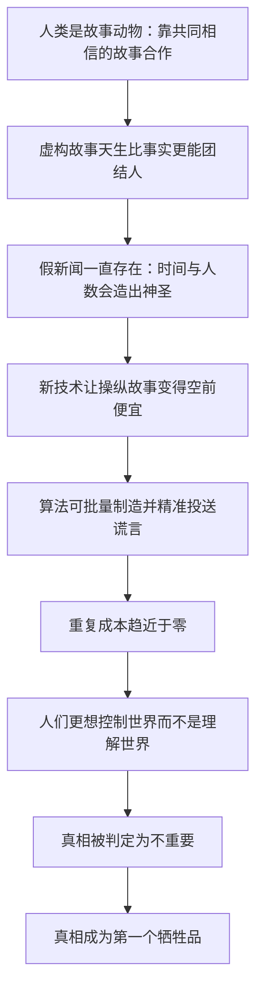

# 17｜「后真相」时代，真相还重要吗？

> 假新闻为什么比真相传播得更快？真相会输吗？

---

## 一、先说结论

赫拉利提醒我们：人类从来都是「故事动物」，虚构的故事天生就比事实更能团结人心——一千个人相信一个月的是假新闻，十亿人相信一千年就成了宗教。真相不是靠「更真实」取胜的，而是靠有没有人愿意为它付出代价。

真正的新问题不是假新闻的存在，而是技术让操纵故事变得空前便宜。过去散布一个谎言需要印刷机和电台；今天，算法可以批量制造和精准投送谎言，戈培尔那句「谎话说一千遍就成了事实」，如今可以工业化生产。

最危险的不是假新闻本身，而是「真相已经不重要」这个观念。当人们更想控制世界而不是理解世界，真相就成了第一个牺牲品。

---

## 二、我们先理解一个问题

先问一个问题：为什么假新闻听起来总比真相顺耳？

我们习惯的解释是「因为人们变蠢了」。这个解释有道理，但不够。真正的原因藏在更深处：人类是靠共同相信的故事组织起来的动物，而一个故事能不能让人团结，跟它是否真实，本来就没有必然关系。

所以问题不是「人类从什么时候开始不尊重真相」，而是「人类为什么需要真相」。赫拉利要做的，是先把真相的位置摆正：它不是人类社会的默认设置，而是一种需要被刻意维护的稀缺品。

---

## 三、作者到底提出了什么观点？

赫拉利在第十七章「后真相时代」里提出了几个判断。

第一，虚构的故事比事实更能团结人。他指出，智人之所以能进行大规模合作，靠的就是共同相信虚构的故事：国家、货币、法律、公司，都是想象的产物。这种能力是优势，也是漏洞：人类对「好用的故事」有天然偏好，对「真实但不那么好用的事实」兴趣有限。

第二，假新闻不是新东西。他有一句被广泛引用的判断：一千个人相信一个月的是假新闻，十亿人相信一千年就成了宗教。真假之间的界线，往往由时间和人数决定。

第三，真正的新问题是技术。赫拉利提到戈培尔那句「谎话说一千遍就成了事实」，并指出：戈培尔要靠广播和报纸一遍遍重复，而今天，算法可以几乎零成本地生产、定向投放和反复强化谎言。

第四，也是最危险的，是「真相已经不重要」这个观念本身。赫拉利说，人类其实一直喜欢权力过于真相。当人们更想控制世界而不是理解世界时，真相就失去了它的地位——不是被打败，而是被判定为无关。他也提醒，可靠的信息往往代价高昂；如果你总是免费得到信息，有可能你才是整个商业世界的产品。

---

## 四、把这个观点翻译成人话

大白话就是：真相从来不是靠「它是真的」赢的，而是靠有人愿意为它付账。

想象两条并排的路。第一条路上，每个路标都是真的：这里到镇上三十公里，前方有桥，桥限重十吨。走在上面，你走得慢，但你会到达。第二条路上，每个路标都写着你想听的话：前方就有加油站，再走五分钟就是温泉。走这条路的人越来越多，因为同行的人都在说「那边有温泉」。

问题是，路标不会自动变真。真相需要有人去测量、去核实、去维护，而这些都是成本。当没有人愿意承担这个成本，路标就会逐渐只剩下让人愉快的那一批。

赫拉利说「人类喜欢权力过于真相」，说的就是这种选择：控制路标比测量路标有用得多。

---

## 五、为什么会这样？

关键在于 D 到 F 这一段。

赫拉利要我们注意的不是「人会说谎」，而是说谎的性价比变了。过去，一个谎言要传播到几百万人，需要报纸、电台、组织，需要时间，也需要承担被核查的风险。现在，制造一条内容几乎不花钱，定向投放几乎不需要组织，重复强化由算法自动完成。当散布的成本趋近于零，而核实的成本依然很高时，天平必然倾斜。

链条的最后一段才是真正的危险：不是谎言赢了，而是「真相重不重要」这个问题不再有人问。

---

## 六、举一个现实生活中的例子

看一个几乎每个家庭都有的场景：家族群。

某个早上，群里出现一条消息：某种常见的蔬菜和某类药物一起吃，会「在体内生成毒素」，配图是模糊的实验照片，落款是「某三甲医院老专家提醒」。转发它的是你的姨妈，她加了一句：「大家都注意一下，尤其是家里有老人的。」

这条消息有三个特点：它带着关怀的温度，贴着权威的标签，还给了一个简单可行的行动方案——别一起吃就行。于是它在几分钟内被转发到了另外五个群。

接着，有人发了一篇辟谣的长文。文章写得很严谨：指出那条消息没有可查的文献来源，解释了相关成分在体内的代谢路径，还附上了几条参考文献。结果是：没人转发。有人在群里说「宁可信其有」，也有人说「反正注意点没坏处」。

注意这里发生了什么。辟谣文章赢的是事实，谣言赢的是情绪与身份。转发谣言的人，转发的不只是一条消息，而是「我是一个关心家人的人」这个身份；而辟谣的人，往往只提供了一条信息。在家族群里，身份永远比信息重要。

真相没有输在逻辑上，它输在了成本和动力上：造谣零成本、高回报，辟谣高成本、低回报。

---

## 七、回到书中重新理解

回到第十七章，会看到赫拉利的重点其实不在「怎么识别假新闻」。

他谈的是更根本的东西：人类与真相的关系。他并不天真地认为，只要提高媒介素养、加强平台审核，问题就能解决。他的判断更冷峻——人类一直更喜欢权力，真相一直是少数人才愿意为之付出代价的东西。宗教和意识形态之所以强大，不是因为它们是真的，而是因为它们能让人团结、行动、牺牲。

他也给了读者一个实际的提醒：可靠的信息往往需要付出昂贵的代价。这句话有两个方向的意思。一是，真正可靠的信息通常不是免费的——它需要调查、需要专业、需要时间。二是，免费信息背后往往有别的生意：你的注意力、你的数据、你的行为，都可能在被出售。所以他提醒，如果你总是免费得到信息，有可能你才是整个商业世界的产品。

它的推论仍然尖锐：在一个信息免费、注意力收费的环境里，真相不会自动胜出，它需要有人专门为它买单。

---

## 八、这个观点背后还有什么？

第一，它接上了全书的核心命题：大规模合作依赖共同相信的虚构故事。如果故事是社会的黏合剂，那么争夺故事就是争夺权力本身——「后真相」不是信息问题，而是政治问题。

第二，它解释了为什么事实核查的效果常常有限。如果一个人相信某条消息，是为了确认自己的身份和归属，那么用事实反驳他，等于要求他放弃身份。这不是说服能解决的问题。

第三，它把「真相」变成了一件有成本的事。这一点和「无知」那一章相连：既然查明真相需要时间和资源，那么在一个不给时间的环境里，无知就是被设计出来的结果，而不只是个人的疏忽。

第四，它为科幻那一章留了接口：如果故事能塑造现实，那么谁掌握讲述未来的权力，谁就在塑造未来。

---

## 九、这个观点有问题吗？

赫拉利这个判断最有说服力的地方，在于他拒绝把「后真相」当成一次偶然的道德滑坡。他把它放回人类的本性里：我们一直是故事动物，一直偏好能团结人的叙事。这种长时段的视角，比「都是社交媒体的错」更有解释力，也更难被反驳。

争议主要集中在这几处。

一些学者认为，赫拉利对「人类一直喜欢权力过于真相」的概括过于悲观。历史上从来不缺为真相付出代价的人：调查记者、科学家、法官、举报者。把人类整体描述成不在乎真相，会低估这些制度性努力的实际作用。

也有研究者指出，「后真相」这个概念本身需要谨慎使用。关于假新闻对选举结果的实际影响，学界存在不同解释：有人认为影响巨大，有人认为被高估了，还有研究显示，真正接触假新闻的人群比例其实很小。把当代政治的全部问题归因于信息环境，可能忽略了经济、身份和制度等更基础的因素。

另外，关于「免费信息意味着你是产品」这类判断，也有人认为它太绝对。公共广播、开源社区、政府公开数据都是免费而相对可靠的例子，代价由税收或者志愿者承担。

最后一点是操作层面的：赫拉利的分析指出了一个结构性问题，但他给出的应对方式相当有限。如果真相需要有人买单，那么由谁买单、按什么规则买单，他并没有展开。

---

## 十、今天再看这个观点

以下是基于赫拉利思想的现代延伸，不是作者原话。

赫拉利写这一章时，生成式 AI 还没有进入公众视野。今天再看，他担心的「操纵故事的成本趋近于零」，已经变成了字面意义上的现实。

过去，制造一条假消息需要有人写、有人配图、有人找渠道；现在，文字、照片、语音、视频，都可以在几秒钟内生成，而且可以按人群定制：同一个事件，不同的人看到不同版本，每个版本都恰好符合他原本的期待。这已经不只是「假新闻」，而是「各自拥有一个真相」。

可靠信息的代价会继续上升。当「看起来真实」变得廉价，「核实过真实」就会变成一种奢侈品。而一个社会能不能为这种奢侈品找到可持续的买单方式，可能决定它还能不能就任何事情达成共识。

---

## 十一、这一篇真正应该记住什么？

1. 人类是靠共同相信的故事组织起来的动物，虚构的故事天生比事实更能团结人心。这不是道德滑坡，而是我们这一物种的老毛病。
2. 假新闻从来不是新东西：一千个人相信一个月的是假新闻，十亿人相信一千年就成了宗教。真假的分界常常由时间和人数决定。
3. 真正的新问题是技术：算法让谎言的制造、投送和重复成本趋近于零，而核实真相的成本依然很高，天平因此必然倾斜。这不是人的问题，而是性价比的问题。
4. 最危险的信号不是假新闻变多，而是「真相重不重要」这个问题不再有人问。当人们更想控制世界而不是理解世界，真相就成了第一个牺牲品。
5. 真相不会自动胜出，它需要有人为核实付出时间、金钱和代价。在一个信息免费而注意力收费的环境里，谁来为真相买单，是一个政治问题。

---

## 十二、留一个问题

> 如果一条消息让你感到温暖、愤怒或者被理解，你会不会因此更少去核查它？

真相的争夺战之所以重要，是因为关于未来的想象本身就是一种争夺。那些讲述未来的人，往往在不知不觉中决定了未来会变成什么样子；当科技公司照着剧本做产品、公众照着图景理解 AI 时，故事就不再只是故事了。
