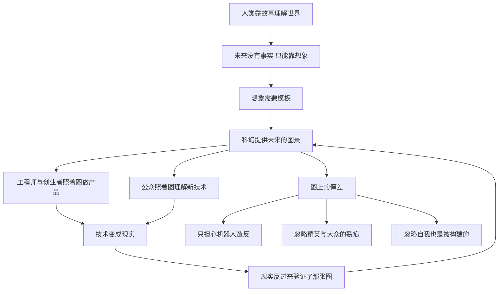

# 18｜科幻小说为什么能塑造未来？

> 为什么说科幻小说是 21 世纪最重要的文学形式？

---

## 一、先说结论

赫拉利认为，21 世纪初最重要的艺术流派，或许就是科幻小说。

理由不在于它写得多好，而在于它承担了一个别的东西都不承担的功能：为还没有发生的世界提供图景。真正塑造人们对科技之想象的，往往不是科学论文，而是《黑客帝国》《她》《黑镜》这类作品——科技公司照着科幻的剧本做产品，公众照着科幻的图景理解人工智能。

但赫拉利同时提醒，科幻也是最容易误导人的文学。它总在担心机器人造反，而真正该担心的是少数「超人类」精英与大多数无力者之间的裂痕；它总假设有一个可以逃向的「真实自我」，却回避了最可怕的问题：如果那个自我本身也是被构建的呢？

在他看来，《美丽新世界》比《1984》更贴近我们的未来：用爱与快乐控制人，比用恐惧和暴力更可靠。

---

## 二、我们先理解一个问题

先问一个问题：你对「未来」的印象是从哪里来的？

大多数人会说是新闻、报告、专家访谈。但你再往深处想一层：那些新闻里的画面——机器人、飞船、脑机接口——其实早就在电影和小说里见过一遍了。你能看懂一条科技新闻，是因为手里已经有一张别人画好的图。

这就带出一个不太被注意的事实：未来是没有事实可讲的。过去可以靠档案研究，现在可以靠调查报道，唯独未来只能靠想象。而想象需要模板。

所以真正的问题不是科幻小说好不好看，而是：当全人类都要靠想象来为未来做准备时，这些想象是由谁来写的？

---

## 三、作者到底提出了什么观点？

赫拉利在《今日简史》讨论科幻小说的那一章里，给出了一个很大胆的判断：科幻小说大概是 21 世纪最重要的文学形式。

他的推理是：人类思考用的是故事，不是数据。而对未来，没有人能拿出数据，所以只能拿故事。科幻是唯一一种认真对待「技术会怎样改变人的生活」的故事形式，因此它在事实上承担了为未来起草剧本的工作。

他还观察到，这种剧本的作用是双向的：科技从业者本人是读着科幻长大的，他们做的产品常常在无意中实现自己少年时代读过的图景；而公众对人工智能的想象，也几乎完全来自科幻。

然后他指出了科幻的两种典型误导。

第一，它把「智能」和「意识」混为一谈。科幻里的机器人总是先有了意识，再起来反抗；于是观众学到的教训是「要小心机器有自我意识」。但赫拉利认为，真正的危险根本不需要意识：算法可以在没有喜怒哀乐、没有欲望、也没有恶意的情况下，做出影响千万人的决定。一个不需要「想要」就能行动的系统，反而更难被察觉，也更难被追责。

第二，它总假设存在一个可以逃向的「真实自我」。《黑客帝国》和《楚门的世界》都建立在这个假设上：只要打破那个虚假的系统，外面就有真实。赫拉利追问的是：如果「真实的自我」本身也是被构建出来的呢？

最后，他做了一个对照：比起《1984》里用恐惧和暴力统治的世界，《美丽新世界》里用爱与快乐控制人的世界，离我们更近。因为暴力会激起反抗，而快乐不会——一个被快乐驯服的人，不会想要逃跑，还会感谢驯服他的人。

---

## 四、把这个观点翻译成人话

可以把科幻理解成建筑行业的「效果图」。

一栋楼还没盖，投资人、设计师、施工队、未来的住户，全靠一张效果图达成共识：这就是我们要的东西。图上的每一根线条，最后都会变成水泥和钢筋。如果图画错了，盖出来的楼就是歪的。

科幻小说就是人类给未来画的效果图：工程师照着它做产品，企业家照着它讲故事给投资人听，公众照着它理解自己将要生活在什么样的世界里。它不是预言，它是施工图——而施工图是有后果的。

赫拉利想说的就是：既然这张图这么重要，就得有人检查一下，图上的哪些线条画错了。

---

## 五、为什么会这样？

把赫拉利的推理拆开，可以看到一个完整的回路：

关键在于中间那个回路：D 到 H 再到 D。

科幻不是单向地「预测」未来，它先塑造人的期待，期待变成产品，产品变成现实，现实又反过来证明「你看，科幻说的没错」。于是那张图获得了自我实现的权力——它不需要正确，只需要被足够多的人当真。

回路旁边分出的三条支线，正是赫拉利认为图上的偏差所在：第一，把注意力全部放在「机器人造反」上，于是看不见真正在发生的权力转移；第二，把智能和意识混为一谈，于是看不见没有意识的系统同样可以支配人；第三，假设一定有一个真实的出口，于是看不见自己可能一直在盒子里。

---

## 六、举一个现实生活中的例子

看《黑客帝国》和《楚门的世界》这两部电影。

在《黑客帝国》里，尼奥吞下红色药丸，从培养液里醒来，看到人类被机器养殖的真相，然后加入反抗军。整部电影的信念是：虚假的母体之外，有一个真实的战场。在《楚门的世界》里，楚门发现自己的整个小镇都是布景、邻居都是演员、连天气都是被安排的，于是他走向那扇门，走进「真正的世界」。两位主角做的是同一件事：逃出去。

赫拉利的评论是：这个希望太乐观了。他说，你逃出一个母体，只会进入一个更大的母体。因为大脑本身就是一个盒子——你从来没有直接接触过外面的世界，你看到的一切，都是大脑根据电信号重建出来的版本。你以为你在看一棵树，其实你在看一份大脑制作的报告。而人类社会是更大的盒子：语言、货币、国家、公司、法律，全都是被构建出来的东西，却比任何实体都更真实地支配着你的生活。

所以，尼奥从培养液里醒来，只是换到了另一个盒子里；楚门走出那扇门，也只是进入了另一套剧本。电影没有拍出来的那一幕是：楚门在新世界里，仍然要用他学会的语言思考，仍然要为钱工作。

真正的问题不是「怎么逃出去」，而是「我能不能知道自己正在盒子里」。

---

## 七、回到书中重新理解

现在回头看，赫拉利写这一章的目的并不是做文学评论。他要处理的是一个更实际的困境：人类必须为未来做准备，但准备所依据的图景，来自一些并不严谨的故事。他并不认为科幻是坏的——恰恰相反，他承认它对现实有巨大的塑造力，所以他才要认真对待它的偏斜。

还有一层值得注意：赫拉利说科幻把「智能」与「意识」混为一谈，这不是技术细节，而是一个认知习惯。我们习惯用人的模型去理解机器——会思考、会有欲望、会嫉妒、会夺权。这个习惯让我们把注意力放在机器的「内心」上，却放过了机器与人的关系：谁拥有它、谁训练它、它的判断影响谁。

---

## 八、这个观点背后还有什么？

第一，它接的是全书最底层的一条线：故事不是装饰，而是基础设施。国家、货币、公司都是靠共同相信的故事运转的；「未来」也一样，它先被讲述出来，然后才被建造出来。

第三，它把「真实的自我」这个问题留了下来，而且留得很重。如果连「我」都是被构建的，那么后面所有关于意义和自我认识的讨论，都必须重新开始。

---

## 九、这个观点有问题吗？

先说它最有说服力的地方。赫拉利把「文化」放进了技术史的因果链，这一点很难反驳：技术的路径确实会被想象塑造，而想象主要来自故事。他指出的偏斜也相当精准——公众对 AI 的恐惧长期集中在「机器人有没有意识」这个几乎无关的问题上，而数据所有权这类更迫近的议题却很难获得同样的注意力。

但至少有四处值得追问。

第一，「21 世纪最重要的文学形式」是一个很难被检验的判断。一些文学研究者认为，这是把「影响力」等同于「重要性」——如果按影响力排，广告文案和流行歌曲同样深刻塑造着人们的未来想象。这个判断更像修辞，而不是可验证的结论。

第二，「科幻只担心机器人造反」是一种选择性概括。科幻传统里同样有大量作品在写结构性控制、消费主义与不平等，反乌托邦本来就是科幻的主要分支。赫拉利批评的那个偏向，更像是好莱坞主流商业片的偏向。

第三，「逃不出母体」依赖一个哲学立场：如果一切真实都是被构建的，那「真实」这个词还剩什么？一些学者认为，这是把「社会构建」和「虚假」混为一谈——货币、国家、语言是被构建的，但它们的作用是实在的，你并不需要「逃出去」才能活得真实。

第四，也有学者认为，真正塑造技术方向的首先是资本与军事需求，科幻只是其中一环，甚至常常是被雇来为产品做包装的那一环。把因果重心放在文学上，可能高估了作家、低估了钱。

---

## 十、今天再看这个观点

以下是基于赫拉利思想的现代延伸，不是作者原话。

赫拉利写这一章的时候，生成式模型还没有成为公共话题。今天再看，「科幻的剧本」和「正在发生的产品」之间的距离已经被压缩到几乎消失：一段以假乱真的视频、一段凭空生成的声音，可以在几个小时内传遍各处，而人们对「什么是真的」的判断，越来越依赖自己事先相信的那个剧本。

这既验证了他的判断，也加重了它：过去科幻提供的是对未来的想象，现在技术本身开始生产内容，而内容又反过来改写人们对技术的想象——那个回路转得更快了。

---

## 十一、这一篇真正应该记住什么？

1. 塑造人们对未来之想象的，往往不是科学论文，而是科幻作品——它像一张效果图，工程师、企业家和公众都照着它施工，而图画错了楼就会歪。
2. 科幻常把智能与意识混为一谈：机器不需要意识、不需要欲望，也不需要恶意，就能夺走决定权，而且更难被察觉、更难被追责。
3. 真正值得担心的不是机器人造反，而是少数升级过的精英与大多数无力者之间正在扩大的裂痕，这才是权力转移的真实方向。
4. 《黑客帝国》式的希望有个漏洞：逃出一个小母体，只会进入一个更大的母体，关键不是逃出去，而是要知道自己一直在盒子里。
5. 用爱与快乐控制人，可能比用恐惧与暴力更可靠——被快乐驯服的人不会逃跑，还会感谢驯服他的人，所以《美丽新世界》离我们更近。

---

## 十二、留一个问题

> 如果塑造未来的力量其实是故事，而我们对未来的恐惧是被剧本挑选出来的，那么接下来就该问：这些剧本，最后要由谁来演？

技术的故事无论怎么写，都要落到具体的人身上。而此刻正在上学的这一代人，是唯一必须在剧本还没写完的时候就开始排练的人。他们要面对的世界，可能连今天最热门的职业都还没有出现——那么，今天到底该教他们什么？
