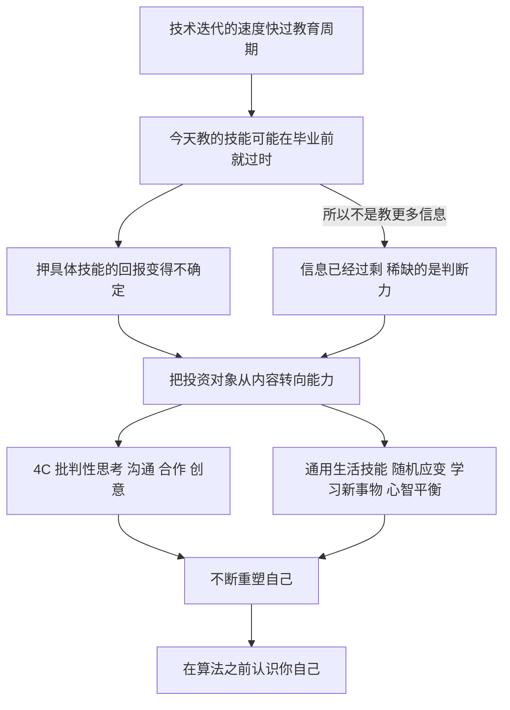

# 19｜未来的教育应该教什么？

> 如果没人知道 2050 年的世界需要什么技能，今天该教孩子什么？

---

## 一、先说结论

赫拉利认为，这个问题没有标准答案，但错误答案很清楚：教更多信息，或者赌一门具体的技能。

他的理由很直接——信息早就不是稀缺品了。今天一个中学生手机里的信息，比几十年前的图书馆还多。真正稀缺的是别的东西：理解信息、判断什么重要、把碎片拼成一张世界图景的能力。

所以他赞同教育专家们提出的「4C」：批判性思考、沟通、合作、创意。而比这些具体能力更重要的，是更底层的通用生活技能：随机应变、学习新事物、在不熟悉的环境里保持心智平衡。

他还说了一句很重的话：人类不只需要发明新的想法和产品，最重要的是得一次又一次地重塑自己。想跟上 2050 年的世界，你要做好反复重来的准备；而如果你想保住对自己人生的控制权，就得跑得比算法更快——在它们之前认识你自己。

---

## 二、我们先理解一个问题

先问一个问题：教育为什么一直「教具体的东西」？

因为过去的教育建立在一个可靠的前提上：世界是稳定的。你学会一门手艺、一门专业，就可以用一辈子。学校像一条流水线，学生按年龄分组，按铃声上下课，按同一份大纲走完全程，最后被送到社会的各个岗位上。这套制度在工业时代非常高效，它的前提是：今天教的东西，二十年后还有用。

现在把这个前提拿掉，问题就变得棘手了。

如果没人知道 2050 年的世界需要什么技能，那么教育面对的不是「教什么最好」，而是「在不知道答案的情况下怎么教」。这不是课程表问题，而是一个赌注问题：你押什么，才最不容易输？

---

## 三、作者到底提出了什么观点？

赫拉利在《今日简史》讲教育的那一章里，先做了一个减法：老师最不需要教给学生的，就是更多的信息。学生手里已经有太多信息了——他们缺的不是数据，而是处理数据的能力：理解它、判断它重不重要、把它放进一个更大的图景里。

接着他做了一个加法。他说自己很赞同教育专家们提出的「4C」：批判性思考、沟通、合作、创意。这四项能力有一个共同点：它们不绑定任何具体行业。无论世界变成什么样，会提问、会表达、会与人一起做事、会想出新的办法，都用得上。

但赫拉利认为 4C 还不够。他更看重的是「通用的生活技能」：随机应变、学习新事物、在不熟悉的环境里保持心智平衡。这三项听起来像心理素质，其实是生存能力——因为未来的变化不是一次性的，而是连续的。

由此他给出全书里最沉重的一句话之一：人类不只需要发明新的想法和产品，最重要的是得一次又一次地重塑自己。他还提醒读者，把过去的所有幻想都放下吧，它们是相当沉重的负担。

最后，他把教育的终点指向了自我认识：想保住对自己人生的控制权，就得跑得比算法更快——在算法之前认识你自己。这句话看似是心理建议，实际上是他对教育提出的最终要求。

---

## 四、把这个观点翻译成人话

可以把教育想成两件事：给人一张地图，或者教人走路。

过去的教育像发地图：你记住这条路怎么走，一辈子照着走就行。这条路可能很长、可能很难，但它是画好的。

今天的问题是地图在过期。你还没来得及背熟，路就改道了；甚至整座城市都搬家了。这时候发地图就没那么有用了，真正有用的是让人学会走路——会看方向、会问路、会在迷路的时候不慌。

赫拉利的主张不是「别学知识」，而是：既然地图随时会作废，那就把教育的一部分力气，从「背地图」挪到「练腿脚」上。

---

## 五、为什么会这样？

把赫拉利的推理拆开，可以看到这样一条链：

关键在于 B 到 D 这一步。

这一步常常被误解。赫拉利不是想说「新技能比旧技能好」，而是想说：当任何一门具体技能都不再保证长期有效时，理性的选择是换一种投资对象——不投内容，投能力。能力不像知识那样会过时，因为它本身就是用来处理「新东西」的。

而 H 是这条链的终点，也是它唯一能落到个人身上的地方。4C 和通用生活技能都是外部的期待，只有「认识你自己」是个人可以自己动手的部分——这也是为什么这本书最后会从教育一路走到对心智的观察。

---

## 六、举一个现实生活中的例子

算一笔时间账。

一个孩子今天入学，到 2050 年，他大约四十岁。四十岁是什么状态？正是职业责任最重、家庭负担最大、也最不可能「回去重新读一遍书」的年纪。而从他入学到 2050 年，中间有二十多年——如果技术每隔几年上一个台阶，那么他至少要穿越好几轮换代。

具体一点：他现在上小学，等到他大学毕业，大概是十六年后。也就是说，他今天开始学的那些具体工具、软件、流程，有很大概率在他拿到毕业证之前就已经被替换掉了。等他工作十年，他所在的行业可能已经改过名字、换过形态，甚至整条产业链都搬到了别处。

于是问题就变了。不是「该教他学编程还是学外语」——这类问题假定我们知道答案；而是「当他四十岁发现自己的专业已经不存在了，他能不能重来一次」。

这也解释了赫拉利为什么把「随机应变」和「在不熟悉的环境里保持心智平衡」放在技能清单的最前面。他还提醒过另一件事：今天学校的形态本身是工业时代的遗产——铃声、教室、三十个同龄人、统一进度。这套设计擅长培养合格的执行者，却不擅长培养能自己重来一次的人。

---

## 七、回到书中重新理解

值得注意的是，赫拉利并没有给出一份课程表。他不说取消数学或者增加编程，他说的是重心的移动。

他也不认为 4C 是什么新发现——教育界谈这些已经很多年了。他真正想强调的是一种地位变化：过去，批判性思考、沟通、合作、创意是「好学生」的加分项；未来，它们会变成所有人的生存技能。加分项可以只有少数人拥有，生存技能不行。

还有一层容易被忽略：赫拉利把教育不只当成就业问题。当工作不再自动提供身份和尊严，「我是谁」这个问题就必须由个人自己回答，而回答它需要的能力，恰恰不是任何一门专业课能给的。所以在他的框架里，教育的终点不是「找到一份好工作」，而是「成为一个能不断重新认识自己的人」。

至于那句「把过去的所有幻想都放下吧」，听起来有点无情。但它的意思不是传统没有价值，而是：把「世界会一直像我小时候那样」当成前提，是一份太重的行李。

---

## 八、这个观点背后还有什么？

第一，它和全书的主线是同一个判断的两种说法。技术颠覆改变了工作，也改变了「人是什么」；教育只是这个变化最先显形的地方。

第二，它把「自我认识」从修养问题变成了能力问题。赫拉利说「在算法之前认识你自己」，意思是：如果你不知道自己想要什么，就会有人替你定义；而这门功课没有老师、没有考试，只能自己练。

第三，它隐含着一个不太乐观的观察：随机应变、心智平衡这类能力，比具体技能更依赖家庭环境——一个有余裕试错的家庭，更容易养出有弹性的人。所以「教通用能力」这件事本身，也可能加剧不平等。

---

## 九、这个观点有问题吗？

先说它最有说服力的地方。赫拉利抓住的是教育最真实的两难：目标不可知。他反对的「教更多信息」也早就被现实证伪——信息过剩的年代，谁都不缺材料，缺的是判断。这一层几乎没人能反驳。

但至少有四处值得追问。

第一，「通用能力」很难教，也很难考。一些教育研究者认为，批判性思考不能脱离具体知识单独训练：没有扎实的内容打底，思维训练容易变成空谈。这就是教育界长期存在的「技能派」与「知识派」之争，关于这一问题，学界存在不同解释。

第二，他把「随机应变」当成普遍的出路，但这项能力并不平均分配。有安全感的人更容易冒险和重来，缺乏安全网的人反而更需要一份稳定的技能。对后者说「学会不断重塑自己」，可能是一种奢侈的建议。

第三，他默认技术变化会持续加速。一些经济史研究者认为，AI 对生产率的实际影响比预期慢得多，制度与教育的调整窗口也许没有他说的那么紧迫。关于这一问题，学界同样存在不同解释。

第四，也是最微妙的一点：赫拉利批评别人押注具体技能，但他给出的「4C 加通用生活技能」本身也是一种押注，只是赌注更宽、更不容易被证伪。它未必错，但它不是「不赌」，而是「换一种赌法」。

---

## 十、今天再看这个观点

以下是基于赫拉利思想的现代延伸，不是作者原话。

今天再看，教育面对的第一个变化是：学生的问题不再是找不到答案，而是被答案淹没。生成式工具让「写出一个像样的答案」变得廉价，于是学校真正要检验的东西被迫上移——你能不能提出一个好问题，能不能判断一个答案靠不靠得住，能不能把别人的结论变成自己的理解。

第二个变化是老师的角色。过去老师是知识的传递者，因为知识在老师那里；今天知识到处都有，老师更像是判断力的示范者——他要示范的是「遇到一个说法时，怎么去查、去比、去怀疑」。

也有一个反向的可能。技术同样可以成为教育的帮手：个性化练习可以让学生按自己的节奏走，不必和三十个人同步。但这里有一个陷阱——如果把新技术用来做更高效的填鸭，那只是把流水线升级成了自动流水线。

---

## 十一、这一篇真正应该记住什么？

1. 教育最根本的困难是目标不可知：没人知道 2050 年的世界需要什么技能，所以把宝押在某一门具体技能上，风险最高，也最容易落空。
2. 信息不再是稀缺品：老师最不需要教给学生的就是更多的信息，真正稀缺的是理解信息、判断轻重、把碎片拼成一张世界图景的能力。
3. 4C——批判性思考、沟通、合作、创意——过去是「好学生的加分项」，未来会变成所有人都必须具备的生存技能，因为没有人能替你做判断。
4. 比具体技能更重要的是通用生活技能：随机应变、学习新事物、在不熟悉的环境里保持心智平衡，因为未来的变化不是一次性的，而是连续的。
5. 想跟上 2050 年的世界，人需要一次又一次地重塑自己；想保住对自己人生的控制权，就得在算法之前认识你自己。

---

## 十二、留一个问题

> 如果教育的任务不是装满一个箱子，而是让一个人能够一次又一次地重塑自己，那么这种能力到底从哪里来？

一个人可以换专业、换城市、换行业，但他不能换掉自己。每一次重塑，都需要一个东西当锚：一种能够判断「这是我真正想要的，还是别人希望我要的」的能力。

而在所有能提供答案的候选者里，故事是最方便的一个——它给你角色、给你目标、给你同伴，还给你一个「为什么值得」。问题是，故事可靠吗？
