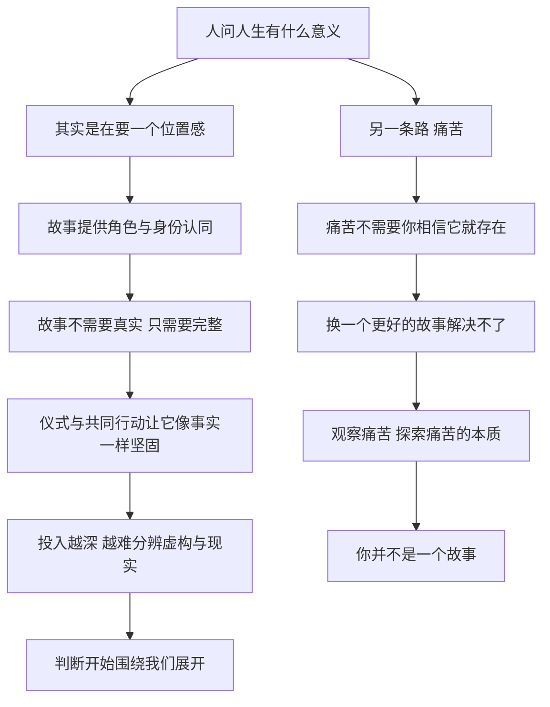

# 20｜人生的意义为什么不能是一个故事？

> 我们习惯用故事回答「人生有什么意义」，可故事可靠吗？

---

## 一、先说结论

赫拉利说，人对「人生有什么意义」这个问题，十有八九会给出一个故事作为答案：民族史诗、宗教轮回、真爱童话。

故事不需要真实，它只需要完整——只要能给你一个角色和身份认同，就能让人生看起来有了意义。民族主义用英勇的故事让你着迷，用灾难的故事让你流泪，最后你所有的判断都会围绕一句话打转：这对我们的国家有什么影响？

但故事有代价。你投入得越多，越难分辨虚构与现实；而且故事永远需要一个「我们」，所以它天然带着排他性。

赫拉利给出的替代方案听上去很朴素：世界上最真实的东西是痛苦。如果你真想知道人生的意义，最好的出发点不是换一个更好的故事，而是开始观察痛苦、探索痛苦的本质。你需要知道的第一件事，就是你并不是一个故事。

---

## 二、我们先理解一个问题

先问一个问题：当一个人问「人生有什么意义」时，他到底在问什么？

表面上看，他在问一个事实问题，像是在问「这颗星球有多少岁」。但如果你注意他提问时的处境，会发现完全不同：他通常不是在求知，而是在不安。他刚失恋、刚失业、刚失去亲人，或者只是在一个普通的深夜突然发现，自己每天做的事说不清是为了什么。

这种时候，他要的不是一条信息，而是一个位置——「我在这件事里是谁」「我受的这些苦在哪个故事里讲得通」。意义首先是一种位置感：我被放进了一个比我更大的东西里，于是我不再是孤零零的一个人。而故事最擅长的，恰恰就是提供位置。

---

## 三、作者到底提出了什么观点？

赫拉利在《今日简史》讲意义的这一章里，先说了一个近乎残酷的观察：人对意义问题的回答，几乎总会是一个故事。宗教给你轮回、救赎或者考验，民族给你牺牲与荣耀，浪漫主义给你一个「命中注定的人」。它们的共同点不是真假，而是结构：有开头、有过程、有结局，而你在其中有一个角色。

他强调，故事不需要真实，只要一致、完整、能提供身份认同就够了。更麻烦的是，重复的仪式与共同的行动会让虚构的东西变得越来越像事实——当所有人都在同一个时间做同一件事，那个被共同相信的东西就获得了实体般的重量。

他举的例子是民族主义：用英勇的故事让你着迷，用灾难的故事让你流泪，等你被这两样东西都打动过，你的判断标准就悄悄换了——从此你评估一切事情，先问的是「这对我们的国家有什么影响」。你并不觉得这是偏见，你觉得自己在关心集体。

然后，赫拉利把话题转了一个方向。他说，世界上最真实的东西就是痛苦。痛苦不需要你相信它就存在，也不需要你加入任何一个故事才能感受它；你可以给痛苦编出一百种解释，痛本身还在那里。所以，如果你真的想知道人生的意义，最好的出发点不是换一个更好的故事，而是开始观察痛苦、探索痛苦的本质。

他的结论只有一句话：你需要知道的第一件事，就是你并不是一个故事。

---

## 四、把这个观点翻译成人话

可以把故事想成一副眼镜。

戴上它，模糊的世界突然清楚了：你知道了谁是好人、谁是坏人、自己该往哪里走。这副眼镜非常有用，所以你会一直戴着。戴久了，你就忘了它的存在——你会以为镜片上的划痕是世界的一部分，以为眼前的颜色就是事物本身的颜色。

赫拉利不是要你把眼镜摔掉，因为你也摔不掉：人是靠故事生活的动物。他想说的是另一件事——你要知道自己戴着眼镜。

而他说「你并不是一个故事」，意思是：眼镜后面还有一个正在看的人。那个看的人不在剧本里，他不扮演任何角色，他只是在那里。故事可以描述他，但不能代替他。

---

## 五、为什么会这样？

把赫拉利的推理拆开，可以看到这样一条链：

关键在于 D 到 G 这一段。

故事的危险不在于它假，而在于它有效。一个无效的故事没人会投入，也就不会造成伤害；恰恰是那些最打动人的故事——关于民族、关于爱情、关于牺牲——让人愿意押上时间、金钱甚至生命。投入越深，退出越难，因为退出意味着承认自己多年的付出建立在一个虚构之上，这比继续相信要痛苦得多。

而 H 是这个链条的转折点。赫拉利不是要用一个更真的故事去替换旧故事，他是把问题整个换掉：不问「哪个故事是真的」，改问「什么东西不需要故事就已经存在」。他的答案是痛苦。

---

## 六、举一个现实生活中的例子

看那句几乎人人都说过的话：「等我买房，就幸福了。」

设想一个三十岁上下、在大城市工作的人。他把买房写在目标清单的第一行，为了它加班、攒首付、推掉所有不必要的花销；他给自己排了顺序：先首付，再装修，再结婚，再考虑孩子的学区。这套安排给了他一个非常清晰的角色——一个负责任的、有规划的成年人；也给了他忍受的理由——现在的一切辛苦都是通往幸福的必经阶段；还给了他同伴——所有和他一样在攒首付的人。

这套剧本是真的管用。它让人在挤地铁的时候不觉得虚无，在加班到深夜的时候觉得值得。它不需要有人验证「买房之后是否真的幸福」，因为它已经兑现了最重要的东西：让每一天都有了方向。

但它有一个结构上的特点：终点会移动。交房那天，幸福感确实来了，但持续得比想象中短；接着出现的是装修、贷款、通勤、孩子上学、换更大的房子。旧的「还差一步」刚刚到达，新的「还差一步」已经在那里等着。这不是因为这个人贪心，而是因为故事的运作方式就是如此——它必须永远保留一个未完成的结局，才能继续给你角色。

赫拉利的问题不是「买房对不对」。他想问的是：当你发现这套剧本永远不会给你终点，你还要不要一直照着它演下去？

---

## 七、回到书中重新理解

要理解这一章，得先记住赫拉利在别处的立场：他从来不是说故事是坏的。

在《人类简史》里，他就主张人类文明是靠共同相信的故事建立起来的——国家、货币、公司、人权，全都是想象的产物。没有这些故事，几千万人根本无法合作。所以他在意义这一章里批判的，不是「使用故事」，而是「把自己等同于故事」。

他其实区分了两种提问方式。一种是「我的人生意义是什么」，它要的是一份说明书，答案必然是一个故事。另一种是「痛苦是什么，它从哪里来」，它要的是一次观察，答案只能来自亲身经验。前一种提问，你可以从别人那里得到答案；后一种，只能自己看。

他还留下一个很重的判断：痛苦是唯一无法被故事完全收编的东西——你可以为痛苦编出各种解释，但痛还在那里。

---

## 八、这个观点背后还有什么？

第一，它把全书的政治批评收束到了个人层面。民族主义、宗教、意识形态之所以强大，不只是因为它们能解释世界，而是因为它们能提供角色。理解了「给人角色」这件事，就理解了它们为什么难以对抗。

第二，它给出了一个判断故事的新方法：不要问一个故事真不真，问它给了你什么角色、要求你放弃什么、以及它需要谁做反面角色。凡是必须靠「我们」和「他们」来运转的故事，代价都已经写在条款里了。

第三，它把「意义」从信仰问题变成了注意力问题。你长期关注什么，什么就会变得真实；你把注意力交给故事，故事就成了你的现实。

---

## 九、这个观点有问题吗？

先说它最有说服力的地方。赫拉利没有用「故事都是假的」这种粗暴的否定，而是指出了故事的一个结构性特征：它必须给你角色，因此它天然是自我中心的。这个观察用在民族主义上尤其有力——它解释了为什么一个温和的人，一旦进入「我们」的框架，就会开始用另一套标准衡量别人的痛苦。

但至少有四处值得追问。

第一，「世界上最真实的东西是痛苦」是一个哲学主张，不是科学结论。一些学者认为，痛苦本身也是被文化和语言塑造的：同样的伤口，有人觉得必须卧床，有人觉得不值一提。把痛苦当作唯一不需要故事就存在的东西，本身也带着一个立场。

第二，如果一切意义都是故事，那么「不要故事」这个建议会不会滑向虚无？赫拉利给出的实际方向是减少痛苦、看清心智，但一些批评者认为，这套方案仍然是一种关于「怎样活」的叙事，只是它自己不承认。

第三，故事也可能是解放的工具，而不只是牢笼。叙事心理学的一些研究发现，人通过讲述自己的经历来整合创伤、重建秩序——同一个故事既能困住人，也能救人，区别在于它是否允许被修改。

第四，赫拉利选民族主义当例子，容易让人觉得故事只算坏账。但民族认同在历史上也支撑过反殖民运动、福利制度和社会互助。把它完全放在「代价」这一栏，简化了历史的复杂性。

---

## 十、今天再看这个观点

以下是基于赫拉利思想的现代延伸，不是作者原话。

今天再看，「提供角色」这件事已经变成了一门更精细的生意。

过去给你剧本的是民族、宗教、家族；现在多了一整套关于「自我」的产业——自我提升、个人品牌、生活方式的内容。它们卖的不再是「你要为某个集体牺牲」，而是「你要活出真正的自己」。这看起来像是从故事里逃了出来，其实只是换了一份更贴身的角色说明书：你要自律、要精进、要有一个清晰的个人定位。它依然给你角色、给你目标、给你同伴，也依然需要一个「还差一步」的结局来维持运转。

另一面也值得记录。赫拉利对痛苦的重视，在今天有了新的现实意义：当一个社会的主要痛苦从「物质匮乏」转向「意义匮乏」时，人们更容易接受那些承诺立刻给出答案的故事——越是焦虑，越需要剧本。

---

## 十一、这一篇真正应该记住什么？

1. 人问「人生有什么意义」时，十有八九会得到一个故事；故事不需要真实，只需要完整，只需要给你一个角色和身份认同。
2. 故事提供的是位置感：民族史诗、宗教轮回、真爱童话，看起来千差万别，本质上都是同一类供给，都要你扮演某个角色，都要你相信它。
3. 故事的危险不在于它假，而在于它有效——你投入得越深，越难分辨虚构与现实，也越难承认自己该退出。
4. 世界上最真实的东西是痛苦：它不需要你相信它就存在，可以被解释一百遍，却无法被故事完全收编，所以它是探索意义的起点。
5. 探索意义的出发点不是换一个更好的故事，而是观察痛苦、探索痛苦的本质，并记住你并不是一个故事。

---

## 十二、留一个问题

> 如果「我」不是任何一个故事里的角色，那么「我」到底是什么？

这个问题一旦认真问出来，就会发现它没有现成的答案——也没有哪位老师、哪本书、哪个权威能替你回答。所有现成的答案都在故事里，而你刚刚被提醒：故事里的那个角色不是你。

赫拉利给出的建议很朴素，甚至朴素得让人怀疑：不是去找一个更好的答案，而是去看——看自己的念头、情绪和欲望怎样升起、怎样消散。
