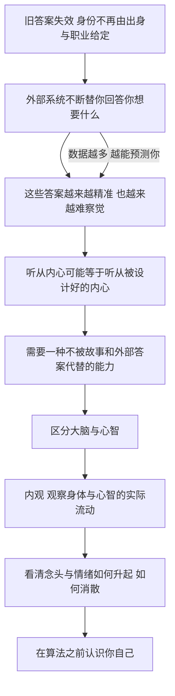

# 21｜为什么「认识自己」变得如此重要？

> 在信息洪流和被操纵的故事之间，个人还能靠什么站稳？

---

## 一、先说结论

赫拉利给出的个人答案是：观察自己的心智。

他先做了一个区分：大脑是神经元与电信号组成的实体网络，可以被测量、可以被干预；心智是痛苦、愉快、爱和愤怒这些主观体验的流动，它不能简单等同于大脑。看清这个区别，是理解他后面所有话的前提。

然后他分享了自己的实践：内观冥想，每天两小时。他反复强调，这不是为了放松，也不是为了获得什么神秘体验，而是为了看清念头、情绪和欲望如何升起、如何消散。

他坦承这是个人经验，不是科学处方——他不主张冥想能解决文明问题。但他坚持一点：当外部世界越来越复杂、故事越来越逼真时，看清自己的能力，可能是个人最后也最重要的防线。

---

## 二、我们先理解一个问题

先问一个问题：为什么「认识自己」这件事，从一种修养变成了一种必需？

过去，这个问题的答案由外部提供。你出生在哪个家庭、做什么工作、信什么教、属于哪个国家，别人已经替你回答了大半。你不太需要问「我是谁」，因为社会会告诉你，而且它的答案相当稳定。

今天这些答案都在松动：职业会消失，社群会瓦解，宗教和国家的故事也不再那么有说服力。与此同时，出现了新的回答者——它们不叫权威，叫服务：它们知道你什么时候需要什么、知道你偏好什么。这些回答比过去任何权威都更精准，也更难被察觉。

于是「认识自己」变成了一件有防御性质的事：不是因为你想活得更通透，而是因为如果你不回答「我是谁」，就会有别人来回答。

---

## 三、作者到底提出了什么观点？

赫拉利在《今日简史》最后一章里做了两件事：第一件是概念上的，第二件是个人经验上的。

概念上，他区分了大脑和心智。大脑是神经元组成的实体网络，是电化学信号的流动，现代科学可以测量它、干预它、改变它；心智则是痛苦、愉快、爱和愤怒这些主观体验的流动。两者不是同一个东西：你可以读出一片脑区的活跃程度，却读不出「他今天为什么难过」。

经验上，他讲了自己的内观冥想。他每天花两个小时坐着，观察自己的呼吸与感受。他特别说明，这不为放松——放松只是副作用；目的是看清心智的实际运作。他用一个画面形容自己的体验：种种想法、情绪和欲望的来去没有理由，也由不得你命令，就像是来自四面八方的风。

他的建议是：观察身体和心智的实际流动，而不是相信社交账号或者内心讲述的故事。注意这里的对称——他把「社交账号」和「内心的故事」放在了同一类东西里，都是事后整理出来的版本。

他也不回避自己的局限：这是他的个人经验，不是科学处方。但他坚持，当外部世界越来越复杂、故事越来越逼真时，看清自己的能力，可能是个人最后也最重要的防线。

---

## 四、把这个观点翻译成人话

把心智想象成一条河。

我们通常以为自己是站在岸上的那个人：河水在流，我在看。但更真实的处境是，我们大多数时候泡在水里，被水带着走，还以为自己在决定方向——直到某一天回头，发现自己已经被冲到很远的地方，却说不清是哪一股水流带走了自己。

冥想这件事，说穿了就是试着在水里停一下，第一次去感觉水流：这一股是愤怒，这一股是担心，这一股是刚刚看到的那条消息带来的不安。它不改变水流，它只是让你知道水流的存在。

赫拉利说「你并不是那些念头」，意思不是念头不重要，而是：念头是会来会走的东西，而能注意到它们来了又走的那份觉察，才是你可以依靠的地方。

---

## 五、为什么会这样？

把赫拉利的推理拆开，可以看到这样一条链：

关键在于 D 到 F 这一步。

赫拉利的方案不是「少用手机」，也不是「换一个更健康的故事」。因为这两条路都还是在内容层面打转——你换掉一个故事，还有别的故事在等着；你把手机放下，语言、文化、社会这些更大的盒子还在。他真正换的是层次：从「我该相信什么」下降到「我能不能看见此刻正在发生什么」。前者需要答案，后者只需要注意力。

而 G 到 H 是一个可以练习的动作，也是这一章最具体的一句话：不是控制念头，而是看着它来去。练习的内容不是让心安静，而是让心被看见。至于最后的 I，是赫拉利把这件事和整个技术时代连起来的地方——他担心的不是你不了解自己，而是别人比你先了解你。

---

## 六、举一个现实生活中的例子

看赫拉利自己每天做的事情。

他每天清晨花两个小时，坐着，闭着眼睛，把注意力放在呼吸和身体的感觉上。这两个小时里会发生什么？工作上的计划会来，昨天的一段对话会来，一段愤怒的旧记忆会来，还会来一些莫名其妙的画面和念头。这些内容不请自来，也不听指挥。

练习的内容不是把它们赶走。他做的是一件更奇怪的事：注意到「它来了」，然后让它走，然后回到呼吸；过一会儿，它又来了，再注意到，再让它走。他形容这些想法、情绪和欲望的来去没有理由，也由不得你命令，就像是来自四面八方的风。

很多人会以为这跟放松差不多。但他强调的区别是：放松是为了舒服，而这件事是为了看清。就像一个每天量血压的人，他关心的不是今天心情好不好，而是那个数字在说什么。

他也说明，这只是他个人的做法。他没有建议所有人都这样过，也没有说这是科学结论。恰恰是这份克制，让这一章的分量更重——他给出的不是一副药方，而是一个示范：在所有人都忙着解释你的时候，你能不能不急着解释自己，先看一眼。

---

## 七、回到书中重新理解

这一章在书里的位置很特别。

前面谈的都是宏大议题：人工智能、就业、民族主义、恐怖主义、战争、真相、后真相。到了最后，镜头忽然拉近到一个人的呼吸上。很多人会问：这算不算逃避？外面那么多结构性问题，你让我坐着看念头？

但如果顺着赫拉利的逻辑走一遍，会发现这不是逃避，而是收敛。他的推理是：真相可以被定制，故事可以被操纵，感受可以被测量和引导；那么个人唯一还能自己动手的领域，就是分辨「正在发生的体验」和「我关于体验的故事」。这一步不需要任何机构批准。

他也做了自我限制：他没有说冥想能拯救文明，也没有说人人都应该这么做。他只是把一件事说清楚——在外部世界失控的时候，向内看是他能想到的、仍然属于个人的动作。

---

## 八、这个观点背后还有什么？

第一，它把整本书串成了一个闭环。故事是人类合作的基础设施，但个人不必成为故事里的零件；前者是政治问题，后者是每个人的功课。

第二，它让「大脑与心智」的区分有了现实后果。技术可以直接干预大脑——药物、电刺激、数据反馈——但心智的体验不能被还原成一串读数。这既保护了人的内在经验，也提出了一个新问题：谁有权力干预别人的心智？

第三，它给出了「自由」的另一种定义。不是「听从内心」，因为内心可能已经被设计过；而是「能够看见内心正在发生什么」。这个定义比自由主义的版本更苛刻，也更难被外部剥夺。

---

## 九、这个观点有问题吗？

先说它最有说服力的地方。赫拉利在这一章里罕见地没有扮演预言家，他明确说这是个人经验、不是科学处方。这份克制本身就很可信；而他要解决的问题——你以为的「我想要」，可能并不来自你——确实很难被反驳。

但至少有四处值得追问。

第一，「观察心智能带来自由」是一个古老的哲学主张，不是科学结论。关于冥想的研究还在发展中，关于这一问题，学界存在不同解释：一些研究显示冥想对情绪调节和注意力有帮助，也有一些研究者指出效果常被夸大，个体差异很大。

第二，这个方案过于个人化。如果问题是不平等、数据权力、生态崩溃这些结构性的，那么「看清自己的念头」看起来杯水车薪。一些批评者认为，把公共问题私人化，恰恰会让人停止追问真正的原因——「你不满意，是因为你没看清自己」，这种说法本身就很有市场。

第三，他可能低估了「观察者」本身的可塑性。如果注意力可以被训练，它同样可以被外部训练；专注和分心争夺的是同一块肌肉，冥想并不是唯一在练它的力量。

第四，「认识自己」这个说法假定有一个可以被认识的自己。但如果心智就是流动，那么被认识的是哪一版？一些学者认为，与其说认识自我，不如说学习与不断变化的自己相处。

---

## 十、今天再看这个观点

以下是基于赫拉利思想的现代延伸，不是作者原话。

今天再看，「看清自己」这件事同时变得更难、也更有工具。

更难，是因为注意力被更专业地争夺：通知、信息流、无穷的内容，都在争夺你注意力的每一分钟。而争夺的方式往往不是强迫，而是取悦——用你想看的、让你舒服的东西留住你。这恰恰印证了赫拉利的担心：让人自愿留下来的力量，比让人害怕的力量更难抵抗。

更有工具，是因为正念、冥想、心理自助的内容变得触手可及。但这里也有一个反讽：这些工具本身也成了生意，一个以「让你平静」为卖点的市场，用的还是争夺注意力的那套方法。

---

## 十一、这一篇真正应该记住什么？

1. 赫拉利区分大脑与心智：大脑是可测量的神经元网络，心智是痛苦、愉快、爱与愤怒这些主观体验的流动，两者不是一回事。
2. 他每天两小时的内观不为放松，只为看清念头、情绪和欲望如何升起、如何消散，它们像风一样由不得你命令。
3. 他坦承这是个人经验而非科学处方：他没有说冥想能拯救文明，只说这是个人可以自己做的练习，这份克制值得学习。
4. 当外部世界越来越复杂、故事越来越逼真时，看清自己的能力，可能是个人最后也最重要的防线，而且不需要谁批准。
5. 认识自己不是修养而是防御：不是为了活得更好，而是为了不被人替你决定——你想要的，不该由别人先定义。

---

## 十二、留一个问题

> 如果心智只是一条不断流动的河，那么「认识自己」到底是在认识什么——是一个稳定的自我，还是一种看清流动的能力？

这个问题赫拉利没有给出结论，他只是把它留在了书的最后。也许这正是他想要的：所有前面那些宏大的问题，最终都要落回到一个具体的人身上——他能不能在看不清的世界里，仍然保有一点自己看的能力。

---

从「旧故事失效」这个起点，一路走到「如何认识自己」，这一趟下来会发现，起点和终点其实是同一个问题：当熟悉的故事不再兑现承诺、新的故事又没有成形，人还能靠什么站住？赫拉利没有搬出一个更大的故事来收尾，他做的是相反的事——把镜头一次次拉近，最后停在一个人的呼吸上。这个选择本身就是一种回答：靠的不是更动听的故事，而是一个人自己看的能力。至于这本书最值得带走的东西，也许不是它的任何结论，而是它提问的方式——在每个议题上，都逼你自己判断一次。剩下的那一份理解，只能由你自己长出来。
