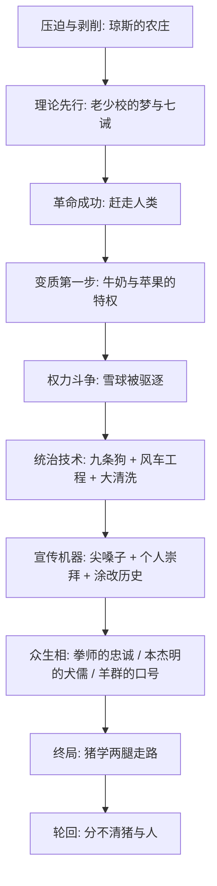

# 《动物农庄》深度解读系列

## 系列简介

《动物农庄》（Animal Farm: A Fairy Story）是乔治·奥威尔 1945 年出版的政治寓言小说，全书只有几万字，却被称为 20 世纪最锋利的政治讽刺作品之一。故事表面很简单：曼诺农庄的动物赶走了人类农场主琼斯，自己当家作主，建立了「动物农庄」；几年之后，领头的猪学会了用两条腿走路，动物们发现，新的统治者和旧的人类已经分不出区别。

这本书回答的不是「革命是什么」，而是一个更冷的问题：**一场以平等为旗帜的革命，是怎么一步一步走回独裁的？** 奥威尔用猪、马、狗、羊、乌鸦这些动物，把权力变质的每个环节都拆开了：革命后的特权从一小桶牛奶开始；异见者被暴力清除；历史被一次次涂改；谎言被修辞包装成「事实」；而最忠诚的劳动者，恰恰是被出卖得最深的人。

奥威尔本人是民主社会主义者，这本书不是反对革命，而是追问：为什么革命反复地背叛它最初的承诺？这个问题至今没有过期——任何组织、公司、社群乃至国家，都可能在《动物农庄》里照见自己的影子。

本系列不按原书十章的章节机械拆分，而是按「革命从哪里来 → 权力如何变质 → 统治的技术 → 动物们的命运 → 终局与轮回」的逻辑重组为 5 个部分、18 篇解读，每篇只讲清一个问题，带你从「看懂情节」走到「看清机制」。

---

## 全书核心问题

| 层次 | 核心问题 | 本书的回答方向 |
|---|---|---|
| 起源 | 革命为什么会发生？理论为什么先于枪炮？ | 被压迫者要先有一个「另一个世界是可能的」的叙事，才会行动 |
| 机制 | 革命成功后，权力是怎样一点点变质的？ | 不是一夜篡权，而是从牛奶、苹果、不干活这些「小例外」开始，由暴力、工程和清洗一步步加固 |
| 技术 | 独裁统治靠什么维持？ | 暴力机关、宣传修辞、个人崇拜、篡改历史——四者缺一不可 |
| 众生 | 普通动物为什么不反抗？ | 劳动者被耗尽、知识分子选择犬儒、宗教提供安慰、底层被口号喂养，每个阶层都参与了自己的压迫 |
| 终局 | 为什么最后分不清猪和人？ | 推翻旧精英的革命制造了新精英，轮回本身才是寓言最冷的部分 |

---

## 全书知识地图

---

## 全系列目录

### 第一部分：革命从哪里来

#### 01｜老少校的演讲：为什么革命需要一个「梦」先存在？

核心问题：为什么被压迫的动物要先听完一场演讲，才敢造反？

核心观点：奥威尔让革命从一场梦开始，这不是文学巧合。动物们受压迫已经很久了，但只有老少校把「你在被剥削」这件事说清楚之后，反抗才变得可以想象。革命的第一步不是武器，而是一份把痛苦翻译成理论的叙事——《动物农庄》里它叫《英格兰兽》，人类历史上它叫宣言和纲领。

理解难度：★★☆☆☆

关键词：老少校、英格兰兽、理论先行、革命叙事、马克思与列宁

---

#### 02｜一场意外的胜利：为什么推翻旧秩序往往是最简单的一步？

核心问题：动物们没计划、没武器、没训练，为什么还是赢了？

核心观点：造反不是周密策划的结果，而是一个偶然事件引爆的——琼斯忘了喂食。奥威尔借此指出：旧秩序真正的守卫者不是锁链，而是习惯和恐惧；一旦动物发现「原来他也就这样」，崩溃比想象中快得多。但容易的胜利也是危险的：赢得太快，就没人想过「接下来怎么办」。

理解难度：★★☆☆☆

关键词：起义、偶然性、琼斯、旧秩序崩溃、牛棚战役

---

#### 03｜七诫：为什么革命成功后，第一件事是把原则写下来？

核心问题：动物农庄为什么要在墙上写下七条戒律？

核心观点：七诫是新秩序的宪法——把「所有动物一律平等」从口号变成白纸黑字。但奥威尔埋了伏笔：能写字的是猪，能念全文的没几个。法律刻在墙上，解释权却握在识字者手里。七诫既是平等的纪念碑，也是后来被逐条涂改的靶子。

理解难度：★★☆☆☆

关键词：七诫、立法、识字权、解释权、制度文本

---

### 第二部分：权力如何变质

#### 04｜消失的牛奶和苹果：特权是怎么从「小例外」开始的？

核心问题：动物农庄的腐化，为什么从没人注意到的小事开始？

核心观点：革命后第一批消失的财产是牛奶和苹果——进了猪的饲料。理由听起来很合理：猪要用脑力保护大家。奥威尔的洞察是：暴政很少以暴政的面目登场，它从一个个「合情合理的例外」开始。反对特权要在第一次特供时反对，等它成为惯例，就再也说不清了。

理解难度：★★☆☆☆

关键词：牛奶与苹果、特权、滑坡、合理化的例外

---

#### 05｜雪球与拿破仑：为什么革命者之间必有一战？

核心问题：共同的敌人消失后，为什么革命者自己打起来了？

核心观点：雪球和拿破仑的分歧不只是路线之争——风车计划 vs 粮食生产，而是权力只能有一个主人。拿破仑从不辩论，他只养大了一窝狗。这场斗争以狗驱逐雪球告终，影射斯大林驱逐托洛茨基。奥威尔要说的是：在权力真空中，会演讲的输给会养狗的——手段的底线决定谁赢。

理解难度：★★★☆☆

关键词：雪球、拿破仑、权力斗争、托洛茨基、路线之争

---

#### 06｜九条狗：为什么独裁者真正的根基不是口号而是暴力？

核心问题：拿破仑的统治，到底靠什么撑起来的？

核心观点：拿破仑刚出场时悄悄带走了蓝铃花和小花狗的一窝幼崽，「亲自负责它们的教育」——等它们长成九条恶犬，谁反对，狗就冲向谁。宣传说服的是外人，暴力对付的是自己人。狗的隐喻直指秘密警察：独裁者可以失去所有选票，只要还没失去枪杆子。

理解难度：★★☆☆☆

关键词：九条狗、暴力机关、秘密警察、恐惧统治、幼崽教育

---

#### 07｜风车：为什么宏大工程会成为统治工具？

核心问题：拿破仑一开始反对风车，为什么后来自己拼命建？

核心观点：风车是雪球的方案，拿破仑当年在上面撒尿；等雪球走了，风车却成了「拿破仑同志的伟大构想」。奥威尔看穿了大工程的双重功能：对内，它耗尽动物的体力，让抱怨变成奢侈品；对外，它是政权合法性的纪念碑。风车塌了可以再建，反正锅永远有人背——雪球。

理解难度：★★★☆☆

关键词：风车、宏大工程、五年计划、疲劳统治、合法性纪念碑

---

#### 08｜谷仓前的屠杀：大清洗为什么需要「认罪」的表演？

核心问题：拿破仑为什么要让动物当众认罪之后再杀？

核心观点：四头猪、三只母鸡、一只鹅、一只羊被拖出来「承认」和雪球勾结，然后被狗撕碎——这是在影射莫斯科大审判。杀人只是清除，认罪才是震慑：让每个目击者怀疑自己——「连他们都承认了，难道他们真的都是叛徒？」公开认罪的表演，是把恐惧种进旁观者心里的技术。

理解难度：★★★☆☆

关键词：大清洗、认罪表演、莫斯科审判、恐怖震慑、互相揭发

---

#### 09｜被涂改的七诫：为什么篡改记忆是独裁的核心技术？

核心问题：猪睡床、喝酒、杀同类，动物们为什么觉得「好像本来就这样」？

核心观点：七诫被一条条加上小尾巴：「不得睡在床上」变成「不得睡在铺床单的床上」；「不得饮酒」变成「不得饮酒过量」；「不得杀害其他动物」变成「不得无故杀害」。每次动物觉得哪里不对，都被一句「你是不是记错了」打发。控制过去的人控制未来——谁掌握对「当初是怎么说的」的解释权，谁就掌握了一切。

理解难度：★★★☆☆

关键词：涂改七诫、记忆篡改、历史解释权、温水煮青蛙、文字游戏

---

### 第三部分：统治的技术

#### 10｜尖嗓子的修辞术：谎言是怎么被说成「事实」的？

核心问题：尖嗓子为什么总能把黑的讲成白的？

核心观点：尖嗓子的武器不是内容而是方法：先抬出恐惧（「你们难道希望琼斯回来吗？」），再制造假两难，然后用数据和术语轰炸，最后反咬一口（「雪球从一开始就是叛徒」）。他从不证明自己对，只让你不敢错。奥威尔在这里解剖了宣传的标准配方——后来他在《一九八四》里把它写成了新话。

理解难度：★★★☆☆

关键词：尖嗓子、宣传术、假两难、恐惧牌、真理报

---

#### 11｜拿破仑同志永远正确：个人崇拜是怎么制造出来的？

核心问题：一头猪是怎么变成「万岁」的？

核心观点：拿破仑渐渐不再露面，先是通过尖嗓子传话，然后有了头衔（「拿破仑同志」「动物之父」「人类之敌的克星」）、颂诗、画像，连一句好话都要归功于他——「感谢拿破仑同志的领导」。个人崇拜不是狂热群众自发的爱，而是被精心管理的缺席与夸饰：领袖越神秘，光环越大。

理解难度：★★★☆☆

关键词：个人崇拜、领袖崇拜、头衔、缺席的领袖、被管理的崇拜

---

#### 12｜被禁唱的《英格兰兽》：为什么革命成功后，革命歌曲反而危险？

核心问题：象征解放的歌曲，为什么被新政权自己禁了？

核心观点：《英格兰兽》唱的是「所有动物终将自由平等」——革命成功后，这首歌反而成了威胁：万一动物们当真了呢？万一他们追问「承诺的乌托邦什么时候到」呢？尖嗓子的解释是「这首歌属于起义的时代，现在已经完成了」。禁歌的本质是封死理想：当权者最怕的，是人民拿革命的承诺来丈量革命的现实。

理解难度：★★★☆☆

关键词：英格兰兽、禁歌、乌托邦理想、承诺与现实、理想的收编

---

### 第四部分：动物们的命运

#### 13｜拳师：为什么最忠诚的劳动者，结局最惨？

核心问题：「我要更加努力工作」的拳师，为什么被送去了屠马场？

核心观点：拳师有两句口头禅：「我要更加努力工作」「拿破仑同志永远正确」。他解决一切问题的办法是再出一份力，直到累垮在风车工地——然后被卖给屠马商换了一箱威士忌。拳师是全书最痛的角色：忠诚没有保护他，反而让他成为最好用的耗材。奥威尔写给所有「埋头苦干、从不抬头看路」的劳动者。

理解难度：★★☆☆☆

关键词：拳师、忠诚的代价、劳动者、屠马场、耗尽的底层

---

#### 14｜本杰明与摩西：犬儒和宗教，各自看透了什么？

核心问题：活得最久的驴和整天讲糖果山的乌鸦，为什么政权都留着他们？

核心观点：本杰明那头驴什么都看得懂，却什么都不说——「驴子长寿，你们谁都没见过死驴子」；乌鸦摩西讲的是死后去糖果山享福，猪不赶他，还给他酒喝。一个犬儒，一个麻醉剂，政权都留得住：看破不说破的知识分子不构成威胁，而相信来世的群众不要求今生。他们代表被统治者的两种逃避。

理解难度：★★★☆☆

关键词：本杰明、摩西、犬儒主义、宗教安慰剂、糖果山

---

#### 15｜羊群、母鸡和猫：不同阶层的动物，怎么参与了自己的压迫？

核心问题：除了猪和狗，其他动物在这场专制里扮演了什么角色？

核心观点：羊群是最完美的群众——只会喊「四条腿好，两条腿坏」，关键时刻用来淹没一切讨论；母鸡为保卫鸡蛋奋起反抗，被饿死九只，是底层唯一一次真正的抵抗；猫从不干活也从不站队，活得最舒服。奥威尔画了一幅阶层图谱：盲从者、反抗者、投机者，每一种都是专制机器上的零件。

理解难度：★★★☆☆

关键词：羊群口号、母鸡起义、投机者、底层抵抗、合谋结构

---

### 第五部分：当猪变成了人

#### 16｜两条腿走路：为什么说腐化不是意外而是轮回？

核心问题：最后一幕里，猪学会用两条腿走路，这意味着什么？

核心观点：这是全书最震撼的一幕：不是「革命失败了」，而是「新精英完成了对旧精英的复制」。奥威尔借影射的是革命的热月——推翻一个统治阶级，制造了另一个统治阶级。腐化不是某头猪的道德问题，而是结构问题：只要权力的分配机制不变，坐上那个位置的都会变成人。

理解难度：★★★★☆

关键词：两条腿走路、精英复制、革命轮回、热月、结构性腐化

---

#### 17｜「所有动物一律平等」的下半句：语言被腐蚀到极点是什么样？

核心问题：「但有些动物比其他动物更平等」这句话，为什么让人毛骨悚然？

核心观点：墙上最后只剩一条戒律：「所有动物一律平等，但有些动物比其他动物更平等。」它在逻辑上自相矛盾，却是全书的题眼——当语言可以容纳自己的反面，一切原则都成了空话。奥威尔后来把这套思路写进《一九八四》的新话：极权不是禁止你说话，而是把「平等」这个词掏空到再也装不下反抗。

理解难度：★★★★☆

关键词：更平等、语言腐蚀、新话前身、概念掏空、自相矛盾

---

#### 18｜最后一幕的牌局：我们如何辨认今天的「猪」？

核心问题：牌桌上猪和人都出了黑桃 A，窗外的动物为什么分不出谁是谁？

核心观点：结尾的牌局影射战时同盟：皮尔金顿和弗雷德里克——人类农场主和猪坐到了一张桌上，为了利益随时结盟又随时翻脸。动物们从窗外看进去，「已经分不清谁是猪，谁是人了」。奥威尔真正的提问留给读者：辨认暴政不能看旗帜和口号，要看行为——当你分不清新统治者和旧统治者时，革命就白打了。

理解难度：★★★☆☆

关键词：牌局、皮尔金顿、弗雷德里克、猪人难辨、行为辨认法

---

## 推荐阅读顺序

### 主线顺序（推荐）

`01 → 02 → 03 → 04 → 05 → 06 → 07 → 08 → 09 → 10 → 11 → 12 → 13 → 14 → 15 → 16 → 17 → 18`

主线基本对应情节推进：从革命的起源（理论、胜利、立法），到权力的变质（特权、内斗、暴力、工程、清洗、篡改），再到统治技术（宣传、崇拜、禁歌），然后是动物众生相（忠诚者、犬儒者、盲从者与反抗者），最后收束于终局（两腿走路、语言掏空、猪人难辨）。

### 按难度分四段

- **入门段（01–04）**：革命怎么发生、怎么立法、特权怎么开始——都是直觉就能理解的。
- **进阶段（05–12）**：权力斗争、暴力、工程、清洗、篡改、宣传、崇拜、禁歌——需要把寓言对应到历史机制。
- **人物段（13–15）**：拳师、本杰明、羊群——理解「被统治者为什么配合」。
- **终局段（16–18）**：轮回、语言腐蚀、猪人难辨——最抽象也最值得反复读的三篇。

### 不同读者的入口

- **想快速抓住全书骨架**：读 01 → 05 → 09 → 13 → 17，五篇串起「理论—夺权—篡改—耗材—语言」主线。
- **对政治寓言/历史影射感兴趣**：05、08、16、18（托洛茨基、莫斯科审判、热月、战时同盟）。
- **想练批判性阅读**：10、17 两篇——把宣传和语言腐蚀拆开看，再看 09 怎么接。
- **关心组织/公司政治**：04、07、11、15——特权滑坡、大工程、领袖崇拜、合谋结构在职场同样成立。

---

## 例子与素材分配表

| 篇目 | 寓言素材（书中） | 历史影射 | 现实例子（第六节用，禁止跨篇重复） |
|---|---|---|---|
| 01 | 老少校的遗言演讲、《英格兰兽》 | 马克思/列宁的革命理论 | 创业团队靠一句「使命」凝聚而非靠工资 |
| 02 | 琼斯忘喂食、起义、牛棚战役 | 二月革命/俄国内战反干涉 | 人人不满的审批流程，领导换岗当天就废除 |
| 03 | 七诫写上墙、多数动物学不会 | 革命后立宪 | 业主赶走物业后第一件事是立自治公约 |
| 04 | 牛奶、苹果、猪搬进农舍 | 特权阶层形成 | 「领导专用停车位」怎么一步步变成惯例 |
| 05 | 雪球 vs 拿破仑、风车辩论、驱逐 | 斯大林驱逐托洛茨基 | 联合创始人内斗，出局者被写成「从一开始就反对」 |
| 06 | 带走九只幼崽亲自教育 | 契卡/内务部 | 公司里直接向老板汇报的监察部门 |
| 07 | 风车三建三塌、甩锅雪球 | 五年计划/大工程 | 新官上任必上大工程证明「有作为」 |
| 08 | 四猪认罪、集体处决 | 莫斯科大审判 | 要求员工「自查自纠」并公开检讨的运动 |
| 09 | 七诫逐条加尾巴 | 历史教科书涂改 | 群公告被悄悄修改后「一直都是这么写的」 |
| 10 | 尖嗓子的话术三件套 | 真理报宣传 | 「不转不是××人」式的假两难话术 |
| 11 | 拿破仑的头衔、颂诗、缺席 | 斯大林个人崇拜 | 创始人语录挂墙、头像文化衫 |
| 12 | 禁唱《英格兰兽》、换成新赞歌 | 意识形态收编 | 公司做大后没人再提「当年一起吃苦」的口号 |
| 13 | 拳师的两句口头禅、屠马场 | 斯达汉诺夫工人 | 最常加班从不抱怨的老员工最先被裁 |
| 14 | 本杰明看破不说破、摩西的糖果山 | 犬儒知识分子/东正教 | 办公室老油条 + 相信「吃亏是福」的长辈 |
| 15 | 羊喊口号淹没讨论、母鸡护蛋、猫两头讨好 | 盲众/富农反抗/投机者 | 班级里起哄的、反抗的、永远中立的三种人 |
| 16 | 猪直立行走、住农舍、拿鞭子 | 革命热月/新精英 | 草根乐队成名后坐商务舱嘲笑当年的自己 |
| 17 | 墙上只剩一条戒律 | 《一九八四》新话前身 | 墙上「奋斗为本」被重新诠释成反义 |
| 18 | 牌局、两张黑桃 A、猪人难辨 | 德黑兰会议/同盟 | 换了三任领导后员工发现 KPI 一点没变 |

---

## 全系列状态

全系列共 **18 篇**，分 5 个部分，目前均已完成写作并通过质检。

- 第一部分：革命从哪里来（01–03）
- 第二部分：权力如何变质（04–09）
- 第三部分：统治的技术（10–12）
- 第四部分：动物们的命运（13–15）
- 第五部分：当猪变成了人（16–18）
