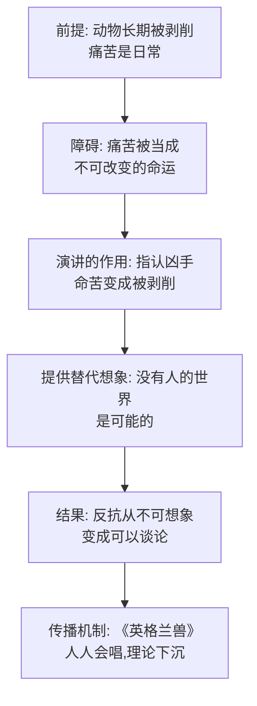

# 01｜老少校的演讲：为什么革命需要一个「梦」先存在？

> 动物们被压榨了一辈子，为什么偏偏在听完一场演讲之后，才开始谈论造反？

---

## 一、先说结论

奥威尔让《动物农庄》的革命从一场演讲开始，这不是文学巧合。老少校没有给动物们武器，没有制定起义计划，甚至没有活着看到革命——他做的一切，只是把动物们习以为常的痛苦说清楚：你们被剥削了，你们的一生被人类拿走了，而另一个世界是可能的。三个月后他死了，但这番话留下的种子长成了《英格兰兽》的歌声和一场真实的起义。奥威尔借这个开头说了一件事：**革命的第一步不是推翻谁，而是先让人相信自己被压迫、且值得更好的生活。** 没有理论，就没有革命。

## 二、我们先理解一个问题

先想象一个场景：你在一个地方干活，干的活最多，吃的最少，产出的东西全被拿走，老了以后还要被处理掉。这不是比喻，这就是农庄里每只动物的一生——马被骑、奶牛被挤奶、母鸡的蛋被收走、猪养肥了挨刀。

问题来了：这样的日子他们过了一辈子，为什么早不反、晚不反，偏偏在老少校讲完那番话之后，造反才成了可以谈论的事情？难道压迫的程度在那一天晚上突然变重了吗？

没有。那一晚什么都没变，唯一变化的是：**有人把痛苦翻译成了理论。**

## 三、作者到底提出了什么观点？

老少校是一头十二岁的老猪，德高望重。他在临死前把全体动物召集到大谷仓，讲了一番话。这番话的结构非常清楚，几乎可以当成一份标准革命宣言来读：

第一层，**指认苦难**。你们的日子过得苦吗？苦。这是动物们早就知道的事实，但第一次有人当着大家的面把它说出来。

第二层，**指认凶手**。苦是谁造成的？不是命运，是人。老少校说得非常直白：人是我们唯一真正的敌人。他不下蛋、不产奶、拉不动犁，却拿走我们所有的产出。注意这一步——他把「命苦」重新解释成「被剥削」。命运是没法反抗的，敌人是可以反抗的。

第三层，**描绘另一个世界**。推翻人类之后，动物可以享受自己劳动的果实，过自由富足的日子。他给这个未来配了一首歌——《英格兰兽》，唱的是「兽类大同」的黄金时代。

然后，第二天晚上他就死了。理论留下了，理论家走了。

## 四、把这个观点翻译成人话

用大白话说：**让人行动起来的，往往不是痛苦本身，而是对痛苦的解释。**

同样是被克扣工资，一个人可以解释成「我命不好」，也可以解释成「老板在剥削我」，还可以解释成「这个制度有问题」。三种解释，指向三种完全不同的行动：认命、跳槽、或者组织工会。痛苦是原材料，解释才是扳机。

老少校干的就是给原材料配扳机的事。他没有减轻动物们一丁点痛苦——演讲完第二天，马照样被骑，蛋照样被收。他改变的是动物们**看待**痛苦的方式：从「日子就是这样」变成「日子本不该这样」。

这中间隔着一整个世界。

## 五、为什么会这样？

为什么一段「只是说话」的演讲，能比一辈子的皮鞭更有力量？奥威尔的推理链是这样的：

这条链上有两个关键环节值得单独说。

第一个是「指认凶手」。如果痛苦是命运，忍受就是唯一选项；一旦痛苦有了具体的责任人，反抗才在逻辑上成立。所以任何革命叙事的第一句话，几乎都是「你的苦是有来源的」。

第二个是「替代想象」。只告诉人「你很惨」没有用——人早就知道自己惨。真正让人行动的是告诉他「另一条路存在」。这就是为什么《英格兰兽》这首歌比演讲本身更重要：演讲在谷仓里就结束了，歌却可以传唱，猪可以教给马，马可以哼给羊，理论就这样长进了日常。

## 六、举一个现实生活中的例子

想一想创业公司是怎么凝聚人的。

一个十几个人的小团队，工资比大厂低、活儿比大厂多、失败概率九成九。按理说没人该来。但总有人来了，还干得拼命。为什么？因为创始人讲了一个「梦」：我们在做一件改变世界的事，你们是缔造者不是打工人，五年后的世界会因为今天这顿饭局不一样。

这个「梦」的结构和老少校的演讲一模一样：指认现状（现在的行业烂透了）、指认问题（巨头垄断/体验糟糕）、描绘替代世界（我们做成之后会是什么样）、配上可传播的口号（使命、愿景、那句印在文化衫上的话）。

最像的地方在于：这个梦是不是真的不重要，重要的是**它先存在**。没有它，大家只是在打一份低薪的苦工；有了它，同样的加班变成了「我们在干一件大事」。老少校死在革命之前，创始人也未必信自己画的饼——但叙事一旦被接受，它就有了自己的生命。

## 七、回到书中重新理解

现在再看这个开头，会发现奥威尔埋了两层意思。

第一层是写实：历史上的革命确实都这么开始。老少校影射的是马克思（也有人说兼具列宁）——理论家本人并没有活到看见自己的理论变成政权，就像马克思死在1883年，没见过1917年。奥威尔甚至安排了一个细节：老少校死后，他的头骨被陈列在农舍前供大家瞻仰，这几乎是列宁墓的直接翻版。

第二层是冷静：奥威尔本人是社会主义者，他写这本书不是嘲讽「做梦的人」，而是记录梦的完整生命周期——它先给人力量，然后被人利用，最后被人收编。我们后面会看到，《英格兰兽》这首革命歌曲，恰恰是被革命成功者亲手禁掉的。梦生出了革命，革命再杀死梦。

## 八、这个观点背后还有什么？

第一，老少校的演讲里其实藏着一个日后会爆炸的前提：「所有动物都是同志」「人是我们唯一的敌人」。这把世界切成了两块——动物 vs 人。这种切法动员力极强，但它有个隐患：当动物内部出现压迫者时，这个框架是失灵的。新的压迫者不是人，是猪——叙事里根本没有给这种情况预留位置。

第二，「梦」的权力掌握在会做梦的人手里。动物里最早掌握演讲、写字、记忆教义的，是猪。也就是说，从理论诞生的第一天起，解释权就已经不平等了。这不是变质的结果，这是变质的起点——后面篇目会反复回到这一点。

第三，值得注意奥威尔的克制：老少校没有错。他诊断的剥削是真的，他描绘的压迫是真的，他指认的敌人也是真的。这本书最冷的地方在于，问题不出在理论是谎言，而出在**真理论被人接过去之后，谁也拦不住解释它的人**。

## 九、这个观点有问题吗？

说服力在哪：把「理论先于行动」放在革命的开头，符合历史经验。启蒙运动先于法国大革命，《共产党宣言》先于俄国革命——没有现成叙事时，被压迫者通常不是反抗，而是内耗或麻木。奥威尔抓住的这点是扎实的。

争议在哪：第一，把革命的起点归因于「一场演讲」，是思想史式的解释，它低估了物质条件的作用——动物真正起义不是因为想通了，而是因为琼斯忘了喂食、饿极了。一些历史学家认为，革命叙事更多是事后追认的合法性，而非事前的原因。第二，「理论先于行动」也可以反过来说：如果梦真能制造行动，为什么同样听过演讲的动物，多数到最后也没反抗？梦解释了第一场起义，解释不了后来的沉默。

哪里过度简化：现实中的压迫者很少像琼斯那样是个纯粹的、可被整体指认的「人」。更多时候苦难的来源是弥散的、结构性的，老少校式「指认一个凶手」的清晰感，在现实里很难复制——这也是为什么革命叙事永远比革命后的治理简单。

还有哪些其他解释：一种解释强调组织而非叙事——革命成功的关键不是「有没有梦」，而是有没有人把梦变成纪律和网络；另一种更激进的解释认为，所有宏大叙事本质上都是夺权工具，老少校和拿破仑的区别只是先来后到。

## 十、今天再看这个观点

以下部分是基于作者思想的现代延伸，不是作者原话。

老少校式的「先讲梦」在今天无处不在，而且早已溢出政治：每一场产品发布会都在讲「现状是坏的，我们的世界是可能的」，每一份创业 BP 都是一篇迷你《英格兰兽》，每一个 KOL 都在指认凶手——内卷的凶手是资本、焦虑的凶手是原生家庭、贫穷的凶手是认知不够。指认凶手 + 描绘替代世界，这套模板已经从革命纲领变成了内容工业的标准配方。

而耐人寻味的地方也在这：当「梦」可以被批量生产，人对梦的信任也在贬值。我们这一代人见过的演讲太多了，多到能瞬间识别「这是不是在给我造梦」——于是犬儒成了新的默认姿势。本杰明那头什么都看得透、什么都不信的驴，也许比老少校更像今天的我们。

## 十一、这一篇真正应该记住什么？

1. 革命从叙事开始：老少校没给武器只给了解释——把「命苦」重新讲成「被剥削」，反抗才变得可以想象。
2. 指认凶手是关键一步：痛苦归给命运就只能忍，归给敌人才可以反。
3. 理论需要可传播的形态：《英格兰兽》比演讲更有力，因为歌能人人传唱。
4. 隐患在第一天就有：会做梦、会写字的猪垄断了解释权，变质不是意外而是起点。

## 十二、留一个问题

如果梦是行动的前提，那么一个坏组织只要「梦讲得好」就能动员人——我们凭什么分辨一场演讲是老少校式的解放叙事，还是另一场收割的开场白？

这个问题先存着。眼下还有一件更直接的事：动物们听懂了梦，然后他们真的赢了——而且赢得快得离谱。快到没人来得及想一个问题：推翻旧秩序，到底是革命里最难的一步，还是最简单的一步？下一篇，我们就看这场意外的胜利。
