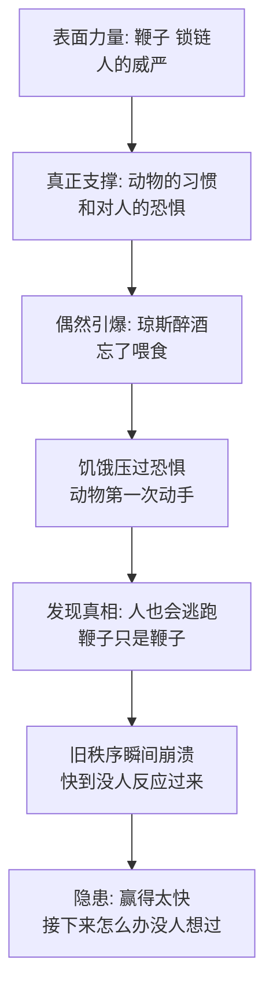

# 02｜一场意外的胜利：为什么推翻旧秩序往往是最简单的一步？

> 动物们没有武器、没有计划、没有训练，起义那天早上甚至没人打算造反——他们为什么还是赢了，而且赢得快得离谱？

---

## 一、先说结论

《动物农庄》里的起义不是周密策划的产物，而是被一个偶然事件引爆的：琼斯喝醉了，忘了喂食，饿极了的动物撞开饲料棚——造反就这么发生了。奥威尔借这个荒诞的开场说了一件事：**旧秩序真正的守卫者不是锁链，而是习惯和恐惧**。动物们多年来不敢反抗，不是因为鞭子真的不可战胜，而是因为他们相信它不可战胜。一旦他们发现「原来他也就这样」，崩溃来得比所有人想象的都快。但奥威尔同时埋了一句警告：容易的胜利也是危险的——赢太快，就没人想过「接下来怎么办」。

## 二、我们先理解一个问题

先清点一下双方的实力对比。琼斯一方：人类、鞭子、枪、四五个帮工、几千年「人管动物」的传统。动物一方：几百张嘴、没有一个指挥者、没有任何武器，起义前一天晚上还在各自的位置上干活。

按任何军事常识，动物都该输。可书中写道，琼斯带着帮工挥着鞭子冲进院子，几分钟后就落荒而逃，连琼斯太太都提着箱子从小路溜走了。

问题来了：如果琼斯这么不堪一击，为什么他能统治这么多年？反过来问更有意思：一个靠鞭子维持的秩序，鞭子失效的那几分钟里，它到底靠什么站着？

## 三、作者到底提出了什么观点？

书中写道的起义过程，几乎是喜剧式的。仲夏节前夕，琼斯喝得烂醉，第二天一整天没人喂动物。到了晚上，一头母牛实在饿得受不了，用角顶开了饲料棚的门，所有动物一拥而上自己吃起来。琼斯和四个帮工拎着鞭子冲进来，鞭子噼里啪啦到处抽——就在这一刻，动物们不约而同地掉过头来，用角顶、用蹄踢、用牙咬。奥威尔写道，这一切「几乎没超过五分钟」，人就逃光了。

接下来是清算仪式：动物们把马具、缰绳、鼻环、狗链、鞭子全扔进垃圾堆烧掉，把缎带也烧了——那是人类套在动物身上的全部枷锁和装饰。然后他们齐唱《英格兰兽》七遍，睡了一个革命后的觉。第二天清晨，他们把「曼诺农庄」的名牌刮掉，刷上「动物农庄」。

但这还没完。当年十月，琼斯带着枪和邻庄的帮手杀回来，要夺回农庄——这就是「牛棚战役」。这一次动物是有准备的：雪球从琼斯留下的一本书里研究过凯撒的战记，指挥了一场教科书式的伏击——鸽子先骚扰，羊群佯攻诈退，人马被引进院子后，藏在牛棚里的主力从背后杀出。拳师一蹄子撂倒一个马夫，随即懊悔不已：「我不愿意杀生，哪怕是人。」雪球带着枪伤冲在最前，琼斯的枪被打飞，人再次溃逃。战后动物们授勋：雪球和拳师得了「一级动物英雄」。

两次胜利合起来传递的信号很清楚：第一次靠饥饿和本能，第二次靠一个读过书的猪。两次都比预想的容易。而琼斯此后再没回来。

## 四、把这个观点翻译成人话

用大白话说：**鞭子管用的前提，是被抽的人相信它管用。**

动物的恐惧从来不是一个物理事实，而是一个信念。这个信念支撑着整个秩序：你不用真的打得过他们，你只要让他们以为自己打不过你。所以旧秩序表面上是铁做的，实际上是信心做的——信心这种东西，平时坚如磐石，破的时候只需要一瞬间。

而「赢太快」之所以危险，是因为推翻旧秩序本来应该附带一个艰难的思考过程：推翻之后谁管事？怎么分配？规矩怎么立？动物们跳过了这一切。他们赢了，却没人回答过「赢了以后呢」。这个空白不会空着——它会被准备最充分的人填上。

## 五、为什么会这样？

为什么一个看似牢固的旧秩序会碎得这么快？奥威尔的推理链是这样的：

这条链上有两个环节值得单独看。

第一个是「恐惧是信念」。动物不是先计算过战力对比才动手的，他们是饿极了顾不上怕——恐惧只是被挤掉了，不是被驳倒了。但动过手之后，一个事实摆在那里：人逃了。这个事实比老少校的整篇演讲都有说服力。所以旧秩序的死法往往是同一种：不是被慢慢消耗掉的，是某一刻大家突然发现它原来挡不住，然后它就真的挡不住了。

第二个是「真空」。书中写道，动物们烧完马具、唱完歌、改完名牌，才开始参观农舍、商量后事——也就是说，仪式跑在了方案前面。推翻的速度越快，「之后怎么办」的准备就越少，权力真空就来得越突然。而真空从来不空着等人，它只认准备。

## 六、举一个现实生活中的例子

想想公司里那个人人抱怨的审批流程。

某家公司有个报销流程，要走五层审批、贴三种单、等两周。所有人都在骂：新员工骂，老员工骂，连中层自己私下都骂。但骂了五年，没人动它——因为「一直是这样的」，因为负责它的那位副总脾气不好，因为谁也不想当「动流程的那个人」。流程看起来坚不可摧，像一堵墙。

后来那位副总调岗了。新领导上任第三天，有人问了一句「这个流程还留着干嘛」，行政查了查发现根本没有文件规定必须五层审批——它只是惯例。于是流程当天就被砍成两层，全程线上，报销三天到账。

五年骂不动的墙，一句问话就倒了。回头才发现，支撑它的从来不是制度，而是两样东西：大家「不敢问」的习惯，和对某个具体的人的怕。人一走，怕就没了对象；有人一问，习惯就露了底——原来根本没有人守这堵墙，大家只是都以为别人在守。

## 七、回到书中重新理解

现在再看这场胜利，奥威尔埋了两层意思。

第一层是历史影射。书中这场「没计划、没武器、饿极了自发而起」的起义，影射的是 1917 年俄国二月革命——面包排队引发的骚动，几天之内就掀翻了三百年的罗曼诺夫王朝，沙皇退位快到连革命者自己都没反应过来。而牛棚战役——琼斯联合邻庄武装反攻、被击退——对应的是俄国内战期间外国干涉的失败。奥威尔几乎是照着时间表写的。

第二层是冷笔：请注意琼斯从此再没回来。旧秩序被推翻之后，威胁不再来自外面。这本书接下来两百页的悲剧，没有一页是琼斯造成的——他只是一个醉醺醺地活在酒吧里的旧日鬼魂。真正的危险在内部，而动物们毫不知情：雪球在读凯撒，拿破仑已经悄悄把那窝小狗抱走了。赢得太容易的人不会想到，有人在替「接下来怎么办」做准备，只是不准备分给大家。

## 八、这个观点背后还有什么？

第一，第一场胜利里已经藏着第一笔代价。拳师踢倒马夫之后蹲下来难过地说「我不愿意杀生」——革命第一天，暴力的道德问题就浮出来了，然后立刻被授勋和欢呼盖过去。这个问题之后会以大得多的规模回来。

第二，容易的胜利便宜了准备最充分的人。动物们打赢了仗，但组织庆功、主持会议、起草规矩的，是过去三个月偷偷自学了读写、办起各种委员会的猪。胜利是大家共有的，果实的分配权却悄悄归了少数——不是因为他们抢，而是因为只有他们提前想过「然后呢」。

第三，奥威尔在篇幅上有个很刻意的倾斜：写战斗用了寥寥几段，写烧马具、唱歌、改名牌、参观农舍的仪式却用了整整一章的力气。符号先于实质建立起来——「动物农庄」这块牌子挂上了，可「动物农庄到底怎么运作」还完全没人知道。符号跑赢了方案，这在后来的每一次庆典里都会重演。

## 九、这个观点有问题吗？

说服力在哪：旧政权在合法性崩裂后的快速垮塌，是被反复验证的历史经验——二月革命如此，柏林墙如此。奥威尔抓住的「恐惧即信念」机制是扎实的：专制日常的坚固和崩溃时刻的脆弱，本来就是同一件事的两面。

争议在哪：第一，「偶然引爆」可能被高估了。一些学者认为，所谓偶然的起义背后都有长期积累的组织条件——别忘了动物们其实已经开了三个月的会、唱熟了《英格兰兽》、完成了指认敌人的理论准备；饥饿只是火星，柴早就铺好了。第二，不是所有旧秩序都是纸老虎——历史上忍过饥荒、挨过暴动而不倒的政权比比皆是，「信心一破就塌」解释不了为什么有的塌、有的不塌。

哪里过度简化：把「赶走统治者」等同于「革命成功」。琼斯跑了，但农庄的活还得有人干、粮还得有人分、仗还得有人防——斩首旧秩序只是第一步，书把它写得容易，恰恰是为了反衬后面每一步都难。

还有哪些其他解释：关于革命为何爆发，存在不同解释——组织论者强调三个月的地下活动才是关键，事故只是触媒；结构论者认为看旧秩序不该看它多坚固，而该看它崩了之后谁有能力接管。两种解释都指向同一件事：偶然性决定时机，组织性决定归属。

## 十、今天再看这个观点

以下部分是基于作者思想的现代延伸，不是作者原话。

「恐惧即信念」的机制在今天只会更快。一个权威形象几十年积累的敬畏，可能被一段视频、一次直播翻车、一条截图在一天之内拆掉——祛魅的速度被传播技术成倍放大。凡是以「从来如此」为地基的规矩，都值得重新看一眼：它背后站着的可能不是制度，只是没人去推。

「赢得太快的陷阱」在商业世界同样成立。靠风口闪电击垮老巨头的公司，常常发现自己在胜利日那天完全没有治理准备——钱突然多了、人突然多了、决策权归谁没人想过，于是真空被准备最充分、而不是最配得上的那部分人填掉。革命后的第一道题从来不是「我们赢了吗」，而是「谁想过明天」。

## 十一、这一篇真正应该记住什么？

1. 起义常常是偶然引爆的：琼斯的一顿酒，比任何计划都更接近革命的直接原因。
2. 旧秩序真正的守卫者是习惯和恐惧：鞭子管用的前提是有人信它管用，信念一破，崩溃快得超出所有人预期。
3. 赢得太快是陷阱：没人回答过「接下来怎么办」，这个空白会被准备最充分的人填上，而不是最配的人。
4. 符号先于实质：农庄改名了、歌唱了七遍、勋章发了，可农庄怎么运转，没人知道。

## 十二、留一个问题

如果旧秩序靠的是习惯和恐惧，那新秩序靠什么站住？动物们的答案几乎立刻就来了：革命成功后没几天，大谷仓的墙上多了一片白漆大字——七条戒律。为什么推翻旧制度之后，第一件大事是立规矩？而这些规矩写下来之后，谁能读、谁说了算？下一篇，我们看墙上的七诫。
