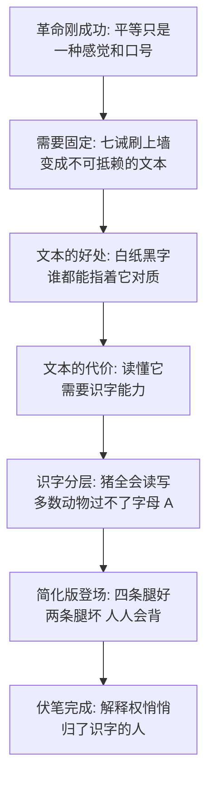

# 03｜七诫：为什么革命成功后，第一件事是把原则写下来？

> 赶跑了琼斯，动物们第一件大事不是分粮食、不是庆功，而是把七条戒律刷上谷仓的墙——为什么革命要从立法开始？而这面墙为什么同时是纪念碑和靶子？

---

## 一、先说结论

七诫是动物农庄的宪法。革命靠口号发动，但口号会飘、会忘、会被各说各话——只有把「所有动物一律平等」变成白纸黑字，新秩序才算落了地。七诫把三件事一次性钉死：谁是敌人（两条腿），谁是自己人（四条腿和有翅膀的），以及我们绝不能变成什么样（不穿衣、不睡床、不饮酒、不杀同类）。但奥威尔在写下七诫的同一段里就埋了伏笔：**能写字的是猪，能念全文的没几个**。法律刻在了墙上，解释权却握在识字者手里。这面墙既是平等的纪念碑，也是日后被逐条涂改的靶子。

## 二、我们先理解一个问题

设想一下起义成功后的那个清晨。农庄归自己了，庄稼等着收，农舍空着，理论上动物们可以做任何事：分地、选个头领、甚至大睡三天。

可书中写道，他们做的第一件具有制度意义的事，是搬来梯子、调好油漆，把七条戒律刷上大谷仓的山墙。问题来了：规矩写在纸上是给人看的，而大多数动物根本不识字——一场全民立宪，立给了一群没法读它的公民。那么，把原则写下来到底解决了什么问题？又制造了什么问题？

## 三、作者到底提出了什么观点？

奥威尔写道，猪们把老少校的思想「归纳成一个完整的体系，称之为动物主义」，再浓缩成七条戒律，用大号白漆写在墙上，三十码外都看得见。这七条是：

> 一、凡用两条腿行走者是敌人；
> 二、凡用四条腿行走者或长翅膀者是朋友；
> 三、任何动物不得穿衣；
> 四、任何动物不得睡在床上；
> 五、任何动物不得饮酒；
> 六、任何动物不得杀害任何其他动物；
> 七、所有动物一律平等。

这七条的结构很讲究：前两条划敌我边界，中间四条划行为底线——每一条底线都是一条「不许变成人」的禁令，最后一条是全部原则的原则：平等。

紧接着，奥威尔做了一件更值得注意的事：他花了一大段写各动物的识字水平。书中写道，猪读写全会；狗学会了念，但对七诫之外的东西没兴趣；山羊穆里尔能念报纸碎片；驴子本杰明念得和任何一头猪一样好，但从不读——他说「据我所知没什么值得读的」；苜蓿认得全部字母却拼不成词；拳师学到字母 D 就再也记不住后面；莫丽只肯学拼自己名字的六个字母；其余的——羊、鸡、鸭——连字母 A 都没过。

所以雪球做了个变通：把七诫压缩成一句所有动物都背得出的口号——「四条腿好，两条腿坏」。母鸡还较真过：那我们算不算两条腿？雪球的裁定是：翅膀是推进器官不是操纵器官，应当算作腿。这是全书有记录的第一例「释法」——条文需要解释，而解释由识字的人给出。

## 四、把这个观点翻译成人话

用大白话说：**写下来，原则才存在；但写下来之后，谁识字谁就替它发言。**

口号时代的平等是感觉，感觉没法拿来对质。写成条文，动物们第一次有了可以指着说「你违反了第几条」的东西——这是立法真实的、巨大的好处，别低估它。

但文本有个结构性代价：它不自动说话。墙上的字不认识你，你得先认识它。于是平等的法典竖起来那一刻，一个不平等的能力结构也同时生效了——能读的替不能读的念，能写的替不能写的改。七诫解决的是「我们相信什么」，制造的是「谁说了算我们相信什么」。

## 五、为什么会这样？

为什么一部平等的宪法，从诞生起就带着不平等的种子？奥威尔的推理链是这样的：

这条链上有两个环节要单独说。

第一是「简化不是中立的」。「四条腿好，两条腿坏」听起来是七诫的缩写，但它实际只保留了第一条的敌我边界——「不得睡床」「不得饮酒」「不得杀同类」「所有动物一律平等」这四条全部消失了。也就是说，给不识字者的版本里，平等二字根本不在场。当一部宪法在大众记忆里只剩下站队口号，往后要改掉它，甚至不需要动笔。

第二是「释法先于违法」。母鸡问翅膀算不算腿的那一刻，一个机制就建立了：条文有歧义时，由识字者裁定。雪球这次裁定是善意的、合理的——但这个「由我来告诉你条文什么意思」的先例一旦成立，用它的就不只雪球了。

## 六、举一个现实生活中的例子

想想赶走物业之后的小区自治。

某小区业主忍了物业五年，终于投票把它换掉。业委会成立当天做的第一件事，就是起草《业主自治公约》——厚厚一册，车位怎么分、装修怎么管、公共收益怎么用，条条清晰，打印出来贴在单元大堂。业主们鼓掌、拍照、转发，都说「这下规矩是咱们自己定的了」。

半年后，争议来了：访客车位收费归谁、楼顶能不能装基站，公约里都有条款，但各家理解不一样。这时大家发现，每次争论最终说了算的，总是那两三个最闲的业委会成员——他们有功夫翻条文、查法规、逐句比对，还能随口背出「公约第十二条第二款」。其他人不是不识字，是没功夫、没耐心，也记不清自己签的到底是第几版。

公约还贴在大堂，人人经过人人看得见——但看见不等于能引，能引不等于能辩。墙不会自己开口，总得有人替它开口；而替它开口的那几个人，渐渐成了小区实际上的立法者、法官和执法者。公约没有失败，它只是安静地换了主人。

## 七、回到书中重新理解

现在再看这面墙，奥威尔埋了两层意思。

第一层是历史影射。革命成功后立刻颁布纲领和宪法，是所有现代革命的标准动作——法国革命有《人权宣言》，苏俄有宪法，殖民地独立有建国纲领。七诫就是动物农庄版的立宪时刻，连「用大号字写上公共建筑」这个细节都符合仪式惯例。

第二层是伏笔：请再读一遍那七条——不睡床、不饮酒、不杀同类、一律平等。奥威尔不是在立法，他是在立靶子。每一条戒律都精确预告了一桩将来会犯的罪：猪会睡上床、喝上酒、杀掉同类，然后声称「有些动物更平等」。也就是说，奥威尔在全书开头就把作案清单交给了读者，然后让接下来两百页逐条打勾。而那段看似闲笔的识字普查，是他提前告诉你：到时候改墙的笔，握在谁手里。

## 八、这个观点背后还有什么？

第一，注意七诫的定义方式：中间四条全是「不许变成人」的禁令——这部宪法说的是「我们不要成为什么」，而不是「我们要成为什么」。只规定反面的法典，把正面问题留空了：那动物农庄该建成什么样？这个空缺不会一直空着，它会被管事的人顺手填上。

第二，本杰明值得单独一行。他识字，读得和猪一样好，但他从不读——「没什么值得读的」。奥威尔在识字普查里放进这头驴，是在说：识字的缺席有两种，一种是认不得字，一种是认得但选择不看。对权力而言两者效果一样——解释权照样垄断。但后者更冷：能监督的人主动弃权，比不能监督更让人无话可说。

第三，那面墙的位置也有讲究：刷在山墙上，三十码外可见——它同时是法律和景观。动物们仰头看它时看到的不是条文，是「我们有自己的法了」这个感觉。当文本的功能从被阅读退化为被仰望，它离被改写就不远了，因为仰望者不会发现上面少了几个字。

## 九、这个观点有问题吗？

说服力在哪：「文本制造解释权阶层」是扎实的历史观察——从解读《圣经》的神职人员到现代法律人，识字能力确实一直在为权力分层。奥威尔更细的地方在于他指出：变质不是在违法那刻开始的，是在「只有我能告诉你条文意思」的先例建立那刻开始的。

争议在哪：第一，识字垄断可能只是结果而非原因——猪之所以握有解释权，是因为他们先握有组织权：主持会议、起草条文、分管委员会。一些学者认为，把矛头指向识字是找错了层级，真正的分层在识字之前就完成了。第二，成文法到底起没起作用也可以争——后来的每一次违法，猪都得偷偷摸摸改墙、不敢明目张胆无视它，说明那面墙多少还是个约束。没有它，腐化可能连遮掩都不用。

哪里过度简化：把「谁能读」当成权力分野，低估了「谁来执行」的分量——现实中的法典失效，往往不是因为没人读得懂，而是因为没有独立的裁判和制衡。动物农庄缺的不只是识字的公民，是整个制衡结构。

还有哪些其他解释：一种更悲观的解释认为，墙从一开始就是装饰——真正的法从来是「谁握着暴力」，条文只是事后贴上去的合法性；另一种解释则反过来强调公民责任：穆里尔能念、本杰明会读，他们本可以每周念一遍给全场听——墙不是被垄断的，是被让渡的。

## 十、今天再看这个观点

以下部分是基于作者思想的现代延伸，不是作者原话。

今天的「识字壁垒」不在字母表上，在语言和结构里。用户协议、隐私条款、平台规则，每一个都是刷在墙上的七诫：技术上人人可读，实际上没人读完，解释权天然归写它的那一方。我们滚动到底点下「同意」的动作，和农场动物仰头看墙的动作，功能完全一样——不是理解，是确认「规矩存在」这件事本身。

而「简化版宪法」——把七条压成一句口号——在今天成了标准操作：复杂条款被压成一句标语、一个 meme、一句平台格言，传得最广的版本永远是被删掉平等那一条的版本。所以一个组织立规时真正该问的也许是：不能读全文的人，拿到的那个版本里还剩下什么？

## 十一、这一篇真正应该记住什么？

1. 原则只有写下来才算存在：口号会飘，白纸黑字才能把「平等」变成可以对质的条文。
2. 文本天生需要中介：谁识字、谁释法，谁就替整部法律发言——立法同时制造了新的权力分层。
3. 简化不等于等值：「四条腿好，两条腿坏」丢掉了平等和禁令，只留下了站队——大众版本缺了什么，日后就从哪里失守。
4. 每条戒律都是预告：写下「绝不能变成什么样」的那一刻，也把将来的罪状清单写好了，就看改墙的笔在谁手里。

## 十二、留一个问题

七诫立起来了，识字分层也摆在那了——但此刻的农庄还没有任何人犯罪，墙上一笔未改。那第一道裂缝会出现在哪里？不在墙上，在一个谁也想不到的地方：一桶挤好了没人管的牛奶，和一地按老规矩本该大家分着吃的苹果。下一篇，我们看特权是怎么从最小的例外开始的。
