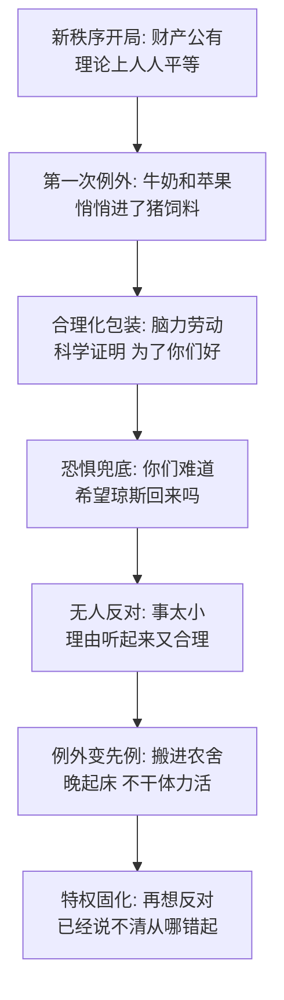

# 04｜消失的牛奶和苹果：特权是怎么从「小例外」开始的？

> 动物农庄丢失的第一批财产，不是粮食、不是工具，而是一桶牛奶和一地没人注意的风落苹果——腐化为什么偏偏从这种小事开始？

---

## 一、先说结论

革命后第一批消失的公共财产是牛奶和苹果——悄无声息地进了猪的饲料。理由听起来无懈可击：猪是脑力劳动者，整个农庄的管理都靠他们；科学研究证明牛奶和苹果含有猪健康必需的物质；「我们其实根本不喜欢吃，完全是为了你们才勉强吃的」。尖嗓子最后还补了一句杀手锏：「你们难道希望琼斯回来吗？」奥威尔的洞察是：**暴政很少以暴政的面目登场，它从一个个合情合理的例外开始**。第一桶牛奶消失时没人问，等特权长成惯例，就再也说不清该从哪一条反对起了。

## 二、我们先理解一个问题

如果要找一场腐化的起点，你会去哪找？多半会盯着大事：谁夺了权、谁清了异己、谁改了规矩。但奥威尔把起点放在了一个几乎看不见的地方——收工回来，傍晚的院子里少了五桶奶。

问题就在这：动物农庄里发生的第一次不公，为什么小到没人觉得值得计较？这个「小」是巧合，还是机制本身的一部分？再问一层：动物们真的没有反对的机会吗——奶就在那摆着，谁喝了谁都看得见，可为什么从头到尾没有一个人问一句？

## 三、作者到底提出了什么观点？

书中写道的经过平淡到近乎无聊。收割大忙那天，母牛的乳房胀得难受，猪提来桶把奶挤了——蹄子居然意外好用。五桶泛着沫的鲜奶摆在那，不少动物饶有兴致地围观，有只母鸡还提起：「琼斯以前偶尔往我们的饲料里掺一点。」拿破仑摆摆手：「别管牛奶了，收庄稼要紧，奶的事会有人管的。」动物们出工去了。晚上回来，奶没了。

接着是苹果。果园里的风落果往年按惯例大家分，这次却传来命令：落地的苹果全部收集起来送到农具房，专供猪食用。有动物嘀咕了几句，尖嗓子出面解释。奥威尔写下的那番话，值得逐句拆：

第一，职责框架：「你们该不会以为我们这么做是出于自私和特权吧？我们许多猪其实根本不喜欢牛奶和苹果——我本人就不喜欢。」

第二，科学背书：「牛奶和苹果含有对猪的健康绝对必需的物质——这一点已经由科学证明了，同志们。」

第三，自我牺牲：「我们猪是脑力劳动者，这个农场的全部管理和组织都系于我们一身。我们不分昼夜地守护你们的福祉。我们喝奶吃苹果，完全是为了你们。」

第四，恐惧兜底：「你们知道如果我们猪失职了会怎样吗？琼斯会回来！没错，琼斯会回来的！」

书中写道，「于是事情便这样定了，动物们毫无异议」。此后，书中继续写道，猪一步步搬进农舍、起床越来越晚、彻底不再干体力活——每一步都小，每一步都配好了说法。

## 四、把这个观点翻译成人话

用大白话说：**特权从来不是抢来的，是解释来的。**

如果拿破仑第一天就宣布「以后好东西归我」，那等于向全庄宣战。但「脑力劳动者需要营养，科学家说的，而且是为了你们」——这个包装的厉害之处不在于它多高明，而在于反对它的成本太高：你反对喝牛奶，就等于质疑管理层的健康；质疑管理层，就等于想让大家没人管；没人管，就等于盼着琼斯回来。一句「合情合理」后面拴着一条恐惧链，每一环你都驳不动。

而「第一次」之所以关键，是因为先例不登记。第一桶奶消失时没有任何文件、没有投票、没有决议，它只是没被问——可一旦第二次发生，它就不再是例外，而是「历来如此」。反对一件没发生过的事很容易，反对一个「惯例」却找不到可撤的那张纸。

## 五、为什么会这样？

为什么腐化一定要从小事开始、靠解释开路？奥威尔的推理链是这样的：

这条链上有两个环节值得单独看。

第一是「小是机制」。一桶奶、一筐风落果，刚好小到触发不了集体反应——为它翻脸显得小题大做，为它开会又不够议程。每一步单看都可辩护，问题从来不在某一步上，而在步与步的方向上。腐化不是一次越线，是一连串「这没什么」的累加。

第二是「解释权在此刻动工」。注意这一幕里发生了什么：没表决、没公告，先造成既成事实，再派尖嗓子补一份解释。这套「先做了再说、说了就等于合法」的操作，在牛奶事件里第一次完整演练了一遍——日后的每一次越界，用的都是这套模具。

## 六、举一个现实生活中的例子

想想「领导专用车位」是怎么长成的。

某公司写字楼车位紧张，天天有人为抢车位迟到。有一天行政在门口最好的位置立了个小牌：「总经理专用」。理由完全说得过去：总经理经常外出见客户，回公司要争分夺秒，总不能让人家绕三圈找车位——而且说了，这是临时安排。

半年后，总经理其实不怎么外出了，车位还空在那。新员工入职被告知「那个位置别停」，问为什么，没人说得出出处——没文件、没发文，只有惯例。有个愣头青停过一次，被叫去谈话，谈的还不是规则，是「工作态度」。有人提议取消，行政一摊手：取消什么？它从来没正式存在过，你找不到一张可以撤销的纸。

这个车位的演变和牛奶一模一样：小到一个牌、一句话；理由正当得挑不出错；从未立法却已成事实。特权最省事的建造方式，不是争下来的，是安静下来的——只要第一次立牌时没人问，后面连问的对象都消失了。

## 七、回到书中重新理解

现在再看这一幕，奥威尔埋了两层意思。

第一层是历史影射。牛奶和苹果影射的是革命政权中特权阶层的形成过程——苏联的干部配给、特供商店、疗养院和达恰，起点同样是「干部担负更重要的工作，需要更好的保障」这一套说辞。待遇不是被宣布为特权的，而是被论证为职责所需的；等它成为制度，论证也就不再需要了。

第二层更冷：注意恐惧牌第一次打出是在这里。「你们难道希望琼斯回来吗」——这句话将在之后每一桩更大的不公面前重复使用，直到成为条件反射。奥威尔的安排非常精确：新政权的第一项特权和第一件统治武器，是在同一场戏里、同一段话里一起出生的。解释和恐吓，从第一天起就是连体的。还有个小细节：出面解释的是尖嗓子而不是拿破仑本人——宣传器官先于恐怖器官上工，领袖在幕后，话术在台前。

## 八、这个观点背后还有什么？

第一，「我们其实根本不喜欢吃」这一句值得停一下。特权被重新包装成了负担——不是享受，是牺牲。这个话术的高明处在于它提前没收了别人的嫉妒：你不但不该眼红，还该心怀感激，因为人家是替你受这份罪。把利益说成义务，是特权修辞里最耐用的一招。

第二，动物们不是被骗，是配合了被骗。奶就摆在那里，五桶，谁喝了都看得见；母鸡甚至记得琼斯掺过奶。他们缺的不是信息，是「问一句」的习惯。特权的第一种原料不是隐瞒，是没人提问的现场。

第三，注意失窃物品的挑选：风落果是边际财产——没有主、没入账、没人清点过。腐化往往从产权最模糊的地带下口，因为那里没有「被偷」的对象，只有「顺手归谁」的选择。牛奶也一样：它不属于哪只动物，它属于「大家」，而「大家」恰恰是最不会抗议的失主。

## 九、这个观点有问题吗？

说服力在哪：滑坡机制有充分的现实支撑——特权体系几乎都是从小额、合理、可辩护的待遇起步的；而「合理化的例外」比赤裸裸的掠夺更稳固，因为它给自己造了一套说法，让反对者先得过话术这一关。

争议在哪：第一，滑坡不是定律。许多小例外确实只是小例外——脑力劳动者有时真的需要更多保障，领导有时真的需要那个车位。把每一次特殊安排都当成腐化第一步，会错杀大量正常的技术性安排。第二，一些学者认为，这个场景暗含了奥威尔自己的立场预设：它默认猪从一开始就别有用心。但也可以读出另一种可能——腐化的关键不在第一桶奶进了谁的嘴，而在没有一个机制能在事后追问它。

哪里过度简化：把每一步特权都写成多米诺骨牌，隐含一个假设——方向一旦开始就停不下来。但现实中先例可以被撤销、惯例可以被审计，前提是有撤销和审计的机制。问题不在例外存在，在例外永远得不到复查。

还有哪些其他解释：制度主义的解释认为，牛奶消失的真正原因不是猪的贪心，是农庄没有任何核查安排——如果本杰明那天当众问一句「奶去哪了」，如果每周有人清点产出，这故事可能写不下去。按这个读法，该被问的不是「谁喝了奶」，而是「为什么没人问」。

## 十、今天再看这个观点

以下部分是基于作者思想的现代延伸，不是作者原话。

「合理化的例外」在今天已经模板化了：数据收集以「改善体验」之名扩大，临时权限以「应急需要」之名固化，管理层待遇以「责任重大」之名加码。识别这套话术有个简单办法——看它是否自带「为了你们」和「否则更糟」两个零件，一个负责合理化，一个负责封口。

更实操的问题是那桶牛奶教我们的反面：特权防不住，缺的是「问」的机制。审计、轮岗、公示、异议渠道——这些安排的价值不在它们能扳倒什么，而在它们保证第一桶奶消失时一定会有人问一句。制度要防的从来不是贪心，是沉默。

## 十一、这一篇真正应该记住什么？

1. 腐化的第一步必然是小步：小到不值得翻脸、不够上议程——小本身就是机制，不是巧合。
2. 特权从不以特权的面目出现：它总是穿着「职责所需」的外衣，还附赠一句「我们其实不喜欢」。
3. 第一次没人问，就没有第二次可问：例外不登记就成先例，先例没有文件可撤，你反对的将是一团空气。
4. 解释和恐吓是连体的：第一桶牛奶配的就是第一张恐惧牌——「你们难道希望琼斯回来吗」，这句话后来会重复使用。

## 十二、留一个问题

牛奶进了猪食槽，苹果进了农具房——特权的大门开了一条缝，但此刻的猪还是复数，还彼此看不顺眼。真正的大戏还没开场：琼斯已经不可能回来了，共同的敌人没了，可庄园只能有一个主人。雪球和拿破仑，两位革命功臣之间的那场仗，为什么非打不可？下一篇，我们看革命者自己的战争。
