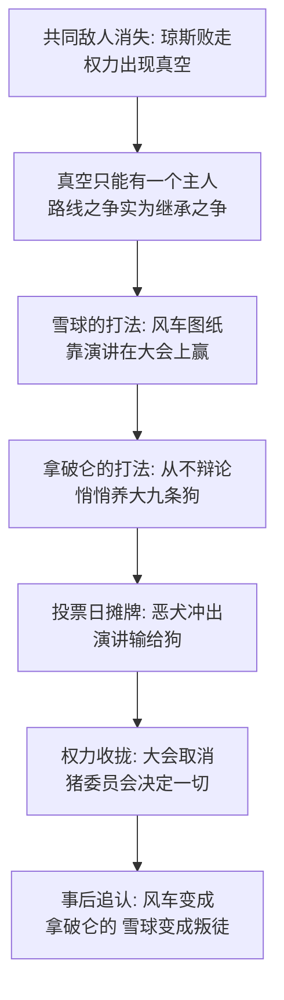

# 05｜雪球与拿破仑：为什么革命者之间必有一战？

> 琼斯赶跑了，人类再没回来。外部敌人消失之后，动物农庄的第一场内战却在两位革命功臣之间爆发——为什么革命者之间必有一战？

---

## 一、先说结论

雪球和拿破仑的斗争表面上是路线之争：一个要建风车搞电力，一个要先保粮食生产；一个主张向外传播革命，一个主张先巩固自己。但奥威尔要写的是路线下面的东西：**权力真空只能容纳一个主人，所以这场仗非打不可**。而决定胜负的不是谁的主张更好——拿破仑从不辩论，他只是早早抱走了一窝幼崽，把它们养成了九条恶犬。投票那天，会演讲的输给了会养狗的。奥威尔的冷峻之处在于：在权力真空里，谁愿意用的手段底线更低，谁就赢。

## 二、我们先理解一个问题

先看这两个主角的履历。雪球：牛棚战役的指挥官、一级动物英雄、会画图、会演讲，革命的理论和组织多半出自他手。拿破仑：革命的组织者之一，同样是一级功臣，平时话不多。论功劳、论资历、论对革命的投入，两人不分伯仲。

问题来了：一个农庄容得下几百只动物，为什么容不下两头有本事的猪？公司有联合创始人，政党内阁有不同派系，合作得好的搭档多了去了——为什么到了这里，分歧就非要变成你死我活的驱逐？这场仗是两个人性格不合的意外，还是结构里的必然？

## 三、作者到底提出了什么观点？

书中写道的对立是全盘的。雪球主张建风车：他从琼斯留下的一本讲电学的旧书里学来方案，在谷仓地上画出复杂的图纸——有了电，就有了灯光、暖气、机器，动物一周只需工作三天。拿破仑的反应是沉默，直到有一天他走到图纸前，抬起后腿在上面撒了一泡尿，一言不发地走了。

分歧不止风车。雪球主张派鸽子去别的农庄煽动起义——到处都革命了，就没人来打我们；拿破仑主张武装自己——要保卫农庄，得靠自己有枪有训练。每周日的大会上，雪球口若悬河，演讲总能当场征服听众；拿破仑不擅长演讲，但他「在会下更善于争取支持」——尤其讨好了羊群，教它们在雪球讲到关键时刻齐声高喊「四条腿好，两条腿坏」，把讨论淹掉。

摊牌在风车投票日。雪球讲完最后一场漂亮的演讲，全场眼看要倒向他——拿破仑发出一声古怪的呼哨，九条大狗冲进会场直扑雪球。雪球满院子奔逃，最后跳过篱笆逃走，从此再没回来。没有审判，没有辩论，没有点票。

接下来是收权。拿破仑宣布：周日全体大会取消，从今往后一切事务由猪组成的特别委员会决定，他亲自任主席。四头年幼的母猪怯生生地提出异议，狗一龇牙，羊群立刻开喊口号——安静了。

然后是改写。几周后，拿破仑宣布风车还是要建的。尖嗓子出面解释：风车本来就是拿破仑同志的构想，雪球图纸是偷去的；当初反对只是策略——「为了除掉雪球这个坏分子而采取的战术」。说完他蹦跳着转了个圈，快活地甩着尾巴补了一句：「战术，同志们，战术！」

## 四、把这个观点翻译成人话

用大白话说：**当两个人都认为舵该由自己来掌时，争论什么航线已经没有意义了。**

风车之争是真的，但风车之争也是壳——壳下面只有一个问题：谁说了算。这个问题没法靠辩论解决，因为辩论的前提是双方都接受辩论的结果；而当赌注是「谁掌全盘」时，输的那方凭什么认账？所以这场斗争的实质从一开始就不是说服，是排除。

雪球在为辩论做准备——练演讲、画图纸、研究方案；拿破仑在为结局做准备——养大九条狗。两个人在参加同一场比赛，但一个人打的是规则内的仗，另一个人提前决定了规则作废的日期。赢的从来不是讲得更好的那个，是先想明白「这场仗其实不是靠讲」的那个。

## 五、为什么会这样？

为什么共同敌人一消失，战友就成了敌人？奥威尔的推理链是这样的：

这条链上有两个环节要单独说。

第一是「共同敌人的隐形功能」。琼斯在的时候，动物之间的所有分歧都被「先对付人」压住了——外敌是个粘合剂，让内部排名这件事可以无限期推迟。敌人消失那一刻，推迟到头了：谁当头、怎么分、听谁的，立刻从背景问题变成唯一问题。这不是谁变坏了，是结构松了绑。

第二是「手段的不对称」。雪球准备的是赢得争论的东西：图纸、数据、口才。拿破仑准备的是终止争论的东西：狗。狗一进场，争论这个形式本身就被取消了——雪球不是被否决的，他是被移出了「有资格投票」的范畴。手段底线更低的一方，同时拥有了改写比赛规则的权力。

## 六、举一个现实生活中的例子

想想联合创始人的出局。

两位创始人合伙创业。一位是产品天才，全员会上永远是最亮的那个，路演能把投资人讲站起来；另一位低调，管运营、管后台，平时几乎不发言。两人在公司方向上吵了一年：一个要做新产品线，一个要守住现金牛。

那位安静的在吵的这一年里做了些别的事：董事会席位是他的人，公章和网银U盾在他的部门，法务总监是他招的，投资人那边的沟通一直是他在跑。摊牌那天，产品天才做完一场漂亮的提案演讲，董事会投票——门锁换了，邮箱封了，公告说他「因个人原因离职」。半年后，公司官网的创始故事里，他被写成了「从一开始就反对公司方向、险些拖垮团队」的那个人。而当年那份打动投资人的商业计划书，一半是他写的。

留在公司里的人后来都学会了一种新的记忆方式：记得少一点。这和动物农庄一模一样——会演讲的输给了管门禁的；出局者不只是一个输家，他会被追认成一个从来就不对的人。

## 七、回到书中重新理解

现在再看这场斗争，奥威尔埋了两层意思。

第一层是历史影射，而且是全书最直白的影射：雪球对应托洛茨基，拿破仑对应斯大林。托洛茨基是十月革命的军事天才、红军缔造者、演说家——正如雪球是牛棚战役的英雄；斯大林是被低估的组织者，靠党务机器在会下布局——正如拿破仑「更善于在会下争取支持」。结局也一模一样：驱逐、流亡、然后被追认为一切灾难的源头。奥威尔甚至复刻了细节：托洛茨基曾是军事家，所以雪球研究的是凯撒战记；斯大林当年被视作平庸的事务型人物，所以拿破仑从头到尾「不太会说话」。

第二层是事后追认的机制。请注意尖嗓子那套说辞的时序：雪球刚走，风车还是雪球的坏主意；几周后，风车成了拿破仑的构想、雪球是剽窃者；再后来——我们会看到——雪球会从「争权失败者」被追封为「潜伏多年的内奸」，连牛棚战役的战功都会被改写。被驱逐者的罪名不是驱逐前定的，是驱逐后按需生产的。理由跟着需要走，这是权力叙事的标准操作。

## 八、这个观点背后还有什么？

第一，幼崽被抱走的时间点值得记住：是在革命刚成功、还在烧马具唱赞歌的时候。也就是说，拿破仑在为这场当时还看不见的仗做准备的时候，雪球在画风车。养狗人的优势是耐心——他投资的是一种在摊牌之前毫无用处、在摊牌之日决定一切的能力。

第二，羊群的作用不能漏。拿破仑不是靠狗赢的第一场，他是靠羊群赢的每一次小场——每到雪球要占上风，「四条腿好，两条腿坏」就准时响起，把讨论变成噪音。群众的口号在他手里是程序性武器：不反驳你，只让你没法被听见。

第三，注意那四头提出异议的小母猪——那是全书最后一次出现「内部异议」这个动作。狗一龇牙、羊一喊，异议消失。从这一刻起，在动物农庄表达不同意见不再是一个言论行为，而是一个生存计算题。

第四，「战术，同志们，战术」——连自己的出尔反尔都能被包装成深谋远虑。权力不只是赢，它还会回头改写「是怎么赢的」：昨日的反对变成今日的策略，对手的遗产变成自己的构想。

## 九、这个观点有问题吗？

说服力在哪：托洛茨基与斯大林的对应几乎逐点吻合；「手段底线决定胜负」的逻辑能解释为什么理想主义者反复输给不择手段者；而「外部敌人粘合内部」的真空理论，在政治学上对继承危机有相当的解释力。

争议在哪：第一，「必有一战」可能被说得太满了。路线之争里也有真东西——托洛茨基的「不断革命」和斯大林的「一国建成社会主义」不是假装的立场，把它彻底还原成权力斗争，等于抹掉了政治里真实存在的路线分歧。第二，这种读法容易同情失败者——雪球写得光彩照人，但他也是猪：牛奶和苹果他喝了，解释权他握了，委员会他主持了。一些学者认为，农庄的病不在哪头猪赢，而在赢的注定是猪。

哪里过度简化：把胜负归因于「谁更敢用暴力」，低估了拿破仑前期的组织积累——他有羊群、有委员会、有会下经营，狗只是最后一步，不是全部步骤。暴力是收尾，铺垫是制度性的。

还有哪些其他解释：结构主义的解释认为，没有继承规则的制度必然产生这种斗争，换谁上台都一样；甚至有一种更激进的读法认为，就算雪球赢了，以他对话语权和特权的享用方式，农庄大概率也不会变成民主制——奥威尔对此故意留白，让「若雪球赢会怎样」永远悬着。

## 十、今天再看这个观点

以下部分是基于作者思想的现代延伸，不是作者原话。

「控制基础设施的人赢」在今天的组织里几乎是一条定律：谁管着账号权限、股权结构、公章法务、现金流，谁就在摊牌日握着狗——演讲和愿景只能赢下会议，赢不下门钥匙。观察任何组织的权力斗争，别只盯着会上谁说得漂亮，去看会下谁在悄悄收拢那些平时没用、决战时有用的东西。

「事后追认」更是当代标准操作：出局者被追认为「一贯的方向反对者」，前任的遗产被改名换姓成现任的构想，每一次翻脸都被公关稿写成「战略的一部分」。读任何一方的官方叙事都该多问一句：这个罪名，是摊牌前立的，还是摊牌后补的？

## 十一、这一篇真正应该记住什么？

1. 共同敌人是粘合剂：外敌在，内部排名可以推迟；外敌一走，谁当头立刻成为唯一问题。
2. 权力真空里的路线之争是代理战争：表面上争风车还是粮食，实际上争的是谁说了算——辩论解决不了它，因为输家不会认账。
3. 手段的不对称决定胜负：一个准备赢争论，一个准备终止争论，养狗的赢了演讲的；底线更低的一方同时买下了改写规则的权利。
4. 赢者改写胜利史：雪球不只输了，他被追认成「从一开始就是叛徒」——罪名按需生产，理由跟着需要走。

## 十二、留一个问题

雪球翻过篱笆消失了，农庄安静下来。但让我们倒回去看一眼那个决定一切的瞬间：九条大狗是从哪冒出来的？它们是什么时候、被谁、以什么名义养大的？为什么拿破仑早在庆功的时候就开始养它们——他养的时候就知道会有这一天吗？下一篇，我们看这九条狗，和暴力机关怎样成为独裁真正的地基。
