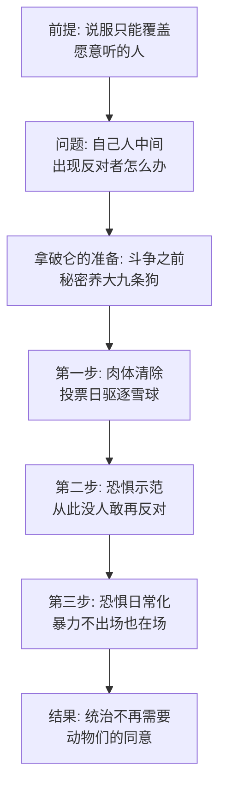

# 06｜九条狗：为什么独裁者真正的根基不是口号而是暴力？

> 拿破仑不会演讲、不出席会议、几乎不露面——他的统治到底靠什么撑起来的？

---

## 一、先说结论

拿破仑的统治不靠说服，靠九条狗。奥威尔在书里写得很早也很隐蔽：革命刚成功，拿破仑就从蓝铃花和小花狗身边带走了一窝幼崽，说是要「亲自负责它们的教育」，然后把它们藏在阁楼上，谁也不见。等它们再出场，已经是九条体格庞大、目光凶狠、只对拿破仑摇尾巴的恶犬。从那天起，动物农庄的政治规则变了：谁反对，狗就冲向谁。奥威尔借这个安排说了一件很冷的事——**宣传说服的是外人，暴力对付的是自己人；独裁者可以失去所有选票，只要还没失去枪杆子。**

## 二、我们先理解一个问题

先注意一个反差。雪球靠什么赢支持？演讲、辩论、画图纸、组织各种委员会——全是「说服」的功夫。拿破仑在这些方面样样不行：他几乎不发言，从不争辩，局势不明的投票他干脆不参加。

按理说，这样的角色应该输掉。但结果我们都知道：雪球被几条大狗追着咬、逃出农庄，从此再没回来。

问题来了：一个不会说服任何人的领导者，是怎么让所有人服从的？答案是，他从一开始就没打算说服——他在准备另一种东西。

## 三、作者到底提出了什么观点？

书里对狗群的交代只有几笔，但每一笔都关键。

第一笔，**带走幼崽**。书中写道，蓝铃花和小花狗生了一窝九只崽，刚断奶，拿破仑就把它们从母亲身边带走，说要「亲自负责它们的教育」，随后把它们关在阁楼里，全农庄几乎忘了它们的存在。注意时间：这发生在一切权力斗争之前。别人在争话语权的时候，他在养狗。

第二笔，**首次出场即定局**。表决风车方案那天，九条狗突然冲进会场，直扑雪球。书中写道，要不是雪球跑得快，当场就没了。狗群没有审判、没有辩论、没有任何程序——它们的功能就是一句话：反对者物理消失。

第三笔，**从武器变成日常**。驱逐雪球之后，狗成了拿破仑的贴身卫队，他走到哪里狗跟到哪里；再往后，狗成了处决者——谷仓前的大清洗，动嘴「认罪」的是动物，动口撕碎的就是这群狗。书中写道，动物们对狗的恐惧，已经超过了当年对琼斯鞭子的恐惧。

第四笔最容易被忽略：狗和马本来是一样的角色——都是农庄里最忠心的劳力。拳师的忠诚献给「动物农庄」这个集体，狗的忠诚却只献给一头猪。奥威尔认为，同样的忠诚，服务对象换了，性质就全变了。

## 四、把这个观点翻译成人话

用大白话说：**口号和制度管的是「愿意配合的人」，暴力管的是「不愿意配合的人」。** 一个政权只要还想维持表面的同意，就得不停地讲道理；一旦它有了随叫随到的暴力，讲道理就变成了可选动作。

再细一层：拿破仑养的不是「军队」，是「家兵」。九条狗不对农庄负责、不对七诫负责、只对拿破仑个人摇尾巴。这就是秘密警察和普通武装的区别——普通武装对外，秘密警察对内；普通武装服从制度，秘密警察服从个人。

所以那句结论可以再压缩一点：**独裁的根基不是有多少人支持你，而是有没有人敢替你动手。**

## 五、为什么会这样？

为什么九条狗比一百场演讲管用？逻辑链是这样的：

这条链上最关键的是第三步：恐惧的日常化。九条狗真正下口的次数屈指可数——驱逐雪球一次，大清洗一次。但它们的威力恰恰在于不必出场：每只动物心里都养着这九条狗。开会之前先想想狗，发言之前先想想狗，于是绝大多数「服从」根本轮不到暴力来执行，是动物们自己完成的。

这就是暴力机器的经济学：养九条狗很贵，但比说服一万只动物便宜得多，而且效果稳定——说服可能失败，恐惧从不失效。

还有一个细节：为什么非得「从幼崽养起」？因为成年的狗有旧记忆——它们记得琼斯，记得平等，甚至可能记得雪球是同志。只有从断奶就隔绝教育的狗，世界里才只有拿破仑一个坐标。暴力要可靠，必须先垄断施暴者的童年。

## 六、举一个现实生活中的例子

想一想某些公司里那种特殊的「监察部门」。

它可能叫合规组、内审组、总裁办督导组。它的编制不在正常组织架构图上，预算不走部门流程，考核不被人力资源管——它只对一个人汇报：老板本人。它的权力边界没人说得清：理论上只管舞弊，实际上谁的报销、谁的考勤、谁和谁吃了午饭、谁在群里说了什么，它都可以管。

这个部门的用人也有讲究：老板偏爱「自己带出来的人」，最好是入行就跟着他、外部没有关系网、离开他就无处可去的年轻人。为什么？理由和拿破仑养狗一模一样——世界里只有你一个坐标的人，咬谁都不会犹豫。

最像的地方在于它的实际用法：它平时几乎不动作，一年可能就「处理」一两个人。但全公司都知道它在。开会时没人提它，写邮件时人人想起它。九条狗冲出来只需要一次，往后的每一次沉默，都是它们替老板省下的管理成本。

## 七、回到书中重新理解

现在回头看，奥威尔埋狗这个伏笔的时机极狠：拿破仑带走幼崽，是在革命刚成功、大家还在唱《英格兰兽》的时候。也就是说，**在新政权的第一批工程里，就已经有一项秘密项目是给自己养打手的。** 变质不是从腐败开始的，是从恐惧的储备开始的。

这一幕影射的是苏俄的秘密警察系统——从契卡到内务部。它们的共同特征在书里被精准复刻：直接向最高领袖个人负责、绕过一切正常程序、以「保卫革命」的名义对付革命内部的人。书里狗群后来执行的正是内务部式的工作：监视、抓人、逼供、处决——而且处决对象全是「自己人」。

还有一点值得专门说：书中写道，动物对狗的恐惧超过了对琼斯鞭子的恐惧。这句话是全书的温度计——鞭子抽在身上，狗咬在心里。旧暴政让你疼，新暴政让你不敢出声。

## 八、这个观点背后还有什么？

第一，暴力机器有个隐蔽特性：它必须被使用，否则就会贬值。狗养久了不见血，威慑会衰减，执行者的「业务能力」也会退化。这解释了为什么清洗是周期性的——不全是拿破仑多疑，也是暴力机器自身需要定期运转。后面谷仓前的屠杀，某种意义上是狗群的「练兵」。

第二，暴力的忠诚只向上，不向前。九条狗保护了拿破仑，但书里没有一处写它们保卫过「动物农庄」——人类反攻的风车战役里，流血最多的是拳师，狗群的存在感低得可疑。家兵的功能从来只有对内一个。

第三，这个安排改写了「教育」这个词。拿破仑说「亲自负责它们的教育」——教育是这本书里反复出现的关键词：猪教育自己读书写字，教育羊群喊口号，教育狗咬人。同一个词，教出的是统治者、愚民和打手。谁垄断教育，谁就在为每个阶层定制它该有的样子。

## 九、这个观点有问题吗？

说服力在哪：把暴力机关放在统治的核心位置，符合二十世纪政治的基本事实。从契卡到各类秘密警察，「对内暴力」确实是极权政权区别于普通威权的关键部件。奥威尔用一个「养狗」的细节把整台机器的人格化逻辑讲透了——忠于个人、隔绝社会、从小驯化，这三点几乎就是秘密警察的人事手册。

争议在哪：第一，「暴力是根基」可能高估了恐惧的独立作用。一些学者认为，复盘斯大林体制时不能只看恐怖，还有庞大的利益分配、晋升通道和意识形态认同——很多人服从不是怕狗，而是真的相信或真的受益。书里其实也暗示了这点：羊群的口号和尖嗓子的宣传，作用并不比狗小。第二，狗群的形象容易让人把暴力理解成「少数坏人加一群打手」，而现实中参与暴力机器的往往是大量普通职员，平庸之恶比恶犬更难写。

哪里过度简化：把对内暴力浓缩成九条狗，忽略了制度化恐怖的官僚面——档案、名单、流程、指标。真实的大清洗不是狗咬人，是纸张咬人；寓言选择了更锋利的形象，代价是丢了恐怖的日常质地。

还有哪些其他解释：一种解释认为暴政的真正根基是「合谋」而非暴力——多数人从体制里分到一点好处，于是自愿维护它，暴力只是给不合作者的备份方案；另一种更结构化的解释认为，关键不在暴力本身而在「暴力使用的不可预测性」——随机的恐怖比定向的恐怖更能瓦解社会信任。

## 十、今天再看这个观点

以下部分是基于作者思想的现代延伸，不是作者原话。

今天绝大多数组织当然没有狗。但「只对个人负责的强制力」这个结构并没有消失，只是换了形态：可以绕过流程的处罚权、只向一把手汇报的督查线、掌握全部数据却不受监督的平台安全部门，以及算法时代那个更隐蔽的版本——不透明的封禁与限流机制。它们共同的特征就是九条狗的本质：**强制力存在、不受被强制者约束、且让所有人意识到它存在。**

更值得警惕的是「恐惧日常化」那条链——当「会不会被处理」成为每个人发言前的后台计算，暴力就已经完成了九成的工作，而且账面上一次都没出手。今天我们讨论「寒蝉效应」，说的其实就是那九条没有出场的狗。

## 十一、这一篇真正应该记住什么？

1. 拿破仑不养说服力，养狗——斗争开始之前，他已经在储备暴力。
2. 秘密警察和普通武装的区别：一个对内、忠于个人；一个对外、忠于制度。
3. 暴力最大的效用不是咬人，是不用咬人——恐惧日常化之后，服从由被统治者自己完成。
4. 教育是关键伏笔：从断奶养起的狗，世界里只有主人——可靠的暴力需要垄断施暴者的童年。

## 十二、留一个问题

如果恐惧可以替代同意，那么一个政权还需要「同意」吗？还是说，只要它表现得像在为人民做事，恐惧和同意就可以长期共存？

这个问题先存着。九条狗解决了「没人敢反对」的问题，但独裁者很快发现还有另一个问题：动物们一旦闲下来，就会想、会比较、会算账。怎么让一群被统治者的体力和精力全部被占满，满到没力气怀疑？拿破仑的答案是那座风车——而这座风车，原本是他最厌恶的东西。下一篇，我们看宏大工程怎么变成统治工具。
