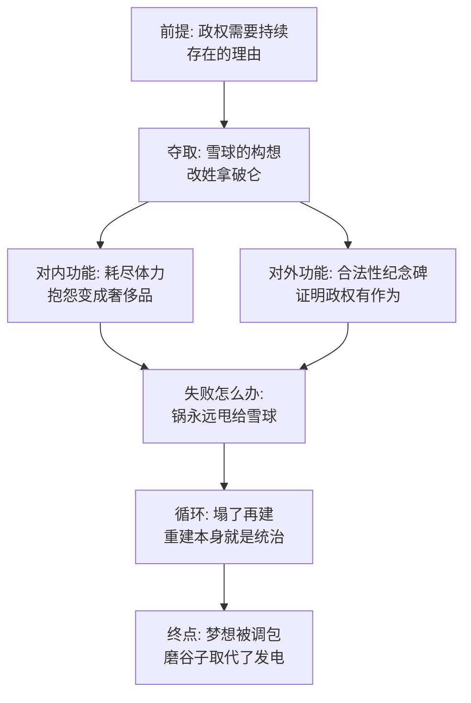

# 07｜风车：为什么宏大工程会成为统治工具？

> 拿破仑当年在风车图纸上撒尿，为什么后来自己成了「风车之父」，还让全农庄为它搭上半条命？

---

## 一、先说结论

风车本来是雪球的发明，拿破仑当年反对到在图纸上撒尿。可雪球被赶走以后，风车摇身一变，成了「拿破仑同志的伟大构想」，而且一建就是三回，把全农庄最壮的马力都耗死在上面。奥威尔借这座风车说出了宏大工程在独裁手里的双重功能：**对内，它耗尽动物的体力，让抱怨变成奢侈品；对外，它是政权合法性的纪念碑。** 风车塌了可以再建，反正锅永远有人背——雪球。

## 二、我们先理解一个问题

先把时间线捋直：雪球画图纸的时候，拿破仑是什么态度？书中写道，他走到图纸跟前，抬起腿在上面撒了泡尿。这不是「不同意」，这是羞辱性的否决。

雪球被驱逐之后呢？拿破仑宣布：风车不但要建，而且本来就是他的想法——当年的反对是装的，是为了麻痹雪球这个「内奸」。尖嗓子负责向动物们解释这一切，没人敢问「那我们记得的撒尿是怎么回事」。

问题来了：一个自己都嫌脏的方案，抢到手里以后为什么要倾全农庄之力去建？如果只是想要电力，慢慢建不就行了？答案是：拿破仑要的从来不是电力。

## 三、作者到底提出了什么观点？

书中风车的完整履历是这样的——

**三建三毁。** 第一次，动物们苦干一年，风车刚立起来就被一场风暴吹塌。检查下来原因很丢人：墙只砌了十八英寸，太薄。拿破仑的处置方式不是检讨技术，而是当场宣布：这是雪球潜回来破坏的，判雪球死刑，悬赏捉拿。第二次，墙加厚到三英尺，石头全靠拳师一蹄一蹄往山顶拖。建到一半，弗雷德里克先用假钞票骗走了农庄的木材，接着带人打进农庄，把风车炸成了废墟——这就是「风车战役」，动物们惨胜，死伤一片。第三次再建，风车终于立住了。

**结局的调包。** 但书中最后写道，建好的风车用来磨谷子赚钱，而不是发电——雪球当年描绘的「电灯、电热、缩短工时」的黄金图景，被悄悄地、没人宣布地取消了。风车还在，梦想被调了包。

奥威尔认为，**工程的实际产出是什么根本不重要，重要的是「有一个大工程」这个状态本身。**

## 四、把这个观点翻译成人话

用大白话说：宏大工程对统治者是个多功能工具，至少有三个用途——

一是**占领时间**。一只动物每天从日出干到天黑，收工只想倒头睡，就没有力气开会、比较、算账、怀疑。疲劳是最便宜的思想警察。

二是**占领叙事**。只要工程在建，政权就有话说：我们在干一件大事，现在的苦是为了以后的甜。工程给所有牺牲提供了一个统一的去向。

三是**占领敌人**。工程顺，是领导英明；工程塌，是有人破坏。成败都能用，失败甚至比成功更好用——因为成功只是一个结果，失败可以制造敌人。

## 五、为什么会这样？

为什么一座磨坊能扛起这么多统治功能？逻辑链如下：

值得展开的是两个环节。

第一个是「疲劳统治」。风车工程的工程量被刻意设计成永远干不完——石头要用马拉上山、砸碎、再运下来，全靠畜力。书中写道，动物们比在琼斯时代吃得更少、干得更多，但尖嗓子总有数字证明现在更好。当体力耗尽到某个阈值以下，「这日子对不对」这个问题就自动消失了——不是有了答案，而是没有提问的力气了。

第二个是「失败的资源化」。风车被风暴吹塌，本来是工程事故、领导责任。拿破仑的处理堪称教科书：转瞬之间把事故改写成敌情。从此雪球成了一个全天候在线的万能解释器——鸡蛋少了是雪球，钥匙丢了是雪球，风车塌了更是雪球。一个遥远的、永远抓不到的敌人，是宏大工程最好的配套设备。

## 六、举一个现实生活中的例子

想一想「新官上任三把火」里最常见的那一把：上任必上马一个大工程。

新领导到岗三个月，一定会立项一个「标志性项目」——一座新园区、一个大平台、一场全行业大会。这类项目通常有几个共同特征：预算大到能占据全年叙事，工期长到能覆盖他的整个任期，验收标准模糊到怎么都算「阶段性成果」。

再看它的用法，和风车一模一样：对内，全公司资源向项目倾斜，所有人都在赶进度，没人有力气质疑方向对不对——质疑也容易被定性为「不支持公司发展」；对外，项目是领导向上汇报的核心素材，是「有作为」的证明；而一旦项目出问题，标准动作是追责到前任或执行层——「方向是对的，是落实出了偏差」。

最像的一点：这类工程很少被正式「取消」。它会在某次架构调整里悄悄降格、合并、改名，最后变成没人再提的东西——就像风车最后磨起了谷子：楼还在，当年承诺的那个未来，没人宣布地作废了。

## 七、回到书中重新理解

风车影射的是苏联的工业化五年计划——尤其是那种以重工业和标志性工程为中心、以透支民生为代价、以「为将来牺牲现在」为官方叙事的发展模式。对应关系相当直接：风车发电改善生活，对应工业化许诺的美好明天；三建三毁对应计划经济的冒进与灾难；而「一切都是破坏分子干的」，对应五年计划失败后成批揪出的「怠工者」和「破坏分子」。

但奥威尔比影射走得更远。他真正想问的是：**一个政权为什么在失败之后反而更依赖大工程？** 答案藏在小说的节奏里：风车每塌一次，农庄的劳役就加重一次，动物的日子就苦一分，雪球这个敌人的用处就大一分——大工程不只消耗体力，它还生产「我们正在被围困」的集体处境。工程越失败，政权越稳。这是最反直觉、也最冷的一笔。

## 八、这个观点背后还有什么？

第一，风车的产权变更比建设本身更说明问题。同一份图纸，雪球画就是「叛徒的阴谋」，拿破仑接过来就成了「伟大构想」。技术方案没变，变的是署名——这说明在动物农庄，一件事的对错不取决于内容，取决于它姓什么。这个原则后来会被推广到一切领域。

第二，「梦想的调包」是最安静的一次变质。睡床、喝酒、杀同类，墙上戒律的修改都有迹可循；但风车从「发电」变成「磨谷子赚钱」，没有任何一条戒律被改——因为那个承诺从来没写在墙上。没被写下来的理想，是最容易被没收的。

第三，拳师和风车是这本书里最痛的一组绑定。全农庄出力最多的是他，相信风车承诺最虔诚的是他，最后累垮在采石场上的也是他。宏大工程真正的成本，永远由最相信它的人支付——这个等式留到拳师那一篇再细算。

## 九、这个观点有问题吗？

说服力在哪：「疲劳加纪念碑加甩锅」的三重功能，精准概括了二十世纪各类标志性工程的政治用途。把「工程的产出」和「工程的政治功能」拆开，是奥威尔很锋利的洞见——现实中我们也确实看到，很多大项目的真实价值在于立项，而不在于交付。

争议在哪：第一，这个解释框架太顺了，顺到可以解释一切——工程成功是统治术，失败也是统治术，那什么样的证据能反驳它？一个永远自圆其说的理论，要小心它可能只是事后归因。第二，把所有大工程都读成统治工具，忽略了真实的公共需求——动物农庄确实需要电力，苏联确实需要工业化。一些学者认为，工程可以同时是必需品和统治工具，寓言为了锋利抹掉了前一半。

哪里过度简化：书里动物们对工程的怀疑能力几乎为零，但现实中的大型工程必然伴随专业讨论、技术争议、利益博弈——工程政治学比「上头定、下头干、塌了甩锅」复杂得多。寓言抽掉了技术官僚这一层，也就抽掉了现代大工程最常见的失败形态：不是被破坏，而是平庸地烂尾。

还有哪些其他解释：一种解释从财政角度看——大工程是资源向上集中的合法通道，重点不是疲劳而是分配权；另一种解释强调信号功能——工程是向上级或民众表演「秩序井然」的舞台剧，观众根本不在农庄内部。

## 十、今天再看这个观点

以下部分是基于作者思想的现代延伸，不是作者原话。

风车逻辑今天最活跃的变体不在土木工程里，而在「项目制」里：大模型项目、数字化转型、城市更新、平台工程——所有那些「立项即胜利、验收即成功、效果没人追」的大型投入，都或多或少承担着风车功能：制造忙碌的合理性、提供汇报的纪念碑、以及在失败时贡献一个可追责的下家。

判断一个工程是不是风车，奥威尔给了一个简单测试：看它塌了之后问责谁。如果每次失败都能精准地落在一个「雪球」身上，而决策者永远免责，那这座工程无论外表多现代，它的政治功能和那座磨坊没有区别。

## 十一、这一篇真正应该记住什么？

1. 风车易主即正义：同一份图纸，姓雪球是阴谋，姓拿破仑是构想——对错取决于署名。
2. 大工程三功能：耗尽体力、提供合法性叙事、失败时制造敌人。
3. 疲劳即治理：当动物苦到没力气想，「对不对」的问题自动消失。
4. 警惕无声调包：风车最后磨谷子不发电——没写在墙上的承诺最容易被没收。

## 十二、留一个问题

如果一个工程的目的是「消耗」而不是「产出」，那参与者越努力，是不是反而把自己的处境钉得越死？拳师后来累死在采石场——他的忠诚到底成全了谁？

这个问题先存着。风车解释了动物们为什么没力气反抗，但光有疲劳还不够——拿破仑还需要一次公开的、见血的事件，把「怀疑」这个念头本身变成危险品。接下来是全书最黑暗的一幕：谷仓前，动物们排队认罪，然后被狗撕碎。下一篇，我们看大清洗为什么需要「认罪」的表演。
