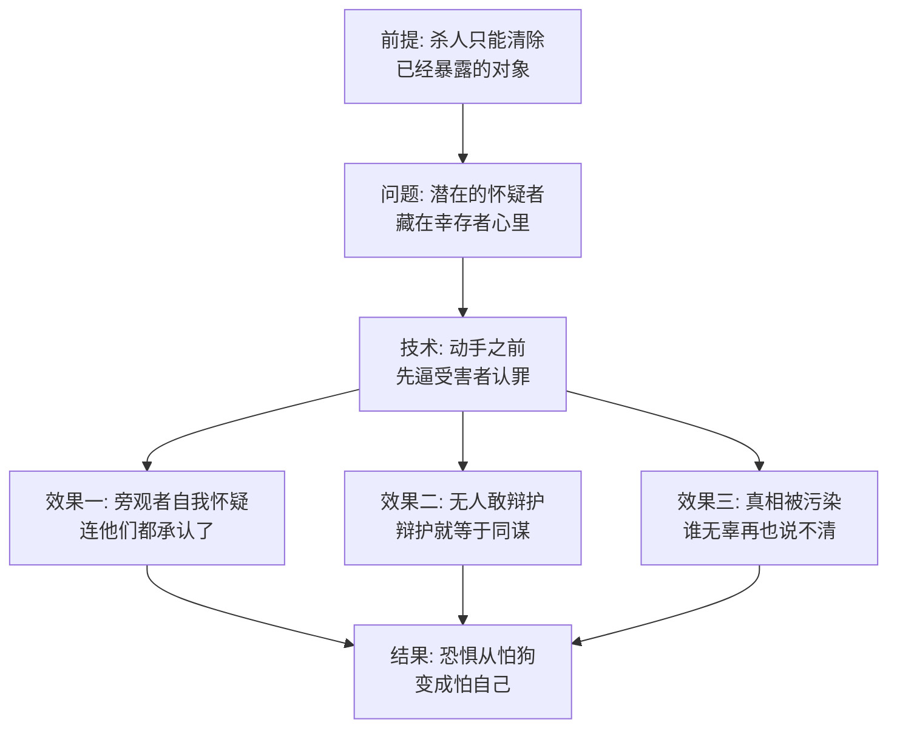

# 08｜谷仓前的屠杀：大清洗为什么需要「认罪」的表演？

> 拿破仑要除掉那几头猪、几只鸡，命令狗直接动手就行了——为什么还要让他们当着全体动物的面，先承认自己是叛徒？

---

## 一、先说结论

全书最黑暗的一幕是这样的：四头小猪、三只母鸡、一只鹅、一只山羊被拖到全体动物面前，挨个「承认」自己受雪球指使、干了各种破坏勾当，然后被九条狗当场撕碎喉咙，谷仓前血流成河。奥威尔在这里影射的是莫斯科大审判，而他真正解剖的是一个技术细节：**杀人只是清除，认罪才是震慑。** 让受害者临死前亲口坐实罪名，是要把恐惧种进每个目击者心里——「连他们都承认了，难道他们真的都是叛徒？那我呢？」

## 二、我们先理解一个问题

先做一道减法题：如果目的只是清除异己，需不需要认罪这个环节？

不需要。狗的效率很高，驱逐雪球只用了一分钟。公开处决反而增加成本：要召集全体动物，要冒受害者翻供的风险，要让血溅在所有人面前。

那为什么要多此一举？除非——目的根本不是「让这些人消失」，而是「让剩下的人看到某种东西」。看到什么？看到认罪。这就指向了这一幕真正的核心：**那几分钟的「坦白」，才是整场表演的主角；后面的撕咬，只是谢幕。**

## 三、作者到底提出了什么观点？

先看清洗前的铺垫。书中写道，拿破仑下令鸡蛋必须卖给温珀换粮食，母鸡们反抗——飞到椽子上把蛋摔在地上。这是动物农庄里唯一一次真正的武装抵抗。镇压方式是断粮：九只母鸡饿死，对外宣称死于鸡瘟。反抗者先被饿垮，账本先被做平。

然后才是那场屠杀。书中写道，曾在「取消全体大会」时哼唧过几声的四头小猪最先被拖出来，在狗的胁迫下「承认」与雪球勾结——刚说完就被撕碎了喉咙。接着是母鸡、鹅、山羊，挨个排队「坦白」各种闻所未闻的罪行：往食槽里下毒、跟雪球秘密接头、在睡梦里谋害拿破仑……每认完一条，狗就扑上去。

奥威尔写得最瘆人的一笔在事后：幸存动物挤在苜蓿身边发抖，苜蓿含着眼泪唱起了《英格兰兽》。动物们心里转着一个不敢说出口的问题——**「这难道比我们闹革命之前更好吗？」**（这首歌不久后被禁唱，那是另一篇的事。）

奥威尔认为，认罪表演的技术含量远高于处决本身。它一次性完成三件事：给处决补发「证据」、让目击者自我怀疑、把「无辜」这个词从辞典里抹掉。

## 四、把这个观点翻译成人话

用大白话说：**秘密处死制造恐惧，公开认罪制造绝望。**

恐惧的逻辑是「别惹他」——还有明确的边界，你知道自己离枪口多远。而认罪表演把边界擦掉了：受害者亲口承认罪行，等于官方叙事获得了受害者本人的背书。旁观者面对的不再是「有人被杀了」，而是一个更可怕的句子：「被杀的人都承认自己有罪」。你无法替他们喊冤——他们自己认了。你甚至无法确认自己是否清白——万一你也有什么「自己没意识到」的罪行呢？

这就是认罪表演真正的作用对象：不是死者，是观众。死者几分钟就退场了，观众要把那场戏带回家，带进往后每一天的自我审查里。

## 五、为什么会这样？

为什么「认罪」比「枪毙」有效得多？拆开看：

三个效果里最关键的是第三个：真相的污染。那几头猪、那几只鸡到底有没有罪？表演结束之后，这个问题永远没有答案了——不是查不出来，而是「认罪」这个动作把「罪」的判定权彻底收走了。从此罪不取决于你做了什么，取决于你能不能活着从那个台子上走下来。

还有一层：为什么受害者会配合认罪？书里写得隐晦——狗就站在旁边，他们先被拖出来、被威胁，在彻底的恐惧和绝望里，「承认」成了唯一能结束这一切的动作。一些学者在研究莫斯科审判时指出，被告的配合往往混杂着刑讯、绝望、保全家人的交易、乃至被摧毁的信念。认罪不是证据，是认罪者被碾碎之后留下的声音。

## 六、举一个现实生活中的例子

想一想某些组织搞「整风」时的标准动作：要求人人「自查自纠」，写书面检讨，在大会上念出来，还要互相揭发。

从管理角度看，这个流程毫无必要——真有违规，按制度处理就行。但它的功能根本不在处理违规，而在那个仪式：让每个人当众写下「我有问题」，让每个人都听见别人说「我有问题」。几场会开下来，整个空气就变了：没人说得清什么算问题，但人人都在检索自己的问题；没人知道谁在名单上，但人人都祈祷自己不在名单上。

最阴的一点和认罪表演一模一样：检讨一旦写下，就成了白纸黑字的证据。今天念检讨是「态度端正」，明天这份检讨就可以变成「你本人承认的劣迹」。恐惧就这样完成了它最彻底的形态——每个人亲手给悬在自己头上的东西签了名。

## 七、回到书中重新理解

这一幕影射的是上世纪三十年代的莫斯科大审判：一批老革命家在公开法庭上承认间谍、破坏、谋杀等不可思议的罪名，然后被处决。那四头「哼唧过的小猪」对应的正是这批革命最早的班底——他们不是新敌人，是自己人。大清洗吃掉的首先是自己的同志，这一点书里和历史上严丝合缝。

回到书里，还有一层常被忽略的寒意：屠杀之后动物们的反应不是愤怒，是**困惑**。苜蓿唱《英格兰兽》的时候，奥威尔写道动物们不明白「为什么事情会变成这样」——恐惧的最高境界不是压迫感，而是失去坐标：连「这是不是比从前好」都算不清了。当比较的能力被夺走，人连委屈都表达不成句子。

## 八、这个观点背后还有什么？

第一，认罪表演同时是对「证据」概念的处决。正常逻辑是先有证据再有判决，表演逻辑是先有判决再生产供词。当供词可以从任何人身上逼出来，证据就不再是约束权力的东西，而是权力的制成品。

第二，注意清洗对象的挑选顺序：先有怨言的（哼唧过的小猪）、反抗过的（扔鸡蛋的母鸡）、然后是随机的（鹅、山羊）。这个结构是有讲究的——前两批是「定点清除」，最后一批随机者的作用是告诉所有人：没有前科也不保证安全。定点制造秩序，随机制造恐怖，恐怖需要随机性才完整。

第三，母鸡起义被轻易地遗忘了。九只母鸡饿死，对外宣称鸡瘟——这是全书第一次「官方说法覆盖真实死因」，是后来所有记忆篡改的预演。大清洗不只是杀人，也是第一次大规模练习「死法由官方说了算」。

## 九、这个观点有问题吗？

说服力在哪：对「公开认罪」功能的拆解相当精准。莫斯科审判最令旁观者困惑的正是「他们为什么承认」——奥威尔给出的答案「认罪是演给幸存者看的」，至今仍是分析政治审判的标准框架之一。

争议在哪：第一，把认罪完全归为「表演」可能低估了被告心理的真实复杂性。一些学者认为，部分老革命家的认罪掺杂着对事业最后的效忠、「以自己的死为组织服务」的扭曲信念，不全是拷打的产物。第二，寓言里动物集体目击、集体沉默，而现实大清洗中告密者、执行者、旁观者往往是同一个人群的不同侧面，恐惧的传导链比「暴君到狗到观众」丰富也肮脏得多。

哪里过度简化：书里狗群直接撕碎，肉体暴力一目了然；现实中的大清洗是漫长的官僚流程——逮捕、审讯、判决、归档，恐怖的质感是文书而非血腥味。寓言选了最浓缩的画面，代价是遮蔽了恐怖最日常的部分：它主要由按时上班的普通人完成。

还有哪些其他解释：一种解释认为清洗的真正功能是「周期性重置」——通过制造普遍不安全感，防止官僚集团坐大，认罪表演只是附带产品；另一种解释强调经济功能——清洗为强制劳动和财产没收提供合法外衣，恐惧是手段不是目的。

## 十、今天再看这个观点

以下部分是基于作者思想的现代延伸，不是作者原话。

今天的认罪表演改头换面成了「公开道歉」「澄清声明」「自查通报」：当事人在镜头前或公告里亲口复述指控方的定性，然后被处理。结构没变——处罚之前的认罪环节，仍然是做给观众看的，仍然是拿「当事人的嘴」去盖「定性的章」。

识别这类表演有个简单判据：看认罪的措辞是不是「过于完整」。真实的人在承认错误时混乱、辩解、语无伦次；而一份措辞工整、定性准确、连罪名轻重都替指控方想好的认罪书，大概率不是忏悔，是台词。

## 十一、这一篇真正应该记住什么？

1. 杀人清除肉体，认罪震慑灵魂——大清洗的观众从来是幸存者。
2. 认罪表演有三重效果：旁观者自我怀疑、辩护变成同谋、无辜与有罪永久混同。
3. 「认罪」是权力自制的证据：供词不从事实来，从恐惧来。
4. 母鸡的「鸡瘟」是预演：官方说法覆盖真实死因，为后来的记忆篡改开了头。

## 十二、留一个问题

如果连受害者都亲口认罪，旁观者该拿什么分辨「坦白」和「台词」？更深的问题是：多年以后，当所有当事人都死了，这场屠杀到底发生过没有——谁来作证？

这个问题先存着。谷仓前的血会被冲干净，目击者会老去，记忆会模糊。但拿破仑还有一项比狗更安静、也更彻底的技术：不需要动任何人，只需要在夜深人静时，给墙上的七诫添几个字。下一篇，我们看被涂改的戒律。
