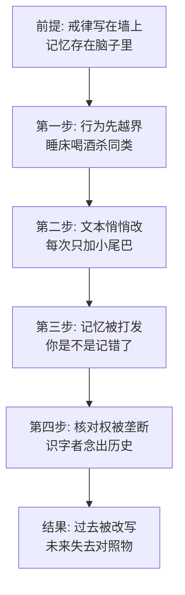

# 09｜被涂改的七诫：为什么篡改记忆是独裁的核心技术？

> 猪睡了床、喝了酒、杀了同类——每一条按原戒律都是死罪。可动物们跑到墙根一看，戒律上写的「好像本来就不是这么回事」。是谁改的？记忆又去哪儿了？

---

## 一、先说结论

动物农庄的七条戒律没有一次性作废，而是被逐条加上了小尾巴：「不得睡在床上」变成「不得睡在铺床单的床上」；「不得饮酒」变成「不得饮酒过量」；「不得杀害其他动物」变成「不得无故杀害其他动物」。每一次，动物们都觉得哪里不对，但跑到墙根一念，字面上确实挑不出错——然后被一句「你是不是记错了」打发。奥威尔在这里指出了独裁最安静也最彻底的技术：**谁掌握对「当初是怎么说的」的解释权，谁就掌握了一切。控制过去的人控制未来。**

## 二、我们先理解一个问题

先看一个诡异的日常场景：苜蓿觉得猪睡床不对，记得戒律写得明明白白。她请识字的山羊穆里尔去念墙上的字。穆里尔念出来的是——「任何动物不得睡在铺床单的床上」。苜蓿的反应不是愤怒，而是松了口气般的困惑：**「啊，是我记错了。」**

诡异在哪？文字摆在那里，记忆却模糊了；而模糊的记忆在白纸黑字面前，永远输。问题来了：如果规则可以被随时修改、且修改的痕迹没人认得出来，「规则」还剩下什么？

## 三、作者到底提出了什么观点？

书中的涂改是一个渐进的完整过程，每一笔都对应一次越界。

**第一改，床。** 书中写道，猪搬进了农舍、睡上了床。动物们隐约记得「不得睡床」。尖嗓子出面解释：戒律禁止的从来不是床——「床不是问题，铺床单这种人类的发明才是」。墙上一念，果然是「不得睡在铺床单的床上」。没人记得什么时候多了「铺床单的」这几个字。

**第二改，酒。** 书中写道，拿破仑喝了威士忌，尖嗓子被发现摔在梯子底下，蹄边滚着油漆桶——第二天他照常露面，墙上的戒律变成了「不得饮酒过量」。这一笔奥威尔写得像黑色喜剧：修改者醉酒负伤，等于被当场抓获的涂改现行犯，但没有动物把两件事连起来。

**第三改，杀。** 谷仓前大清洗之后，「不得杀害其他动物」变成了「不得无故杀害其他动物」。这一次涂改最晚也最狠：它要赦免的不是生活作风，是血。

每一次的路径都相同：先越界，再改字，然后用「你记错了」关闭质疑。奥威尔认为，**篡改历史不是删除，是润色——只改几个字，改到刚好为现在的行为赦免为止。**

## 四、把这个观点翻译成人话

用大白话说：独裁者不跟你的记忆正面冲突，他做的是**给你的记忆提供一个永远对得上的版本**。

如果他把「不得饮酒」整个划掉，人人都会发现墙变了——太粗暴。他只加「过量」两个字：规则还在，戒律的尊严还在，只是它的保护范围悄悄挪了位。你印象里好像确实有这么一条，一念也确实有——记忆和文本对上了，疑点自动消解。

这就是篡改比删除高明的地方：删除制造「空白」，空白引人追问；润色制造「偏差」，偏差让你怀疑自己。当怀疑的箭头从指向权力转为指向自己的记忆力，统治就赢了。

## 五、为什么会这样？

为什么改几个字比改整套制度更可怕？机制如下：

两个环节决定成败。

一是「核对权的垄断」。全农庄能完整念出七诫的动物屈指可数，穆里尔已经算识字多的。墙上那段字对绝大多数动物来说不是文本，是权威的象征——他们核对不了内容，只能核对「墙还在」。当核实历史的工具本身握在被怀疑对象手里，核实这个动作就成了表演。

二是「记错羞耻」。「你是不是记错了」这句话能生效，是因为它把举证责任倒转了：本来该由修改者证明「我没改」，变成由质疑者证明「我记对了」。而记忆是私人财产，无法出示、无法公证——于是每次质疑都以质疑者的自我怀疑收场。一个人道歉几次，就再也不质疑了。

## 六、举一个现实生活中的例子

想一想微信群、知识库或者公司内网上那份「群公告」。

最初版本写着「每周五不加班」「报销不需要发票照片」「实习生日补贴两百」。半年后有人翻出来说不对啊，一看公告——「每周五原则上不加班」「报销原则上不需要发票照片」「实习生日补贴视情况最高两百」。

最妙的是，没人找得到修改记录。有人问旧版什么样，没人存截图；有人坚持「我记得不是这样」，得到的回复是「你是不是记错了，一直都是这么写的」。几次之后，连最初提意见的人也开始怀疑自己的记忆——毕竟白纸黑字在那摆着，而记忆连一张截图都拼不过。

这和七诫的修改完全同构：不删规则，只加限定词；不否认过去，只让你的记忆无法举证；最后达成的效果一模一样——**「一直都是这么写的」**。区别只是梯子换成了管理员权限，油漆桶换成了编辑按钮。

## 七、回到书中重新理解

七诫的涂改影射的是对历史文本的系统修订——教科书、档案、照片、百科条目随政治需要反复改写：某人从革命元勋的合影里消失，某场战役换了主角，某段历史整页蒸发。奥威尔对这套工艺的观察细到骨头里：篡改不是一次「大改写」，而是无数次「小补丁」——每次改动都小到不构成事件，积累起来就是一部全新的历史。

回到书里，最冷的不是涂改本身，而是苜蓿的那声「是我记错了」。一头诚实、善良、记忆力在全农庄数一数二的老马，被自己的诚实打败了——正因为她诚实，她愿意相信白纸黑字胜于相信自己。奥威尔写的其实是：**记忆的私有制，是专制的最后一道护城河。** 只要历史只存在于私人头脑里，它就永远无法联合起来对抗墙上的字。

## 八、这个观点背后还有什么？

第一，七诫被改的顺序是精心安排的：先是舒适（床），再是嗜好（酒），最后是暴力（杀）。越界的烈度在升级，而每次升级都借上一次涂改成功的惯性——前两次你已经「记错」过了，第三次你有什么立场坚持自己记得对？涂改的技术含量不在笔，在顺序。

第二，涂改要有效，必须保留原文的躯壳。「不得饮酒」和「不得饮酒过量」在视觉上只差两个字，远看完全是同一条戒律。篡改者最深的技巧是**维持文本的连续性幻觉**——规则神圣不可侵犯的表象越完整，实际被替换得越干净。这与后来墙上只剩「所有动物一律平等，但有些动物比其他动物更平等」是同一套工艺的成品形态。

第三，注意识字阶层的共谋结构。穆里尔能念出字、苜蓿只能记个大概、绝大多数动物只认得「墙上还有字」——同一个历史文本，对三个阶层的可验证性完全不同。解释权是按识字率分层的，而识字率是统治者分配的。篡改记忆的上游，其实是垄断识字权——这是七诫上墙第一天就埋好的伏笔。

## 九、这个观点有问题吗？

说服力在哪：「润色优于删除」「记忆输给文本」「举证责任倒转」三个机制，抓住了历史篡改的全部技术要领。奥威尔后来把这个主题放大成《一九八四》里真理部的全套工序——可以说《动物农庄》是这门独裁核心技术的原型机。

争议在哪：第一，这个模型假设存在一个可供对照的「原始文本」——墙上毕竟写着字。而现实中更多历史根本没有原始文本，争议不是靠涂改获胜，是靠「从来没人写下来」获胜；书写先于篡改垄断了记忆。第二，一些学者认为，动物们的「记错」不全是记忆失败，也包含一种配合性的自欺——承认自己记错，比承认自己被骗更轻松。篡改能成功，一半靠油漆桶，一半靠观众愿意被说服。

哪里过度简化：书里涂改是单点完成的——尖嗓子加梯子加油漆桶。现实中的历史修订是分布式工程：教育系统、媒体、档案机构、出版物协同改写，改的人自己都可能以为自己在「恢复真相」。个人化的涂改形象，低估了制度化篡改的自我正当化能力。

还有哪些其他解释：一种解释认为控制未来的关键不是改过去，而是垄断「意义框架」——史实可以不改，只改评价：屠杀还在，但改叫「必要的净化」；另一种解释强调「遗忘的制度化」——不必涂改，只要让下一代从未听过原版，新版自然成为唯一版本。

## 十、今天再看这个观点

以下部分是基于作者思想的现代延伸，不是作者原话。

数字时代给「涂改」换了三个新特征：一是涂改无痕化——电子文本没有油漆味，编辑历史可以不公开；二是版本碎片化——不同人看到的「同一页面」可以不同，连「墙上只有一份字」这个前提都被瓦解；三是记忆外包化——我们不再背诵过去，只搜索过去，而搜索结果本身可被排序和下架。

但硬币有另一面：截图、存档服务、分布式备份让「白纸黑字」第一次有了对抗涂改的武器。今天围绕「原始版本存不存在」的攻防——改词条与存快照、删帖与留档——正是苜蓿和尖嗓子那场墙根对峙的大规模翻版。唯一没变的还是那条规则：谁掌握对「当初是怎么说的」的裁判权，谁就掌握现在。

## 十一、这一篇真正应该记住什么？

1. 篡改的最高形态是润色：不删规则，只加限定词——「铺床单的」「过量」「无故」。
2. 「你记错了」是关键话术：把举证责任踢回给质疑者，让怀疑自我瓦解。
3. 核对权即历史权：识字者念出的字，就是不识字者的全部过去。
4. 涂改讲顺序：先舒适、再嗜好、后暴力——每次小赦免为下次大赦免铺路。

## 十二、留一个问题

如果记忆无法公证，那么「留下来作证」是不是每一个普通人的义务？可问题是：当你留下的证据被说成是伪造的、你记的事情被说成是幻觉——坚持记忆本身，会不会也变成一种需要勇气的事？

这个问题先存着。七诫改完，墙上只剩文字的躯壳。但篡改记忆还只是「事后擦除」——更高级的统治术是不等记忆形成就先发制人：把黑的当场讲成白的。负责这项工作的是那头口才极好的猪，尖嗓子。下一篇，我们看谎言是怎么被修辞包装成「事实」的。
