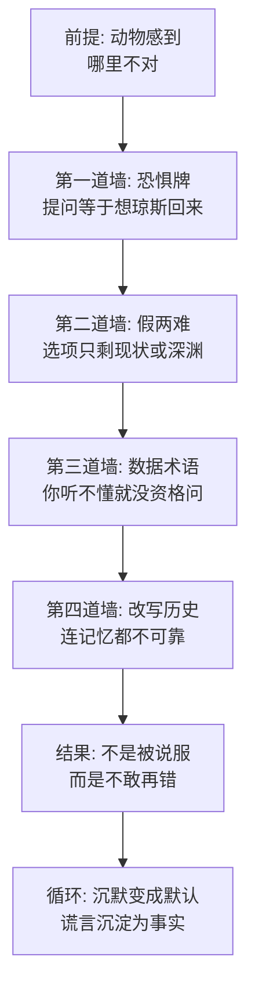

# 10｜尖嗓子的修辞术：谎言是怎么被说成「事实」的？

> 尖嗓子从来没有打赢过一场真正的辩论，为什么动物们最后却都信了他？

---

## 一、先说结论

尖嗓子是拿破仑的传声筒，一头口才极好的肥猪。他的任务只有一个：把猪们的每一项特权、每一次翻脸、每一条被涂改的戒律，说成「本来就该这样」。他确实每次都说赢了——但赢的方式值得拆开看：他从不用事实证明自己正确，而是用一套固定的话术流程，让听众不敢坚持疑问。先抬出恐惧——「你们难道希望琼斯回来吗？」；再制造假两难——要么接受现状，要么回到奴隶时代；然后用数据和术语轰炸——「我们有数字证明」；最后反咬一口——连雪球的伤疤都可以说成是假的。奥威尔借尖嗓子解剖的是宣传的标准配方：谎言之所以能被说成「事实」，不是因为谎言编得好，而是因为提问的成本被抬得太高。

## 二、我们先理解一个问题

先留意一个书中反复出现的细节：动物们其实经常觉得「哪里不对」。

牛奶苹果不见了，大家觉得不对；大风雪天猪们在农舍里取暖，大家在雪地里挨饿，觉得不对；明明记得七诫上写的是「不得睡床」，现在猪睡在床上，还是觉得不对。每一次，疑问都真实地存在过——动物农庄里从来不缺怀疑，缺的是能把怀疑坚持到最后的人。

每次站出来「解决」这些疑问的都是尖嗓子。说完之后，动物们不是被说服了，而是不吭声了。这个区别很关键。被说服是「我觉得你说得对」，不吭声是「我争不过你，而且我好像不该再问了」。尖嗓子的全部手艺，就是把后一种结果伪装成前一种。

## 三、作者到底提出了什么观点？

奥威尔没有让尖嗓子说什么高明的谎话，恰恰相反，他说的话往往粗糙得可笑——牛奶苹果给猪吃是因为「猪需要脑力保护大家」，睡床不算破戒因为戒律禁止的只是「床单」，雪球在牛棚战役里的英勇其实是「深入研究的史料证明的」怯战。

奥威尔的观察是：宣传的力量从来不在内容，而在方法。他让尖嗓子重复使用的，是一套可以拆成四个零件的话术机器。

第一，恐惧牌。无论话题是什么，尖嗓子的收尾几乎都是同一句：「同志们，你们难道希望琼斯回来吗？」这句话从不回答任何问题，它只做一件事——把「现状是否合理」偷换成「现状和琼斯你选哪个」。在这道选择题面前，任何抱怨都显得不知好歹。

第二，假两难。猪占用牛奶苹果，理由不是「这对吗」，而是「要么我们吃，要么没人保卫农庄，你们选」。选项被人为压到只剩两个，而另一个选项被涂成深渊，中间的千百种可能——比如大家一起分、比如猪也下地干活——根本不会出现在菜单上。

第三，数据轰炸。尖嗓子最爱说「我们有数字证明」「科学已经证实」「经过深入研究」——但他从不给出处，数字也从不允许核对。术语的作用不是传达信息，而是制造资格差：你连词都听不懂，凭什么质疑结论？

第四，改写历史。这是最狠的一招。雪球明明在牛棚战役里带头冲锋、负了伤，几年后尖嗓子宣布：最新研究表明，雪球当时是人类的内应，他的伤疤都是假的。当过去的英雄可以被追认成叛徒，听众最后一点凭据——「我亲眼看见的」——也被没收了。

## 四、把这个观点翻译成人话

用大白话说：尖嗓子不是在「撒谎」，他是在「管理你的提问权」。

普通人理解的撒谎，是说一句假话等别人信。尖嗓子的做法高一层：他搭建一个话语场，在这个场里，你提问本身就等于站错队。你质疑牛奶的分配？你想让琼斯回来。你记得戒律不是这么写的？你记错了，而且你的记忆本身很可疑——连雪球都能被追认成叛徒，你的记忆凭什么比档案可靠？

这就是为什么动物们每次都「被说服」却从不心服。心服需要理由，不吭声只需要代价。当一个人发现提问的代价是成为「琼斯同伙」的嫌疑人，他会迅速地学会一件事：算了。

书中写道，尖嗓子说话时有个标志性动作——跳来跳去、尾巴摇个不停。这个细节不是闲笔：他的身体语言在替内容兜底，用表演的热闹填补逻辑的窟窿。

## 五、为什么会这样？

为什么这套粗糙的话术总能赢？奥威尔揭示的机制是这样的：

这条链上最要害的一环是第四道墙。前面三道墙针对的是「现在」——让你不敢质疑当下；第四道墙针对的是「过去」——让你不敢相信自己记得的东西。一个人只要还确信「我亲眼见过雪球冲锋」，谎言就有破绽；一旦连亲眼所见都能被「史料研究」推翻，他就彻底失去了判断的支点。

还有一个容易被忽略的条件：尖嗓子从不单独作战。他背后站着九条狗。他说完「你们难道希望琼斯回来吗」的时候，狗就蹲在旁边低吼。话术负责让你说不清，狗负责让你不敢说——宣传和暴力是同一台机器的两个挡位，这一篇拆开的是宣传那一挡。

## 六、举一个现实生活中的例子

想想社交网络里那些传播最广的话术。

「不转不是××人」「是××人就转发」——这句话有内容吗？没有。它论证了任何观点吗？没有。它只做了一件事：把「转不转」和「你是不是自己人」焊在一起。你想保持沉默？那你就是立场有问题的人。这和「你难道希望琼斯回来吗」是同一个模子：不回答问题，只审判提问者。

职场里更常见的版本是假两难：「要么支持这次改革，要么就是希望公司垮掉。」——改革方案合不合理？不许讨论。讨论的入口被一句话封死：你只有两个身份，拥护者，或者盼着公司完蛋的人。中间那个位置——「我支持公司，但对这条方案有疑问」——被从菜单上划掉了。

还有术语轰炸：满屏的「闭环」「抓手」「赋能」「颗粒度」，听不懂是你的问题，方案对不对反而是次要的。尖嗓子的「我们有数字证明」和「这个数据涉及内部口径不方便展开」，相隔八十年，说的是同一种语言。

## 七、回到书中重新理解

带着这套拆法重读尖嗓子的几场戏，会发现奥威尔的笔法冷静得像在做实验。

为牛奶苹果辩护那场，尖嗓子一段话里塞齐了全部零件：先是术语——「牛奶和苹果含有维持猪的健康所必需的物质」；再是拔高——「我们猪是脑力劳动者，整个农庄的管理和组织都靠我们」；最后是恐惧收尾——「你们难道想看到琼斯回来吗」。书中写道，这段话讲完，「大家就再也无话可说了」。注意，是无话可说，不是心悦诚服。

最极端的一次是改写雪球的历史。牛棚战役是全农庄的集体记忆，雪球带头冲锋时动物们都在场。几年后尖嗓子宣布，经过对秘密档案的研究，雪球那天其实在为琼斯效力，「他身上的伤口都是自己弄出来骗取信任的」。有动物小声说自己明明记得不是这样，尖嗓子的回应是反问：你记错了，这种事在档案面前还重要吗？——当「档案」成了唯一合法的真相来源，记忆本身就成了罪证。

这些段落影射的是《真理报》式的宣传机器：不追求一次说圆，追求每次都说，说到旧版本没地方存放为止。

## 八、这个观点背后还有什么？

第一，尖嗓子本人可能一个字都不信。书中没有写他犹豫过、脸红过——这恰恰说明奥威尔把他当成一种「功能」而非一个人物来写。宣传者的真诚与否无关紧要，重要的是这个岗位存在：需要一个能把任何今天和任何昨天焊接到一起的人。

第二，这套话术的有效性依赖一个前提：听众没有可对照的信息源。动物农庄里没有报纸、没有档案公开、没有第二头会念字的动物敢出来对质。谎言最怕的不是反驳，是并列——只要把尖嗓子的今天和尖嗓子的昨天摆在一起，他自己就是自己的反证。而垄断信息的意义，就是禁止这种并列。

第三，奥威尔后来把这套思路推向了更冷的地方。《动物农庄》里谎言还需要一条一条地说服，《一九八四》里的新话直接修改语言本身，让「不忠」这个概念失去词汇。尖嗓子是新话的史前形态：他还在费力地骗，下一代已经不用骗了。

## 九、这个观点有问题吗？

说服力在哪：把宣传拆成「恐惧—假两难—术语—改史」的可复用流程，解释力很强。它说明了一个反直觉的事实：谎言不需要高明，只需要把质疑的成本抬到普通人付不起的程度。这个框架套在后世无数宣传案例上都能用，是全书被引用最多的分析之一。

争议在哪：第一，奥威尔的写法带有知识分子的视角偏差——他把动物们写成「其实怀疑但不敢」，但现实中很多受众是真心相信的，不是不敢错，而是不觉得错。把「沉默」一律解释成「被压服」，可能低估了认同的真实存在。第二，尖嗓子的成功有很大一半靠的是狗和饥荒——脱离暴力和生存压力谈「修辞的胜利」，会把宣传机器说得太轻巧。

哪里过度简化：现实中的宣传很少是单口相声，它有反驳者、有泄露、有竞争叙事；尖嗓子的环境是被奥威尔刻意抽成真空了的，所以他赢得才这么干净。

还有哪些其他解释：传播学者可能强调媒介而非话术——尖嗓子赢在垄断了农庄唯一的发声渠道；社会心理学家可能强调从众——动物们不是被话术击败，而是看见别人都点头就跟着点头；也有分析认为真正起作用的是时间——谎言不是靠技巧赢的，是靠重复到下一代动物出生为止赢的。

## 十、今天再看这个观点

以下部分是基于作者思想的现代延伸，不是作者原话。

今天的「尖嗓子」不再是一个发言人，而是一套分发机制。话术四件套有了新的载体：恐惧牌变成了「不转就是不爱」的社交绑架；假两难变成了热搜评论区里「要么支持要么敌人」的站队结构；术语轰炸变成了行业黑话和「内部人士透露」；改写历史则变成了删稿、改百科词条、旧文不可见。

但环境也变了：信息源不再唯一，「把今天和昨天并列」的成本降到了一张截图。所以当代尖嗓子发展出了新策略——既然挡不住并列，就污染并列：同时放出十个版本的说法，让真相淹没在「谁也说不准」里。从「只许听我讲」进化到「什么都有人讲，所以你只能挑着信」，这是宣传术在信息过载时代的升级版本。

## 十一、这一篇真正应该记住什么？

1. 尖嗓子赢在方法不在内容：恐惧牌、假两难、术语轰炸、改写历史，四件套可以原样拆走。
2. 「你们难道希望琼斯回来吗」不回答任何问题，它只审判提问的人——识别这句式就拆掉了半台机器。
3. 假两难的破绽在菜单之外：永远问一句「谁规定了只有两个选项」。
4. 最狠的一招是改史：当一个人连「我亲眼所见」都不敢信，他就再没有判断的支点了。
5. 宣传的背后永远站着狗：话术负责说不清，暴力负责不敢说。

## 十二、留一个问题

如果尖嗓子的话术如此粗糙、破绽如此明显，动物们为什么还是集体接受了？是因为怕狗，还是因为——承认自己被愚弄，比继续被愚弄更难受？

这个问题先存着。尖嗓子再厉害，也只是个传声筒——他嘴里那些「伟大决定」「英明领导」到底是谁的？下一个问题就是：拿破仑这头几乎不露面的猪，是怎么被一步步造成「神」的？
