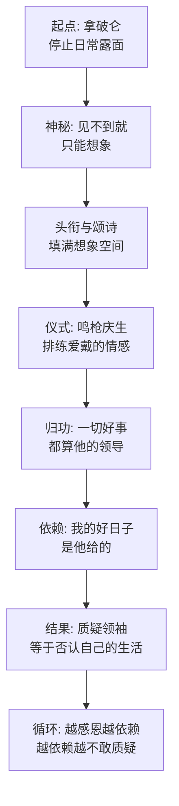

# 11｜拿破仑同志永远正确：个人崇拜是怎么制造出来的？

> 一头几乎不露面的猪，是怎么变成「动物农庄之父」「万岁」的？

---

## 一、先说结论

拿破仑的个人崇拜不是动物们自发长出来的爱戴，而是一套被精心设计、逐步加码的工程。流程清晰得像施工图纸：先让他消失——几周才现身一次，凡事经尖嗓子传话；再给他头衔——从「拿破仑同志」一路加到「动物农庄之父」「人类之敌的克星」；然后配颂诗、画像、鸣枪礼这些仪式；最后也是最关键的一步，把一切好事归功于他——丰收是他的功劳，日子幸福是他的领导。缺席制造神秘，头衔制造距离，颂歌制造情感，归功制造依赖。四步走完，一头猪就成了不可议论的存在。奥威尔借这个过程说破一件事：个人崇拜的本质不是群众太狂热，而是有人系统性地把「爱戴」当成一项建设工程在管理。

## 二、我们先理解一个问题

先想一个反直觉的问题：什么样的领袖更容易被神化——天天和大家一起在田里干活、满身泥水的，还是深居简出、一个月见不到一次的？

直觉会说是前者，毕竟同甘共苦才赢得人心。但《动物农庄》给出的答案相反：雪球天天在动物堆里演讲、辩论、带头干活，最后被狗追得仓皇逃命；拿破仑把农活全推出去，自己躲在农舍深处，结果成了「万岁」。

为什么？因为「了解」是崇拜的敌人。你见过他抠鼻子、发脾气、说错话、干不动活，他就只是一头猪。崇拜需要的是想象的空间，而想象只在空白处生长。奥威尔安排拿破仑越来越少露面，不是在写他的性格孤僻，而是在写一套原理：神秘感是可以生产的，生产方式就是缺席。

## 三、作者到底提出了什么观点？

书中写道，赶走雪球之后，拿破仑的出现频率急剧下降——有时候三周才露面一次，而且每次必由九条狗拱卫，尖嗓子先行开路。他不再参加劳动，不再出席讨论，连命令都不再亲自下达，全部由尖嗓子转述。

与此同时，另一套东西在加速生长。头衔层层加码：「拿破仑同志」不够用，加上「动物农庄之父」「人类之敌的克星」「鸭之友」；猪诗人米尼穆斯专门写了颂诗，刻在谷仓墙上，就在七诫旁边；生日那天鸣枪庆祝；农庄里流传起一句口头禅——「拿破仑同志领导下的日子是幸福的」；最妙的是，每一件好事都被归到他名下，母鸡下了蛋、地里收了粮，都要说一句「感谢拿破仑同志的领导」。

奥威尔借这套完整的清单指出：个人崇拜是一种制度产品，不是情感事故。它有明确的功能分工——缺席负责制造神秘，头衔负责制造距离，颂诗负责制造情感，归功负责制造依赖。四个零件组装起来，就是一头不允许被质疑的猪。

## 四、把这个观点翻译成人话

用大白话说：拿破仑干的事，相当于给自己开了一间「崇拜代工厂」。

这间工厂有四条流水线。第一条叫「稀缺」：好东西都是限量的，领袖露面也一样——三周一次，一次几分钟，让「见到他」本身变成一种待遇。第二条叫「包装」：名字不够用就加头衔，头衔不够响就写诗，诗不够显眼就刻上墙——符号的密度代替事实的厚度。第三条叫「仪式」：鸣枪、庆生、画像，仪式的作用不是表达感情，是排练感情——让你在鸣枪的瞬间真切地感到激动，然后把激动误记成「我爱戴他」。第四条叫「归功」：把每一件好事的因果链切断重接，一律接到领袖名下——你碗里的粥不是地里长的，是他的领导。

四条流水线合起来，产品就是「拿破仑同志永远正确」。注意这个产品的用法：它不是一句陈述，是一件工具——动物们拿它来解释一切想不通的事。

## 五、为什么会这样？

为什么这套流程对动物们有效？机制是这样的：

这条链的精妙处在最后一步。如果只是神秘加颂歌，那顶多造出一个「高高在上的偶像」；但「归功」把崇拜接上了利益——你的每一顿饭都被记账在他的名下。到这一步，质疑拿破仑就不再是「对一个人有看法」，而是「否定自己碗里那口饭的来源」。崇拜从情感变成了生存逻辑。

还有一层值得注意：这套工程里动物们是「被服务」的一方。谁修的颂诗墙？猪。谁定的鸣枪礼？猪。谁把丰收归功于拿破仑？尖嗓子。群众自始至终是受众，不是发起者——这决定了个人崇拜的产权归属：它是统治技术，不是群众运动。

## 六、举一个现实生活中的例子

看那些把创始人供起来的公司。

创始人语录被印成册子人手一本，会议室墙上挂着他的大幅照片和「金句」，公司之歌里出现他的名字，新人入职第一课是「创始人的创业故事」，每逢司庆必播他的讲话录像。更微妙的是归功机制：项目成功了是「战略方向正确」，方向是谁定的？创始人。于是每一次庆功会都在重复同一件事——把集体的劳动折算成一个人的英明。

最有意思的是「缺席」这条线。不少创始人做大之后开始有意识地减少露面：全员会一年只出席一两次，平时只通过高管传话。员工会发现一个奇怪的现象——越见不到，越觉得高深；偶尔露一次面讲几句平常话，全场感动得像受了接见。这不是员工幼稚，这是奥威尔写过的机制在自动运转：稀缺生产光环，光环自行增值。

这些做法单独看每一条都能辩解——企业文化、精神传承、团队凝聚。但放在一起看，图纸和动物农庄是同一套：缺席、头衔、仪式、归功。

## 七、回到书中重新理解

重读拿破仑「封神」的过程，会发现奥威尔埋着一条冷静的线索：每一步加码都发生在统治出现裂缝之后。

风车被风暴吹塌，需要有人背锅——于是雪球被追认为破坏者，拿破仑的英明被对比得更耀眼。饥荒蔓延、动物挨饿，需要情感止痛——于是「拿破仑同志领导下的日子是幸福的」被规定成口头禅。大屠杀血流成河，需要合法性修复——于是头衔再加码，颂诗刻上墙。崇拜工程的每一次提速，都对应着现实的一次塌方。换句话说，颂歌的分贝和日子的糟糕程度成正比。

这个对应关系影射的是斯大林个人崇拜的历史：越是集体化失败、清洗惨烈的年份，「伟大领袖」「各族人民的父亲」的称谓越是铺天盖地。奥威尔的洞察是：个人崇拜不是权力的装饰品，是权力的止血带——现实伤口越大，纱布缠得越厚。

## 八、这个观点背后还有什么？

第一，拿破仑本人在这套工程里几乎是缺席的——不光物理上缺席，人格上也缺席。书中从头到尾没写过他有任何「魅力」：不会演讲，没有雪球的辩才，没有老少校的威望。奥威尔刻意让被神化的人毫无神性，就是为了说清：崇拜的对象不需要配得上崇拜，只需要配得上工序。

第二，颂诗刻在七诫旁边是个极狠的细节。七诫是「法律」，颂诗是「赞美」，两者并列上墙，意味着法律在贬值、领袖在升值——最终的效果是，「他」取代「它」成为最高准则。等七诫被改成「所有动物一律平等，但有些动物比其他动物更平等」的时候，墙的另一边早就写好了答案：更平等的那一位，名字就叫拿破仑。

第三，「永远正确」这个产品的真正用户其实不是动物，是拿破仑体制本身。动物需要一个解释「为什么日子这样还能忍」的理由，体制需要一个解释「凭什么我说了算」的授权——个人崇拜就是这份双向合同的签字仪式。

## 九、这个观点有问题吗？

说服力在哪：把个人崇拜拆成「缺席—头衔—仪式—归功」四条可操作的流水线，解释了崇拜的「可生产性」。这个框架的锋利在于它挪开了对群众的道德评判——动物不是蠢，他们是被一套工程设计成了受众。

争议在哪：第一，这个解释偏「自上而下」，把一切归因于权力的管理，但一些历史学家认为，个人崇拜里有真实的自下而上的情感需求——动荡年代的人们主动需要一个父亲形象来安放恐惧，不是全靠被灌。第二，拿破仑从未露过魅力，可历史上的被崇拜者往往确有某种煽动性天赋，奥威尔为了说机制，把人的因素压到了零，这也是一种简化。

哪里过度简化：把崇拜完全解释成「工程」，解释不了它为什么有时会在权力主动降温后仍然延续——比如领袖死后民间自发的哀悼。工程说解释了制造，解释不了残留。

还有哪些其他解释：社会学视角会强调「卡里斯玛」的自然生成——危机时刻人们本能地把希望投射到强者身上；心理学视角会强调认同与依附；也有分析认为个人崇拜本质是官僚系统的自保行为——各级官员需要不断加码赞美来证明忠诚，是体制在给自己上保险，未必全是顶层的策划。

## 十、今天再看这个观点

以下部分是基于作者思想的现代延伸，不是作者原话。

今天的「拿破仑工程」最显著的变化，是受众参与了生产。社交平台上，普通人自发地给偶像修「颂诗墙」——写长文、剪视频、控评、反黑，义务完成过去要由宣传部干的全套工序。缺席、包装、仪式、归功四条流水线还在，但动力部分地变成了自下而上：粉丝们为偶像「打投」，本质上是在给自己的情感劳动追加投资，投得越多越离不了场。

另一个变化是归功机制的泛化。算法时代把一切成就都加速归因于个人 IP——公司成功归创始人，球队胜利归球星，连社会情绪都要归到某个大 V「说透了真相」。当「谁的名字该被记住」成为注意力竞争的核心，「感谢拿破仑同志的领导」就有了无数个现代化身。要辨认今天的崇拜工程，别看有没有颂诗和鸣枪，看一件事就够了：好事的因果链，是不是总被接到同一个名字上。

## 十一、这一篇真正应该记住什么？

1. 个人崇拜是制度产品不是情感事故：缺席造神秘，头衔造距离，仪式造情感，归功造依赖。
2. 「见不到」比「天天见」更能造神——了解是崇拜的敌人，想象只在空白处生长。
3. 颂歌的分贝和现实的塌方成正比：每一次头衔加码，背后都有一次需要掩盖的失败。
4. 最致命的一步是归功：当饭碗被记在他名下，质疑他就等于否定自己的生活。
5. 被崇拜者不需要配得上崇拜，只需要配得上工序。

## 十二、留一个问题

如果崇拜是被工程制造出来的，那动物们欢呼「拿破仑万岁」时的激动是真的还是假的？一场被排练出来的情感，体验到的人那里还算不算真情？

这个问题先存着。崇拜工程造出了「神」，但「神」的体系还差最后一块拼图：旧信仰怎么处理？革命是有过自己的「圣经」的——那首《英格兰兽》唱的是所有动物终将自由。可如果有一天，动物们拿着这首歌来对照眼前的生活呢？下一篇我们就看，这首革命圣歌为什么会被革命者亲手禁掉。
