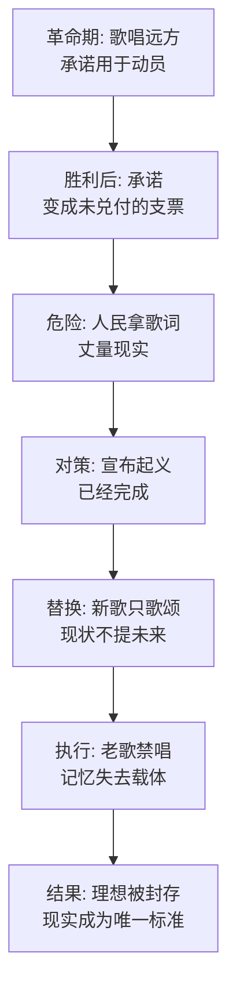

# 12｜被禁唱的《英格兰兽》：为什么革命成功后，革命歌曲反而危险？

> 一首号召动物推翻暴政的歌，为什么在动物当家作主之后，被新政权亲手禁掉了？

---

## 一、先说结论

《英格兰兽》是动物农庄的「国歌」——老少校留下的那首歌，唱的是「兽类大同、所有动物终将自由」的黄金时代。起义靠它凝聚，胜利靠它庆祝，可在大屠杀之后，尖嗓子宣布：这首歌从今以后禁唱，因为它「属于起义的时代，而起义已经完成」。奥威尔借这道禁令说破了一层冷酷的逻辑：革命歌曲对革命政权是资产，对统治政权是负债——只要歌还在唱，「所有动物终将自由平等」这个承诺就还悬在头顶，动物们随时可能拿它来丈量眼前的现实。禁歌的本质不是更换曲目，而是封死理想：当权者最怕的不是人民忘了革命，而是人民还记得革命承诺过什么。

## 二、我们先理解一个问题

先想清楚一件事：一首歌能对政权有什么威胁？

《英格兰兽》没有武器，没有组织能力，它就是几段旋律加几句词，唱的是牛马羊猪将来摆脱缰绳、缰绳与刺棒消失、所有兽类共享大地的图景。起义之前唱它，敌人是琼斯——矛头朝外，当然是好歌。起义成功之后，歌词一个字没变，旋律一个音没改，按理说应该升格成国歌，天天唱才对。

可恰恰是在「已经胜利」之后，它变成了危险品。区别不在歌里，在听歌的位置：胜利之前，歌词描绘的是「我们要去的地方」；胜利之后，歌词变成了「你们答应过的地方」。同一个承诺，革命前是动员令，革命后是催款单。

## 三、作者到底提出了什么观点？

书中禁歌的那场戏写得极冷。大屠杀的血还没干——四头猪、三只母鸡、一只鹅、一只羊刚刚被狗撕碎在院子里。幸存的动物们挤在苜蓿身边，含着眼泪，又唱起了《英格兰兽》。这是他们最古老的歌，小时候母亲哼过，起义前夜唱过，胜利那天唱过——此刻唱它，是在用最熟悉的方式舔伤口。

就在这时候，尖嗓子赶来宣布：《英格兰兽》从此禁唱。理由是一套完整的官方话术：这首歌属于起义的时代，表达的是对一个更好社会的渴望，而现在，那个社会已经建立，起义已经完成，歌的历史使命也就结束了。

作为替代，米尼穆斯写了一首新歌，开头是「动物农庄，动物农庄，我永远不会给你带来伤害」。注意这首新歌的歌词走向：它歌颂的是「现在的农庄」，一个字都不提「未来的大同」。旧歌唱的是远方，新歌唱的是脚下；旧歌里有一个尚未兑现的世界，新歌里世界已经到顶了。

奥威尔借这次替换指出：意识形态到了一定阶段，任务不再是许诺未来，而是宣布未来已至——因为只要未来还没来，当权者就永远欠着账。

## 四、把这个观点翻译成人话

用大白话说：**《英格兰兽》被禁，是因为它是一张没有兑付日期的支票。**

革命的时候，支票随便开——「将来人人自由」「将来按劳分配」「将来兽类大同」——开得越多，人心越齐。可一旦掌权，这些支票就全变成了负债表上的数字。最麻烦的是它们没有期限：没有写「十年内兑现」，意思是每一天都可以被追问「到了吗」。

尖嗓子的解法很聪明也很无赖：不宣布支票作废，而是宣布「已经兑付」。起义「已经完成」，理想社会「已经建立」——不是赖账，是销账。销账之后，再唱《英格兰兽》就不只是怀旧了，是在暗示「还没兑付」——这就从情怀问题变成了立场问题。

所以禁歌的真正对象不是旋律，是那把尺子。只要尺子还在，谁都可以量一量现实和承诺之间差多少；把尺子没收了，现实就是标准本身。

## 五、为什么会这样？

为什么一首旧歌会被新政权视为威胁？机制可以这样拆开：

这条链上最关键的一环是「记忆需要载体」。动物们不识字，七诫的字可以被涂改，白纸黑字靠不住；但歌不一样——歌活在嘴里和耳朵里，是底层唯一拥有的「不可涂改的文本」。墙可以重刷，记忆可以说成「你记错了」，可一首人人会唱的歌，你没法逐条加小尾巴。这就是为什么偏偏是歌必须死：它是最后一个不受控制的承诺存档。

还有一层：《英格兰兽》被禁的时间点选在大屠杀之后，不是巧合。正是动物们心理防线最低、最需要抱团的时刻——在最需要歌的时候收走歌，等于在最需要问「怎么会走到这一步」的时刻，收走了提问的语言。

## 六、举一个现实生活中的例子

看一家创业公司做大之后的变化。

创业初期，办公室墙上贴着一句话：「我们在一起改变这个行业。」年会上唱自己改编的歌，讲当年几个人挤在民房里吃泡面、发誓「绝不变成我们讨厌的那种大公司」。这套叙事和《英格兰兽》功能完全一样：动员、凝聚、许诺远方。

几年后公司上市了，搬进了写字楼，考勤打卡、层级审批、末位淘汰一样不少，当年的承诺——扁平、自由、改变世界——一样都没剩。这时候会发现一个微妙的现象：再也没人在年会上提「当年一起吃苦改变行业」那句话了。不是谁下了禁令，而是它自己会消失——因为只要它被提起，全场就会安静一秒钟，那一秒里每个人都在心里丈量：现在的公司，和当年答应的那个，是同一家吗？

老员工的工位上可能还留着旧文化衫，但不会穿来上班了；新员工压根没听过那首歌。禁歌从来不需要一纸公文——当一首歌会让当权者难堪，它自然会被「时代变了」四个字安静地处决。

## 七、回到书中重新理解

带着「封死理想」这个钥匙重读禁歌这场戏，几个细节会变得格外刺眼。

第一，尖嗓子宣布禁令时的用词是「不再需要」，不是「错误」——他没有否定这首歌，只是宣布它「过期」。这比骂它反动高明得多：否定一首歌会激起捍卫，宣布一首歌完成使命则让它「光荣退役」。意识形态最体面的处决方式，就是追授它历史地位，然后放进纪念馆。

第二，替代品的投向很说明问题。新歌《动物农庄》不再唱「将来」，唱的是「我永远不会给你带来伤害」——主体从「兽类大同的理想」换成了「农庄这个实体」，情感从「向往」换成了「效忠」。旧歌让人抬头，新歌让人低头。

第三，书中写道，禁令之后年长的动物们私下还会哼起旧歌的调子，但不敢唱词；年轻一代则根本不知道有过这首歌。这个代际断层是禁歌的真正战果：不是当下没人唱，是十年后没人记得曾经有过那样一个承诺。影射的是意识形态的收编与替换——革命话语不会消失，只会被换成只歌颂当权者的版本。

## 八、这个观点背后还有什么？

第一，《英格兰兽》和七诫是同一种东西的两种形态：都是革命留下的「承诺存档」。七诫写在墙上，能被逐条涂改；歌唱在嘴里，涂改不了就只能整首没收。奥威尔安排两条线——改的和禁的——合起来说明：凡是能修改的承诺就修改，修改不了的就删除。

第二，禁歌令暴露了「起义已经完成」这个命题的命门：谁有权宣布完成？动物们从未表决过「我们的理想社会是不是已经到了」。宣布权握在猪手里——这跟解释权、立法权是同一根藤。承诺的死活，从来不由承诺的受益人决定。

第三，苜蓿含泪唱歌的那个场景值得单独停留：那是大屠杀之后，动物们不是因为「还没实现」而唱，是因为「需要相信点什么」而唱。禁令在这一刻落下，说明政权连「情感避难所」都不允许存在——因为它知道，人一旦在歌里避难，就可能从歌里出发。

## 九、这个观点有问题吗？

说服力在哪：「革命承诺变成统治负债」这个框架解释力极强，而且抓住了意识形态运作里一个少有人点破的环节——不是敌人在攻击理想，是继承者在封存理想。禁歌比改歌更常见，因为有些承诺改不动。

争议在哪：第一，这个解释把禁歌完全读成统治技术，但也存在另一种可能——新政权可能真心认为「已经建成」，不是存心欺骗而是自我催眠；尖嗓子们的信念结构书里没写，全读成算计也许把人想得太清醒。第二，「承诺即负债」假设了民众真的会用承诺丈量现实，但书里多数动物恰恰不丈量——威胁也许没有政权以为的那么大，禁令可能是过度反应而非精准打击。

哪里过度简化：把意识形态更替讲成一次「换歌」，浓缩了现实中漫长、杂糅、反复的过程；真实的收编往往是旧理想和新话术长期共存、互相注释，而不是一刀切地替换。

还有哪些其他解释：功能主义的解释认为，新政权需要新仪式来凝聚认同，换歌是正常的精神更新而非封存理想；符号学的解释强调，旧歌的危险不在歌词内容而在它的「起义性」——任何动员型符号都天然携带再次动员的可能；也有分析认为，禁歌针对的不是理想而是怀旧——怀旧本身就是对现状的无声批评。

## 十、今天再看这个观点

以下部分是基于作者思想的现代延伸，不是作者原话。

今天《英格兰兽》的现代化身，是所有「过期了的初心」：公司的使命宣言、组织的成立纲领、品牌的创始故事。它们都面临同一个命运分叉——要么被悄悄淡化（墙刷掉、官网改版、年会不提），要么被「重新解释」（初心没变，只是内涵升级了）。「起义已经完成」对应的现代话术是「我们从未忘记初心」——比禁唱高明一代：不删歌，改歌的唱法。

更值得警惕的是「宣布完成」的泛化。当任何一种叙事宣称「历史终结了」「问题已经解决了」「这已经是最好的方案」，它都在执行尖嗓子式的销账——把尚待兑现的承诺改写成既成事实。辨认这种话术有个简单的办法：看它让不让你翻旧账。允许拿着承诺丈量现实的，理想还活着；谁急了，谁就心虚了。

## 十一、这一篇真正应该记住什么？

1. 革命歌曲对革命是资产、对统治是负债：承诺一旦掌权就变成未兑付的支票。
2. 禁歌的真对象是尺子：不让唱，是不让拿承诺丈量现实。
3. 最高明的封存不是否定而是「宣布完成」——光荣退役比公开处决更彻底。
4. 歌是底层唯一不可涂改的文本：墙能重刷，嘴里的旋律改不了，所以它必须死。
5. 禁令选在最需要歌的时刻落下——避难所本身就是威胁。

## 十二、留一个问题

如果连一首歌都能成为威胁，那在这个农庄里，还有什么是绝对安全的？一个只会低头拉车、从不唱歌、对领袖只有两句口头禅——「我要更加努力工作」「拿破仑同志永远正确」——的老实动物，总该有个好下场吧？

这个问题先存着。下一个故事就是全书最让人咽不下去的那一段：拳师，农庄里最强壮、最忠诚、干活最多的那匹马，他的结局会回答你——忠诚在这片土地上，到底值多少钱。
