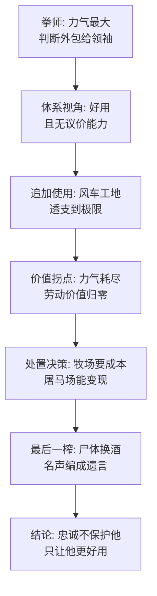

# 13｜拳师：为什么最忠诚的劳动者，结局最惨？

> 「我要更加努力工作」的拳师，为农庄流尽了最后一滴汗，为什么被送去了屠马场？

---

## 一、先说结论

拳师是动物农庄最强壮的挽马，干三个人的活，是牛棚战役的英雄，也是风车工地的主力。他面对一切问题的答案只有两句口头禅：「我要更加努力工作」「拿破仑同志永远正确」。他累垮在工地上之后，没有等到休养，等来的是一辆写着「屠马商兼熬胶商」的货车——他被卖掉了，换来一箱当晚就被猪们喝光的威士忌。拳师是全书最痛的角色，因为他的命运戳破了一个所有劳动者都依赖的假设：忠诚和汗水会换来善待。奥威尔用他说明，在一个只讲效忠不讲权利的体系里，最忠诚的劳动者恰恰是最优质的耗材——好用、不抱怨、死了还能变现。

## 二、我们先理解一个问题

先列出拳师的「资格」，再对照他的结局。

资格清单：全农庄力气最大的动物，一匹顶三匹；牛棚战役里蹄子踢翻过人类，立下战功；风车工地三次重建，最重的石头都是他拉的；早起晚归，别人收工他加练，口头禅是「我要更加努力工作」；政治上毫无野心，从不争权，遇到想不通的事就用第二句口头禅收尾——「拿破仑同志永远正确」。

按任何朴素的道德账本，这样的动物应该得到农庄最好的照顾：老了给草料，病了给医治，干不动了让他安度晚年。这也是拳师自己的全部指望——他拉石头的时候撑着一口气，心里想的是「再干完这一段，退休的日子就快到了」。

结局我们都知道了：他倒在工地上，被抬进一辆货车。本杰明追在后面喊出了车身上印的字——屠马商。奖励忠诚的不是牧场，是屠宰场。这中间到底哪一环出了问题？

## 三、作者到底提出了什么观点？

书中写道，拳师把自己的全部判断都外包给了两句话。风车要不要建？拿破仑同志永远正确。雪球是不是叛徒？拿破仑同志永远正确。牛棚战役的记忆被改写了？也许吧——反正我要更加努力工作。

奥威尔借拳师解剖的是一种劳动者的生存哲学：用体力上的加倍投入，替代判断上的独立承担。想不通的事不想了，用干活压过去；看不清的局势不看了，用「相信领导」盖过去。这套哲学在个人层面是省心，在结构层面是自杀——因为它把「我应该被善待」这个唯一的筹码，也交给了对方定义。

最冷的一笔在结尾。拳师死后三天，尖嗓子宣布他死在了医院，临终遗言是「前进！动物农庄万岁」；至于那辆屠马商的货车，解释说那是医院新买的二手车，旧字样还没来得及重漆。当晚，猪们喝到半夜——用的是卖拳师换来的威士忌。一头马的最后价值被精确榨取了两遍：先榨干力气，再榨干名声，连尸体的去向都要编进宣传口径。

## 四、把这个观点翻译成人话

用大白话说：拳师的悲剧不是「好人没好报」，是**他把自己活成了一件没有议价能力的资产**。

资产和伙伴的区别在哪？伙伴是可以讨价还价的：我出多少力、得多少回报、什么时候退出，都有商量。资产没有这些——资产的价值由所有者说了算，使用年限由所有者说了算，报废方式也由所有者说了算。拳师的两句口头禅，恰好把自己从伙伴降格成了资产：第一句「更加努力工作」放弃了对劳动条件的谈判，第二句「永远正确」放弃了对决策的判断权。

而一个体系对「用旧的资产」的标准处理方式是什么？不是养老，是处置——榨出最后的残值，然后销账。屠马场是肉体的销账，「临终遗言」是名誉的销账，威士忌是残值变现。拳师至死都相信自己是被送去疗伤的，这才是最疼的地方：耗材到报废那一刻，还以为自己在保修期。

## 五、为什么会这样？

为什么最忠诚的人反而下场最惨？拆开看，逻辑是冷的：

这条链上最刺眼的节点是「价值拐点」。牧场养老和屠马场变现之间，差的不是感情——猪们对拳师未必有私怨——差的是一笔账：养一匹干不动活的马要持续投入，卖一匹干不动活的马能立刻回笼一箱威士忌。在一个劳动者不掌握自己命运定价权的结构里，「忠诚值多少钱」这个问题，从提问那天起就由收账方回答了。

还有一层：拳师的忠诚反而加速了这个结局。正因为他不质疑，风车计划可以无限追加；正因为他无怨言，透支可以一直继续；正因为「永远正确」，连送他走的谎言都不需要编得太圆——尖嗓子那套「医院二手车」的说辞漏洞百出，但拳师已经没法听见了，听见的那批动物又学不会拳师曾经会做的事：追问。

## 六、举一个现实生活中的例子

看每个公司里都有的那种「老黄牛」。

工龄最长，加班最多，从不提涨薪，从不在会上唱反调。别人推诿的烂摊子他接，别人不愿去的项目他去。领导在大会上表扬他「是我们学习的榜样」，他憨厚地笑笑，第二天继续最早一个到工位。他的口头禅和拳师同构：「干就完了」「公司肯定不会亏待咱」。

然后有一天，组织架构调整，第一批「优化名单」里就有他。理由很体面：成本结构、年龄结构、人才迭代。HR 谈话时的措辞也和尖嗓子同款温情：感谢多年贡献，公司永远记得你。散伙饭吃完，他的工位三天内就有新人坐下，他的「事迹」留在公司的荣誉墙里——和拳师的「临终遗言」一个用途：遗体进了宣传材料。

这类故事的共同点不是老板特别坏，而是结构一样：一个从不为待遇谈判、从不积累议价筹码、把安全感全部押在「我忠诚所以安全」上的劳动者，在账本翻页的时候，和一台折旧完毕的设备排在同一列。

## 七、回到书中重新理解

重读拳师线，会发现奥威尔把他的死写成了一场「全民目击的测试」。

货车拉走拳师的时候，所有动物都在场，本杰明喊出了车身上「屠马商兼熬胶商」的字样，动物们追在车后跑——这是他们离真相最近的一次，近到只差追上那辆车。没追上。三天后尖嗓子拿出漏洞百出的解释，大家居然接受了。奥威尔在这里写的不是拳师一个人的悲剧，而是一次集体的错过：真相曾经拉着警笛从全体动物面前开过，他们眼睁睁看它开走，然后选择相信补丁。

拳师影射的是被耗尽的无产阶级——苏联语境里的斯达汉诺夫式工人，被树为劳动英雄、超额完成定额，最终被体系榨干。但奥威尔给这个角色加了一层超越时代的普遍性：拳师不愚昧、不懒惰、不投机，他有的恰恰是主流价值观赞美的一切品质——勤劳、忠诚、信任、奉献。这本书最冷的地方就是：**它让最值得赞美的人，死于他最被赞美的品质。**

还有一个细节容易被漏掉：拳师倒下前，唯一的指望是「退休」。农庄的规矩里写着老马可以退休养老——权利文本里其实写好了他的保障，只是没有任何机制保证它会兑现。承诺在纸上，定价权在猪手里，这和被禁的《英格兰兽》、被涂改的七诫，是同一条链：凡是无法由受益人执行的承诺，都只是宣传材料。

## 八、这个观点背后还有什么？

第一，拳师和本杰明是一对镜像。驴子本杰明什么都看得懂，所以什么都不说，也什么都不出全力——他活到了最后；拳师什么都不看懂，所以什么都扛，死得最早。奥威尔把「看破的犬儒」和「实干的信徒」摆在一起，给出一个残忍的对比：在这个农庄里，清醒者自保，奉献者殉葬。这等于否定了「好好干总会有出路」这条最朴素的劳动伦理。

第二，拳师的两句口头禅是一个完整的闭环：「更加努力工作」负责消耗身体，「永远正确」负责关闭大脑。前者保证他没有余力观察，后者保证他没有动机怀疑。身体被工地占用，头脑被口号托管——一个完美的劳动力就此成型。宣传机器不需要骗他，他自己会完成自我说服。

第三，威士忌那笔账值得停在原地多看一眼：一头马的整条命，折现为一箱酒，当晚喝完。奥威尔故意把数字写得这么小——不是一笔巨款，不是一块地，就是一顿酒钱。忠诚的价格不是被低估了，是被当场揭示了：在掌权者的账本上，它从来就没被当作资产记过价。

## 九、这个观点有问题吗？

说服力在哪：拳师之死是全书情感冲击最强、也是最站得住的一段——「好用者不议价，议价者不好用」的结构分析，把个人悲剧还原成了机制问题，避免了廉价的「坏人害好人」式读法。牲畜老了卖给屠马商，在真实的农场经济里本来就是常态，奥威尔只是把这笔账算给读者看。

争议在哪：第一，有读者认为奥威尔把拳师写得太纯了——现实中「忠诚的劳动者」很少完全放弃判断，拳师的「零怀疑」是寓言需要的极端化。第二，把结局完全归因于结构，可能放过了个体责任：本杰明明明读懂了车身上的字，动物们明明追过那辆车——他们集体选择了不追问，这份共谋不全是「结构」能免责的。

哪里过度简化：把劳动关系压缩成「资产与所有者」两个角色，略去了中间层——工会、舆论、行规、同伴网络。书里这些都不存在，所以账算得干净利落；现实里劳动者多少有第三方可借力，绝望程度没有寓言里那么绝对。

还有哪些其他解释：心理学的解释强调认知失调——拳师不是不想怀疑，是怀疑的代价太高，一旦承认被骗，前半辈子的汗就白流了，所以「永远正确」是自我保护而非单纯天真；经济学的解释强调沉没成本和议价筹码——拳师的问题不在忠诚，在忠诚之外没有任何替代选项；也有解释认为，奥威尔真正批判的是单向度的评价体系——当一个社会只奖励「奉献」不奖励「判断」，它就会批量生产拳师。

## 十、今天再看这个观点

以下部分是基于作者思想的现代延伸，不是作者原话。

「拳师困境」在今天的变体，是把自我价值完全绑定在单一雇主、单一身份、单一叙事上的人。当一个人的全部筹码是「我为它付出了多少」，他就把定价权完整让渡给了收账方——平台骑手、大厂老黄牛、体制内熬资历的人，账本的结构是同一个。

但现代环境也给了拳师书里不存在的选项：技能可以跨雇主流通，资历可以公开记账，声音可以绕过尖嗓子直接抵达同类。换句话说，今天的「屠马场货车」还在，但「本杰明喊出车身上的字」之后，围观者有了追上车的可能——前提是他们不选择用「拿破仑同志永远正确」来替自己省掉追问的力气。奥威尔如果今天重写，也许会把问题换成：当追问的成本已经降下来，沉默还算是被迫的吗？

## 十一、这一篇真正应该记住什么？

1. 拳师死于他最被赞美的品质：勤劳、忠诚、信任、奉献——这是全书最冷的一笔。
2. 两句口头禅是闭环：「更加努力工作」耗光身体，「永远正确」关掉大脑。
3. 忠诚没有定价：在只有效忠没有权利的体系里，忠实员工和折旧设备排在账本同一列。
4. 最后一榨是名誉：屠马场收走肉体，「临终遗言」收走名声，威士忌是残值。
5. 那是一次全民目击的测试：真相拉着警笛开过，动物们追了几步，然后选择相信补丁。

## 十二、留一个问题

拳师到死都相信那辆车是开往医院的。但如果他在车厢里听见了真相——他这辈子流的汗、信的话、喊的口号全是一场骗局——对他来说，知道真相和不知道真相，哪一个更仁慈？

这个问题先存着。拳师代表着「不问就信」的人，而农庄里还住着另外两种角色：一头什么都看得懂却什么都不说的驴，和一只整天宣讲死后糖果山的乌鸦。看破的和做梦的，凭什么反而活得比实干的久？下一篇我们看本杰明和摩西——犬儒与宗教，各自看透了什么。
