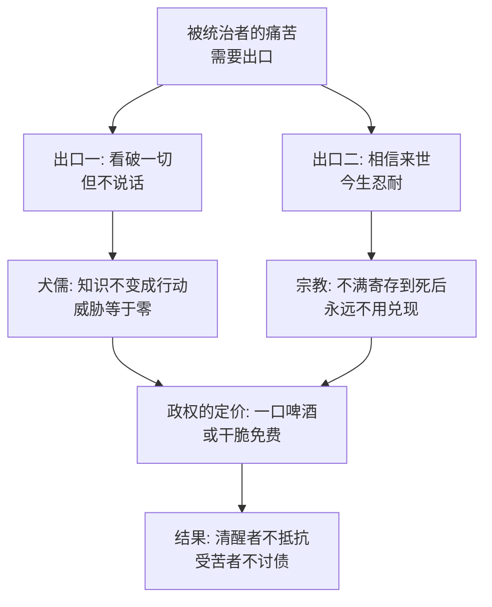

# 14｜本杰明与摩西：犬儒和宗教，各自看透了什么？

> 一头什么都看得懂的驴，和一只只会讲来世的乌鸦，为什么偏偏是拿破仑政权最容忍的两种动物？

---

## 一、先说结论

本杰明是《动物农庄》里最聪明的动物——他识字的水平和猪相当，每一次变局都看在眼里，却从来只说一句话：「生活从来如此，以后也如此。」摩西是农庄里最「没用」的动物——一只不干活、整天讲死后去糖果山享福的乌鸦，革命后猪不仅不赶他，还每天给他一口啤酒配给。奥威尔把这两个角色并排放在书里，是要画出被统治者的两种逃避方式：**一个犬儒，一个麻醉剂。** 看破不说破的知识分子不构成威胁，相信来世的群众不要求今生——对政权来说，这两种人不是隐患，是资产。

## 二、我们先理解一个问题

先想象一个政权最该防的是谁。

按直觉，应该是聪明人——看得穿宣传、记得住历史、认得出谎言的那种。本杰明完全符合：全书每一次涂改七诫、每一次尖嗓子颠倒黑白，他都在场，而且他都懂。动物里只有他从头到尾没有被骗过。

按同一个直觉，其次该防的是「传播别的信仰」的人——摩西讲的是死后世界，跟革命教义完全是两套话语，革命初期他确实被当作「琼斯先生的间谍」赶走了。

可是书中写道的现实是：本杰明活到了最后，摩西被赶走又飞了回来，还领上了配给。反倒是那些不懂的、相信的、卖力的——拳师被卖去屠马场，母鸡被饿死，羊被训练成活喇叭。为什么看得懂的留下了，看不懂的反而被消耗掉了？

## 三、作者到底提出了什么观点？

先看本杰明。书中写道，他是农庄里年龄最大、脾气最坏的动物，对革命既不热心也不反对。雪球的演讲他不表态，拿破仑上台他不表态，七诫改了他也不表态——动物们问他看法，他的标准答案是：「驴子长寿。你们谁都没见过死驴子吗？」这句话的潜台词是：我活得比你们所有人都久，我见得多了，所以你们的激动在我眼里都不新鲜。

他唯一一次失态，是拳师被拖上货车那一幕。全农庄只有他读出了车厢上「屠马商」的字，他第一次扯着嗓子嘶吼，让所有动物去追——但货车已经开远了。唯一清醒的人，在唯一关键的时刻，还是晚了。

再看摩西。他是琼斯先生养的乌鸦，职业是「间谍和长舌妇」，业余工作是讲故事：所有动物死后都会去一个叫糖果山的地方，那里每周休息七天，苜蓿四季常青，方糖直接长在篱笆上。书中写道，动物们将信将疑，却还是愿意听他讲——干活太累的时候，谁都需要一个画出来的去处。

奥威尔安排的最微妙的细节是：革命后摩西一度消失，几年后又飞回来了，继续讲糖果山。而猪的态度是：不赶他，不让他干活，每天给他一口啤酒。

## 四、把这个观点翻译成人话

用大白话说：**一个政权不需要人人拥护，它只需要没人认真反对。**

犬儒和宗教恰好从两头满足了这一点。犬儒说「我早就知道会这样」——这句话听起来像洞见，功能却是取消行动的必要：反正天下乌鸦一般黑，换谁都一样，那还折腾什么？于是最清醒的人自我缴械，识破了一切，原谅了一切。

宗教说「今生的苦是为了来世的甜」——这句话听起来像安慰，功能是把不满寄存到一个永远没法兑现的账户：死后才结账，谁死后来投诉过？于是最苦的人自备止痛药，受着最深的剥削，盼着最远的假期。

一个把批判消化在心里，一个把希望推迟到死后。政权连镇压都省了。

## 五、为什么会这样？

为什么政权偏偏容得下这两种人？奥威尔的逻辑链是这样的：

这条链上有两处值得单独说。

第一是「知识不等于威胁」。我们通常默认「看得懂的人危险」，但奥威尔指出，知识要变成威胁，中间还差一步——说出来、传出去、变成行动。本杰明掐掉了这一步：他的聪明全部用于自我消化，产出为零。一个从不对外输出的智者，对政权来说和不存在没有区别。

第二是「安慰是便宜货」。注意猪给摩西的报酬：每天一口啤酒，不用干活。这是全书性价比最高的一笔开支——一口啤酒买下的是无数动物对今生苦难的忍耐额度。影射到现实里，这对应着历代政权对教会的态度：不需要你帮我宣传，只需要你替我安抚。

## 六、举一个现实生活中的例子

想一想办公室里的那位老油条。

他入职十五年，什么都见过：战略换过八版，领导换了五任，每次「这次不一样」的运动他都经历过。新人激动地跟他吐槽公司，他总是笑笑：「我刚来的时候也这样，过几年你就明白了。」他从不在会上表态，从不站队，从不提意见——不是不懂，是太懂了，懂到确信一切都不会变。

诡异的是，这种人往往最安全。裁员裁不到他，斗争扯不上他，因为任何一方都知道：他不构成威胁。他的全部智慧用来「不生气」，而不生气的人，也不会做任何事。

再看家里那位长辈。你跟他说工作里被欺负了，他说「吃亏是福，忍忍就过去了」；你说这不公平，他说「老天爷看着呢，坏人自有报应」。他把所有的不公都存进了一个叫「以后」的账户——人在做天在看，善恶终有报。这些话慰藉了他一辈子，也让他一辈子没有去争过任何一样东西。

老油条是本杰明，长辈是摩西教出来的信徒。一个用看透取消了行动，一个用彼岸消化了此岸。

## 七、回到书中重新理解

现在再看这两个角色，会发现奥威尔的笔是双线的。

本杰明一般被解读为影射犬儒化的知识分子——那些看穿真相、却选择沉默的知识阶层。一些学者甚至更尖锐地认为，本杰明身上有奥威尔自己的影子：他什么都懂，他悲观，他活得比谁都久地旁观。这解释了为什么奥威尔给他的笔墨带着一种近乎自厌的冷静。

摩西影射的是俄罗斯东正教会，对应关系几乎是逐条的：沙皇时代教会为政权服务——摩西是琼斯养的；革命初期教会被取缔——摩西被赶走；斯大林在战争期间恢复教会以换取支持——摩西飞回来，领到啤酒配给。书中写道，猪容忍摩西是因为动物们干活太累的时候需要听听糖果山——安抚品在短缺年代是战略物资。

把两头放在一起看，奥威尔要说的是：被统治者沉默的方式不止一种。拳师用忠诚沉默，羊用口号沉默，本杰明用智慧沉默，信徒用盼望沉默。沉默的价码不同，结果一样。

## 八、这个观点背后还有什么？

第一，本杰明是全书唯一一个「本可以改变结局」的旁观者。他能识字——这意味着他能读出七诫被改的每一个字，能认出屠马场的货车，能在每一次篡改现场作证。全书里这种能力只有猪和他有。可他把它用在了「不出声」上。犬儒的真正代价不是冷漠，是把稀缺的预警能力白白耗在肚子里——拳师被拖走那晚，他如果早一天说出来呢？

第二，政权对这两类人的定价方式完全不同，值得细看。本杰明是免费的——犬儒自带口粮，他的报酬是优越感，是「我比你们清醒」的内心秩序，政权一分钱不用花。摩西需要补贴——啤酒虽小，说明麻醉剂是要生产的，安慰是一门有成本的生意。一个政权对犬儒零投入、对宗教微投入，买来的都是沉默，这是统治术里极精明的一笔账。

第三，注意本杰明唯一一次失控是为了拳师。这泄露了犬儒的底色：他不是没有感情，是把感情压缩到了只剩一个对象。全世界他都不在乎，只在乎那匹马——所以那匹马被拖走的时候，他一辈子的镇定在几十秒内崩溃。犬儒不是免疫，是延迟发作。

## 九、这个观点有问题吗？

说服力在哪：奥威尔抓住了极权生态里一个反直觉的真相——镇压不是所有沉默的来源，自我取消才是大头。历史上东正教会在苏联的「先取缔后恢复」，与知识阶层的普遍沉默，都有扎实的史实支撑。把「清醒的旁观者」列为专制机器的一部分，是这本书最狠的洞察之一。

争议在哪：第一，把宗教简化为「麻醉剂」沿用了马克思「鸦片」的论断，但历史上教会也有反抗政权、庇护底层的一面——摩西只呈现了宗教顺从的那一半。第二，本杰明的沉默可以被另作解读：一些学者认为他不是犬儒而是清醒——他早知道反抗会换来新主子，所以拒绝配合任何一方演戏，这是悲观而非怯懦。

哪里过度简化：寓言把「看透了」和「不说」焊死成一个人格，但现实里的旁观者往往是动态的——今天沉默的人，明天可能在某个时刻开口。本杰明的恒定沉默服务于寓言结构，却低估了人在压力下的摇摆性。

还有哪些其他解释：一种解释从经济结构看——本杰明不承担最重的劳役，他的沉默是处境较好者的沉默，而非智者的沉默；另一种解释认为，在连语言都被垄断的环境里（七诫的解释权在猪手里），本杰明的沉默是合理的——说出来也没用，苜蓿不是觉得不对吗，有用吗？

## 十、今天再看这个观点

以下部分是基于作者思想的现代延伸，不是作者原话。

本杰明可能是全书在今天成活率最高的角色。「我早就知道会这样」已经是社交媒体的默认语气：每条丑闻底下都是「早就如此」「太阳底下无新事」「你才知道啊」。犬儒不再是少数知识分子的姿态，而成了大众的口气——只是今天的犬儒连书都不用读，一句「都一样」就能完成本杰明一辈子才修成的冷漠。

摩西的糖果山也换了形态。它未必还叫来世，可以叫「以后就好了」「熬过这阵再说」「平台不会亏待认真的人」「吃苦是福气」——一切把补偿推迟到不可验证时间点的叙事，都在做糖果山的生意。连安慰都工业化了：以前是乌鸦一只只讲，现在是一句句话术批量分发。

真正该问的是：当你发现自己对一切都不惊讶、对一切都能「看透」时，你是在变得更清醒，还是在变成农庄里最长寿、也最没用的那头驴？

## 十一、这一篇真正应该记住什么？

1. 沉默不止一种配方：拳师用忠诚沉默，本杰明用智慧沉默，信徒用盼望沉默——结果对政权来说完全一样。
2. 看破不等于威胁：知识要变成行动才算数，只用于自我消化的清醒，产出为零。
3. 麻醉剂是便宜的战略物资：一口啤酒换一群人的忍耐，是全书性价比最高的统治开支。
4. 犬儒的代价是浪费预警能力：本杰明识字，能读出一切篡改——他若早开口一天，拳师也许不用死。

## 十二、留一个问题

如果「不说话的清醒」和「讲来世的安慰」都在替政权工作，那么反过来问：一个人要怎么做，才不算参与了自己的压迫？

这个问题先存着。因为除了这两个清醒的和做梦的，农庄里还有更大的一群——只会喊口号的羊、为鸡蛋拼命的母鸡、两头讨好的猫。他们不是旁观者，他们是这台机器运转时最忙碌的零件。下一篇，我们看底层是怎么亲自下场，参与了自己的压迫。
