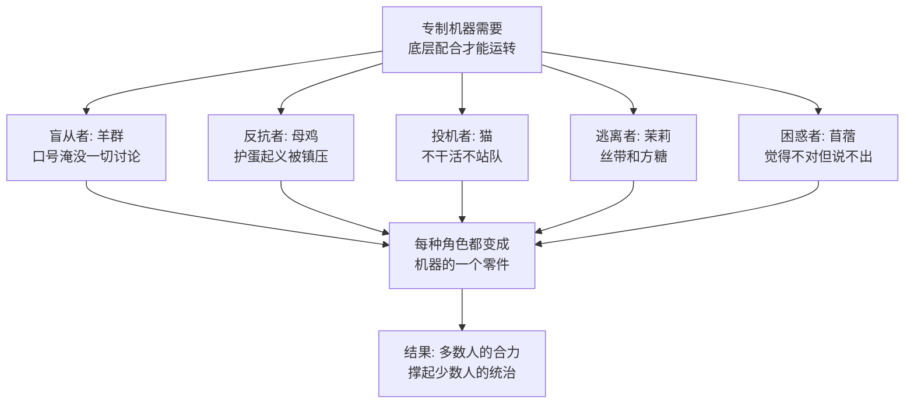

# 15｜羊群、母鸡和猫：不同阶层的动物，怎么参与了自己的压迫？

> 一台专制机器只靠猪和狗是转不起来的——那么，占大多数的普通动物，各自出了哪一份力？

---

## 一、先说结论

《动物农庄》里的专制不是猪和狗两头的事业，它有一群沉默的合伙人。羊群是盲从者——学不会七诫，只会喊「四条腿好，两条腿坏」，每当辩论进入关键时刻，他们的叫声就淹没一切；母鸡是反抗者——为保卫鸡蛋发动了全书唯一一次底层起义，被断粮饿死九只；猫是投机者——从不干活也从不站队，开会积极、出勤为零，两头讨好谁都不得罪；茉莉是逃离者——要丝带和方糖，最后逃回人类社会；苜蓿是困惑者——每次觉得「哪里不对」却念不出墙上的字。奥威尔画的不是一群受害者，而是一幅阶层图谱：**盲从者、反抗者、投机者、逃离者、困惑者，每一种都以自己的方式，成了这台机器的零件。**

## 二、我们先理解一个问题

读这本书很容易形成一个惯性视角：上面是坏人（拿破仑），下面是受害者（所有动物）。坏人对受害者干了坏事，故事就这么简单。

但如果真是这样，有笔账对不上：猪只有十几头，狗只有九条，而农庄里有上百只动物。力气最大的是马，数量最多的是羊和鸡——为什么几百个被统治的，压不住几十个统治的？

答案不能只写「因为有狗」。狗负责的是最后那一下撕咬，可在这之前，是谁让讨论进行不下去的？是谁把口号喊得最响的？是谁在邻居被拖走时低下头的？这一篇要看的，正是这些「非反派」的角色。

## 三、作者到底提出了什么观点？

奥威尔给每个阶层都分配了一个角色，几乎没有闲笔。

**羊群：完美的群众。** 书中写道，雪球花了很多时间教羊背七诫，但它们智力有限，最后只能压缩成一句：「四条腿好，两条腿坏。」这句口号第一次大显身手，是在雪球演讲赢得掌声时——羊齐声高喊，把接下来的讨论全部淹没。雪球被驱逐后，这群羊被拿破仑接手，功能原封不动地保留：每当有动物要提出异议，羊就开喊。到最后猪学两条腿走路，羊的口号原样升级：「四条腿好，两条腿更好！」盲从者不生产观点，只放大当前的赢家。

**母鸡：唯一的反抗者。** 拿破仑下令鸡蛋全部上缴换钱，母鸡做出了全书唯一一次有组织抵抗：飞到椽子上，把蛋摔碎在地上。镇压方式是断粮——五天后九只母鸡饿死，其余投降，尸体埋在果园里。书中写道，动物们被告知的死因是「球虫病」。

**猫：职业的投机者。** 书中写道，猫在表决时总是两边都投——开会最积极，干活永远找不到她。她还搞过一个「老鼠再教育委员会」，号称要把老鼠改造成好动物，工作内容据说是宣讲，实际成效为零。她对革命和拿破仑都不忠诚，只对舒服忠诚，而她也确实活成了农庄里最舒服的动物之一。

**茉莉与苜蓿：逃离者和困惑者。** 茉莉是拉车的小白母马，革命后发现自己要失去人类的丝带和方糖，于是逃回人类社会，给另一个农场主拉车。苜蓿是那头母马，识字只够认字母表，每次觉得「哪里不对」却验证不了——她代表了数量最大的一群：直觉知道不对，但没有工具核对。

## 四、把这个观点翻译成人话

用大白话说：**专制是一台需要全员出勤的机器，只是不同人干的工种不同。**

羊的工种是「气氛组」——不需要理解，只需要在正确的时间发出足够大的声音。母鸡的工种是「代价展示」——反抗者的尸体用来告诉旁观者「这就是下场」。猫的工种是「润滑剂」——她的存在证明了「不站队也能活」，于是更多人选择不站队。茉莉的工种是「出口」——她的离开证明「想走的走了」，留下的人更无话可说。

最微妙的是：这些角色没有一个需要知道自己在为机器工作。羊以为自己只是在喊口号，猫以为自己只是聪明，茉莉以为自己只是想过好日子。**合谋不需要共谋**——每个人都只是在追求自己的小利益，加起来就成了系统。

## 五、为什么会这样？

为什么几百只动物压不住几十头猪和狗？奥威尔给出的结构是这样的：

这条链上两个环节值得展开。

第一是「功能与意图分离」。羊群不知道自己是在执行舆论管制，他们只是觉得喊口号很热闹——但机器要的就是这个效果。奥威尔的狠处在于指出：系统的每个零件都不必知道整台机器在造什么。这是合谋结构最可怕的地方——不需要坏人足够多，只需要各怀小利的普通人足够多。

第二是「反抗的成本定价」。母鸡起义的失败不是因为反抗无效，而是因为政权掌握了定价权：反抗的代价是断粮饿死，顺从的代价是交出鸡蛋。只要前者贵得离谱，后者再亏也有人选。九只母鸡的尸体，就是把「反抗的价格标签」钉在了果园里。

## 六、举一个现实生活中的例子

想一想一个班级在选出专制型班长之后的样子。

第一种人是起哄的。班长说「谁不跟我一组就是跟全班作对」，立刻有一群人跟着喊——他们不是想通了，只是觉得喊这个最安全、最热闹，而且喊的人越多越安全。谁要是提出不同意见，最先淹没他的不是班长，是这群喊口号的。

第二种人是较真的。有个同学真的去翻班规、真的在会上说「这条不合理」。结果是：不是被说服，而是被孤立——喊口号的人觉得他「事多」，中立的人觉得他「连累大家」。班长只需要晾着他，不用动手，他自己就成了「破坏团结的人」。

第三种人是永远中立的。开会他来，表态他躲，谁赢他跟谁笑。他的名言是「我就一普通同学，这些事我不懂」。他确实活得最省心——既没有起哄者的廉价热情，也没有较真者的昂贵麻烦。

一个班级就是一座农庄：喊口号的羊、摔蛋的母鸡、不站队的猫。专制不需要全班都是坏人，只需要这三种人各就各位。

## 七、回到书中重新理解

回到书里，这幅图谱几乎可以直接贴到历史上。

羊群影射的是被口号喂养的盲众——他们不判断内容，只跟随声量。一些学者把母鸡起义对应到苏联农业集体化中农民的反抗：屠宰牲畜、藏匿粮食，换来的是更残酷的镇压与饥荒——九只饿死的母鸡背后，是真实历史里以百万计的死亡。猫对应的是体制内外的投机者——任何政权下都有活得滋润的中间人。茉莉影射的是流亡的小资产阶级：革命许诺的平等对她没有吸引力，她要的只是丝带和方糖，于是宁可回去给旧主人拉车。

最值得停下来看的是苜蓿。她不是零件，她是机器的「误差」——书中多次写道她觉得不对：七诫改了她说不对，屠杀后她唱起《英格兰兽》想哭。可她识字只够认字母，永远验证不了自己的怀疑。奥威尔把她放在图谱的中央，是要指出最庞大的那个阶层：不是盲从，不是投机，是**模糊的善意**——感到不对、说不出哪里不对、于是继续过日子。这个阶层的人数，决定了其他所有零件的生效范围。

## 八、这个观点背后还有什么？

第一，羊群的功能在书里完成了两次「转手」，这很少被注意。雪球训练羊喊口号，用来淹没拿破仑一方的反对声音；雪球被驱逐后，同一群羊、同一句口号，被拿破仑原样用来淹没雪球的拥护者。口号没有换，羊群没有换，只换了按喇叭的人。**盲从是一种基础设施——谁掌权归谁用。**

第二，猫的「老鼠再教育委员会」是个容易被忽略的细节：她用一套「为了大家好」的叙事包装自己的不干活。投机者的高级形态不是公然偷懒，而是发明一件听起来有意义、永远考核不了的「工作」——这几乎是职场里所有务虚岗位的寓言原型。

第三，反抗者为什么是母鸡而不是别的动物？奥威尔的选择很精确：鸡蛋是母鸡「自己的东西」——别的动物被拿走的是劳动，母鸡被拿走的是后代。底层不是不会反抗，而是只有当压迫碰到「最后那条线」时才会反抗。这解释了统治的一个核心技术：永远只拿九成，留下一成，让每个人算完账都觉得「还能忍」。

## 九、这个观点有问题吗？

说服力在哪：把专制解释为「全员合谋的结构」而非「少数人作恶」，符合政治学的研究——一些学者认为，极权统治的维持成本远低于想象，正是因为社会各层以「不参与、不质疑、不抵抗」的方式分摊了成本。奥威尔用几个动物种群把这个抽象结论画成了漫画，精准且可感。

争议在哪：第一，这种讲法有「责怪受害者」的风险——把压迫的账分摊到底层头上，可能冲淡统治者真正的责任。喊口号的羊固然可恨，但训练羊的是雪球和拿破仑。第二，母鸡起义被写成「失败案例」，但也可以反着读：九只母鸡的死亡证明底层并非天然顺从，反抗的失败是镇压技术的结果，不是底层意志的缺陷。

哪里过度简化：寓言按物种分配阶层，一个种群一种人格——但现实中的人是流动的：今天喊口号的，明天可能是较真的；投机者也可能在某个节点选边。物种的固定性让图谱清晰，却也牺牲了「人会变」这个现实变量。

还有哪些其他解释：一种解释强调信息而非人格——底层的配合主要不是盲从或投机，而是信息封锁（苜蓿看不懂墙）造成的判断瘫痪；另一种解释强调暴力威慑——与其说是底层「参与」了压迫，不如说是恐惧「征用」了底层，合谋的说法高估了他们的选择空间。

## 十、今天再看这个观点

以下部分是基于作者思想的现代延伸，不是作者原话。

羊群功能在今天已经完全自动化了。不需要训练羊喊「四条腿好」——评论区、热搜和转发按钮就是羊群，任何话题下都有现成的声量，任何异见都会被格式化的喊声淹没。雪球当年还要花时间教羊背句子，今天的算法直接按「参与度」分发喇叭。

猫的后代也过得很好。「我不站队」「这事跟我没关系」「我就是个打工人」——中立从来不是一个位置，而是一种产品，专制环境里它是最畅销的那款。至于母鸡的反抗，今天依然存在，只是「椽子」换了地方：断供、弃考、离职信——每一次以毁掉自己所有物为代价的抵抗，本质上都是在把蛋摔在地上。

真正值得警惕的是苜蓿的位置：今天识字的人比农庄时代多得多，但「觉得不对又验证不了」的状态并没有消失——信息太多等于没有信息，当一切都能被说成假的，字母认得再多，也念不出墙上那句话。

## 十一、这一篇真正应该记住什么？

1. 专制是合谋结构：盲从者出声、投机者润滑、反抗者示范代价、逃离者腾位置——每种角色都是零件。
2. 零件不需要知道整机在造什么：各怀小利的普通人加起来，就是系统本身。
3. 口号是中立的基础设施：同一群羊先服务雪球再服务拿破仑，盲从谁掌权归谁用。
4. 最大的一群是苜蓿：感到不对、说不出哪不对、继续过日子——他们的人数决定一切。

## 十二、留一个问题

如果底层的每一种「生存策略」最后都在给机器供电，那出路在哪里？连「不站队」都是机器需要的零件，普通人还剩什么选项？

这个问题先存着。因为农庄的故事要走到最后一幕了——猫也好羊也好，他们终将看到一幅超出所有人想象的画面：猪站起来了，用两条腿，绕着院子走。下一篇，我们看这场全书最震撼的变身，以及它为什么不是意外，而是轮回。
