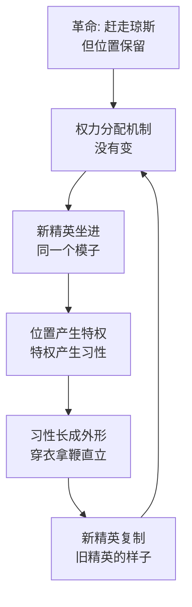

# 16｜两条腿走路：为什么说腐化不是意外而是轮回？

> 当猪用后蹄绕着院子走路的那一刻，动物们看到的到底是一次堕落，还是一个圈？

---

## 一、先说结论

《动物农庄》的高潮不是屠杀，不是饥荒，而是一个安静的动作：尖嗓子和一群猪用两条后腿直立行走，绕着院子走了一圈。奥威尔在这一幕里给出了全书的最终诊断——**腐化不是某头猪的道德失败，而是位置对人的改造。** 拿破仑不是变坏了才坐上那个位置，而是坐上那个位置之后，那个位置把他变成了琼斯。推翻旧精英的革命制造了新精英，新精英连走路的姿势都在复制旧精英。这一幕影射的是革命史上的「热月」：不是革命被背叛了，而是革命生出了它自己的统治阶级——轮回本身，才是这本寓言最冷的地方。

## 二、我们先理解一个问题

先注意一个容易被读漏的细节：动物农庄的革命，赶走的不是「某个坏人」，而是「两条腿」这个物种。

七诫第一条写得很明白：凡用两条腿走路的，都是敌人。对动物来说，「两条腿」不是走路方式，是一个政治概念——它代表着坐享其成、拿走牛奶和鸡蛋、拿鞭子的那一类存在。所以全书真正的问题从来不是「拿破仑坏不坏」，而是：**当农庄里最反对两条腿的动物，自己变成了两条腿，这场革命到底推翻了什么？**

如果答案只是「推翻了一个叫琼斯的人」，那革命换的只是一个名字。如果答案是「推翻了人这个阶级」，那为什么猪站起来之后，动物们看到的分明是人回来了？

## 三、作者到底提出了什么观点？

书中写道，那一幕发生得毫无预兆。几年过去，琼斯死在酒鬼收容所，雪球被遗忘，当年参加革命的老动物一个个凋零——马只剩苜蓿，猪却养得肥壮。然后某一天，动物们看到尖嗓子用两条后腿走了出来，虽然走得不稳，但确实是直立行走。接着一头接一头的猪走出来，最后拿破仑本人也出来了——直立，穿着琼斯留下的黑外套和马裤，蹄子里还握着一根鞭子。

细节堆得很密：猪搬进了农舍，睡床，喝酒，听收音机，穿衣服，用两条腿走路。每一条都是当年七诫明文禁止的——不准睡床、不准喝酒、不准穿衣、四腿为善。现在它们被一次性全部跨过，而且是公开地、绕场一周地跨过。

苜蓿的反应是全书的情绪低点。书中写道，她盯着这幅画面，惊得喊来了所有动物——不是愤怒，是一种连名字都叫不出的惊恐。而羊群此刻齐声改喊：「四条腿好，两条腿更好！」当晚动物们回到墙下，发现七条戒律已经被全部刷掉，只剩一条。

奥威尔认为，这一幕要说的不是「坏人得逞」，而是更结构性的东西：你换掉了坐在那个位置上的人，但没有换那个位置。

## 四、把这个观点翻译成人话

用大白话说：**不是人掌权之后变坏了，是那个位置本身会生产「人」。**

想象一下农庄是一个模子：农舍在那、鞭子在那、「谁来管理农庄」这个问题在那。琼斯不过是刚好坐进模子的那个。革命把琼斯从模子里抠出去，但没有砸掉模子——于是猪坐了进去，然后被模子一点一点压出琼斯的形状：住农舍、拿鞭子、穿衣服、直立行走。

所以这一幕真正的问题不是「拿破仑怎么变坏了」，而是「为什么谁坐上去都会变成这样」。答案在书的前面已经埋好了：特权从牛奶苹果开始，暴力从九条狗开始，解释权从识字开始——机制不改，换什么品种坐上去，成品都是一样的。

腐化不是意外，是流水线。

## 五、为什么会这样？

为什么坐上那个位置就一定会变成人？奥威尔埋在全书里的机制是这样的：

这条链上有两个环节最关键。

第一是「位置先于人品」。注意奥威尔没有写拿破仑年轻时就是坏猪——书里他甚至没什么个性，只写他少言寡语、善于积蓄势力。真正被写的是那个位置的内容：独占的粮食、独立的住处、对暴力和解释权的垄断。这些东西摆在那，对任何坐上去的人提出同一套要求，也提供同一套诱惑。猪的直立行走不是学会了新姿势，是位置把他竖起来了。

第二是「复制的完整性」。猪的腐化不是挑几样享受，而是全套复制：从喝牛奶到睡床到穿衣到拿鞭子到直立——七诫被违反的顺序，恰好就是「变成人」的工序表。奥威尔用戒律的消失顺序当进度条，显示这个复制过程一条不落。

## 六、举一个现实生活中的例子

想一想那支草根乐队。

他们出道时睡地下室，一首歌骂一次「商业化的垃圾音乐」，在台上说「我们永远不做讨好市场的歌」，歌迷爱他们正是因为这个。五年后他们红了——坐商务舱，住五星酒店，上综艺，接过他们当年骂过的那种广告。有老歌迷在台下喊「你们变了」，主唱在采访中笑着说：「年轻的时候不懂，那才叫幼稚。」

最讽刺的不是他们坐了商务舱，而是他们现在看待「地下乐队」的眼神——和当年主流音乐人看他们的眼神一模一样。当年他们骂的不是某种音乐，是那个位置；等他们自己坐进那个位置，他们就开始生产当年被骂的东西。

这和猪学两条腿是同一个过程：不是某个主唱道德崩坏，而是「头部乐队」这个位置自带商务舱、自带对底层的俯视。换掉坐位置的人容易，换掉位置的性质难——而当位置没变时，坐上去的人连鄙视链的角度都会复制得分毫不差。

## 七、回到书中重新理解

现在再看这一幕，奥威尔的双线写法就很清楚了。

表层是寓言：猪站起来，动物惊呆。底层是历史：这一幕影射的是革命史上的「热月」——法国大革命里热月政变后革命者变成新权贵，俄国革命后官僚蜕变为特权阶层。一些学者指出，奥威尔写这本书时最直接的对象是斯大林体制：到那个年代，苏联官僚的特权、对工人的管理、乃至生活方式，已经与革命前的统治阶级难以区分——猪穿琼斯的外套，就是给这个判断画的漫画。

但奥威尔没有停在对苏联的嘲讽上。他安排了一个更深的时间设计：这一幕发生在「几年之后」，老一代动物已经死得差不多了。也就是说，等到猪直立行走时，**农庄里已经没有几双眼睛见过两条腿意味着什么**——苜蓿的惊恐，是最后一代亲历者的惊恐。轮回能完成，前提是记忆先凋零。

## 八、这个观点背后还有什么？

第一，注意猪是先学会「不工作」再学会「直立」的。书里腐化的顺序是：先占有产出，再免除劳动，再垄断暴力，最后才改变形体。身体的变化是结果不是原因——两条腿走路是全套特权完成后的「毕业证书」，不是堕落的起点。这个顺序提醒我们：看一个掌权者腐化到哪一步，不要看他穿什么，要看他免除了什么。

第二，鞭子是这一幕里最重要的道具。猪穿外套、睡床、喝酒，都可以解释成「享受」；但拿破仑蹄子里握着鞭子走出来，这是功能性的东西——鞭子是管理工具，是用来打别人的。享受可以被说成「领导的一点福利」，握鞭说明他已经正式接过了「管理者」这个身份：他不再是动物里享受最好的那个，而是站到了动物的对立面。

第三，苜蓿的「惊」值得拆开。她惊的不是猪违反了七诫——七诫被违反她早就一件件看过来了；她惊的是形体本身。戒律的违反是一次次偷的，这次却是公开的：绕着院子走给所有人看。从偷着改规则到公开秀违规，说明连「需要掩饰」的阶段都过去了——这是轮回完成的标志：新精英已经不需要向旧原则伪装。

## 九、这个观点有问题吗？

说服力在哪：「位置塑造人」有扎实的理论支撑——一些政治学者认为，特权阶层的形成不依赖个人品德，而依赖对资源和暴力的垄断结构。奥威尔把「结构性腐化」用一个形体变化的动作具象化，是政治寓言能达到的最高效率：一个画面装下一整套理论。

争议在哪：第一，「轮回必然论」可能被读得过于宿命——如果坐上位置必然变成人，那革命是否从一开始就不值得？奥威尔本人是社会主义者，未必同意这个推论，但文本的冷峻确实给悲观解读留了门。第二，把腐化完全归因于结构，可能开脱了具体的人——拿破仑毕竟是主动养了狗、杀了同类、涂改了戒律，「位置让他这样」与「他选择这样」之间，文本更倾向前者，但后者的分量不该为零。

哪里过度简化：「模子理论」解释不了为什么有些革命后没有立刻轮回——同样赶走了旧精英，有的社会建立了制衡机制，有的滑向新独裁。奥威尔写的是「没有制衡时会发生什么」，但寓言的形式让他没法展开「制衡从哪里来」这个问题。

还有哪些其他解释：一种解释强调文化而非结构——轮回的根源是动物社会没有民主传统，猪复制的不是「位置」而是「唯一见过的统治方式」；另一种解释强调外部环境——农庄要跟人做贸易、要融入外部世界，猪学人走路是为了「能跟人打交道」，腐化是外部结构逼出来的，不全是内部自发的。

## 十、今天再看这个观点

以下部分是基于作者思想的现代延伸，不是作者原话。

「先反感、再加入、再复制」已经是组织里最标准的腐化路径。新人吐槽公司流程蠢，升成主管后开始捍卫流程；年轻编辑骂标题党，做了主编后教人写标题党；创业者骂大厂官僚，公司做大后自己的审批链比大厂还长。每一轮「我终于理解了他们的难处」，都是一次用后蹄站起来的瞬间。

更值得警惕的是复制速度的加快。书里猪用了好几年才学会直立，今天的组织里这个过程被压缩到一次晋升：位置自带话术（「从公司角度想想」）、自带特权（独立的汇报线）、自带视角（看下属像看成本）。不是人变得更快了，是模子迭代得更成熟了——现代组织早已把「怎么当一个管理者」预制成了入职包。

如果有什么能从这一幕里拿走，是奥威尔提示的那个检查方法：判断一个人是否腐化，不要听他怎么解释特权，看他免除了什么、垄断了什么、以及他看「下面」的眼神——复制旧精英最诚实的信号从来不是宣言，是体态。

## 十一、这一篇真正应该记住什么？

1. 腐化是结构产物：模子不砸，换谁坐进去都会被压出琼斯的形状。
2. 复制的顺序是工序表：先占有产出，再免除劳动，再垄断暴力，最后才改变形体——身体是毕业证。
3. 鞭子比外套重要：享受还可以伪装，拿起管理工具说明他正式站到了对立面。
4. 轮回靠记忆凋零完成：等亲历者死得差不多，「两条腿意味着什么」就没人记得了。

## 十二、留一个问题

如果腐化是必然的轮回，那「当初的原则」还剩下什么用？墙上那七条被刷掉的戒律，是不是从写下的第一天起就注定要被刷掉？

这个问题先存着。因为猪直立行走那晚，动物们回到墙下，发现七诫不见了——只剩一条，而那一条的后半句，是全书最让人毛骨悚然的几个字。下一篇，我们看语言被腐蚀到极点是什么样子。
