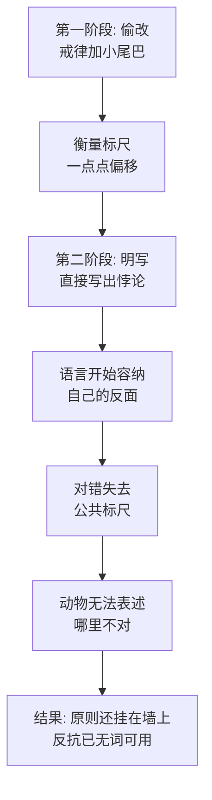

# 17｜「所有动物一律平等」的下半句：语言被腐蚀到极点是什么样？

> 一句自相矛盾的话刻在墙上，为什么比屠杀更让人不寒而栗？

---

## 一、先说结论

猪直立行走那晚，苜蓿请穆里尔念墙上的戒律——七条只剩一条：「所有动物一律平等，但有些动物比其他动物更平等。」这句话在逻辑上是自相矛盾的：「平等」既然普遍，就不能有「更」；一旦有了「更」，前半句就死了。但这正是奥威尔的题眼：**语言被腐蚀到极点，不是原则被撕掉，而是原则被改写成容纳自己的反面。** 七诫时代是偷着加小尾巴，现在是明着写悖论——说明连伪装都不需要了。奥威尔后来把这套思路写进《一九八四》的「新话」：极权的终极形态不是禁止你说话，而是把「平等」掏空到再也装不下反抗。

## 二、我们先理解一个问题

先做一个思想实验：假如墙上这条戒律改成「猪比所有动物都高贵」，动物们会怎么反应？

大概率会炸。因为这句话直白地宣布了不平等，它跟革命最初的承诺正面冲突，任何识字动物都能指出「这跟当初说的不一样」。谎言至少还承认对错的存在——它假装自己是对的。

但墙上实际写的是「所有动物一律平等，但有些动物比其他动物更平等」。这句话的高明和恐怖都在于：它没有否定平等，它「兼容」了不平等。你没法反驳它——它前半句还是你信仰的那句话。可你也没法用它——它后半句已经把你维权的路堵死了。

一种既无法反驳、又无法使用的原则，还算原则吗？

## 三、作者到底提出了什么观点？

书中写道，七诫的命运是一条完整的退化线。最初是偷改：「不得睡在床上」被加成「不得睡在铺床单的床上」，「不得饮酒」被加成「不得饮酒过量」，「不得杀害其他动物」被加成「不得无故杀害」——每次都是在原句后接一个小尾巴，偷换的范围一次比一次大，但每次都还保留着「原句仍在」的假象。

最后这一次不是偷改，是改写。七条戒律全部刷掉，只剩一条，而这一条的前半句保留着革命最神圣的词汇——「所有动物一律平等」，后半句用一个「但」字把它掏空：「但有些动物比其他动物更平等。」

动物们的反应是全书最冷的一笔。书中写道，穆里尔念完后，动物们没有愤怒，没有骚动——他们接受了。为什么不反抗？因为衡量「对不对」的那把尺子，就是墙上这些字。尺子被重刻之后，你连「这不对」都不知道怎么说了。

奥威尔认为，这是极权逻辑的终点站：先篡改记忆，再篡改语言，最后篡改「语言本身能表达什么」。他后来把这个构想发展成《一九八四》里的「新话」——一门故意把词汇砍到极少的语言，目标是让「自由」「平等」这些词失去含义，从而让造反在语言层面就无法被思考。

## 四、把这个观点翻译成人话

用大白话说：**最高级的谎言不是把黑说成白，而是让「白」这个词本身作废。**

普通的篡改是：规定 A，偷偷执行 B——你还能拿 A 去对质。语言腐蚀是：规定还是 A，但 A 的意思被重新解释成 B——你拿 A 去对质，对方指着同一个词说「对啊，这就是 A」。

「更平等」就是这种操作的极限形态。它留着「平等」的外壳，往里灌了「不平等」的实质。结果是一个死局：你想用平等抗议特权，对方说「我们就是平等——只是我们更平等」。原则没有被废除，而是被充气到容纳一切，于是再也撑不住任何东西。

语言一旦被掏空，反抗就变成了「无词可用」——你连投诉表都填不了，因为表上每一栏的词都已被重新定义过。

## 五、为什么会这样？

为什么一句自相矛盾的话能被接受？奥威尔的推理链是这样的：

这条链上有两处必须展开。

第一是「从偷改到明写」的质变。加小尾巴还需要偷偷摸摸——尖嗓子半夜提灯上梯子改字，说明政权还怕被发现，还承认「原来的写法是对的」。明写悖论意味着这个心理防线没了：我不再需要假装遵守原则，我让原则本身长出相反的意思。统治成熟度的标志，就是看它需不需要掩饰。

第二是「标尺消失」的机制。人判断一件事对不对，靠的不是天生的直觉，而是公共语言里的标准——「平等」「公正」「不许杀人」。这些词是测量工具。当「平等」被重定义为「可以更平等」，测量工具本身就弯了——你拿着弯尺去量，量出来的永远是「正常」。动物们不反抗，不是不痛苦，是痛苦的坐标系被拆了。

## 六、举一个现实生活中的例子

想一想某公司墙上挂了十年的标语：「奋斗为本」。

最初它的意思很朴素：好好干活，按劳分配。后来慢慢变了。先是「奋斗」被解释成「自愿加班」；再被解释成「周末也在线」；最后被解释成「能进领导层的才叫真奋斗」——那些天天加班但职位没动的老员工，被定义为「只是出力，不是奋斗」。

注意这个操作和「更平等」的结构一模一样：标语一个字没改，「奋斗」的外壳还挂在墙上，但它的内核已经被置换——从「按付出算」变成了「按结果算、按位置算」。你想拿标语维权？人力资源部可以指着同一句话告诉你：「公司一直讲奋斗为本，你的问题是不够奋斗。」

词还在，词的主人换了。这就是语言腐蚀的日常版：不是把你的词删掉，是把你的词重新登记到对方名下——从此你说出的每一个原则，都在替对方作证。

## 七、回到书中重新理解

回到书里，这句话的位置是精心选过的。它被写在同一面墙上，用的还是当年那种大字体——形式没变，内容换了主人。这是奥威尔最狠的暗示：极权不拆神庙，它直接进驻神庙。你以为是旧原则被推翻，其实是旧原则的躯壳里住进了新主人。

历史上，这一行字影射的是革命修辞在斯大林时代的处境：宪法写着公民平等，现实里是官僚特权阶层——但特权从来不叫特权，叫「按级别配给」。一些学者认为，奥威尔在这里埋的正是《一九八四》的种子：「战争即和平、自由即奴役、无知即力量」那三句口号，和「更平等」是同一个语法——把对立面焊进同一个句子里，让概念自己掐死自己。

还有一个细节值得回看：发现这句话的是苜蓿，但她自己不认字，要请穆里尔念。也就是说，到了终局，连「读出墙上写了什么」都要靠别人——识字权、解释权、记忆，全部集中在越来越少的人手里。语言的腐蚀从来不是孤立事件，它是识字垄断的最终产品。

## 八、这个观点背后还有什么？

第一，注意动物们「接受」而非「愤怒」的反应，这常被读成麻木，但更接近真相的读法是：他们已经没有反抗的语法了。愤怒需要词汇——「这违反戒律」「这不平等」；当戒律本身写着「可以更平等」，愤怒的句子还没说出口就自我瓦解了。奥威尔写的不是群众的沉默，是群众的语言被提前缴械。

第二，「更平等」是一个比较级。比较级需要一个参照系：比谁更平等？答案不言自明：比你们。这个语法细节说明，这句话不是为了「说明白」，而是为了「说得没法反驳」——它的功能不是沟通，是终止沟通。

第三，墙上只剩一条戒律，这个数字「一」也有含义。七诫时代，原则好歹是个系统——这条被改还有那条对照。只剩一条时，连「这条和那条冲突了」这种自我纠错的可能性都没了。单一文本加悖论结构，等于完美的不可证伪：你永远无法用墙上的话反对墙上的话。

## 九、这个观点有问题吗？

说服力在哪：奥威尔对语言政治的观察是被验证过的——极权体制确实系统性地劫持词汇：「民主」「自由」「人民」在不同政权下有完全不同的填充物。一些语言学者认为，概念被掏空比被禁止更难抵抗，因为被禁的词至少还以「禁忌」的形式活着，被掏空的词则以「正确」的形式死亡。「更平等」把这一点压缩成一句话，是文学史上最经济的政治诊断之一。

争议在哪：第一，「语言决定思想」这个前提本身有争议——语言相对论的强版本「没有词就无法思考」在学界并没有定论，动物们也许能感到不对、只是说不出，但「说不出」不等于「想不到」。第二，把一切归因于语言，可能高估了修辞的独立作用——动物们接受「更平等」，也可能只是因为狗还在、鞭子还在，语言只是暴力做完事之后的装修。

哪里过度简化：寓言把语言腐蚀写成一条单行线——七诫逐步退化到一句悖论。但现实中语言的腐蚀往往是多线混战：旧词被掏空的同时，新词在涌入，同一个词在不同人群中含义不同。奥威尔的单线叙事清晰，但低估了语言生态的混乱程度。

还有哪些其他解释：一种解释从权力而非语言出发——「更平等」能成立不是因为它修辞高明，而是因为没人敢指出它矛盾，暴力和识字垄断才是地基；另一种解释认为这句话根本不需要成立——它的存在本身就是忠诚测试：你敢不敢在逻辑上接受矛盾，是政权筛选「自己人」的试剂。

## 十、今天再看这个观点

以下部分是基于作者思想的现代延伸，不是作者原话。

「更平等」式语法在今天已经渗透进日常表达，而且包装得更好。「灵活就业」保留了「就业」的外壳，里面装着没有雇佣关系的内容；「优化」「毕业」「向社会输送人才」保留了「人事调整」的外壳，里面装着裁员；「自愿原则」保留了「自愿」两个字，后面跟着一串不得不做的事。每一个都是把对立面焊进同一个词里。

比词汇置换更深的是「标尺私有化」：当「努力」由雇主定义、「真相」由信源定义、「价值」由流量定义，公共标尺就变成了各家的私尺——你拿你的尺量，他说你的尺不是标准尺。苜蓿当年的困境是看不懂字，今天的困境是看懂了字但每个字都有两套定义，而且哪套算数由对方决定。

奥威尔教的自检方法今天仍可用：拿到任何一个高频大词，问一句——这个词此刻的内容，和三年前相比，是被充实了还是被置换了？如果外壳没变、内核换了主人，你面对的就是一次小型的「更平等」。

## 十一、这一篇真正应该记住什么？

1. 语言腐蚀的终极形态是悖论明写：不是撕掉原则，是让原则容纳自己的反面。
2. 从偷改到明写是质变：还需要掩饰时政权尚有顾忌，公开写悖论说明连伪装都省了。
3. 标尺一弯，万事正常：公共词汇被重定义后，「这不对」三个字就说不出口了。
4. 「更平等」是《一九八四》的前身：把对立面焊进一句话，让概念自己掐死自己。

## 十二、留一个问题

当所有原则都能被解释成自己的反面，反抗还能用什么语言说话？如果「平等」已经死了，我们该拿什么词去指控不平等？

这个问题先存着。因为书的最后一幕已经来了：墙上的字刷完了，语言的游戏玩到头了，动物们聚到农舍窗外——窗里，猪和人正在打牌。下一篇，也是最后一篇，我们看那场牌局，以及奥威尔留给读者的终极问题：今天的「猪」，要怎么辨认？
